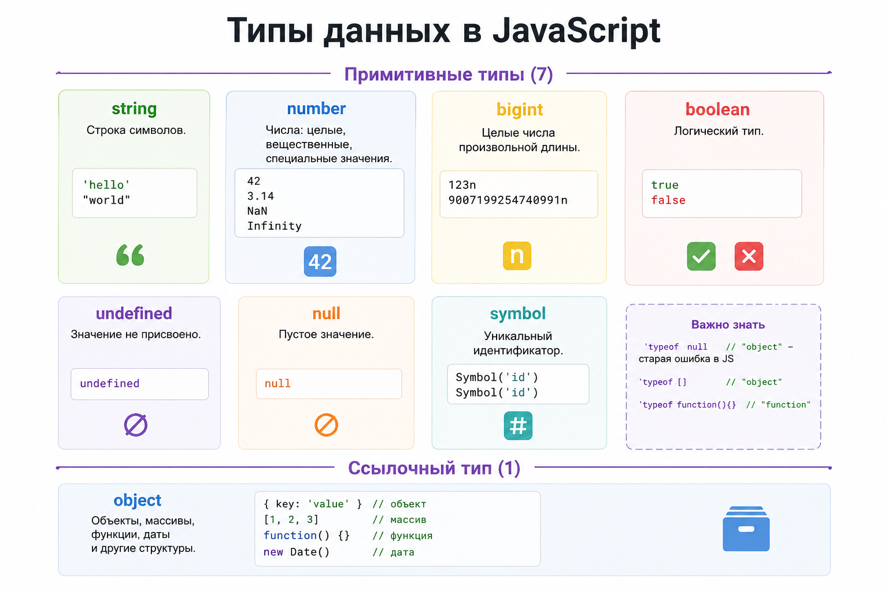

# Вопросы на собеседовании по Angular

Вопросы помогают определить уровень Angular-разработчика: насколько глубоко он понимает Web-платформу, JavaScript,
TypeScript и устройство Angular-приложений.

Angular-ответы ориентированы на версии 19–22. Для нового кода используются standalone APIs, signals и functional
providers; поддерживаемые старые API помечены как legacy.

Дополнительные материалы:

**Fundamentals**:

- [Coding Interview University](https://github.com/jwasham/coding-interview-university)
- [Awesome Interviews](https://github.com/alex/what-happens-when)
- [Angular Interview Questions](https://github.com/sudheerj/angular-interview-questions)

**Frontend**:

- [Front-end Job Interview Questions](https://github.com/h5bp/Front-end-Developer-Interview-Questions)
- [The Best Frontend JavaScript Interview Questions](<https://performancejs.com/post/hde6d32/The-Best-Frontend-JavaScript-Interview-Questions-(Written-by-a-Frontend-Engineer)>)
- [Frontend Guidelines Questionnaire](https://github.com/bradfrost/frontend-guidelines-questionnaire)
- [Подготовка к интервью на Front-end разработчика](https://proglib.io/p/frontend-interview/)

**Angular**:

- [Angular Interview Questions by Google Developer Expert](https://github.com/Yonet/Angular-Interview-Questions)

## Как пользоваться

- **Junior**: Web Platform, основы JavaScript и TypeScript, базовые вопросы Angular, templates, DI и forms.
- **Middle**: дополнительно Engineering principles, Change Detection, Signals, RxJS, Router, HTTP, performance и
  testing.
- **Middle+/Senior**: архитектурные компромиссы, управление состоянием, SSR и hydration, security, libraries, design
  systems и tooling.

## Содержание

- [Web Platform](#web-platform)
- [JavaScript](#javascript)
- [TypeScript](#typescript)
- [Основы программирования и проектирования](#основы-программирования-и-проектирования)
  - [Алгоритмы и структуры данных](#алгоритмы-и-структуры-данных)
- [Рабочее окружение frontend-разработчика](#рабочее-окружение-frontend-разработчика)
  - [Методологии и процессы](#методологии-и-процессы)
- [Soft skills и интервью](#soft-skills-и-интервью)
- [Angular](#angular)
  - [Angular Core](#angular-core)
  - [Angular PWA и Service Worker](#angular-pwa-и-service-worker)
  - [Основные концепции](#основные-концепции)
  - [Templates](#templates)
  - [Компоненты, директивы, сервисы и pipes](#компоненты-директивы-сервисы-и-pipes)
  - [Lifecycle и rendering](#lifecycle-и-rendering)
  - [Angular Change Detection](#angular-change-detection)
  - [Angular Signals](#angular-signals)
  - [RxJS](#rxjs)
  - [Dependency Injection](#dependency-injection)
  - [Управление состоянием](#управление-состоянием)
  - [Angular HTTP](#angular-http)
  - [Security](#security)
  - [Angular Router](#angular-router)
  - [Angular Forms](#angular-forms)
  - [Performance](#performance)
  - [SSR, hydration и SEO](#ssr-hydration-и-seo)
  - [Testing](#testing)
  - [Angular libraries и design systems](#angular-libraries-и-design-systems)
  - [Micro Frontends](#micro-frontends)
  - [Tooling](#tooling)

## Web Platform

### HTML и CSS

<details>
<summary>Для чего нужен HTML/CSS?</summary>

- HTML нужен, чтобы описать структуру страницы: заголовки, текст, кнопки, формы, ссылки, картинки.

- CSS нужен, чтобы описать внешний вид: цвета, размеры, отступы, шрифты, расположение элементов.

```html
<button>Buy</button>
```

```css
button {
  color: white;
  background: blue;
}
```

</details>

### Accessibility

<details>
<summary>Для чего нужен атрибут lang?</summary>

Атрибут `lang` задает язык документа или отдельного фрагмента текста.

```html
<html lang="ru"></html>
```

Он помогает:

- скринридерам выбрать правильное произношение;
- браузеру проверять орфографию и предлагать перевод;
- поисковым системам определить язык страницы;
- применять языковые правила переноса и типографики.

```html
<p>
  Я изучаю
  <span lang="en">frontend development</span>
  .
</p>
```

`lang` не меняет внешний вид напрямую, но помогает браузеру и assistive technologies правильно интерпретировать контент.

</details>

<details>
<summary>Для чего нужны семантические HTML-теги?</summary>

Семантические теги описывают назначение контента: `header`, `nav`, `main`, `article`, `button`.

Они улучшают accessibility, навигацию скринридеров, SEO и читаемость разметки. Семантика не заменяет корректную
структуру заголовков, подписи элементов форм и поддержку клавиатуры.

</details>

### CSS

<details>
<summary>Веса в CSS</summary>

Веса в CSS — это специфичность, то есть приоритет селектора.

Пример весов:

```css
/* 0 (0,0,0) */
* {}

/* 1 (0,1,0) */
button {}

/* 10 (0,1,0) */
.button {}

/* 100 (1,0,0) */
#button {}

/* 1000 (1,0,0,0) */
style="color: red"
```

div, button, p - 1 .class, [attr], :hover - 10 #id - 100 inline style - 1000 !important - перебивает почти все

Пример:

```css
button {
  color: blue;
}

.button {
  color: red;
}
```

```html
<button class="button">Click</button>
```

Будет red, потому что .button весит больше, чем button. Чем селектор конкретнее, тем выше его вес.

</details>

<details>
<summary>Что такое user agent style?</summary>

То есть CSS, который браузер сам применяет к HTML-элементам, даже если ты не написал свой CSS.

```html
<h1>Hello</h1>
<p>Text</p>
<button>Click</button>
```

Даже без CSS у них уже есть внешний вид:

```css
h1 {
  font-size: 2em;
  font-weight: bold;
  margin-block-start: 0.67em;
  margin-block-end: 0.67em;
}

button {
  appearance: auto;
}
```

</details>

### Frontend fundamentals

<details>
<summary>В чем отличие фреймворка от библиотеки (приведите примеры и отличия)?</summary>

**Библиотека** решает отдельную задачу, а приложение само определяет архитектуру и момент вызова библиотеки. Примеры:
RxJS, Lodash, date-fns.

**Фреймворк** задает каркас приложения, жизненный цикл, правила организации кода и сам вызывает пользовательский код в
нужный момент. Это называют inversion of control. Примеры: Angular, NestJS.

Angular предоставляет не только рендеринг, но и DI, Router, формы, HTTP-клиент, компиляцию шаблонов, CLI и инструменты
тестирования. Поэтому Angular является платформой и фреймворком, а не просто UI-библиотекой.

</details>

<details>
<summary>Какие популярные CSS, JS библиотеки вы знаете?</summary>

Примеры, которые уместно назвать вместе с их назначением:

- UI и CSS: Angular Material, Taiga UI, Bootstrap, Tailwind CSS.
- Реактивность: RxJS.
- Работа с датами: date-fns, Luxon.
- Утилиты: Lodash.
- Графики: D3.js, Chart.js, ECharts.
- Тестирование: Vitest, Jest, Jasmine, Cypress, Playwright.
- Управление состоянием Angular: NgRx, NGXS.

На собеседовании важнее объяснить, какую проблему решает библиотека и почему она была выбрана, чем перечислить много
названий.

</details>

### Browser rendering и performance

<details>
<summary>Как браузер рендерит HTML-страницу?</summary>

Браузер строит DOM из HTML и CSSOM из CSS, объединяет их в render tree, вычисляет layout, выполняет paint и compositing.

JavaScript, стили, шрифты и изображения могут задерживать отдельные этапы. Производительность оценивают по реальному
critical rendering path, а не только по размеру файлов.

</details>

<details>
<summary>Что такое DOM, CSSOM и render tree?</summary>

- DOM представляет структуру HTML.
- CSSOM содержит разобранные CSS-правила.
- Render tree объединяет видимые DOM-узлы с вычисленными стилями.

Элементы вроде `display: none` не участвуют в render tree, хотя остаются в DOM.

</details>

<details>
<summary>Что такое layout и repaint?</summary>

Layout, или reflow, пересчитывает размеры и положение элементов. Repaint перерисовывает пиксели без обязательного
изменения геометрии.

Чередование чтения layout-свойств и записи стилей в цикле может вызвать layout thrashing. Операции лучше группировать и
измерять через browser Performance panel.

</details>

<details>
<summary>Почему transform лучше top и left для анимаций?</summary>

Изменение `top` и `left` часто требует layout и paint. `transform` обычно может обрабатываться на этапе compositing,
поэтому анимация получается плавнее.

Это не абсолютное правило: создание лишних layers расходует память, а итог нужно проверять профилировщиком.

</details>

<details>
<summary>Почему не стоит использовать transition: all?</summary>

`transition: all` анимирует любые изменившиеся свойства, включая неожиданные и дорогие для layout. Это усложняет
поддержку и может создавать случайные анимации.

Лучше явно перечислить свойства:

```css
.button {
  transition:
    transform 150ms ease,
    opacity 150ms ease;
}
```

</details>

<details>
<summary>Блокирует ли CSS рендеринг?</summary>

Внешний stylesheet обычно является render-blocking resource: браузеру нужен CSSOM, чтобы корректно выполнить первый
render.

CSS не обязательно останавливает загрузку всего документа, но может задержать отображение и выполнение scripts,
зависящих от стилей. Помогают небольшой critical CSS, удаление неиспользуемых стилей и корректное разделение bundles.

</details>

<details>
<summary>Что такое Web Vitals?</summary>

Web Vitals - пользовательские метрики качества страницы:

- **LCP**: скорость отображения основного контента;
- **INP**: отзывчивость на взаимодействия;
- **CLS**: визуальная стабильность.

Метрики анализируют по полевым данным реальных пользователей и дополняют лабораторными измерениями Lighthouse и
DevTools.

</details>

<details>
<summary>Как браузер обрабатывает index.html?</summary>

Основные этапы Critical Rendering Path:

1. Браузер получает HTML и постепенно строит DOM.
2. При обнаружении CSS загружает его и строит CSSOM. CSS блокирует первый рендер.
3. Обычный синхронный `<script>` может остановить разбор HTML до загрузки и выполнения JavaScript.
4. DOM и CSSOM объединяются в render tree.
5. Layout вычисляет размеры и положение видимых элементов.
6. Paint рисует пиксели.
7. Compositing объединяет слои и выводит кадр на экран.

`defer` загружает скрипт параллельно и выполняет после разбора HTML с сохранением порядка. `async` выполняет скрипт
сразу после загрузки, поэтому порядок не гарантирован.

Для ускорения первого рендера уменьшают блокирующие CSS/JS, используют code splitting, оптимизируют шрифты и
изображения, кеширование и SSR/SSG там, где это оправдано.

</details>

### CSS architecture

<details>
<summary>Чем Flexbox отличается от Grid?</summary>

Flexbox в первую очередь решает одномерную раскладку по строке или колонке. Grid управляет строками и колонками
одновременно.

Flexbox подходит для toolbar, списка и выравнивания внутри компонента. Grid удобен для page layout и двумерных сеток. Их
часто используют вместе.

</details>

<details>
<summary>Что такое BEM?</summary>

BEM делит CSS-имена на block, element и modifier:

```css
.user-card {
}
.user-card__title {
}
.user-card--compact {
}
```

Соглашение делает связи явными и снижает конфликты глобальных стилей, но длинные имена и ручная дисциплина могут быть
избыточны при надежной component style isolation.

</details>

<details>
<summary>Что делает box-sizing: border-box?</summary>

При `border-box` заданные `width` и `height` уже включают padding и border. Это делает размеры элементов предсказуемее.

```css
*,
*::before,
*::after {
  box-sizing: border-box;
}
```

</details>

<details>
<summary>Чем img отличается от picture?</summary>

`img` отображает одно изображение и поддерживает responsive candidates через `srcset` и `sizes`.

`picture` позволяет задать несколько `source` по media query или формату, например отдельный crop для мобильного экрана
и AVIF/WebP fallback. Внутри `picture` всегда остается fallback `img`.

</details>

<details>
<summary>Чем SCSS @import отличается от @use?</summary>

Legacy `@import` глобально объединяет файлы, может загружать их повторно и создает конфликты имен.

`@use` загружает module один раз и предоставляет namespace:

```scss
@use 'tokens';

.button {
  color: tokens.$primary;
}
```

Для нового Sass-кода используют `@use` и `@forward`.

</details>

<details>
<summary>Какие есть способы изоляции стилей?</summary>

Основные варианты:

- соглашения именования, например BEM;
- Angular style encapsulation;
- CSS Modules;
- Shadow DOM;
- utility-классы;
- ограничение стилей через feature/component boundaries.

Изоляция уменьшает конфликты, но global tokens, typography и overlays все равно требуют продуманного общего слоя.

</details>

<details>
<summary>Какие плюсы и минусы готового UI Kit?</summary>

Плюсы: единый дизайн, accessibility primitives, быстрый старт, готовые сложные компоненты и меньше дублирования.

Минусы: ограниченная кастомизация, лишний bundle, зависимость от release cycle и сложные обновления. Перед выбором
проверяют accessibility, theming, SSR, forms integration, поддержку Angular-версий и качество API.

</details>

### HTTP, auth и realtime

<details>
<summary>Чем HTTPS отличается от HTTP?</summary>

HTTPS передает HTTP внутри защищенного TLS-соединения. Оно шифрует трафик, подтверждает подлинность сервера сертификатом
и защищает данные от незаметного изменения в пути.

HTTPS не исправляет XSS, слабую авторизацию или утечку данных на сервере.

</details>

<details>
<summary>Может ли GET-запрос иметь body?</summary>

Семантика body у GET не определена для обычного web-взаимодействия, многие servers и proxies его игнорируют, а browser
`fetch` запрещает body для GET и HEAD.

Параметры чтения передают через URL. Если запрос слишком сложный или содержит чувствительную структуру, API обычно
проектируют отдельным POST endpoint для поиска.

</details>

<details>
<summary>Что такое CORS?</summary>

CORS - browser security mechanism, который ограничивает JavaScript-запросы между разными origins. Сервер разрешает
доступ через `Access-Control-Allow-*` headers, а для части запросов браузер сначала отправляет preflight `OPTIONS`.

Postman не применяет browser same-origin policy, поэтому запрос может работать там и блокироваться в браузере.
Исправление находится в server CORS configuration или same-origin proxy, а не в отключении защиты браузера.

</details>

<details>
<summary>Что такое авторизация через токены?</summary>

После аутентификации сервер выдает credential, например access token. Клиент прикладывает его к запросам, а сервер
проверяет подпись, срок действия и права.

Access token обычно живет недолго. Refresh token позволяет получить новый access token и требует более строгой защиты и
ротации.

</details>

<details>
<summary>Где хранить access token и refresh token?</summary>

Универсального ответа нет. Частый browser-подход:

- access token хранится в памяти приложения;
- refresh token находится в `HttpOnly`, `Secure`, `SameSite` cookie и недоступен JavaScript.

`localStorage` переживает перезагрузку, но доступен при XSS. Cookie автоматически отправляется браузером, поэтому
требует корректной CSRF-защиты. Решение зависит от backend, доменов и threat model.

</details>

<details>
<summary>Чем WebSocket отличается от SSE?</summary>

WebSocket предоставляет постоянный двусторонний канал и подходит для чатов, multiplayer и совместного редактирования.

SSE передает события только от сервера к клиенту поверх HTTP, автоматически переподключается и проще для уведомлений,
прогресса и live feed. SSE передает текстовые события и имеет browser-specific ограничения соединений.

</details>

<details>
<summary>Когда выбрать polling, SSE или WebSocket?</summary>

- Polling прост и подходит для редких обновлений, когда задержка допустима.
- SSE выбирают для постоянного потока server-to-client.
- WebSocket нужен для частого двустороннего обмена с низкой задержкой.

Учитывают инфраструктуру, reconnect, authentication, масштабирование, mobile network и реальную частоту событий.

</details>

<details>
<summary>Как проектировать API layer и типизировать backend contracts?</summary>

Data-access слой инкапсулирует endpoints, DTO, mapping и transport errors:

```ts
export class UsersApi {
  private readonly http = inject(HttpClient);

  getById(id: string): Observable<User> {
    return this.http.get<UserDto>(`/api/users/${id}`).pipe(map(mapUserDto));
  }
}
```

Generic в `HttpClient` — compile-time ожидание, а не runtime-валидация. Для внешних данных используют schema validation.
OpenAPI может генерировать DTO/client, но generated layer обычно оборачивают доменным API.

</details>

<details>
<summary>Как устроены TCP/IP и HTTP?</summary>

Упрощенная модель TCP/IP:

1. Прикладной уровень: HTTP, DNS, WebSocket.
2. Транспортный уровень: TCP или UDP.
3. Сетевой уровень: IP и маршрутизация пакетов.
4. Канальный уровень: передача кадров внутри локальной сети.

HTTP — протокол прикладного уровня с моделью request/response. Клиент отправляет метод, URL, заголовки и при
необходимости body; сервер возвращает status code, заголовки и body.

HTTPS — HTTP поверх защищенного TLS-соединения. TCP обеспечивает надежную упорядоченную доставку для HTTP/1.1 и HTTP/2;
HTTP/3 использует QUIC поверх UDP.

TCP устанавливает соединение, гарантирует порядок и повторную доставку потерянных данных. UDP отправляет datagrams без
таких гарантий, но с меньшими накладными расходами.

В модели OSI HTTP относится к прикладному уровню, TCP/UDP - к транспортному, IP - к сетевому.

Для frontend-разработчика важны методы, коды ответа, заголовки, кеширование, cookies, CORS, TLS, сжатие и понимание
того, что количество и размер запросов влияют на производительность.

</details>

<details>
<summary>Что такое клиент-серверная архитектура?</summary>

Клиент отвечает за интерфейс и отправляет запросы, сервер хранит данные, применяет бизнес-правила и возвращает ответы.

Граница не является границей доверия: server всегда повторно проверяет authentication, authorization и входные данные,
даже если frontend уже выполнил validation.

</details>

<details>
<summary>Что происходит после ввода URL в браузере?</summary>

Упрощенная последовательность:

1. Браузер разбирает URL и проверяет cache.
2. DNS находит IP-адрес.
3. Устанавливается транспортное и для HTTPS TLS-соединение.
4. Отправляется HTTP-запрос.
5. Браузер обрабатывает redirect и ответ.
6. HTML парсится, загружаются CSS, JavaScript и другие ресурсы.
7. Строятся DOM/CSSOM, layout, paint и compositing.

Service worker, HTTP cache, CDN и connection reuse могут изменить отдельные шаги.

</details>

<details>
<summary>Из чего состоят HTTP-запрос и ответ?</summary>

Запрос содержит method, URL, headers и необязательный body. Ответ содержит status code, headers и необязательный body.

Частые headers: `Content-Type`, `Accept`, `Authorization`, `Cache-Control`, `ETag`, `Cookie`, `Set-Cookie`, `Origin`.
Формат body описывает `Content-Type`.

</details>

<details>
<summary>Что такое REST API?</summary>

REST — архитектурный стиль, в котором ресурсы имеют URL, а стандартные HTTP-методы выражают операции:

- `GET /users/42` — получить ресурс;
- `POST /users` — создать;
- `PUT /users/42` — заменить;
- `PATCH /users/42` — частично изменить;
- `DELETE /users/42` — удалить.

`POST` обычно создает подчиненный ресурс или запускает команду. `PUT` полностью заменяет ресурс по известному URL, а
`PATCH` изменяет отдельные поля. `GET` читает данные и в browser `fetch` не может иметь body.

Основные группы статусов:

- `2xx`: успех, например `200`, `201`, `204`;
- `3xx`: перенаправление и кеш, например `301`, `304`;
- `4xx`: ошибка клиента, например `400`, `401`, `403`, `404`, `409`, `422`, `429`;
- `5xx`: ошибка сервера, например `500`, `502`, `503`.

Частые значения:

- `200 OK` - успешный ответ;
- `201 Created` - ресурс создан;
- `400 Bad Request` - некорректный запрос;
- `401 Unauthorized` - нет действительной аутентификации;
- `403 Forbidden` - пользователь распознан, но доступ запрещен;
- `404 Not Found` - ресурс не найден;
- `409 Conflict` - конфликт с текущим состоянием;
- `422 Unprocessable Content` - данные синтаксически корректны, но не проходят validation;
- `429 Too Many Requests` - превышен rate limit;
- `500 Internal Server Error` - внутренняя ошибка сервера.

Частые заголовки: `Content-Type`, `Accept`, `Authorization`, `Cache-Control`, `ETag`, `Cookie`, `Set-Cookie`,
CORS-заголовки.

REST предполагает stateless-взаимодействие: каждый запрос содержит достаточно контекста для обработки. Идемпотентность
означает, что повторный одинаковый запрос имеет тот же итоговый эффект; обычно `GET`, `PUT` и `DELETE` проектируют
идемпотентными.

</details>

<details>
<summary>Что такое JSON и какие форматы body используются?</summary>

JSON представляет objects, arrays, strings, numbers, booleans и `null`. Он не хранит `Date`, `Map`, functions и
`undefined` как отдельные типы.

Кроме `application/json`, frontend встречает `multipart/form-data` для файлов, `application/x-www-form-urlencoded`,
plain text, binary data и streams. Клиент и сервер согласуют формат через `Content-Type` и `Accept`.

</details>

<details>
<summary>Какими способами frontend взаимодействует с backend?</summary>

- REST/HTTP для обычных request-response операций;
- GraphQL для управляемой клиентом выборки;
- WebSocket для двустороннего realtime;
- SSE для потока server-to-client;
- polling для простых периодических обновлений;
- gRPC-web в отдельных инфраструктурах.

Выбор зависит от направления потока, задержки, cache, browser support и возможностей backend.

</details>

### Security basics

<details>
<summary>Что такое XSS?</summary>

XSS позволяет выполнить вредоносный script в контексте сайта. Причина обычно в выводе непроверенного HTML, опасных URL
или обходе sanitization.

Защита: escaping и sanitization, безопасные DOM APIs, CSP, запрет небезопасного `innerHTML` и осторожность с Angular
`DomSanitizer`.

</details>

<details>
<summary>Что такое CSRF?</summary>

CSRF заставляет browser авторизованного пользователя отправить нежелательный запрос, используя автоматически
прикладываемые cookies.

Защита: SameSite cookies, anti-CSRF token, проверка Origin/Referer и отсутствие state-changing операций через GET.

</details>

<details>
<summary>Что такое OWASP?</summary>

OWASP - открытое сообщество и набор практических материалов по безопасности приложений. Frontend-разработчику полезны
OWASP Top 10, ASVS и Cheat Sheet Series.

Это не scanner и не готовая сертификация, а база рисков, требований и рекомендаций.

</details>

<details>
<summary>Какие меры защиты должен знать frontend-разработчик?</summary>

- не вставлять непроверенный HTML;
- не хранить secrets в frontend bundle;
- использовать HTTPS и безопасные cookie attributes;
- учитывать XSS, CSRF, CORS и CSP;
- валидировать данные на клиенте для UX, но доверять только server validation;
- обновлять зависимости и проверять supply-chain риски;
- не раскрывать чувствительные данные в логах и URL.

Безопасность является общей ответственностью frontend, backend и инфраструктуры.

</details>

### Performance и PWA

<details>
<summary>Для чего нужен PWA и какие плюсы?</summary>

PWA — это сайт, который ведет себя почти как приложение

PWA = Progressive Web App.

Это обычное веб-приложение, но с дополнительными возможностями:

- можно установить на телефон/компьютер как приложение;
- может работать офлайн или при плохом интернете;
- может кешировать данные и ресурсы;
- может отправлять push-уведомления;
- открывается из иконки без обычного ощущения “я в браузере”.

Для чего нужен PWA:

PWA нужен, когда ты хочешь дать пользователю app-like experience, но без полноценной разработки под iOS/Android.

Главные плюсы PWA:

1. Можно установить без App Store / Google Play

Пользователь может нажать “Add to Home Screen” и получить иконку приложения.

Плюс для бизнеса:

- не нужно проходить модерацию стора;
- быстрее выкатывать обновления;
- один код для web/mobile/desktop.

PWA может кешировать:

- HTML;
- JS;
- CSS;
- картинки;
- шрифты;
- API-ответы.

Может работать офлайн

Например:

- открыть последнюю загруженную страницу;
- показать сохраненные данные;
- дать заполнить форму;
- отправить данные позже, когда интернет вернется.

Это особенно полезно для:

- путешествий;
- слабого интернета;
- мобильных пользователей;
- внутренних рабочих инструментов.

Push-уведомления:

PWA может отправлять уведомления, например: “Заказ доставлен”; “Новая задача”; “Скидка”; “Напоминание”; “Документ
согласован”.

Когда PWA подходит

PWA хорошо подходит, если:

- приложение в основном показывает данные;
- нужна установка на экран;
- важна скорость загрузки;
- нужен офлайн-режим;
- нет сложной работы с железом телефона;
- хочется быстро доставлять обновления.

CRM, todo app, dashboard, docs, e-commerce, booking app

Когда PWA не лучший выбор

PWA хуже подходит, если нужны:

- глубокие native API;
- сложная работа с Bluetooth/NFC;
- тяжелая графика;
- мощная фоновая работа;
- сложная интеграция с iOS/Android;
- максимальная производительность как у native.

</details>

<details>
<summary>Какую роль в PWA играет Service Worker?</summary>

Service Worker — это JS-файл, который браузер запускает отдельно от страницы и который стоит “между” приложением и
сетью.

Как работает обычный сайт: Page -> Network -> Server

PWA с Service Worker: Page -> Service Worker -> Cache / Network -> Server

Service Worker может перехватывать запросы:

Пользователь открыл страницу ↓ Браузер спрашивает Service Worker ↓ SW решает:

- взять файл из кеша
- сходить в сеть
- показать fallback-страницу

Ты открыл сайт первый раз:

- index.html
- main.js
- styles.css
- logo.png

Service Worker может сохранить эти файлы в Cache Storage.

Потом пользователь открывает сайт без интернета:

нет сети ↓ Service Worker берет файлы из кеша ↓ приложение все равно открывается

Для чего он нужен в PWA

1. Offline. Можно открыть приложение без интернета.
2. Faster load. Файлы уже лежат локально, поэтому приложение может открываться быстрее.
3. Cache strategy. Service Worker может выбирать стратегию:
   1. Cache first сначала кеш, потом сеть картинки, шрифты, статика
   2. Network first сначала сеть, если нет — кеш свежие данные
   3. Stale while revalidate быстро отдать кеш, потом обновить списки, статьи, каталоги
   4. Cache only только кеш заранее сохраненные ресурсы
   5. Network only только сеть критичные операции
4. Push notifications. Service Worker может принимать push-события даже когда вкладка закрыта. Server -> Push Service ->
   Service Worker -> Notification

Service Worker не имеет доступа к DOM. Он живет отдельно от страницы. Страница и Service Worker общаются через
события/messages.

Service Worker нужен в PWA, чтобы приложение могло кешировать ресурсы, быстрее загружаться, работать офлайн и получать
push-уведомления.

</details>

## JavaScript

### Типы, функции и область видимости

<details>
<summary>Какие типы данных есть в JavaScript?</summary>

В JavaScript есть семь примитивных типов: `string`, `number`, `bigint`, `boolean`, `undefined`, `symbol` и `null`.

Все остальные значения относятся к типу `object`: обычные объекты, массивы, функции, даты и коллекции. Примитивы
неизменяемы и сравниваются по значению, а переменные с объектами хранят ссылки.

```js
// Примитивные

string; // "hello"
number; // 123, 3.14, NaN, Infinity
bigint; // 123n
boolean; // true / false
undefined; // значение не задано
null; // пустое значение
symbol; // уникальный идентификатор

// Ссылочный тип

object; // {}, [], function, Date, Map, Set и т.д.
```

Важно:

```js
typeof null; // "object" — старая странность JS
typeof []; // "object"
typeof function () {}; // "function"
```

```js
typeof Symbol('id'); // "symbol"
```



</details>

<details>
<summary>В чем разница между call и apply, bind в JS?</summary>

call и apply делают одно и то же: вызывают функцию с явно заданным this.

call

Аргументы передаются через запятую:

```js
function greet(city, age) {
  console.log(`${this.name}, ${city}, ${age}`);
}

const user = {name: 'Max'};

greet.call(user, 'Moscow', 32);
// Max, Moscow, 32

// fn.call(thisArg, arg1, arg2, arg3);
```

```js
function greet(city, age) {
  console.log(`${this.name}, ${city}, ${age}`);
}

const user = {name: 'Max'};

greet.apply(user, ['Moscow', 32]);
// Max, Moscow, 32
```

bind тоже работает с this, но не вызывает функцию сразу.

Он создает новую функцию, у которой this уже заранее привязан.

```js
function greet(city) {
  console.log(`${this.name} from ${city}`);
}

const user = {name: 'Max'};
```

call — вызывает сразу. apply — вызывает сразу, но аргументы массивом. bind — НЕ вызывает сразу

```js
const boundGreet = greet.bind(user);

boundGreet('Moscow');
// Max from Moscow
```

</details>

<details>
<summary>Что такое область видимости в JS?</summary>

Область видимости в JavaScript — это правило, которое определяет, где переменная, функция или класс доступны в коде.

```js
function test() {
  const name = 'Max';

  console.log(name); // доступна
}

console.log(name); // ошибка: name не видна снаружи
```

Основные виды scope в JS

1. Global scope

Доступно везде в файле/программе:

```js
const appName = 'My App';

function log() {
  console.log(appName);
}
```

2. Function scope

var виден внутри всей функции:

```js
function test() {
  var x = 1;

  if (true) {
    var y = 2;
  }

  console.log(y); // 2
}
```

3. Block scope

let и const видны только внутри блока {}:

```js
if (true) {
  const x = 1;
  let y = 2;
}

console.log(x); // ошибка
console.log(y); // ошибка
```

4. Module scope

В ES-модулях переменные не попадают в global scope:

```js
const value = 123;

export {value};
```

</details>

<details>
<summary>В чем отличие нативных (Native) объектов от хост-объектов (Host objects)?</summary>

#### Нативные объекты — часть спецификации языка. Они доступны нам вне зависимости от того, на каком клиенте исполняется наш код. Примеры: Array, Date и Math. Полный список нативных объектов.

```js
var users = Array(); // Array — нативный объект
```

Встроенные (Built-in): Array, Date, Math, String, Promise, Object. Пользовательские: Объекты, создаваемые вами через new
Object(), литералы {} или классы. Контекстные: Объект globalThis (или window в браузере, global в Node.js), Math и JSON.

#### Хост-объекты (Host objects)

Это объекты, предоставляемые средой выполнения (окружением), в которой запущен JavaScript (браузер, сервер Node.js и
т.д.).

Они не являются частью самого языка, зависят от платформы и могут различаться.

В браузере: window, document, location, history, XMLHTTPRequest, fetch, элементы DOM, localStorage.

В Node.js: Объекты для работы с файловой системой (fs), процессами (process), операционной системой (os).

</details>

### Массивы, объекты и даты

<details>
<summary>Что такое Object.groupBy и когда его использовать?</summary>

`Object.groupBy()` группирует элементы iterable по ключу, который возвращает callback. Результат - объект, поэтому API
удобно использовать, когда ключи группировки можно представить строками или symbols.

```ts
const operations = [
  {date: '2017-07-31', amount: 5422},
  {date: '2018-03-31', amount: 5654},
  {date: '2017-08-31', amount: 5451},
];

const byYear = Object.groupBy(operations, ({date}) => date.slice(0, 4));

// {
//   "2017": [...],
//   "2018": [...]
// }
```

`Object.groupBy()` подходит, например, для группировки операций по году или задач по статусу. Возвращаемый объект имеет
`null` в качестве prototype, поэтому методы вроде `hasOwnProperty()` у него напрямую недоступны.

</details>

<details>
<summary>Чем Object.groupBy отличается от Map.groupBy?</summary>

`Object.groupBy()` возвращает объект и удобен для строковых ключей. `Map.groupBy()` возвращает `Map` и сохраняет ключ
без преобразования в строку: им может быть объект, дата или другое значение.

```ts
const active = {label: 'active'};
const archived = {label: 'archived'};

const users = [
  {name: 'Max', status: active},
  {name: 'Anna', status: archived},
  {name: 'Kate', status: active},
];

const grouped = Map.groupBy(users, ({status}) => status);

grouped.get(active);
// [{ name: "Max", ... }, { name: "Kate", ... }]
```

Выбор зависит от того, какие ключи нужны и будет ли результат дальше использоваться как объект или `Map`.

</details>

<details>
<summary>Что такое Object.fromEntries?</summary>

`Object.fromEntries()` преобразует iterable пар `[key, value]` в объект. Это обратная операция к `Object.entries()`; ее
удобно сочетать с `map`, `filter`, `Map` и `URLSearchParams`.

```ts
const entries = [
  ['name', 'Max'],
  ['role', 'frontend'],
];

const user = Object.fromEntries(entries);
// { name: "Max", role: "frontend" }
```

Пример фильтрации свойств:

```ts
const params = {
  search: 'angular',
  page: 1,
  empty: undefined,
};

const cleaned = Object.fromEntries(Object.entries(params).filter(([, value]) => value !== undefined));

// { search: "angular", page: 1 }
```

</details>

<details>
<summary>Что делает Object.hasOwn?</summary>

`Object.hasOwn(object, key)` проверяет, есть ли свойство непосредственно у объекта, а не в его prototype chain.

```ts
const user = Object.create({role: 'admin'}) as {
  name?: string;
  role: string;
};

user.name = 'Max';

Object.hasOwn(user, 'name'); // true
Object.hasOwn(user, 'role'); // false
'role' in user; // true
```

В отличие от `object.hasOwnProperty()`, статический метод работает с объектами без prototype и объектами,
переопределившими `hasOwnProperty`.

</details>

<details>
<summary>Чем Object.hasOwn отличается от оператора in?</summary>

`Object.hasOwn()` проверяет только собственное свойство. Оператор `in` ищет ключ и в самом объекте, и во всей prototype
chain.

`Object.hasOwn()` подходит для проверки входных данных и словарей. `in` полезен, когда наличие унаследованного свойства
тоже является частью контракта, а в TypeScript еще используется для narrowing union types.

</details>

<details>
<summary>Чем Object.entries отличается от Object.fromEntries?</summary>

`Object.entries()` превращает собственные enumerable string-keyed свойства объекта в массив пар `[key, value]`.
`Object.fromEntries()` выполняет обратное преобразование.

```ts
const user = {name: 'Max', role: 'frontend'};
const entries = Object.entries(user);
const copy = Object.fromEntries(entries);
```

Symbols не попадают в `Object.entries()`.

</details>

<details>
<summary>Что возвращает Object.keys и в каком порядке?</summary>

`Object.keys()` возвращает массив собственных enumerable строковых ключей. Symbol-ключи в результат не входят.

Integer-like ключи идут по возрастанию, остальные строковые ключи - в порядке добавления:

```ts
const value = {10: 'ten', 2: 'two', name: 'Max'};

Object.keys(value); // ["2", "10", "name"]
```

Порядок определен спецификацией, но бизнес-логику сортировки лучше выражать явно, а не связывать со способом хранения
объекта.

</details>

<details>
<summary>Что такое Array.prototype.reduce?</summary>

`reduce()` последовательно сворачивает массив в одно значение. Результатом может быть число, объект, массив или `Map`.

```ts
const total = [10, 20, 30].reduce((sum, value) => sum + value, 0);
// 60
```

Initial value стоит задавать явно, особенно если массив может быть пустым:

```ts
const byYear = operations.reduce<Record<string, typeof operations>>((groups, operation) => {
  const year = operation.date.slice(0, 4);

  groups[year] ??= [];
  groups[year].push(operation);

  return groups;
}, {});
```

Не стоит использовать `reduce()`, если `map`, `filter`, `some`, `every` или `find` выражают намерение понятнее.

</details>

<details>
<summary>Чем flat отличается от flatMap?</summary>

`flat(depth)` создает новый массив, раскрывая вложенные массивы на указанную глубину. `flatMap(callback)` сначала
преобразует каждый элемент, затем раскрывает результат на один уровень.

```ts
const nested = [[1, 2], [3]];
nested.flat(); // [1, 2, 3]

const users = [
  {name: 'Max', roles: ['admin', 'editor']},
  {name: 'Anna', roles: ['viewer']},
];

const roles = users.flatMap(({roles}) => roles);
// ["admin", "editor", "viewer"]
```

</details>

<details>
<summary>Когда использовать flatMap вместо map().flat()?</summary>

`flatMap()` короче выражает преобразование, при котором один входной элемент дает ноль, один или несколько выходных
элементов.

```ts
const values = [1, -1, 2];
const positive = values.flatMap((value) => (value > 0 ? [value] : []));
// [1, 2]
```

`flatMap()` раскрывает только один уровень. Если нужна другая глубина или преобразование и flatten являются отдельными
шагами, понятнее использовать `map().flat(depth)`.

</details>

<details>
<summary>Чем toSorted отличается от sort?</summary>

`sort()` сортирует массив на месте, а `toSorted()` возвращает новый массив. `toSorted()` удобнее для immutable state,
Angular signals и Redux-подобных подходов.

```ts
const numbers = [10, 2, 30];
const sorted = numbers.toSorted((first, second) => first - second);

console.log(numbers); // [10, 2, 30]
console.log(sorted); // [2, 10, 30]
```

`sort()` изменяет исходный массив:

```ts
const numbers = [10, 2, 30];

numbers.sort((first, second) => first - second);

console.log(numbers); // [2, 10, 30]
```

Для чисел нужен comparator, иначе значения сортируются как строки.

</details>

<details>
<summary>Чем reverse отличается от toReversed?</summary>

`reverse()` меняет порядок элементов исходного массива. `toReversed()` возвращает новый массив и не мутирует источник.

```ts
const source = [1, 2, 3];
const reversed = source.toReversed();

console.log(source); // [1, 2, 3]
console.log(reversed); // [3, 2, 1]
```

</details>

<details>
<summary>Чем splice отличается от toSpliced?</summary>

`splice()` изменяет исходный массив и возвращает удаленные элементы. `toSpliced()` возвращает новый массив с примененным
изменением.

```ts
const source = ['a', 'b', 'c'];
const updated = source.toSpliced(1, 1, 'x');

console.log(source); // ["a", "b", "c"]
console.log(updated); // ["a", "x", "c"]
```

</details>

<details>
<summary>Что делает array.with?</summary>

`array.with(index, value)` возвращает копию массива с замененным элементом. Исходный массив не меняется; поддерживаются
и отрицательные индексы.

```ts
const source = ['draft', 'review', 'done'];
const updated = source.with(1, 'approved');

console.log(source); // ["draft", "review", "done"]
console.log(updated); // ["draft", "approved", "done"]
```

Недопустимый индекс приводит к `RangeError`.

</details>

<details>
<summary>Почему immutable-методы массивов полезны в Angular?</summary>

`toSorted()`, `toReversed()`, `toSpliced()` и `with()` создают новую ссылку. Это делает обновление signals,
OnPush-компонентов и store предсказуемым.

```ts
readonly users = signal<ReadonlyArray<User>>([]);

sortByName(): void {
  this.users.update((users) =>
    users.toSorted((first, second) => first.name.localeCompare(second.name)),
  );
}
```

Мутация массива на месте может не создать ожидаемого реактивного обновления и усложняет сравнение предыдущего и нового
состояния.

</details>

<details>
<summary>Что такое sparse array?</summary>

Sparse array, разреженный массив, содержит пустые слоты, в которых нет свойства с соответствующим индексом. Это не то же
самое, что явное значение `undefined`.

```ts
const sparse = [1, , 3];

0 in sparse; // true
1 in sparse; // false
sparse.length; // 3
```

Методы ведут себя по-разному: `map()` сохраняет пустой слот, `filter()`, `forEach()` и `flatMap()` не вызывают callback
для него, а spread и `Array.from()` превращают слот в `undefined`. В прикладном коде разреженных массивов обычно
избегают.

</details>

<details>
<summary>Какие базовые API есть у Date?</summary>

`Date` хранит момент времени, а не календарную дату без времени.

```ts
const now = new Date();

now.getFullYear();
now.getMonth(); // 0-11
now.getDate(); // День месяца

Date.now(); // Текущий timestamp в миллисекундах
now.getTime(); // Timestamp конкретной даты
```

`getFullYear()`, `getMonth()` и `getDate()` используют локальную таймзону. Их UTC-варианты: `getUTCFullYear()`,
`getUTCMonth()` и `getUTCDate()`.

</details>

<details>
<summary>Что такое ISO-формат даты?</summary>

ISO 8601 - распространенный стандарт записи даты и времени. В JavaScript часто встречается формат
`YYYY-MM-DDTHH:mm:ss.sssZ`.

```ts
const iso = '2026-06-20T10:30:00.000Z';
```

`T` разделяет дату и время, а `Z` обозначает UTC. Важно не путать UTC с локальным временем пользователя.

</details>

<details>
<summary>Что делает Date.prototype.toISOString?</summary>

`toISOString()` возвращает строку в ISO-подобном формате `YYYY-MM-DDTHH:mm:ss.sssZ`. Результат всегда представлен в UTC.

```ts
const date = new Date('2026-06-20T10:30:00+03:00');

date.toISOString();
// "2026-06-20T07:30:00.000Z"
```

Метод удобен для API, логов, сериализации и приведения моментов времени к единому формату.

</details>

<details>
<summary>Какие ошибки часто допускают при работе с Date?</summary>

- Забывают, что `getMonth()` возвращает значения от `0` до `11`.
- Путают локальное время и UTC.
- Парсят строки нестандартного формата с зависимым от среды результатом.
- Сравнивают даты как локализованные строки.
- Не учитывают, что `setDate()`, `setMonth()` и `setFullYear()` мутируют объект.
- Ожидают, что `Date` хранит календарную дату без времени.

```ts
const date = new Date();

date.setDate(date.getDate() + 1); // Мутирует исходный объект
```

Для более сложной работы с датами развивается `Temporal`, но базовые вопросы обычно сфокусированы на `Date`.

</details>

<details>
<summary>Как сравнивать даты в JavaScript?</summary>

Моменты времени удобно сравнивать по timestamp через `getTime()`:

```ts
const first = new Date('2026-06-20T10:00:00.000Z');
const second = new Date('2026-06-20T12:00:00.000Z');

first.getTime() < second.getTime(); // true
```

Для API моменты времени обычно передают в ISO/UTC. Если значение является календарной датой без времени, например днем
рождения, его часто безопаснее хранить отдельной строкой `YYYY-MM-DD`, чтобы не получить сдвиг из-за таймзоны.

</details>

### Promise и асинхронность

<details>
<summary>Чем Promise.all отличается от Promise.allSettled?</summary>

`Promise.all()` успешно завершается, когда выполнены все promises, и возвращает значения в исходном порядке. При первом
rejection итоговый promise сразу отклоняется: это fail-fast поведение.

`Promise.allSettled()` ждет завершения всех операций и возвращает для каждой `{ status, value }` или
`{ status, reason }`. Он подходит для частично успешных независимых запросов.

```ts
const results = await Promise.allSettled([loadProfile(), loadRecommendations()]);

const successful = results.filter((result): result is PromiseFulfilledResult<unknown> => result.status === 'fulfilled');
```

`Promise.all([])` возвращает fulfilled promise со значением `[]`; обработчик `then` или продолжение после `await` все
равно выполняется асинхронно.

</details>

<details>
<summary>Что произойдет при ошибке внутри Promise.all?</summary>

Итоговый promise отклонится с причиной первого обнаруженного rejection. Остальные запущенные операции автоматически не
отменяются и могут продолжить работу.

Если допустим частичный результат, используют `Promise.allSettled()` или обрабатывают ошибку каждого promise отдельно.
Если операции нужно остановить, им передают общий `AbortSignal`.

</details>

<details>
<summary>Когда использовать Promise.race?</summary>

`Promise.race()` возвращает результат первого settled promise: как fulfilled, так и rejected. Метод подходит для выбора
первого ответа, соревнования альтернативных источников или timeout-сигнала.

Важно: проигравшие операции автоматически не отменяются.

</details>

<details>
<summary>Чем Promise.any отличается от Promise.race?</summary>

`Promise.any()` возвращает первый fulfilled результат и игнорирует промежуточные rejections. Если отклонены все
promises, он завершается `AggregateError`.

`Promise.race()` завершается при первом settled результате, поэтому первый rejection сразу отклонит итоговый promise.

`Promise.any()` полезен для нескольких взаимозаменяемых источников, где нужен первый успешный ответ.

</details>

<details>
<summary>Что такое Promise.withResolvers?</summary>

`Promise.withResolvers<T>()` создает promise и отдельно возвращает связанные функции `resolve` и `reject`.

```ts
const {promise, resolve, reject} = Promise.withResolvers<string>();

button.addEventListener('click', () => resolve('confirmed'), {once: true});

const result = await promise;
```

Метод удобен при адаптации callback/event API, но внешнее управление promise усложняет жизненный цикл. Для обычной
последовательной логики чаще проще `async/await`.

</details>

<details>
<summary>Что такое Promise.try?</summary>

`Promise.try(callback, ...args)` синхронно вызывает callback и возвращает promise. Обычное значение становится
fulfillment, возвращенный promise ожидается, а синхронная ошибка превращается в rejection.

```ts
const result = await Promise.try(parseConfig, rawConfig);
```

API удобно на границе, где callback может быть синхронным или асинхронным. Это новый стандартный метод, поэтому перед
использованием нужно проверить поддержку целевых browsers и runtime.

</details>

### URL и query params

<details>
<summary>Что такое URL и URLSearchParams?</summary>

`URL` разбирает и изменяет адрес через структурированные свойства. `URLSearchParams` работает с query parameters и
корректно кодирует имена и значения.

```ts
const url = new URL('/users', 'https://example.com');

url.searchParams.set('page', '2');
url.searchParams.set('search', 'Angular & RxJS');

url.toString();
// "https://example.com/users?page=2&search=Angular+%26+RxJS"
```

Это безопаснее и понятнее ручной конкатенации query string.

</details>

<details>
<summary>Как добавлять, изменять и удалять query parameters?</summary>

```ts
const params = new URLSearchParams('page=1');

params.set('page', '2');
params.append('tag', 'angular');
params.delete('page');

params.toString(); // "tag=angular"
```

`get(name)` возвращает первое значение или `null`, если параметра нет. Все значения хранятся как строки.

</details>

<details>
<summary>Чем URLSearchParams.append отличается от set?</summary>

`append()` добавляет еще одно значение и сохраняет существующие. `set()` заменяет все значения параметра одним новым
значением.

```ts
const params = new URLSearchParams();

params.append('tag', 'angular');
params.append('tag', 'rxjs');

params.get('tag'); // "angular"
params.getAll('tag'); // ["angular", "rxjs"]
```

Для multi-value параметров используют `append()` и `getAll()`.

</details>

### Отмена асинхронных операций

<details>
<summary>Что такое AbortController и AbortSignal?</summary>

`AbortController` управляет отменой, а его `signal` передается поддерживающей отмену операции. Вызов `abort()` переводит
signal в состояние `aborted` и сообщает причину наблюдателям.

```ts
const controller = new AbortController();

const request = fetch('/api/users', {
  signal: controller.signal,
});

controller.abort();
await request; // Rejection с AbortError
```

Один signal можно передать нескольким связанным операциям.

</details>

<details>
<summary>Как сделать timeout для fetch?</summary>

Современный вариант использует `AbortSignal.timeout()`:

```ts
const response = await fetch('/api/users', {
  signal: AbortSignal.timeout(5_000),
});
```

Если нужен ручной контроль, создают `AbortController`, вызывают `abort()` через timer и очищают timer в `finally`.

```ts
const controller = new AbortController();
const timeoutId = setTimeout(() => controller.abort(), 5_000);

try {
  return await fetch('/api/users', {signal: controller.signal});
} finally {
  clearTimeout(timeoutId);
}
```

</details>

<details>
<summary>Чем отмена запроса отличается от игнорирования результата?</summary>

Игнорирование результата не останавливает сетевую работу и обработку ответа. Настоящая отмена через `AbortSignal`
позволяет поддерживающему API прекратить ненужную операцию и освободить ресурсы раньше.

В Angular это встречается в autocomplete, навигации между страницами и уничтожении компонентов. `HttpClient` Observable
отменяет запрос при unsubscribe; `switchMap` использует это для отмены предыдущего поиска. Для `fetch` и других Web APIs
передают `AbortSignal`.

</details>

### HTTP и REST

<details>
<summary>Что такое REST?</summary>

REST (Representational State Transfer) — это набор правил и принципов для построения взаимодействия между программами
(клиентом и сервером) через интернет. Обычно клиент (например, браузер или мобильное приложение) запрашивает данные у
сервера, а тот их возвращает, чаще всего по протоколу HTTP.

Ключевые принципы REST Клиент-серверная модель:

1. Четкое разделение: сервер хранит и обрабатывает данные, а клиент занимается интерфейсом и отправкой запросов.
2. Отсутствие состояния (Stateless): Каждый запрос от клиента содержит всю необходимую информацию для его обработки.
   Сервер не «помнит» клиента между запросами.
3. Использование стандартных методов HTTP:
   - Для управления данными используются определенные запросы (так называемый CRUD):
   - GET — получение данных
   - POST — создание новых данных
   - PUT или PATCH — обновление существующих данных
   - DELETE — удаление данных
4. Уникальные адреса (URI): Каждый ресурс или объект (пользователь, товар, статья) имеет свой уникальный адрес в сети
   (например, https://site.com).

</details>

<details>
<summary>Что было до REST и после?</summary>

REST (Representational State Transfer) — это набор правил и принципов для построения взаимодействия между программами
(клиентом и сервером) через интернет. Обычно клиент (например, браузер или мобильное приложение) запрашивает данные у
сервера, а тот их возвращает, чаще всего по протоколу HTTP.

Ключевые принципы REST Клиент-серверная модель:

1. RPC

Идея: клиент вызывает удаленную функцию как обычную функцию.

```ts
userService.getUser(123);
```

На уровне сети это превращалось в запрос к серверу.

Минус: клиент часто сильно завязан на серверные методы. То есть API выглядит как набор команд.

2. SOAP

SOAP — более формальный XML-based подход.

```xml
<soap:Envelope>
  <soap:Body>
    <GetUser>
      <UserId>123</UserId>
    </GetUser>
  </soap:Body>
</soap:Envelope>
```

Особенности:

- XML;
- строгие схемы;
- много формальности;
- часто использовался в enterprise, банках, госке, больших системах.

Минус: тяжеловесно, много boilerplate.

3. REST

REST стал популярным как более простой HTTP-подход.

```ts
call getUser(123)
```

Появляется ресурс:

```ts
GET / users / 123;
```

Вместо:

```ts
call deleteUser(123)
```

REST-стиль:

```
DELETE /users/123
```

Главная идея REST: API строится вокруг ресурсов, а HTTP-методы описывают действие.

REST никуда не исчез. Он до сих пор основной стандарт для обычных web API. Но рядом появились другие подходы.

4. GraphQL

Идея: клиент сам говорит, какие поля ему нужны.

```ts
query {
  user(id: 123) {
    name
    avatar
    posts {
      title
    }
  }
}
```

Плюсы:

- меньше лишних данных;
- удобно для сложных UI;
- frontend сам собирает нужную форму данных.

Минусы:

- сложнее кеширование;
- сложнее backend;
- легко сделать тяжелый запрос.

Хорошо подходит, когда UI сложный и REST начинает плодить много endpoint-ов.

5. gRPC

Идея: быстрые типизированные контракты между сервисами. Обычно используется не browser ↔ backend, а backend ↔ backend.

```ts
service UserService {
  rpc GetUser (GetUserRequest) returns (User);
}
```

Плюсы:

- быстро;
- строго типизировано;
- хорошо для микросервисов.

Минусы:

- менее удобно напрямую из браузера;
- хуже читается человеком, чем JSON/REST.

</details>

### Event Loop

<details>
<summary>Чем отличается queueMicrotask от setTimeout?</summary>

- queueMicrotask выполняет код после текущего синхронного кода, но до рендера и до setTimeout.
- setTimeout выполняет код в следующей macrotask, то есть позже: после microtasks, часто после рендера.

```js
console.log('1');

setTimeout(() => console.log('setTimeout'), 0);

queueMicrotask(() => console.log('queueMicrotask'));

console.log('2');
```

Вывод:

```js
1;
2;
queueMicrotask;
setTimeout;
```

</details>

<details>
<summary>Что такое Event loop?</summary>

JavaScript в браузере выполняется в основном в одном потоке. Поэтому ему нужен диспетчер, который по очереди
обрабатывает:

- обычный синхронный код;
- клики, ввод, события;
- setTimeout;
- Promise.then;
- queueMicrotask;
- рендер страницы.

```text
┌──────────────────────────────┐
│        Call Stack             │
│  выполняется текущий JS-код   │
└───────────────┬──────────────┘
                │
                ▼
┌──────────────────────────────┐
│       Microtask Queue         │
│  Promise.then                 │
│  queueMicrotask               │
└───────────────┬──────────────┘
                │
                ▼
┌──────────────────────────────┐
│      Browser Rendering        │
│  layout / paint / update UI   │
└───────────────┬──────────────┘
                │
                ▼
┌──────────────────────────────┐
│         Task Queue            │
│  setTimeout                   │
│  click                        │
│  input                        │
│  network events               │
└───────────────┬──────────────┘
                │
                └─────── снова в Call Stack
```

```ts
console.log('1');

setTimeout(() => {
  console.log('2');
}, 0);

Promise.resolve().then(() => {
  console.log('3');
});

queueMicrotask(() => {
  console.log('4');
});

console.log('5');
```

```ts
1;
5;
3;
4;
2;
```

</details>

### Дополнительные основы JavaScript

<details>
<summary>Как устроена память в JavaScript (memory heap, memory stack)?</summary>

Упрощенная модель состоит из call stack и heap:

- В стеке находятся контексты вызова функций, параметры и локальные данные, необходимые текущему вызову.
- В heap динамически размещаются объекты, функции, замыкания и другие значения с произвольным временем жизни.
- Переменная с объектом фактически хранит ссылку на область памяти.

Сборщик мусора освобождает объекты, которые больше недостижимы от корней приложения. Основная идея современных сборщиков
мусора — mark and sweep.

Типичные причины утечек: забытые подписки и обработчики, бесконечно растущий кеш, таймеры, замыкания и ссылки на
удаленные DOM-узлы. В Angular для подписок можно использовать `AsyncPipe`, `toSignal()` или `takeUntilDestroyed()`.

</details>

<details>
<summary>Что такое this и расскажите про область видимости?</summary>

Область видимости определяет, где доступна переменная. В JavaScript есть глобальная, модульная, функциональная и блочная
область видимости. `let` и `const` имеют блочную область, `var` — функциональную.

`this` определяется способом вызова функции:

- `obj.method()` — `this` обычно равен `obj`;
- `fn.call(value)` / `apply` / `bind` — значение задается явно;
- `new Constructor()` — `this` указывает на создаваемый объект;
- при обычном вызове в strict mode — `undefined`;
- стрелочная функция не имеет собственного `this` и берет его из внешней области.

```ts
class Counter {
  count = 0;

  increment = (): void => {
    this.count += 1;
  };
}
```

Нельзя определять `this` только по месту объявления обычной функции: важно место и форма вызова.

</details>

<details>
<summary>В чем отличие var от const, let?</summary>

- `var` имеет функциональную область видимости, допускает повторное объявление и поднимается с начальным значением
  `undefined`.
- `let` имеет блочную область видимости, допускает повторное присваивание, но не повторное объявление в том же блоке.
- `const` имеет блочную область видимости и требует значение при объявлении; повторное присваивание запрещено.

`let` и `const` тоже поднимаются, но до инициализации находятся в temporal dead zone.

`const` запрещает изменить саму ссылку, но не делает объект неизменяемым:

```ts
const user = {name: 'Ann'};
user.name = 'Kate'; // Допустимо
```

По умолчанию используют `const`, а `let` — только когда переменную действительно нужно переназначить. `var` в
современном коде обычно не используют.

</details>

<details>
<summary>Как устроено прототипное наследование в JavaScript?</summary>

Каждый обычный объект может иметь внутреннюю ссылку `[[Prototype]]` на другой объект. Если свойства нет у самого
объекта, JavaScript ищет его в прототипе, затем в прототипе прототипа и так далее до `null`. Это и есть цепочка
прототипов.

```ts
const animal = {moves: true};
const dog = Object.create(animal);

dog.barks = true;
console.log(dog.moves); // Найдено в прототипе
```

Синтаксис `class` появился в ECMAScript 2015. Он делает создание конструкторов, методов и наследования удобнее, но в
основе по-прежнему лежит прототипная модель.

Слишком глубокие и изменяемые цепочки усложняют код. В прикладной разработке часто предпочитают композицию небольших
объектов наследованию.

</details>

<details>
<summary>Что такое Promise и для чего используется в JS?</summary>

`Promise<T>` представляет будущий результат одной асинхронной операции. У него есть состояния `pending`, `fulfilled` и
`rejected`; после выполнения состояние изменить нельзя.

```ts
fetch('/api/users')
  .then((response) => response.json())
  .catch((error: unknown) => handleError(error))
  .finally(() => hideLoader());
```

Обработчики `then`, `catch` и `finally` выполняются как microtasks. `async/await` — более читаемый синтаксис поверх
Promise.

Для параллельной работы есть `Promise.all`, `allSettled`, `race` и `any`. Сам Promise не предоставляет универсальной
отмены операции; для `fetch` используют `AbortController`.

</details>

<details>
<summary>Что такое call-stack, task-queue (приведите примеры работы)?</summary>

Call stack хранит активные вызовы функций. JavaScript выполняет верхний frame стека и снимает его после возврата из
функции.

Task queue содержит готовые к выполнению задачи: таймеры, DOM-события и другие callbacks. Event loop передает следующую
задачу в стек, когда стек пуст и обработаны microtasks.

```ts
console.log('A');

setTimeout(() => console.log('B'), 0);
Promise.resolve().then(() => console.log('C'));

console.log('D');
```

Порядок вывода: `A`, `D`, `C`, `B`. Синхронный код выполняется первым, затем microtasks, затем следующая task.

</details>

<details>
<summary>Что такое макро и микро задачи в JS?</summary>

Термин task часто неформально называют macrotask.

- Tasks: выполнение скрипта, `setTimeout`, `setInterval`, события UI, сетевые callbacks.
- Microtasks: обработчики Promise, `queueMicrotask`, `MutationObserver`.

После завершения текущей task движок полностью очищает очередь microtasks и только затем может выполнить рендер и
перейти к следующей task.

Если microtasks непрерывно добавляют новые microtasks, они могут задержать рендер и обработку событий. Поэтому тяжелую
работу нельзя бесконечно дробить только через Promise или `queueMicrotask`.

</details>

<details>
<summary>Что такое класс и интерфейс?</summary>

Класс описывает создание объектов, их состояние и поведение. Класс существует во время выполнения JavaScript.

Интерфейс TypeScript описывает контракт формы значения и используется только при проверке типов. После компиляции
интерфейс исчезает.

```ts
interface UserRepository {
  findById(id: string): Promise<User | null>;
}

class HttpUserRepository implements UserRepository {
  async findById(id: string): Promise<User | null> {
    return loadUser(id);
  }
}
```

Интерфейс нельзя напрямую использовать как Angular DI-токен, потому что его нет в runtime. Для DI используют класс,
`InjectionToken` или другой runtime-токен.

</details>

<details>
<summary>Что такое конструктор класса?</summary>

Конструктор — специальный метод, который выполняется при создании экземпляра через `new`. Он инициализирует обязательное
состояние объекта и принимает зависимости или параметры.

```ts
class User {
  constructor(
    readonly id: string,
    readonly name: string,
  ) {}
}
```

В производном классе до обращения к `this` нужно вызвать `super()`.

В Angular конструктор класса не является lifecycle hook. Для компонентов он должен оставаться простым: DI и базовая
инициализация выполняются в конструкторе, а логика, зависящая от входных данных, размещается в соответствующем lifecycle
hook или реактивной модели.

</details>

## TypeScript

<details>
<summary>Зачем нам нужны определения типов, где есть JavaScript c динамической типизацией?</summary>

Динамическая типизация удобна во время выполнения, но многие ошибки можно обнаружить раньше:

- неправильное имя свойства;
- передача аргумента неверного типа;
- забытая обработка `null`;
- несовместимое изменение публичного API.

TypeScript добавляет статический анализ, автодополнение, безопасный рефакторинг и явные контракты между частями
приложения. Типы не заменяют runtime-валидацию: данные от API, пользователя и внешних систем все равно считаются
недоверенными и должны проверяться.

После компиляции большинство типов удаляется, а браузер выполняет обычный JavaScript.

</details>

<details>
<summary>Что такое пользовательский тип данных</summary>

Пользовательский тип описывает доменную модель приложения с помощью `type`, `interface`, класса, enum или их комбинации.

```ts
type UserId = string;

interface User {
  readonly id: UserId;
  readonly name: string;
  readonly role: 'admin' | 'user';
}
```

Хороший тип выражает ограничения предметной области и делает недопустимые состояния трудными для представления. Для
вариантов состояния удобно использовать discriminated union, а для runtime-поведения и DI — классы.

</details>

<details>
<summary>Что такое Union Type (тип объединения) и для чего используется?</summary>

Union type означает, что значение может принадлежать одному из нескольких типов:

```ts
type RequestState<T> =
  | {status: 'idle'}
  | {status: 'loading'}
  | {status: 'success'; data: T}
  | {status: 'error'; error: string};
```

Перед использованием специфичных свойств union нужно сузить тип через `typeof`, `instanceof`, оператор `in`, проверку
discriminant-поля или type guard.

Discriminated union часто лучше набора независимых boolean-флагов: он не позволяет одновременно представить
несовместимые состояния, например `loading` и `success`.

</details>

<details>
<summary>Поддерживает ли TypeScript перегрузку методов?</summary>

Да. TypeScript поддерживает несколько сигнатур перегрузки и одну общую реализацию.

```ts
function format(value: number): string;
function format(value: Date): string;
function format(value: number | Date): string {
  return value instanceof Date ? value.toISOString() : value.toFixed(2);
}
```

Сигнатура реализации не видна вызывающему коду и должна быть совместима со всеми перегрузками. В runtime существует
только одна JavaScript-функция, поэтому различение вариантов выполняет сама реализация.

Если union-параметр дает такой же понятный API, обычно он проще перегрузок.

</details>

<details>
<summary>Возможна ли перегрузка конструктора в TypeScript?</summary>

Да, с тем же ограничением: можно описать несколько сигнатур, но реализация конструктора остается одна.

```ts
class Point {
  readonly x: number;
  readonly y: number;

  constructor();
  constructor(x: number, y: number);
  constructor(x = 0, y = 0) {
    this.x = x;
    this.y = y;
  }
}
```

Нельзя написать несколько тел `constructor`, как в некоторых языках. При большом числе вариантов часто понятнее
использовать именованные фабричные методы.

</details>

<details>
<summary>Поддерживает ли TypeScript перегрузку методов (конструкторов)?</summary>

TypeScript поддерживает перегрузку функций, методов и конструкторов на уровне типов. Сначала объявляются доступные
вызывающему коду сигнатуры, затем одна совместимая реализация.

В скомпилированном JavaScript остается одна функция или один конструктор. Поэтому перегрузка не выбирает разные
реализации автоматически: код должен сам сузить аргументы.

Перегрузки нужны, когда разные наборы аргументов дают разные, точно связанные возвращаемые типы. Для простых случаев
предпочтительнее union types, optional-параметры или объект параметров.

</details>

<details>
<summary>Что такое декоратор и какие виды декораторов вы знаете?</summary>

Декоратор — способ добавления метаданных к объявлению класса. Это специальный вид объявления, который может быть
присоединен к объявлению класса, методу, методу доступа, свойству или параметру.

Декораторы используют форму @expression, где expression - функция, которая будет вызываться во время выполнения с
информацией о декорированном объявлении.

И, чтобы написать собственный декоратор, нам нужно сделать его factory и определить тип:

- ClassDecorator
- PropertyDecorator
- MethodDecorator
- ParameterDecorator

**Декоратор класса**

Вызывается перед объявлением класса, применяется к конструктору класса и может использоваться для наблюдения, изменения
или замены определения класса. Expression декоратора класса будет вызываться как функция во время выполнения, при этом
конструктор декорированного класса является единственным аргументом. Если класс декоратора возвращает значение, он
заменит объявление класса вернувшимся значением.

```ts
export function logClass(target: Function) {
  // Сохранение ссылки на оригинальный конструктор
  const original = target;

  // Функция генерирует экземпляры класса
  function construct(constructor, args) {
    const c: any = function () {
      return constructor.apply(this, args);
    };
    c.prototype = constructor.prototype;
    return new c();
  }

  // Определение поведения нового конструктора
  const f: any = function (...args) {
    console.log(`New: ${original['name']} is created`);
    //New: Employee создан
    return construct(original, args);
  };

  // Копирование прототипа, чтобы оператор intanceof работал
  f.prototype = original.prototype;

  // Возвращает новый конструктор, переписывающий оригинальный
  return f;
}

@logClass
class Employee {}

let emp = new Employee();
console.log('emp instanceof Employee');
//emp instanceof Employee
console.log(emp instanceof Employee);
//true
```

**Декоратор свойства**

Объявляется непосредственно перед объявлением метода. Будет вызываться как функция во время выполнения со следующими
двумя аргументами:

- target - прототип текущего объекта, т.е. если Employee является объектом, Employee.prototype
- propertyKey - название свойства

```ts
function logParameter(target: Object, propertyName: string) {
  // Значение свойства
  let _val = this[propertyName];

  // Геттер свойства
  const getter = () => {
    console.log(`Get: ${propertyName} => ${_val}`);
    return _val;
  };

  // Сеттер свойства
  const setter = (newVal) => {
    console.log(`Set: ${propertyName} => ${newVal}`);
    _val = newVal;
  };

  // Удаление свойства
  if (delete this[propertyName]) {
    // Создает новое свойство с геттером и сеттером
    Object.defineProperty(target, propertyName, {
      get: getter,
      set: setter,
      enumerable: true,
      configurable: true,
    });
  }
}

class Employee {
  @logParameter
  name: string;
}

const emp = new Employee();
emp.name = 'Mohan Ram';
console.log(emp.name);

// Set: name => Mohan Ram
// Get: name => Mohan Ram
// Mohan Ram
```

**Декоратор метода**

Объявляется непосредственно перед объявлением метода. Будет вызываться как функция во время выполнения со следующими
двумя аргументами:

- target - прототип текущего объекта, т.е. если Employee является объектом, Employee.prototype
- propertyName - название свойства
- descriptor - дескриптор свойства метода т.е. - Object.getOwnPropertyDescriptor (Employee.prototype, propertyName)

  ```ts
  export function logMethod(
    target: Object,
    propertyName: string,
    propertyDescriptor: PropertyDescriptor,
  ): PropertyDescriptor {
    const method = propertyDescriptor.value;

    propertyDescriptor.value = function (...args: any[]) {
      // Конвертация списка аргументов greet в строку
      const params = args.map((a) => JSON.stringify(a)).join();

      // Вызов greet() и получение вернувшегося значения
      const result = method.apply(this, args);

      // Конвертация результата в строку
      const r = JSON.stringify(result);

      // Отображение в консоли деталей вызова
      console.log(`Call: ${propertyName}(${params}) => ${r}`);

      // Возвращение результата вызова
      return result;
    };
    return propertyDescriptor;
  }

  class Employee {
    constructor(
      private firstName: string,
      private lastName: string,
    ) {}

    @logMethod
    greet(message: string): string {
      return `${this.firstName} ${this.lastName} says: ${message}`;
    }
  }

  const emp = new Employee('Mohan Ram', 'Ratnakumar');
  emp.greet('hello');
  //Call: greet("hello") => "Mohan Ram Ratnakumar says: hello"
  ```

**Декоратор параметра**

Объявляется непосредственно перед объявлением метода. Будет вызываться как функция во время выполнения со следующими
двумя аргументами:

- target - прототип текущего объекта, т.е. если Employee является объектом, Employee.prototype
- propertyKey - название свойства
- index - индекс параметра в массиве аргументов

```ts
function logParameter(target: Object, propertyName: string, index: number) {
  // Генерация метаданных для соответствующего метода
  // для сохранения позиции декорированных параметров
  const metadataKey = `log_${propertyName}_parameters`;

  if (Array.isArray(target[metadataKey])) {
    target[metadataKey].push(index);
  } else {
    target[metadataKey] = [index];
  }
}

class Employee {
  greet(@logParameter message: string): void {
    console.log(`hello ${message}`);
  }
}
const emp = new Employee();
emp.greet('world');
```

</details>

### Продвинутый TypeScript

<details>
<summary>Чем type отличается от interface и что такое intersection type?</summary>

`interface` описывает форму объекта, поддерживает declaration merging и удобно расширяется через `extends`. `type` может
описывать не только объект, но и union, tuple, primitive alias, mapped или conditional type.

```ts
interface Identifiable {
  readonly id: string;
}

type Timestamped = {
  readonly createdAt: Date;
};

type Entity = Identifiable & Timestamped;
```

Intersection `A & B` требует одновременно выполнить оба контракта. Для публичных объектных контрактов часто выбирают
`interface`, для композиции и type-level вычислений — `type`.

</details>

<details>
<summary>Что такое generics, generic constraints и keyof?</summary>

Generic позволяет сохранить связь между входными и выходными типами:

```ts
function getProperty<T extends object, K extends keyof T>(value: T, key: K): T[K] {
  return value[key];
}
```

`T extends object` — constraint, ограничивающий допустимые типы. `keyof T` создает union ключей объекта, а `T[K]`
получает тип конкретного свойства.

Generics нужны для reusable API, но не должны превращать простой код в сложную type-level программу.

</details>

<details>
<summary>Что такое mapped, conditional types и infer?</summary>

Mapped type преобразует свойства существующего типа:

```ts
type ReadonlyState<T> = {
  readonly [K in keyof T]: T[K];
};
```

Conditional type выбирает тип по условию:

```ts
type ApiResult<T> = T extends Error ? {error: T} : {data: T};
```

`infer` извлекает часть типа внутри conditional type:

```ts
type AwaitedValue<T> = T extends Promise<infer Value> ? Value : T;
```

В прикладном коде сначала используют стандартные utility types: `Pick`, `Omit`, `Partial`, `Required`, `Record`,
`Parameters`, `ReturnType`, `Awaited`.

</details>

<details>
<summary>Чем satisfies отличается от as?</summary>

`satisfies` проверяет совместимость значения с типом, сохраняя максимально точный выведенный тип:

```ts
const routes = {
  home: '/',
  profile: '/profile',
} satisfies Record<string, `/${string}`>;
```

`as` утверждает тип и может скрыть ошибку:

```ts
const config = value as AppConfig;
```

Для конфигураций, route maps и provider options предпочтителен `satisfies`. Type assertion используют только после
реального runtime narrowing или на узкой границе interop.

</details>

<details>
<summary>Почему unknown безопаснее any и как писать type guards?</summary>

`any` отключает проверку типов и распространяет небезопасность по коду. `unknown` требует сначала доказать форму
значения.

```ts
function isUser(value: unknown): value is User {
  if (typeof value !== 'object' || value === null) {
    return false;
  }

  return 'id' in value && 'name' in value;
}
```

Type guard с предикатом `value is User` сужает тип. Данные API нужно валидировать в runtime: TypeScript не проверяет
JSON после загрузки.

</details>

<details>
<summary>Как типизировать состояние, API response и конфигурацию Angular-компонента?</summary>

Для состояний удобен discriminated union:

```ts
type LoadState<T> =
  | {status: 'idle'}
  | {status: 'loading'}
  | {status: 'success'; data: T}
  | {status: 'error'; error: string};
```

API DTO отделяют от доменной модели и преобразуют на data-access границе. Inputs типизируют максимально узко:

```ts
readonly user = input.required<Pick<User, "id" | "name">>();
```

Конфигурации проверяют через `satisfies`, readonly properties и explicit defaults. Generic-компонент оправдан, когда тип
элемента должен проходить через inputs, templates и outputs без потери связи.

</details>

## Основы программирования и проектирования

### Принципы проектирования

<details>
<summary>Что такое SOLID?</summary>

SOLID - пять принципов проектирования:

- **SRP**: у модуля должна быть одна основная причина для изменения.
- **OCP**: поведение лучше расширять через новые реализации, а не растущий `if`.
- **LSP**: реализация должна соблюдать контракт базового типа.
- **ISP**: лучше несколько узких интерфейсов, чем один универсальный.
- **DIP**: бизнес-логика должна зависеть от абстракций, а не от HTTP, storage или других деталей.

На практике SOLID помогает уменьшить связанность и упростить тестирование. Это ориентиры, а не требование создавать
отдельный класс для каждой функции.

</details>

<details>
<summary>Что такое DRY?</summary>

DRY означает, что одно бизнес-правило должно иметь один источник истины. Если порог бесплатной доставки используется в
нескольких местах, его лучше вынести в общую функцию или доменный сервис.

Одинаковые строки кода не всегда являются дублированием: два похожих сценария можно оставить раздельными, если они
меняются по разным причинам.

</details>

<details>
<summary>Что такое KISS?</summary>

KISS предлагает выбирать самое простое решение, которое корректно выполняет текущие требования.

Если обычной функции или небольшого компонента достаточно, не нужны фабрики, глубокое наследование и универсальная
конфигурация. Простота не отменяет типизацию, обработку ошибок и тесты.

</details>

<details>
<summary>Что такое YAGNI?</summary>

YAGNI означает: не реализовывать функциональность, пока для нее нет подтвержденной потребности.

Код «на будущее» увеличивает объем поддержки и часто основан на неверном прогнозе. При этом текущее решение должно
оставаться понятным и допускать безопасные изменения.

</details>

<details>
<summary>Как могут конфликтовать SOLID, DRY, KISS и YAGNI?</summary>

Принципы могут подталкивать к разным решениям:

- DRY предлагает вынести повторение, а KISS может оставить два простых независимых фрагмента.
- OCP предлагает точку расширения, а YAGNI не позволяет проектировать ее без реального сценария.
- SRP помогает разделить обязанности, но чрезмерное дробление ухудшает навигацию.

Приоритет отдают текущим требованиям и стоимости изменений. Сначала пишут ясное рабочее решение, а абстракцию добавляют
после появления устойчивого повторения или вариативности.

</details>

<details>
<summary>Как применять инженерные принципы в Angular?</summary>

- Компонент отвечает за UI и события пользователя.
- Сервис или facade координирует сценарий.
- Чистая функция содержит вычисления и преобразования.
- DI и `InjectionToken` позволяют заменить инфраструктурную реализацию.
- Signals подходят для локального синхронного состояния, RxJS - для сложных асинхронных потоков.

```ts
export interface UserRepository {
  findById(id: string): Observable<User>;
}

export const USER_REPOSITORY = new InjectionToken<UserRepository>('USER_REPOSITORY');

@Injectable({providedIn: 'root'})
export class UserFacade {
  private readonly repository = inject(USER_REPOSITORY);

  load(id: string): Observable<User> {
    return this.repository.findById(id);
  }
}
```

`UserFacade` зависит от узкого контракта, а HTTP-реализацию можно заменить provider-ом или тестовым fake.

</details>

<details>
<summary>Что такое cohesion и coupling?</summary>

**Cohesion** показывает, насколько логика внутри модуля относится к одной задаче. **Coupling** показывает, насколько
сильно модуль зависит от деталей других модулей.

Обычно стремятся к высокой cohesion и низкому явному coupling: например, состояние корзины и расчет суммы можно хранить
вместе, а аналитику и HTTP вынести за ее границы.

</details>

<details>
<summary>Что лучше: композиция или наследование?</summary>

Во frontend чаще выбирают композицию: компоненты, сервисы, директивы, content projection, host directives и DI можно
сочетать без глубокой иерархии классов.

Наследование уместно, когда существует устойчивое отношение «является» и подкласс полностью соблюдает контракт базового
типа.

</details>

<details>
<summary>Что такое code smell и technical debt?</summary>

Code smell - признак возможной проблемы дизайна: большой компонент, длинный список зависимостей, boolean-флаги с
противоречивыми состояниями или повторение бизнес-правил.

Technical debt - будущая стоимость сделанного упрощения. Он допустим как осознанный компромисс с ограниченным риском,
тестовой страховкой и планом пересмотра.

</details>

<details>
<summary>Что такое рефакторинг?</summary>

Рефакторинг улучшает внутреннюю структуру кода без изменения наблюдаемого поведения. Его выполняют небольшими шагами под
тестами.

Если небольшое бизнес-правило нельзя проверить без большого `TestBed`, его стоит отделить от I/O и Angular APIs,
например вынести в чистую функцию или узкий сервис.

</details>

### Парадигмы и базовые CS-темы

<details>
<summary>Что такое функциональное программирование?</summary>

Функциональное программирование строит вычисления вокруг функций и преобразований данных. Практические идеи:

- pure functions без скрытых side effects;
- immutable data;
- композиция небольших функций;
- декларативные операции `map`, `filter`, `reduce`;
- явное отделение вычислений от I/O.

Во frontend это упрощает тестирование и предсказуемость состояния. Полностью избегать мутаций не обязательно: важно
локализовать их на понятных границах.

</details>

<details>
<summary>Назовите основные принципы ООП?</summary>

- **Инкапсуляция** — объект скрывает внутреннее состояние и предоставляет контролируемый API.
- **Абстракция** — наружу выносится существенное поведение, детали реализации скрываются.
- **Наследование** — новый тип переиспользует и расширяет поведение базового типа.
- **Полиморфизм** — разные реализации используются через общий контракт.

ООП не требует применять наследование везде. В Angular чаще полезны композиция компонентов и сервисов, DI и небольшие
интерфейсы.

Пример сочетает четыре принципа:

```ts
interface NotificationChannel {
  send(message: string): void;
}

abstract class BaseNotificationChannel implements NotificationChannel {
  constructor(private readonly prefix: string) {}

  protected format(message: string): string {
    return `${this.prefix}: ${message}`;
  }

  abstract send(message: string): void;
}

class EmailChannel extends BaseNotificationChannel {
  send(message: string): void {
    sendEmail(this.format(message));
  }
}

class PushChannel extends BaseNotificationChannel {
  send(message: string): void {
    sendPush(this.format(message));
  }
}

function notify(channel: NotificationChannel, message: string): void {
  channel.send(message);
}
```

- `private prefix` демонстрирует инкапсуляцию.
- `NotificationChannel` и `BaseNotificationChannel` задают абстракцию.
- `EmailChannel` и `PushChannel` используют наследование.
- `notify()` работает полиморфно с любой реализацией контракта.

Отдельно часто спрашивают SOLID: пять принципов проектирования, которые помогают уменьшать связанность и делать код
расширяемым и тестируемым.

</details>

### Алгоритмы и структуры данных

<details>
<summary>Что такое сложность алгоритмов?</summary>

Big O показывает верхнюю асимптотическую границу роста времени или памяти при увеличении входных данных. Константы и
небольшие слагаемые обычно отбрасывают.

- `O(1)` - доступ к элементу `Map` в среднем;
- `O(log n)` - бинарный поиск в отсортированном массиве;
- `O(n)` - один проход по массиву;
- `O(n log n)` - типичная сортировка;
- `O(n²)` - вложенное сравнение всех элементов.

Один цикл по `n` элементам обычно имеет `O(n)`, два независимых последовательных цикла тоже `O(n)`, а два вложенных
цикла часто дают `O(n²)`.

</details>

<details>
<summary>Чем Θ-нотация отличается от O-нотации?</summary>

`O(f(n))` задает верхнюю границу роста, а `Θ(f(n))` - точную асимптотическую оценку сверху и снизу.

Например, полный проход по массиву всегда выполняет пропорциональное `n` число шагов: это `Θ(n)` и одновременно `O(n)`.
На frontend-собеседованиях чаще используют Big O, но важно понимать, что это оценка роста, а не точное время в
миллисекундах.

</details>

<details>
<summary>Как измерять сложность алгоритма?</summary>

Определяют размер входа `n`, считают наиболее часто выполняемые операции и оставляют доминирующий член.

Помимо времени учитывают память, реальные размеры данных и стоимость операций. Профилирование дополняет асимптотическую
оценку: алгоритм с лучшим Big O не всегда быстрее на маленьком входе.

</details>

<details>
<summary>Как оптимизировать перебор двумя циклами?</summary>

Часто один набор заранее индексируют через `Map` или `Set`, заменяя повторный линейный поиск на lookup:

```ts
const usersById = new Map(users.map((user) => [user.id, user]));

const ordersWithUsers = orders.map((order) => ({
  ...order,
  user: usersById.get(order.userId),
}));
```

Вместо примерно `O(n * m)` получается `O(n + m)` по времени ценой дополнительной памяти.

</details>

<details>
<summary>Чем линейный поиск отличается от бинарного?</summary>

Линейный поиск проверяет элементы последовательно и работает за `O(n)`. Он подходит для небольшого или
неотсортированного списка.

Бинарный поиск делит область поиска пополам и работает за `O(log n)`, но требует отсортированных данных и доступа по
индексу. Предварительная сортировка стоит `O(n log n)`, поэтому она не всегда окупается для одного поиска.

</details>

<details>
<summary>Какова сложность доступа в основных структурах данных?</summary>

- Массив: доступ по индексу `O(1)`, поиск по значению `O(n)`, вставка в середину `O(n)`.
- Связный список: доступ по позиции `O(n)`, вставка по известной ссылке `O(1)`.
- `Map` и `Set`: lookup, добавление и удаление в среднем `O(1)`.
- Стек и очередь: добавление и удаление с рабочего конца обычно `O(1)`.

В JavaScript для очереди частый `shift()` массива имеет `O(n)`. Для большой очереди лучше использовать индекс начала или
специализированную структуру.

</details>

<details>
<summary>Какой алгоритм сортировки полезно знать?</summary>

Merge sort делит массив пополам, сортирует части и сливает их. Временная сложность - `O(n log n)`, дополнительная
память - `O(n)`.

В прикладном frontend-коде обычно используют встроенный `toSorted(comparator)`. Важно уметь написать comparator и
понимать, что сортировка больших таблиц может потребовать memoization, worker или переноса на сервер.

</details>

<details>
<summary>Что такое структура данных и какие виды вы знаете (Стек, etc)?</summary>

Структура данных — способ организовать данные и операции над ними.

- Массив: быстрый доступ по индексу, последовательное хранение.
- Связный список: удобные вставки и удаления при наличии ссылки на узел.
- Стек: LIFO, пример — call stack.
- Очередь: FIFO, пример — очередь задач.
- `Map`: пары ключ-значение с ключами любого типа.
- `Set`: множество уникальных значений.
- Дерево: иерархия, пример — DOM и дерево компонентов.
- Граф: вершины и связи, пример — зависимости модулей.
- Heap: структура для быстрого получения минимального или максимального элемента.

На собеседовании полезно сравнить сложность основных операций по времени и памяти, а не только дать определения.

</details>

<details>
<summary>Как следить за чистотой кода?</summary>

Помогают небольшие функции, точные имена, строгие типы, явные состояния, отсутствие скрытых side effects и регулярное
удаление мертвого кода.

ESLint, Prettier и тесты автоматизируют проверки, но не заменяют ясные границы модулей и ответственность разработчика.

</details>

## Рабочее окружение frontend-разработчика

### Git и командная разработка

<details>
<summary>Чем git revert отличается от git reset?</summary>

`git revert` создает новый коммит, отменяющий изменения выбранного коммита. Он безопасен для общей ветки, потому что не
переписывает историю.

`git reset` перемещает указатель ветки. Варианты `--soft`, `--mixed` и `--hard` по-разному работают с index и рабочими
файлами. Reset опубликованной ветки требует последующего force push и может сломать работу коллег.

</details>

<details>
<summary>Чем merge отличается от rebase?</summary>

`merge` объединяет истории и обычно создает merge commit. Реальные commit hashes существующей ветки сохраняются.

`rebase` переносит коммиты на новую базу, создавая для них новые hashes и линейную историю. Rebase удобен для локальной
feature-ветки, но опубликованную общую историю без договоренности не переписывают.

</details>

<details>
<summary>Как переключиться на hotfix с незакоммиченными изменениями?</summary>

Безопасные варианты:

- сделать небольшой временный коммит в текущей ветке;
- выполнить `git stash push -u`, переключиться на hotfix, затем вернуть изменения через `git stash pop`;
- использовать отдельный `git worktree`, чтобы одновременно работать с двумя ветками.

Не стоит терять изменения через `reset --hard` или переносить незавершенный код в hotfix.

</details>

<details>
<summary>Что происходит с коммитами при rebase на свежий develop?</summary>

Git берет коммиты feature-ветки и последовательно применяет их поверх нового `develop`. Содержимое может сохраниться, но
commits получают новые parent links и hashes.

Конфликты разрешают по одному, продолжая `git rebase --continue`. После rebase уже опубликованной ветки обычно нужен
`git push --force-with-lease`, а не обычный force push.

</details>

### Инфраструктура проекта

<details>
<summary>Что такое package.json?</summary>

`package.json` описывает Node.js-проект: metadata, scripts, dependencies, devDependencies, engines и настройки
инструментов.

Версии в нем часто задаются диапазонами. Точный набор установленных пакетов фиксирует lock-файл.

</details>

<details>
<summary>Чем отличаются npm, pnpm и Yarn?</summary>

Все три инструмента устанавливают зависимости и запускают scripts из `package.json`.

- npm поставляется вместе с Node.js и использует `package-lock.json`.
- pnpm хранит пакеты в общем content-addressable store и строго связывает зависимости.
- Yarn предлагает собственные workflows и `yarn.lock`.

В проекте используют один package manager и коммитят его lock-файл. Смешивание lock-файлов делает установку
непредсказуемой.

</details>

<details>
<summary>Зачем нужен package-lock.json?</summary>

`package-lock.json` фиксирует точное дерево npm-зависимостей, их версии и integrity hashes. Его коммитят, чтобы
локальная разработка и CI получали воспроизводимую установку.

Lock-файл обновляют вместе с изменениями зависимостей и не редактируют вручную.

</details>

<details>
<summary>Чем npm install отличается от npm ci?</summary>

`npm install` устанавливает зависимости и может обновить `package-lock.json`, если он расходится с `package.json`.

`npm ci` требует существующий согласованный lock-файл, удаляет текущую `node_modules` и устанавливает зависимости строго
по lock-файлу. Поэтому его обычно используют в CI.

</details>

<details>
<summary>Чем ESLint, Stylelint и Prettier отличаются?</summary>

ESLint анализирует код и находит потенциальные ошибки, небезопасные конструкции и нарушения правил проекта.

Stylelint выполняет похожую проверку для CSS, SCSS и других стилей. Prettier отвечает за форматирование: отступы,
переносы и кавычки, но не заменяет semantic linting.

</details>

<details>
<summary>Для чего нужен Husky?</summary>

Husky настраивает Git hooks в проекте. Например, `pre-commit` может запускать lint-staged, а `commit-msg` - проверять
формат сообщения.

Hooks дают быстрый локальный feedback, но не заменяют CI: их можно пропустить или не установить.

</details>

<details>
<summary>Чем Webpack отличается от Vite?</summary>

Webpack строит dependency graph и создает bundles через loaders и plugins. Он гибкий, но development-сборка крупного
проекта может быть тяжелой.

Vite в development использует native ES modules и преобразует файлы по запросу, поэтому обычно быстрее запускается и
обновляет модули. Production-сборка использует отдельный bundling pipeline. В Angular конкретный инструмент часто скрыт
за CLI builder.

</details>

<details>
<summary>Как код попадает в отдельный chunk?</summary>

Основные сигналы для сборщика:

- отдельная entry point;
- динамический `import()`;
- lazy route;
- Angular `@defer`;
- правила code splitting в конфигурации сборщика.

Сборщик анализирует dependency graph и выносит асинхронную или общую часть в отдельный файл. Chunk полезен, если
уменьшает initial load, но слишком мелкое дробление увеличивает число запросов и служебные расходы.

</details>

<details>
<summary>Что такое CI/CD?</summary>

CI автоматически проверяет изменения: устанавливает зависимости, запускает type check, lint, tests и production build.

CD доставляет проверенную версию в staging или production автоматически либо после ручного подтверждения. Pipeline
должен быть воспроизводимым, быстрым и сохранять artifacts и диагностику ошибок.

</details>

<details>
<summary>Что нужно знать frontend-разработчику о Docker?</summary>

Docker image содержит приложение и его runtime-зависимости, а container является запущенным экземпляром image.

Для frontend Docker часто используют для одинакового Node.js-окружения в CI и multi-stage сборки: на первом этапе
собирают static assets, на втором отдают их через web server. В image не добавляют secrets и лишние build dependencies.

</details>

### Методологии и процессы

<details>
<summary>Что такое Agile?</summary>

Agile - набор принципов итеративной разработки: короткие циклы, частая поставка работающего результата, обратная связь и
готовность менять план.

Agile не означает отсутствие документации или сроков. Команда сохраняет необходимый процесс, но быстрее проверяет
гипотезы и снижает риск большой поставки в конце проекта.

</details>

<details>
<summary>Чем waterfall отличается от agile-подхода?</summary>

Waterfall последовательно проходит этапы требований, проектирования, разработки и тестирования. Он удобен при стабильных
требованиях и дорогих изменениях.

Agile-подход поставляет результат небольшими итерациями и уточняет требования по обратной связи. В реальных проектах
часто используют гибрид, а выбор зависит от продукта, регулирования и рисков.

</details>

<details>
<summary>Что такое Scrum?</summary>

Scrum организует работу короткими sprints. Есть product backlog, sprint planning, daily, review и retrospective; роли
включают product owner, scrum master и developers.

Для frontend-разработчика важны понятная цель sprint, согласованный объем и прозрачное обсуждение blockers.

</details>

<details>
<summary>Что такое Kanban?</summary>

Kanban визуализирует поток задач по состояниям и ограничивает work in progress. Новая задача берется, когда освободилась
пропускная способность.

Метод подходит для непрерывного потока support, bugs и небольших улучшений, где фиксированный sprint менее удобен.

</details>

<details>
<summary>Что такое sprint и backlog?</summary>

Sprint - ограниченный период, обычно одна-две недели, с конкретной целью и выбранными задачами.

Backlog - упорядоченный список product work: features, bugs, technical debt и исследования. Перед реализацией задачи
уточняют, декомпозируют и снабжают acceptance criteria.

</details>

<details>
<summary>Для чего нужны daily и retrospective?</summary>

Daily помогает синхронизировать движение к цели и быстро обнаружить blockers. Это не отчет руководителю и не место для
длинного технического обсуждения.

Retrospective проводится после итерации: команда выбирает, что сохранить, что улучшить и какое конкретное действие
проверить дальше.

</details>

<details>
<summary>Что такое bug tracker?</summary>

Bug tracker хранит задачи, defects, приоритеты, владельцев, статусы и историю обсуждения. Примеры: Jira, YouTrack,
GitHub Issues.

Хороший bug report содержит шаги воспроизведения, ожидаемый и фактический результат, окружение, severity и
диагностические материалы.

</details>

<details>
<summary>Чем CI отличается от CD?</summary>

CI регулярно объединяет изменения и автоматически запускает проверки. CD отвечает за доставку проверенного artifact в
окружения.

Continuous delivery оставляет production release под ручным подтверждением, а continuous deployment автоматически
публикует каждое прошедшее изменение.

</details>

<details>
<summary>Чем отличаются GitFlow, GitHub Flow и Trunk-Based Development?</summary>

- GitFlow использует долгоживущие `develop`, release и hotfix branches; процесс формальный, но интеграция может быть
  медленной.
- GitHub Flow использует короткие feature branches, pull requests и merge в основную ветку.
- Trunk-Based Development предполагает очень короткие branches или работу близко к trunk, частую интеграцию и feature
  flags.

Выбор зависит от release process, размера команды и автоматизации тестов.

</details>

## Soft skills и интервью

### Мотивация и развитие

<details>
<summary>Какие критерии важны при выборе работы?</summary>

Стоит назвать несколько конкретных критериев: задачи, команда, инженерная культура, продукт, формат работы, развитие и
компенсация.

Полезно расставить приоритеты и объяснить их через опыт. Ответ «важно все» не показывает, как кандидат принимает
решения.

</details>

<details>
<summary>Почему интересна эта вакансия или команда?</summary>

Ответ связывает требования вакансии с конкретным опытом и следующей целью кандидата: продукт, Angular-задачи, масштаб
интерфейса, accessibility, performance или уровень ответственности.

Перед интервью полезно изучить продукт и сформулировать, чем можно быть полезным команде.

</details>

<details>
<summary>Какие frontend-направления тебе интересны?</summary>

Нужно назвать одно-два направления и объяснить интерес через реальные задачи: архитектура Angular-приложений, design
systems, performance, accessibility или developer experience.

Сильный ответ содержит уже сделанный шаг: проект, исследование, доклад или улучшение в продукте.

</details>

<details>
<summary>Как описать развитие на ближайшие один-два года?</summary>

Цель должна быть конкретной, но не жесткой: углубить Angular и browser platform, брать feature ownership, улучшить
system design или mentoring.

Хорошо назвать текущий разрыв, план действий и способ измерить прогресс.

</details>

<details>
<summary>Как рассказывать об опыте по STAR?</summary>

STAR помогает дать конкретный ответ:

- **Situation** - контекст;
- **Task** - личная задача и ограничения;
- **Action** - собственные действия;
- **Result** - результат и выводы.

Важно отделять свой вклад от действий всей команды и не пропускать итог.

</details>

### Обучение и обратная связь

<details>
<summary>Как изучать новую технологию?</summary>

Сначала формулируют задачу, читают официальную документацию и ограничения, затем собирают маленький prototype и
проверяют его тестом или измерением.

После этого сравнивают подход с текущим stack. Tutorial полезен для старта, но production-решение требует понимания
trade-offs.

</details>

<details>
<summary>Что делать, если не знаешь, как решить задачу?</summary>

Нужно локализовать неизвестную часть, воспроизвести проблему, проверить документацию и несколько гипотез. Вопрос коллеге
лучше задавать с контекстом: что ожидалось, что уже проверено и где блокировка.

Важно не тратить часы без прогресса и не перекладывать задачу без самостоятельной попытки.

</details>

<details>
<summary>Как реагировать на большое количество правок на code review?</summary>

Правки разделяют на ошибки, требования проекта, вопросы и предложения. Если причина непонятна, уточняют ожидаемый
контракт, а повторяющееся правило автоматизируют или документируют.

Review оценивает изменение, а не личность автора. Спорное предложение можно спокойно обсудить фактами.

</details>

<details>
<summary>Как рассказать об ошибке и выводах?</summary>

Нужно описать контекст, собственное решение, влияние ошибки, способ исправления и изменение процесса после нее.

Сильный ответ показывает ответственность: добавленный test, monitoring, checklist или более раннее обсуждение риска.

</details>

<details>
<summary>Какие материалы использовать для развития?</summary>

Приоритет обычно такой: официальная документация и specifications, source code и issues, качественные статьи и доклады,
затем курсы и книги.

ИИ полезен для поиска направлений и черновиков, но результат нужно проверять по первичным источникам и уметь объяснить
самостоятельно.

</details>

### Коммуникация и командная работа

<details>
<summary>Как проводить code review?</summary>

Сначала проверяют корректность, риски, security, accessibility и тесты, затем архитектуру и читаемость. Комментарий
должен объяснять проблему и ее влияние, а не оценивать автора.

Полезно разделять обязательные исправления, вопросы и необязательные предложения. Мелкие style-проблемы лучше
автоматизировать.

</details>

<details>
<summary>Что делать при неполных требованиях?</summary>

Нужно выписать неизвестные условия, задать конкретные вопросы и согласовать acceptance criteria. Если ответ
задерживается, можно предложить минимальный безопасный вариант и явно зафиксировать assumptions.

Не стоит молча выбирать важное продуктовое поведение, которое потом дорого менять.

</details>

<details>
<summary>Что делать при несогласии с техническим решением?</summary>

Сначала нужно понять цели и ограничения решения, затем предложить альтернативу с конкретными trade-offs: стоимостью,
рисками, сроками и поддержкой.

Полезны небольшой prototype, измерения или ADR. После командного решения его поддерживают, если оно не создает
критический security, legal или reliability риск.

</details>

<details>
<summary>Как объяснить техническую проблему не-техническому специалисту?</summary>

Сначала объясняют влияние на пользователя, сроки или риск, избегая внутреннего jargon. Затем предлагают варианты с
понятными последствиями.

Вместо «hydration mismatch» можно сказать: «часть страницы может мигать и не реагировать на первый клик; исправление
займет примерно день».

</details>

<details>
<summary>Что делать со сложным для реализации макетом?</summary>

Нужно уточнить цель дизайна, показать технические ограничения, accessibility и responsive risks, затем предложить
несколько близких вариантов с оценкой стоимости.

Не стоит молча упрощать макет или сразу говорить «невозможно». Небольшой prototype помогает проверить спорное
взаимодействие.

</details>

<details>
<summary>Как решать конфликт на code review?</summary>

Нужно вернуть обсуждение к контракту, данным и правилам проекта. Полезно привести test, benchmark, documentation или
небольшой пример.

Если спор не влияет существенно на качество, команда выбирает согласованный вариант. Для архитектурного решения можно
подключить третьего участника и зафиксировать итог.

</details>

<details>
<summary>Какой уровень общения в команде комфортен?</summary>

Лучше описать рабочий формат: асинхронные статусы, доступность для вопросов, регулярные синхронизации и focus time без
постоянных сообщений.

Важно показать гибкость к процессу команды и обозначить условия прозрачной коммуникации.

</details>

### Ответственность и надежность

<details>
<summary>Как подходить к написанию кода?</summary>

Сначала уточняют ожидаемое поведение, ограничения и критерии готовности. Затем выбирают самое простое понятное решение,
предусматривают ошибки и проверяют его тестами или ручным сценарием.

«Работает» - обязательное условие, но поддерживаемость, доступность и безопасность тоже являются частью результата.

</details>

<details>
<summary>Что значит взять ответственность за задачу?</summary>

Это означает понять ожидаемый результат, выявить зависимости и риски, поддерживать прозрачный статус, проверить
реализацию и довести изменение до принятого состояния.

Ответственность не означает делать все одному: вовремя подключить коллегу или сообщить о блокировке тоже является частью
ownership.

</details>

<details>
<summary>Как понять, что задача готова?</summary>

Проверяют acceptance criteria, основные и ошибочные сценарии, tests, accessibility, analytics и документацию, если они
нужны. Изменение должно пройти review и согласованный pipeline.

Done определяется командным Definition of Done, а не только тем, что код работает локально.

</details>

<details>
<summary>Что делать, если не успеваешь к дедлайну?</summary>

Нужно сообщить о риске как можно раньше, показать причину и оставшийся объем, затем предложить варианты: уменьшить
scope, перенести часть или привлечь помощь.

Скрывать задержку до последнего хуже самой ошибки оценки.

</details>

<details>
<summary>Что делать, если ошибка найдена после релиза?</summary>

Сначала оценивают влияние и останавливают дальнейший ущерб: rollback, feature flag или hotfix. Затем сообщают статус,
исправляют причину и проверяют результат.

После инцидента полезен разбор без поиска виноватого: почему защита не сработала и какой test, monitoring или процесс
снизит повторение.

</details>

<details>
<summary>Как не забывать задачи?</summary>

Все обязательства фиксируют в одном task tracker или личной системе, а не держат в памяти и чатах. Большие задачи
декомпозируют, ограничивают work in progress и регулярно пересматривают приоритеты.

В календарь выносят события со временем, в tracker - работу и follow-ups.

</details>

<details>
<summary>Как оценивать время для нескольких задач?</summary>

Задачи декомпозируют, учитывают зависимости, review, testing и неизвестность, затем сверяют приоритеты с владельцем
продукта.

Оценку лучше давать диапазоном и обновлять после получения новой информации. Одновременная работа над многими задачами
увеличивает context switching.

</details>

### Самооценка и ожидания

<details>
<summary>Как назвать свои сильные стороны?</summary>

Нужно выбрать две-три стороны, релевантные вакансии, и подтвердить каждую примером: системная отладка, Angular
architecture, коммуникация, accessibility или доведение feature до production.

Общие слова вроде «ответственный» без ситуации и результата звучат слабо.

</details>

<details>
<summary>Как говорить о зонах роста?</summary>

Стоит назвать реальную, но управляемую область, объяснить ее влияние и текущий план улучшения.

Формула: «пока меньше опыта в X, поэтому делаю Y и уже получил Z». Не нужно превращать сильную сторону в искусственную
слабость или обесценивать себя.

</details>

<details>
<summary>Почему команда должна выбрать тебя?</summary>

Ответ связывает потребности вакансии с подтвержденным опытом: какие задачи кандидат уже решал, как работает с командой и
какой результат сможет дать в первые месяцы.

Не нужно сравнивать себя с неизвестными кандидатами или обещать идеальность.

</details>

<details>
<summary>Как отвечать про зарплатные ожидания?</summary>

Полезно заранее изучить рынок и назвать обоснованный диапазон с учетом роли, уровня ответственности, формата и полного
compensation package.

Можно уточнить бюджет позиции до точного ответа. Не нужно оправдываться за ожидания или называть случайную сумму без
контекста.

</details>

<details>
<summary>Как говорить о слабых местах профессионально?</summary>

Нужно описывать не личный ярлык, а наблюдаемое ограничение, его влияние и способ работы с ним.

Например: «раньше поздно поднимал риск оценки; теперь декомпозирую задачу и сообщаю об изменениях сразу после
исследования».

</details>

## Angular

### Angular Core

#### DI + providers

<details>
<summary>Что такое provider и чем отличаются useClass, useValue, useFactory и useExisting?</summary>

Provider связывает DI token со способом получения значения:

```ts
providers: [
  {provide: Logger, useClass: ConsoleLogger},
  {provide: API_URL, useValue: '/api'},
  {
    provide: APP_CONFIG,
    useFactory: () => createConfig(inject(EnvironmentService)),
  },
  {provide: AbstractLogger, useExisting: Logger},
];
```

- `useClass` создает экземпляр класса.
- `useValue` возвращает готовое значение.
- `useFactory` вычисляет dependency.
- `useExisting` создает alias на уже существующий instance.

`useClass` с двумя tokens создаст два instances, а `useExisting` — один общий.

</details>

<details>
<summary>Что такое InjectionToken и когда он нужен?</summary>

TypeScript interface отсутствует в runtime и не может быть DI token. `InjectionToken<T>` используют для конфигураций,
функций, primitives и абстрактных контрактов:

```ts
export interface AnalyticsConfig {
  readonly endpoint: string;
}

export const ANALYTICS_CONFIG = new InjectionToken<AnalyticsConfig>('ANALYTICS_CONFIG');
```

Описание токена должно быть уникальным и понятным. Для tree-shakable default можно передать `providedIn` и `factory`.

</details>

<details>
<summary>Что такое inject() и injection context?</summary>

`inject()` получает dependency без constructor parameter. Он работает только внутри injection context:

- field initializer или constructor создаваемого Angular class;
- provider factory;
- guard, resolver, interceptor;
- функция, запущенная через `runInInjectionContext()`.

```ts
export class UserStore {
  private readonly api = inject(UserApi);
}
```

Нельзя вызывать `inject()` позже в произвольном method или async callback. Для reusable helper можно использовать
`assertInInjectionContext()`.

</details>

<details>
<summary>Как избежать circular dependency в Angular?</summary>

Сначала проверяют архитектуру: циклическая DI или import-зависимость часто означает смешение ответственности.

Варианты исправления:

- вынести общий контракт или pure logic в более низкий слой;
- разделить API service, state service и orchestration facade;
- заменить двусторонние вызовы events/commands;
- использовать `InjectionToken`, если зависимость должна быть инвертирована;
- не лечить архитектурный цикл `forwardRef()` без необходимости.

Import cycles проверяют инструментами dependency graph и правилами ESLint/Nx.

</details>

<details>
<summary>Как разделять API service, state service и facade?</summary>

- API service знает HTTP DTO и endpoints, но не UI.
- State service хранит feature state и pure transitions.
- Facade координирует use cases и предоставляет удобный API компонентам.

Для маленькой feature три класса могут быть лишними. Разделение вводят, когда обязанности действительно различаются.
Компонент отвечает за rendering и UI events, а бизнес-правила не должны зависеть от DOM.

</details>

<details>
<summary>Как подменять dependencies в Angular-тестах?</summary>

```ts
TestBed.configureTestingModule({
  providers: [UserStore, {provide: UserApi, useValue: userApiMock}],
});

TestBed.overrideProvider(APP_CONFIG, {
  useValue: testConfig,
});
```

Предпочтительны небольшие fake/stub реализации с типом `Pick<Dependency, "...">`. Не нужно мокать каждую внутреннюю
функцию: подменяют внешние границы и проверяют observable behavior.

</details>

<details>
<summary>Что такое DI в Angular?</summary>

Angular DI — это система, через которую Angular создает и передает зависимости компонентам, директивам, сервисам и
другим сущностям. Сервисы можно регистрировать через providedIn, ApplicationConfig.providers, route providers или
component/directive providers; Angular DI при этом иерархическая, то есть ближайший injector может переопределить
зависимость для части дерева.

```ts
@Injectable({
  providedIn: 'root',
})
export class UserService {}

@Component({
  selector: 'app-profile',
  template: `
    ...
  `,
})
export class ProfileComponent {
  private readonly userService = inject(UserService);
}
```

Angular 22+

```ts
@Service()
export class UserService {}

@Component({
  selector: 'app-profile',
  template: `
    ...
  `,
})
export class ProfileComponent {
  private readonly userService = inject(UserService);
}
```

</details>

<details>
<summary>Что делает `providedIn: 'root'`?</summary>

`providedIn: "root"` регистрирует сервис в корневом `EnvironmentInjector`.

```ts
@Injectable({providedIn: 'root'})
export class AuthService {}
```

- Обычно во всем приложении создается один экземпляр сервиса.
- Сервис доступен без ручного добавления в `providers`.
- Неиспользуемый сервис может быть удален из production-сборки с помощью tree shaking.
- Экземпляр живет столько же, сколько приложение.

Это подход по умолчанию для stateless-сервисов, API-клиентов и общего состояния приложения.

</details>

<details>
<summary>Чем отличается providedIn: 'root' от providers в компоненте?</summary>

`providedIn: "root"` создает провайдер на уровне приложения, а `providers` компонента создает локальный провайдер в
`ElementInjector`.

```ts
@Component({
  selector: 'app-editor',
  providers: [DraftService],
})
export class EditorComponent {}
```

- Root-сервис обычно один на все приложение.
- Локальный сервис создается для каждого экземпляра компонента.
- Локальный экземпляр доступен компоненту и его потомкам по правилам иерархического DI.
- При уничтожении компонента уничтожается и его локальный экземпляр сервиса.

Локальный `providers` полезен для изолированного состояния виджета, формы или нескольких независимых экземпляров одного
компонента.

</details>

<details>
<summary>Что будет, если один сервис есть и в root, и в providers компонента?</summary>

Будут существовать разные экземпляры сервиса. Angular начинает поиск с ближайшего инжектора, поэтому компонент и его
потомки получат локальный экземпляр, а остальные части приложения продолжат использовать root-экземпляр.

Это называется shadowing провайдера.

```ts
@Injectable({providedIn: 'root'})
export class CounterService {}

@Component({
  providers: [CounterService],
})
export class LocalCounterComponent {
  readonly counter = inject(CounterService); // Локальный экземпляр
}
```

Такое поведение полезно для изоляции состояния, но может стать причиной ошибок, если разработчик ожидал настоящий
singleton.

</details>

<details>
<summary>Объясните как работает Dependency Injection на примере SOLID</summary>

Как мы помним Dependency Injection в Angular это механизм, при котором класс не создает зависимости сам, а получает их
снаружи.

То есть вместо:

```ts
class UserComponent {
  private api = new UserApiService();
}
```

мы пишем:

```ts
@Component({
  // ...
})
export class UserComponent {
  private readonly api = inject(UserApiService);
  // или через constructor:
  // constructor(private readonly api: UserApiService) {}
}
```

Angular сам найдет UserApiService, создаст экземпляр и передаст его в компонент.

##### Зачем это нужно?

Представь компонент:

```ts
@Component({
  // ...
})
export class ProfileComponent {
  loadProfile(): void {
    // Нужно сходить на backend
  }
}
```

Компоненту не хочется знать:

- как создается HTTP-клиент;
- где лежит API;
- как кешируются данные;
- как мокать API в тестах;
- как менять реализацию для dev/prod.

Компоненту нужно только сказать:

"Дай мне сервис, который умеет загружать профиль".

Это и есть идея Dependency Injection.

##### Без Dependency Injection

Плохой вариант:

```ts
export class ProfileComponent {
  private readonly service = new ProfileService();

  load(): void {
    this.service.loadProfile();
  }
}
```

Проблемы:

- ProfileComponent жестко связан с ProfileService.
- В тестах сложно подменить сервис на мок.
- Если ProfileService требует HttpClient, придется руками создавать и его.
- Компонент знает слишком много о создании зависимостей.

##### С Dependency Injection

Хороший вариант:

```ts
@Injectable({
  providedIn: 'root',
})
export class ProfileService {
  private readonly http = inject(HttpClient);

  loadProfile() {
    return this.http.get('/api/profile');
  }
}
```

```ts
@Component({
  selector: 'app-profile',
  template: `
    ...
  `,
})
export class ProfileComponent {
  private readonly profileService = inject(ProfileService);

  load(): void {
    this.profileService.loadProfile().subscribe();
  }
}
```

Теперь ProfileComponent не создает ProfileService. Он только просит Angular:

“Найди мне зависимость типа ProfileService”.

Angular смотрит в injector и возвращает нужный экземпляр.

##### Как это связано с SOLID

###### 1. S — Single Responsibility Principle

Класс должен иметь одну основную ответственность. Без DI компонент часто делает слишком много:

```ts
export class ProfileComponent {
  private readonly http = new HttpClient(/* ... */);

  loadProfile() {
    return this.http.get('/api/profile');
  }

  renderProfile() {
    // UI logic
  }
}
```

Компонент отвечает и за UI, и за работу с API.

Лучше разделить:

```ts
@Injectable({
  providedIn: 'root',
})
export class ProfileApiService {
  private readonly http = inject(HttpClient);

  getProfile() {
    return this.http.get('/api/profile');
  }
}
```

```ts
@Component({
  //...
})
export class ProfileComponent {
  private readonly api = inject(ProfileApiService);

  load(): void {
    this.api.getProfile().subscribe();
  }
}
```

Теперь:

- ProfileComponent отвечает за UI;
- ProfileApiService отвечает за API.

DI помогает не смешивать ответственности.

###### 2. O — Open/Closed Principle

Код должен быть открыт для расширения, но закрыт для изменения.

Допустим, есть аналитика:

```ts
export class AnalyticsService {
  track(event: string): void {
    console.log(event);
  }
}
```

Компонент использует ее:

```ts
@Component({
  // ...
})
export class ButtonComponent {
  private readonly analytics = inject(AnalyticsService);

  click(): void {
    this.analytics.track('button_click');
  }
}
```

Если завтра нужно заменить ConsoleAnalyticsService на FirebaseAnalyticsService, не хочется переписывать все компоненты.

В Angular можно сделать абстракцию через InjectionToken:

```ts
export interface Analytics {
  track(event: string): void;
}

export const ANALYTICS = new InjectionToken<Analytics>('ANALYTICS');
```

Реализация:

```ts
@Injectable()
export class ConsoleAnalyticsService implements Analytics {
  track(event: string): void {
    console.log(event);
  }
}
```

Provider:

```ts
bootstrapApplication(AppComponent, {
  providers: [
    {
      provide: ANALYTICS,
      useClass: ConsoleAnalyticsService,
    },
  ],
});
```

Использование:

```ts
@Component({
  // ...
})
export class ButtonComponent {
  private readonly analytics = inject(ANALYTICS);

  click(): void {
    this.analytics.track('button_click');
  }
}
```

Теперь компонент не зависит от конкретного класса. Можно заменить реализацию:

```ts
providers: [
  {
    provide: ANALYTICS,
    useClass: FirebaseAnalyticsService,
  },
];
```

Компонент не меняется.

###### 3. L — Liskov Substitution Principle

Любую реализацию интерфейса можно заменить другой, если она соблюдает тот же контракт.

Например, у нас есть контракт:

```ts
export interface AuthStorage {
  getToken(): string | null;
  setToken(token: string): void;
}
```

Одна реализация хранит токен в localStorage:

```ts
@Injectable()
export class LocalStorageAuthStorage implements AuthStorage {
  getToken(): string | null {
    return localStorage.getItem('token');
  }

  setToken(token: string): void {
    localStorage.setItem('token', token);
  }
}
```

Другая — в памяти:

```ts
@Injectable()
export class MemoryAuthStorage implements AuthStorage {
  private token: string | null = null;

  getToken(): string | null {
    return this.token;
  }

  setToken(token: string): void {
    this.token = token;
  }
}
```

DI позволяет подставить любую реализацию:

```ts
export const AUTH_STORAGE = new InjectionToken<AuthStorage>('AUTH_STORAGE');

providers: [
  {
    provide: AUTH_STORAGE,
    useClass: LocalStorageAuthStorage,
  },
];
```

А потребитель не знает, какая реализация внутри:

```ts
@Injectable({
  providedIn: 'root',
})
export class AuthService {
  private readonly storage = inject(AUTH_STORAGE);

  getToken(): string | null {
    return this.storage.getToken();
  }
}
```

Если заменить LocalStorageAuthStorage на MemoryAuthStorage, AuthService должен продолжить работать.

###### 4. I — Interface Segregation Principle

Не заставляй класс зависеть от методов, которые ему не нужны.

Плохо:

```ts
export interface UserFacade {
  loadUser(): Observable<User>;
  updateUser(user: User): Observable<User>;
  deleteUser(id: string): Observable<void>;
  exportUsers(): Observable<Blob>;
  sendMarketingEmail(): void;
}
```

Компоненту профиля нужен только loadUser, но он зависит от огромного интерфейса.

Лучше разделить:

```ts
export interface UserReader {
  loadUser(): Observable<User>;
}

export interface UserWriter {
  updateUser(user: User): Observable<User>;
}
```

Токен:

```ts
export const USER_READER = new InjectionToken<UserReader>('USER_READER');
```

Компонент:

```ts
@Component({
  // ...
})
export class ProfileComponent {
  private readonly userReader = inject(USER_READER);

  ngOnInit(): void {
    this.userReader.loadUser().subscribe();
  }
}
```

Компонент зависит только от того, что ему реально нужно.

###### 5. D — Dependency Inversion Principle

Это главный принцип, связанный с DI. Высокоуровневый код не должен зависеть от низкоуровневых деталей. Оба должны
зависеть от абстракций.

Плохо:

```ts
export class AuthService {
  private readonly storage = new LocalStorageAuthStorage();
}
```

AuthService зависит от конкретной детали: LocalStorageAuthStorage.

Лучше:

```ts
export interface AuthStorage {
  getToken(): string | null;
  setToken(token: string): void;
}

export const AUTH_STORAGE = new InjectionToken<AuthStorage>('AUTH_STORAGE');
```

```ts
@Injectable({
  providedIn: 'root',
})
export class AuthService {
  private readonly storage = inject(AUTH_STORAGE);
}
```

```ts
providers: [
  {
    provide: AUTH_STORAGE,
    useClass: LocalStorageAuthStorage,
  },
];
```

Теперь AuthService зависит не от конкретной реализации, а от абстракции.

##### Главная мысль

DI в Angular — это не просто “удобно получить сервис”.

Это способ сделать код:

- менее связанным;
- проще тестируемым;
- легче расширяемым;
- более соответствующим SOLID;
- более безопасным для замены реализаций.

Самая важная связь с SOLID — это Dependency Inversion:

Компонент или сервис должен зависеть не от конкретной реализации, а от контракта/абстракции.

</details>

### Angular PWA и Service Worker

<details>
<summary>Для чего нужны service worker?</summary>

Service Worker — это фоновый слой между сайтом и сетью.

Service Worker — это JavaScript-файл, который браузер запускает отдельно от страницы. Он может перехватывать сетевые
запросы, работать с кешем, получать push-уведомления и помогать сайту работать офлайн.

</details>

### Основные концепции

<details>
<summary>Что такое Angular?</summary>

Angular — TypeScript-платформа для создания web-приложений. Она включает compiler, declarative templates, components,
signals, DI, Router, forms, HttpClient, SSR/SSG/hydration, service worker, CLI и testing APIs.

Современная модель Angular 19–22:

- standalone components, directives и pipes; с Angular 19 они standalone по умолчанию;
- `bootstrapApplication()` и functional providers;
- signals для локального и template-facing состояния;
- `input()`, `output()`, `model()` и signal queries;
- built-in control flow `@if`, `@for`, `@switch` и `@defer`;
- RxJS для сложных асинхронных потоков;
- zoneless change detection по умолчанию с Angular 21;
- server-side и hybrid rendering через `@angular/ssr`.

Плюсы: единая экосистема, строгая типизация шаблонов, предсказуемая архитектура, хороший tooling и масштабируемость.

Минусы: большой API surface, необходимость понимать DI, reactivity, Router, rendering и RxJS; неправильные границы
состояния или feature могут сделать приложение сложным независимо от выбранного state manager.

</details>

<details>
<summary>В чем разница между AngularJS и Angular?</summary>

**AngularJS** является фреймворком, который может помочь вам в разработке Single Page Application. Он появился в 2009
году и с годами выяснилось, что имел много проблем. **Angular** (Angular 2+) же в свою очередь направлен на тоже самое,
но дает больше преимуществ по сравнению с AngularJS 1.x, включая лучшую производительность, ленивую загрузку, более
простой API, более легкую отладку.

**Что появилось в Angular**:

- Angular ориентирован на мобильные платформы и имеет лучшую производительность
- Angular имеет встроенные сервисы для поддержки интернационализации
- AngularJS проще настроить, чем Angular
- AngularJS использует контроллеры и $scope
- Angular имеет много способов определения локальных переменных
- В Angular новый синтаксис структурных директив (camelCase)
- Angular работает напрямую с свойствами и событиями DOM элементов
- Одностороннее связывание данных через [property]
- Двустороннее связывание данных через [(property)]
- Новый механизм DI, роутинга, запуска приложения

**Основные преимущества Angular**:

- Обратная совместимость Angular 2, 4, 5, ..
- TypeScript с улучшенной проверкой типов
- Встроенный компилятор с режимами JIT и AOT (+сокращение кода)
- Встроенные анимации

</details>

<details>
<summary>Какой должна быть структура каталогов компонентов любого Angular приложения и почему?</summary>

Универсальной структуры нет: она зависит от размера продукта и команды. Для приложения обычно лучше группировка по
feature/domain, а не один глобальный каталог `components`, `services`, `models`.

```text
src/app/
  core/
    auth/
    http/
  shared/
    ui/
    pipes/
  features/
    orders/
      data-access/
      ui/
      pages/
      orders.routes.ts
  app.config.ts
  app.routes.ts
```

- `features` содержит бизнес-функции и их локальные зависимости.
- `shared` содержит действительно переиспользуемые, не зависящие от продукта элементы.
- `core` содержит инфраструктуру приложения: авторизацию, конфигурацию, глобальные interceptors.
- Routes и lazy-loading задают явные границы feature.
- Файлы компонента обычно лежат рядом: `.ts`, `.html`, `.less`/`.css`, `.spec.ts`.

Главные критерии: связанный код находится рядом, публичный API узкий, зависимости направлены от feature к общим слоям, а
не между случайными feature.

</details>

<details>
<summary>Что такое MVVM и в чем разница перед MVC?</summary>

**MVVM** - шаблон проектирования архитектуры приложения. Состоит из 3 ключевых блоков: Model, View, ViewModel.

Отличие от MVС заключаются в:

- View реагирует на действия пользователя и передает их во View Model через Data Binding.
- View Model, в отличие от контроллера в MVC, имеет особый механизм, автоматизирующий связь между View и связанными
  свойствами в ViewModel.

Привязка данных между View и ViewModel может быть односторонней или двусторонней (one-way, two-way data-binding).

</details>

### Templates

<details>
<summary>Что такое standalone component и чем он отличается от NgModule-подхода?</summary>

Standalone-компонент напрямую импортирует зависимости шаблона через `imports` и не требует объявления в `NgModule`.

```ts
@Component({
  selector: 'app-profile',
  imports: [DatePipe, RouterLink],
  templateUrl: './profile.html',
})
export class ProfileComponent {}
```

С Angular 19 компоненты, директивы и pipes standalone по умолчанию. Standalone упрощает lazy loading, локальные
зависимости и tree shaking. `NgModule` остается поддерживаемым для legacy-приложений и некоторых library APIs.

</details>

<details>
<summary>Как работают @if, @for, @switch и @let?</summary>

- `@if` условно создает view и поддерживает `@else`.
- `@for` повторяет view и требует `track`.
- `@switch` выбирает одну ветку без fallthrough.
- `@let` сохраняет результат template expression в локальную readonly-переменную.

<!-- prettier-ignore -->
```html
@let user = currentUser();

@if (user) {
  @switch (user.role) {
    @case ("admin") {
      <app-admin />
    }
    @default {
      <app-profile [user]="user" />
    }
  }
}
```

Built-in control flow не требует `CommonModule` и лучше анализируется компилятором, чем legacy `*ngIf/*ngFor`.

</details>

<details>
<summary>Для чего нужен track в @for?</summary>

`track` связывает элемент данных с DOM-view. При изменении массива Angular переиспользует существующие nodes и component
instances вместо пересоздания списка.

<!-- prettier-ignore -->
```html
@for (user of users(); track user.id) {
  <app-user [user]="user" />
}
```

Лучший ключ — стабильный уникальный id. `track $index` допустим только для статичного списка, где элементы не
вставляются, не удаляются и не сортируются.

</details>

<details>
<summary>Что такое интерполяция в Angular?</summary>

Разметка интерполяции с внедренными выражениями используется в Angular для присвоения данных текстовым нодам и значения
аттрибутов. Например:

```html
<a href="img/{{ username }}.jpg">Hello {{ username }}!</a>
```

</details>

<details>
<summary>Какие способы использования шаблонов в Angular вы знаете?</summary>

Шаблон можно задать:

- внешним файлом через `templateUrl`;
- inline-строкой через `template`;
- переиспользуемым фрагментом `<ng-template>`;
- переданным `TemplateRef`, например через content query или input;
- динамически вставленным через `ViewContainerRef`.

В шаблонах используются интерполяция, property/event binding, control flow `@if`, `@for`, `@switch`, pipes, template
reference variables и content projection через `<ng-content>`.

Для обычного компонента предпочтителен внешний `.html`, если шаблон не тривиален. Шаблон не должен содержать тяжелые
вычисления и побочные эффекты: подготовку данных лучше выполнять в компоненте, `computed()` или pipe.

</details>

<details>
<summary>В чем разница между структурной и атрибутной директивой, назовите встроенные директивы?</summary>

**Структурные директивы** управляют структурой представления: создают, удаляют или повторяют embedded views.
Классические примеры — `NgIf`, `NgFor`, `NgSwitch`, пользовательская директива на `<ng-template>`.

В Angular 19–22 для обычных условий и циклов используют встроенный control flow:

<!-- prettier-ignore -->
```html
@if (user()) {
  <app-profile [user]="user()" />
}

@for (item of items(); track item.id) {
  <app-item [item]="item" />
} @empty {
  <p>Список пуст</p>
}
```

`@if`, `@for` и `@switch` встроены в синтаксис шаблонов и не требуют импорта `CommonModule`.

**Атрибутные директивы** изменяют поведение или свойства существующего элемента. Примеры: `RouterLink`, `NgModel`,
собственная `appTooltip`.

Для классов и стилей предпочтительны прямые bindings:

```html
<button
  [class.active]="isActive()"
  [style.width.px]="width()"
>
  ...
</button>
```

`NgClass`, `NgStyle`, `*ngIf` и `*ngFor` остаются поддерживаемыми для существующего кода, но не являются первым выбором
для новых шаблонов.

</details>

<details>
<summary>Для чего нужны директивы ng-template, ng-container, ng-content?</summary>

В современном Angular:

- `<ng-template>` хранит неотрендеренный `TemplateRef`, который можно создать позже через `ViewContainerRef`,
  `NgTemplateOutlet` или пользовательскую структурную директиву.
- `<ng-container>` группирует элементы, не добавляя лишний DOM-узел. С `@if` и `@for` он нужен реже, но полезен для
  `ngTemplateOutlet`, `ngComponentOutlet` и DI-границ.
- `<ng-content>` задает compile-time content projection. Для нескольких областей используют `select`.

<!-- prettier-ignore -->
```html
@if (lessons(); as items) {
  @for (lesson of items; track lesson.id) {
    <app-lesson [lesson]="lesson" />
  }
} @else {
  <ng-container [ngTemplateOutlet]="loading" />
}

<ng-template #loading>Загрузка...</ng-template>
```

Ниже приведен legacy-синтаксис `*ngIf/*ngFor`, который все еще встречается в проектах до миграции на built-in control
flow.

#### 1. ng-template

`<template>` — это механизм для отложенного рендера клиентского контента, который не отображается во время загрузки, но
может быть инициализирован при помощи JavaScript.

Template можно представить себе как фрагмент контента, сохраненный для последующего использования в документе. Хотя
парсер и обрабатывает содержимое элемента `template` во время загрузки страницы, он делает это только чтобы убедиться в
валидности содержимого; само содержимое при этом не отображается.

`<ng-template>` - является имплементацией стандартного элемента template, данный элемент появился с четвертой версии
Angular, это было сделано с точки зрения совместимости со встраиваемыми на страницу template элементами, которые могли
попасть в шаблон ваших компонентов по тем или иным причинам.

Пример:

```html
<div
  class="lessons-list"
  *ngIf="lessons; else loading"
>
  ...
</div>

<ng-template #loading>
  <div>Loading...</div>
</ng-template>
```

#### 2. ng-container

`<ng-container>` - это логический контейнер, который может использоваться для группировки узлов, но не отображается в
дереве DOM как узел (node).

На самом деле структурные директивы (*ngIf, *ngFor, …) являются синтаксическим сахаром для наших шаблонов. В реальности,
данные шаблоны трансформируются в такие конструкции:

```html
<ng-template
  [ngIf]="lessons"
  [ngIfElse]="loading"
>
  <div class="lessons-list">...</div>
</ng-template>

<ng-template #loading>
  <div>Loading...</div>
</ng-template>
```

Но что делать, если я хочу применить несколько структурных директив? (спойлер: к сожалению, так нельзя сделать)

```html
<div
  class="lesson"
  *ngIf="lessons"
  *ngFor="let lesson of lessons"
>
  <div class="lesson-detail">{{ lesson | json }}</div>
</div>
```

```
Uncaught Error: Template parse errors:
Can't have multiple template bindings on one element. Use only one attribute
named 'template' or prefixed with *
```

Но можно сделать так:

```html
<div *ngIf="lessons">
  <div
    class="lesson"
    *ngFor="let lesson of lessons"
  >
    <div class="lesson-detail">{{ lesson | json }}</div>
  </div>
</div>
```

Однако, чтобы избежать необходимости создавать дополнительный div, мы можем вместо этого использовать директиву
ng-container:

```html
<ng-container *ngIf="lessons">
  <div
    class="lesson"
    *ngFor="let lesson of lessons"
  >
    <div class="lesson-detail">{{ lesson | json }}</div>
  </div>
</ng-container>
```

Как мы видим, директива ng-container предоставляет нам элемент, в котором мы можем использовать структурную директиву,
без необходимости создавать дополнительный элемент.

Еще пара примечательных примеров, если все же вы хотите использовать ng-template вместо ng-container, по определенным
правилам вы не сможете использовать полную конструкцию структурных директив.

Вы можете писать либо так:

```html
<div class="mainWrap">
  <ng-container *ngIf="true">
    <h2>Title</h2>
    <div>Content</div>
  </ng-container>
</div>
```

Либо так:

```html
<div class="mainWrap">
  <ng-template [ngIf]="true">
    <h2>Title</h2>
    <div>Content</div>
  </ng-template>
</div>
```

На выходе, при рендеринге будет одно и тоже:

```html
<div class="mainWrap">
  <h2>Title</h2>
  <div>Content</div>
</div>
```

#### 3. ng-content

`<ng-content>` - позволяет внедрять родительским компонентам html-код в дочерние компоненты.

Здесь на самом деле, немного сложнее уже чем с ng-template, ng-container. Так как ng-content решает задачу проецирования
контента в ваши веб-компоненты. Веб-компоненты состоят из нескольких отдельных технологий. Вы можете думать о
Веб-компонентах как о переиспользуемых виджетах пользовательского интерфейса, которые создаются с помощью открытых
веб-технологий. Они являются частью браузера и поэтому не нуждаются во внешних библиотеках, таких как jQuery или Dojo.
Существующий Веб-компонент может быть использован без написания кода, просто путем импорта выражения на HTML-страницу.
Веб-компоненты используют новые или разрабатываемые стандартные возможности браузера.

Давайте представим ситуацию от обратного, нам нужно параметризовать наш компонент. Мы хотим сделать так, чтобы на вход в
компонент мы могли передать какие-либо статичные данные. Это можно сделать несколькими способами.

comment.component.ts:

```ts
@Component({
  selector: 'comment',
  template: `
    <h1>Комментарий:</h1>
    <p>{{ data }}</p>
  `,
})
export class CommentComponent {
  readonly data = input.required<string>();
}
```

app.component.html

<!-- prettier-ignore -->
```html
@for (message of comments(); track message.id) {
  <comment [data]="message.text" />
}
```

Но можно поступить и другим путем.

comment.component.ts:

```ts
@Component({
  selector: 'comment',
  template: `
    <h1>Комментарий:</h1>
    <ng-content></ng-content>
  `,
})
export class CommentComponent {}
```

app.component.html

<!-- prettier-ignore -->
```html
@for (message of comments(); track message.id) {
  <comment>
    <p>{{ message.text }}</p>
  </comment>
}
```

Конечно, эти примеры плохо демонстрируют подводные камни, свои плюсы и минусы. Но второй способ демонстрирует подход при
работе, когда мы оперируем независимыми абстракциями и можем проецировать контент внутрь наших компонентов (подход
веб-компонентов).

</details>

### Компоненты, директивы, сервисы и pipes

<details>
<summary>Что такое директива и как создать собственную?</summary>

Директивы бывают трех видов: компонент, структурные и атрибутные (см. выше).

Современная атрибутная директива использует `inject()`, signal input и объект `host`:

```ts
@Directive({
  selector: '[appHighlight]',
  host: {
    '(mouseenter)': 'active.set(true)',
    '(mouseleave)': 'active.set(false)',
    '[style.backgroundColor]': 'active() ? color() : null',
  },
})
export class HighlightDirective {
  readonly color = input('yellow', {alias: 'appHighlight'});
  readonly active = signal(false);
}
```

В новом коде объект `host` предпочтительнее `@HostBinding` и `@HostListener`. Прямое изменение DOM через
`ElementRef.nativeElement` используют только когда declarative binding или `Renderer2` не решают задачу.

Пользовательская структурная директива работает с `TemplateRef` и `ViewContainerRef`:

```ts
@Directive({
  selector: '[appUnless]',
})
export class UnlessDirective {
  private readonly template = inject(TemplateRef<unknown>);
  private readonly container = inject(ViewContainerRef);
  private readonly condition = input.required<boolean>({alias: 'appUnless'});

  constructor() {
    effect(() => {
      this.container.clear();

      if (!this.condition()) {
        this.container.createEmbeddedView(this.template);
      }
    });
  }
}
```

Для обычных условий собственная структурная директива не нужна: используйте `@if`. Она оправдана, когда инкапсулирует
повторяемое доменное поведение.

</details>

<details>
<summary>Что такое директива, компонент, модуль, сервис, пайп в Angular и для чего они нужны?</summary>

- **Компонент** — директива с собственным шаблоном. В Angular 19+ компоненты standalone по умолчанию и напрямую
  импортируют зависимости шаблона в `imports`.
- **Директива** добавляет поведение существующему элементу или шаблону.
- **Сервис** инкапсулирует состояние, бизнес-логику, data access или интеграцию и обычно получается через `inject()`.
- **Pipe** выполняет чистое преобразование значения для отображения в шаблоне.
- **NgModule** группирует declarations/providers в legacy-архитектуре. Он остается поддерживаемым, но для нового
  приложения базовой моделью являются standalone APIs, `bootstrapApplication()` и route-level providers.

</details>

<details>
<summary>Расскажите об основных параметрах @NgModule, @Component, @Directive, @Injectable, @Pipe</summary>

В Angular 19–22 основной подход — standalone. Компоненты, директивы и pipes standalone по умолчанию; `standalone: true`
обычно не пишут.

Основные параметры:

- `@Component`: `selector`, `template`/`templateUrl`, `styles`/`styleUrl`, `imports`, `providers`, `viewProviders`,
  `changeDetection`, `encapsulation`, `host`.
- `@Directive`: `selector`, `providers`, `host`, `exportAs`.
- `@Injectable`: `providedIn`.
- `@Pipe`: `name`, `pure`.

Inputs, outputs и queries в новом коде объявляют в классе:

```ts
@Component({
  selector: 'app-user-card',
  imports: [DatePipe],
  templateUrl: './user-card.component.html',
  changeDetection: ChangeDetectionStrategy.OnPush,
  host: {
    '[class.selected]': 'selected()',
  },
})
export class UserCardComponent {
  readonly user = input.required<User>();
  readonly selected = input(false);
  readonly selectedChange = output<boolean>();
  readonly menu = viewChild(MenuComponent);
}
```

`NgModule` остается поддерживаемым для legacy-кода и некоторых библиотек. Его основные поля: `declarations`, `imports`,
`exports`, `providers` и `bootstrap`. `entryComponents`, `ComponentFactoryResolver` и `moduleId` в современном
Ivy-приложении не нужны.

</details>

<details>
<summary>Что такое динамические компоненты и как их можно использовать в Angular?</summary>

Динамические компоненты создаются во время выполнения. Типичные случаи: dialogs, overlays, notifications и
конфигурируемые widgets.

В Angular 19–22 есть три основных варианта:

1. `@defer` — лениво загрузить тяжелую часть шаблона.
2. `NgComponentOutlet` — выбрать тип компонента в шаблоне.
3. `ViewContainerRef.createComponent()` — создать компонент императивно.

```ts
@Component({
  selector: 'app-dialog-host',
  template: `
    <ng-container #container />
  `,
})
export class DialogHostComponent {
  private readonly container = viewChild.required('container', {
    read: ViewContainerRef,
  });

  open(): void {
    const componentRef = this.container().createComponent(UserDialogComponent);

    componentRef.setInput('userId', '42');
    componentRef.instance.closed.subscribe(() => componentRef.destroy());
  }
}

export class UserDialogComponent {
  readonly userId = input.required<string>();
  readonly closed = output<void>();
}
```

Для глобальных overlays обычно используют Angular CDK Overlay или API UI-kit. `ComponentFactoryResolver` и
`entryComponents` относятся к legacy-подходу.

</details>

<details>
<summary>Как применить анимацию к компонентам?</summary>

В Angular 20.2+ для нового кода рекомендуются CSS-анимации и compiler APIs `animate.enter` / `animate.leave`.

<!-- prettier-ignore -->
```html
@if (isOpen()) {
  <section animate.enter="dialog-enter" animate.leave="dialog-leave">
    ...
  </section>
}
```

```css
.dialog-enter {
  animation: fade-in 180ms ease-out;
}

.dialog-leave {
  animation: fade-out 120ms ease-in;
}
```

Для сложной timeline-анимации можно передать функцию и интегрировать GSAP или другую библиотеку. Нужно учитывать
`prefers-reduced-motion`.

Legacy DSL из `@angular/animations` с `trigger`, `state` и `transition` deprecated, но может встречаться в существующих
приложениях.

</details>

### Lifecycle и rendering

<details>
<summary>Объясните механизм загрузки (bootstrap) Angular-приложения в браузере?</summary>

Современное standalone-приложение запускается через `bootstrapApplication()`:

```ts
import {bootstrapApplication} from '@angular/platform-browser';

import {AppComponent} from './app/app.component';
import {appConfig} from './app/app.config';

bootstrapApplication(AppComponent, appConfig).catch(reportError);
```

```ts
export const appConfig: ApplicationConfig = {
  providers: [provideRouter(routes), provideHttpClient(withInterceptors([authInterceptor]))],
};
```

Angular создает root `EnvironmentInjector`, регистрирует providers, создает корневой компонент и запускает первый
render.

NgModule-bootstrap через `platformBrowserDynamic().bootstrapModule(AppModule)` остается поддерживаемым для
legacy-приложений, но не является подходом по умолчанию для нового Angular 19–22 кода.

</details>

<details>
<summary>Как происходит взаимодействие компонентов в Angular (опишите components view)?</summary>

Основные способы взаимодействия:

1. **Родитель передает данные ребенку** через `input()`.
2. **Ребенок сообщает о событии** через `output()`.
3. **Двусторонний контракт** компонента объявляется через `model()`.
4. **Доступ к дочернему view** выполняется через signal queries: `viewChild()`, `viewChildren()`.
5. **Несвязанные компоненты** взаимодействуют через feature-сервис состояния, Router или общий store.

```ts
@Component({
  selector: 'app-parent',
  template: `
    <app-counter
      [count]="count()"
      (increment)="count.set($event)"
    />
  `,
})
export class ParentComponent {
  readonly count = signal(0);
}

@Component({
  selector: 'app-counter',
  template: `
    <button
      type="button"
      (click)="increment.emit(count() + 1)"
    >
      +1
    </button>
  `,
  changeDetection: ChangeDetectionStrategy.OnPush,
})
export class CounterComponent {
  readonly count = input.required<number>();
  readonly increment = output<number>();
}
```

Для двухсторонней привязки:

```ts
export class QuantityComponent {
  readonly value = model(0);
}
```

```html
<app-quantity [(value)]="quantity" />
```

Для общего синхронного состояния сервис может инкапсулировать writable signal и наружу отдавать readonly signal. RxJS
используют для асинхронных потоков и сложной координации.

`@Input`, `@Output`, `EventEmitter` и decorator queries поддерживаются, но functional signal APIs предпочтительны для
нового кода.

</details>

<details>
<summary>Каков жизненный цикл у компонентов?</summary>

Angular 19–22 поддерживает классические lifecycle hooks и render callbacks.

Классические hooks:

- ngOnChanges() - вызывается когда Angular переприсваивает привязанные данные к input properties. Метод получает объект
  SimpleChanges, со старыми и новыми значениями. Вызывается перед NgOnInit и каждый раз, когда изменяется одно или
  несколько связанных свойств.
- ngOnInit() - инициализирует директиву/компонент после того, как Angular впервые отобразит связанные свойства и
  устанавливает входящие параметры.
- ngDoCheck() - при обнаружении изменений, которые Angular не может самостоятельно обнаружить, реагирует на них.
- ngAfterContentInit() - вызывается после того, как Angular спроецирует внешний контент в отображение компонента или
  отображение с директивой. Вызывается единожды, после первого ngDoCheck().
- ngAfterContentChecked() - реагирует на проверку Angular-ом проецируемого содержимого. Вызывается после
  ngAfterContentInit() и каждый последующий ngDoCheck().
- ngAfterViewInit() - вызывается после инициализации отображения компонента и дочерних/директив. Вызывается единожды,
  после первого ngAfterContentChecked().
- ngAfterViewChecked() - реагирует на проверку отображения компонента и дочерних/директив. Вызывается после
  ngAfterViewInit() и каждый последующий ngAfterContentChecked().
- ngOnDestroy() - после уничтожения директивы/компонента выполняется очистка. Отписывает Observables и отключает
  обработчики событий, чтобы избежать утечек памяти.

Современные render callbacks:

- `afterNextRender()` выполняется после следующего завершенного render.
- `afterEveryRender()` выполняется после каждого render.
- `afterRenderEffect()` связывает DOM side effect с signals.

Для cleanup удобно использовать `DestroyRef` и `takeUntilDestroyed()`:

```ts
export class SearchComponent {
  private readonly destroyRef = inject(DestroyRef);

  constructor() {
    this.search.valueChanges.pipe(takeUntilDestroyed(this.destroyRef)).subscribe((query) => this.load(query));
  }
}
```

При signal inputs многие реакции выражаются через `computed()` или `effect()`, но `ngOnChanges` остается полезен, если
нужны одновременно previous и current values.

</details>

<details>
<summary>Что такое Shadow DOM и как с ним работать в Angular?</summary>

Shadow DOM — браузерный механизм инкапсуляции DOM-поддерева и стилей web component. Внешние стили по умолчанию не
проникают внутрь shadow tree, а внутренние не влияют на остальную страницу.

Angular поддерживает режимы `ViewEncapsulation`:

- `Emulated` — режим по умолчанию: Angular эмулирует изоляцию CSS с помощью служебных атрибутов.
- `ShadowDom` — создает настоящий shadow root средствами браузера.
- `None` — стили компонента становятся глобальными.

```ts
@Component({
  selector: 'app-player',
  templateUrl: './player.component.html',
  styleUrl: './player.component.css',
  encapsulation: ViewEncapsulation.ShadowDom,
})
export class PlayerComponent {}
```

При `ShadowDom` нужно учитывать наследуемые CSS-свойства, CSS custom properties, slots/content projection, тестирование
и интеграцию с глобальной дизайн-системой. `::ng-deep` устарел и не должен быть основным способом стилизации.

</details>

<details>
<summary>Что такое Data Binding и какие проблемы связанные с ним вы знаете?</summary>

Data Binding связывает template expression со свойством, атрибутом, классом, стилем или событием.

```html
<h2>{{ user().name }}</h2>
<button
  [disabled]="saving()"
  (click)="save()"
>
  Сохранить
</button>
<div
  [attr.aria-label]="label()"
  [class.active]="active()"
></div>
```

Для component inputs и outputs используется тот же синтаксис:

```html
<app-editor
  [document]="document()"
  (saved)="handleSaved($event)"
/>
```

Двусторонняя привязка раскрывается в input + output `<name>Change`. В современном компоненте контракт удобно объявлять
через `model()`:

```ts
readonly value = model("");
```

```html
<app-editor [(value)]="draft" />
```

Типичные проблемы: тяжелые вычисления в шаблоне, вызовы методов с side effects, мутация объектов с OnPush, неявный
сложный two-way data flow и неправильное различение property binding и attribute binding.

</details>

<details>
<summary>Как вы используете одностороннюю и двухстороннюю привязку данных?</summary>

Односторонняя привязка имеет явное направление:

```html
<h2>{{ title }}</h2>
<button
  [disabled]="isSaving"
  (click)="save()"
>
  Сохранить
</button>
```

- `{{ value }}` и `[property]="value"` передают данные из компонента в представление.
- `(event)="handler($event)"` передает событие из представления в компонент.

Двусторонняя привязка объединяет property и event binding:

```html
<input [(ngModel)]="name" />
```

Для компонентов предпочтителен model input:

```ts
readonly value = model("");
```

`model()` автоматически создает input `value` и output `valueChange`. Two-way binding удобен для локального состояния
элемента управления, но при сложном data flow явные `input()`/`output()` или форма обычно легче для отладки.

</details>

<details>
<summary>В чем преимущества и недостатки Regular DOM (Angular) перед Virtual DOM (React)?</summary>

Формулировка упрощает реальность: и Angular, и React в итоге обновляют настоящий DOM, но используют разные модели
определения изменений.

Angular компилирует шаблон в точные инструкции создания и обновления узлов. Ему не обязательно каждый раз строить новое
виртуальное дерево и сравнивать его целиком. React обычно создает новое представление Virtual DOM и выполняет
reconciliation.

Преимущества подхода Angular:

- компилятор заранее знает, какие bindings нужно обновлять;
- предсказуемая структура шаблонов;
- хорошая интеграция change detection, signals и DI.

Возможные недостатки:

- лишние проверки при неудачно спроектированном change detection;
- сложнее интеграция ручных DOM-изменений;
- производительность сильно зависит от структуры компонентов, `track`, неизменяемых обновлений и границ реактивности.

Нельзя утверждать, что один подход всегда быстрее. Нужно измерять конкретный сценарий: большие списки, частые события,
startup, memory и стоимость обновления.

</details>

<details>
<summary>Что такое ngZone?</summary>

`NgZone` — сервис интеграции Angular с ZoneJS. В zone-based приложении ZoneJS патчит асинхронные browser APIs и помогает
Angular определить момент, когда может потребоваться синхронизация представления.

Важно для Angular 19–22:

- Angular 19 обычно использует ZoneJS, если приложение не настроено иначе.
- В Angular 20 zoneless включается через `provideZonelessChangeDetection()`.
- Начиная с Angular 21 zoneless является режимом по умолчанию.

В zoneless-приложении Angular получает точные уведомления от signals, template/host listeners, `AsyncPipe`,
`markForCheck()` и установки inputs.

`runOutsideAngular()` полезен в zone-based приложениях для частых событий сторонней библиотеки. В новом коде
предпочтительны точные реактивные уведомления, а не ручной глобальный `tick()`.

</details>

<details>
<summary>Как обновлять представление, если ваша модель данных обновляется вне 'зоны'?</summary>

В современном Angular предпочтительно записать новое значение в signal. Это работает и в zoneless-приложении:

```ts
export class ClockComponent {
  readonly time = signal(new Date());

  constructor() {
    setInterval(() => this.time.set(new Date()), 1000);
  }
}
```

Если сторонний callback изменяет обычное поле, можно вызвать `ChangeDetectorRef.markForCheck()`. `detectChanges()`
применяют для локальной немедленной проверки в специальных интеграционных сценариях.

`ApplicationRef.tick()` проверяет все приложение и почти никогда не должен быть обычным решением. `NgZone.run()`
актуален только для zone-based интеграций.

Ниже приведены legacy-варианты ручного запуска change detection.

1. Используя метод `ApplicationRef.prototype.tick`, который запустит `change detection` на всем дереве компонентов.

```ts
import {Component, ApplicationRef, NgZone} from '@angular/core';

@Component({
  selector: 'app-root',
  template: `
    <h1>Hello, {{ name }}!</h1>
  `,
})
export class AppComponent {
  public name: string = null;

  constructor(
    private app: ApplicationRef,
    private zone: NgZone,
  ) {
    this.zone.runOutsideAngular(() => {
      setTimeout(() => {
        this.name = window.prompt('What is your name?', 'Jake');
        this.app.tick();
      }, 5000);
    });
  }
}
```

2. Используя метод `NgZone.prototype.run`, который также запустит `change detection` на всем дереве.

```ts
import {Component, NgZone} from '@angular/core';
import {SomeService} from './some.service';

@Component({
  selector: 'app-root',
  template: `
    <h1>Hello, {{ name }}!</h1>
  `,
  providers: [SomeService],
})
export class AppComponent {
  public name: string = null;

  constructor(
    private zone: NgZone,
    private service: SomeService,
  ) {
    this.zone.runOutsideAngular(() => {
      this.service.getName().then((name: string) => {
        this.zone.run(() => (this.name = name));
      });
    });
  }
}
```

Метод `run` под капотом сам вызывает `tick`, а параметром принимает функцию, которую нужно выполнить перед `tick`. То
есть:

```ts
this.zone.run(() => (this.name = name));

// идентично

this.name = name;
this.app.tick();
```

3. Используя метод `ChangeDetectorRef.prototype.detectChanges`, который запустит `change detection` на текущем
   компоненте и дочерних.

```ts
import {Component, NgZone, ChangeDetectorRef} from '@angular/core';

@Component({
  selector: 'app-root',
  template: `
    <h1>Hello, {{ name }}!</h1>
  `,
})
export class AppComponent {
  public name: string = null;

  constructor(
    private zone: NgZone,
    private ref: ChangeDetectorRef,
  ) {
    this.zone.runOutsideAngular(() => {
      this.name = window.prompt('What is your name?', 'Jake');
      this.ref.detectChanges();
    });
  }
}
```

</details>

<details>
<summary>Что такое output(), EventEmitter и как подписываться на события?</summary>

Для нового компонента custom event объявляют через `output()`:

```ts
export class SaveButtonComponent {
  readonly saved = output<SaveResult>();

  save(): void {
    this.saved.emit({status: 'success'});
  }
}
```

```html
<app-save-button (saved)="handleSaved($event)" />
```

`output()` возвращает `OutputEmitterRef`. На output динамического компонента можно подписаться программно:

```ts
const subscription = componentRef.instance.saved.subscribe(handleSaved);
subscription.unsubscribe();
```

Angular автоматически очищает подписки при уничтожении компонента. Outputs не всплывают по DOM.

`@Output() readonly saved = new EventEmitter<SaveResult>()` остается поддерживаемым legacy API. `EventEmitter` не
следует использовать как event bus в сервисах; для сервисов подходят signals или RxJS.

</details>

### Angular Change Detection

<details>
<summary>Что такое Change Detection, как работает Change Detection Mechanism?</summary>

Change Detection — синхронизация состояния приложения с DOM. Angular выполняет скомпилированные инструкции шаблона и
обновляет bindings, значения которых изменились.

Angular должен получить уведомление, что view может быть dirty. Основные источники:

- изменение signal, прочитанного шаблоном;
- установка input;
- template или host listener;
- новое значение в `AsyncPipe`;
- `ChangeDetectorRef.markForCheck()`;
- подключение или удаление view.

В zone-based приложении ZoneJS также планирует синхронизацию после async-задач. В zoneless Angular опирается на точные
уведомления; начиная с Angular 21 zoneless используется по умолчанию.

Во время одной проверки Angular обходит дерево views сверху вниз. Не следует менять уже проверенное состояние во время
рендера.

</details>

<details>
<summary>Какие существуют стратегии обнаружения изменений?</summary>

Есть две стратегии:

- `Default` (`CheckAlways`) — view участвует в каждой запланированной проверке.
- `OnPush` (`CheckOnce`) — Angular может пропустить subtree, пока компонент не получит уведомление об изменении.

`OnPush`-компонент проверяется, когда:

- изменился input по сравнению через `Object.is`;
- событие обработано в его subtree;
- изменился signal, прочитанный шаблоном;
- `AsyncPipe` получил значение;
- вызван `markForCheck()` или view создано/подключено.

```ts
@Component({
  changeDetection: ChangeDetectionStrategy.OnPush,
  template: `
    {{ user().name }}
  `,
})
export class UserCardComponent {
  readonly user = input.required<User>();
}
```

Нельзя мутировать объект input на месте и ожидать новую ссылку. Предпочтительны immutable updates и signals.

</details>

<details>
<summary>Сколько Change Detector(ов) может быть во всем приложении?</summary>

У каждого component view есть собственное представление change detection, связанное в дерево views. В Ivy это внутренние
структуры `LView`/`TView`; `AbstractChangeDetector` не является актуальной моделью публичного API.

Через `ChangeDetectorRef` можно пометить view для проверки, локально проверить его, detach или reattach. Обычно signals
и bindings отправляют необходимые уведомления автоматически.

</details>

<details>
<summary>Основное отличие constructor от ngOnInit?</summary>

Конструктор — механизм JavaScript/TypeScript. Angular создает экземпляр класса и предоставляет injection context,
поэтому зависимости можно получать через `inject()` в инициализаторах полей.

`ngOnInit()` — lifecycle hook Angular. Он вызывается один раз после установки initial inputs и до проверки дочерних
views.

Signal inputs можно читать в `ngOnInit`, `computed()` и `effect()`. Для чистых производных значений лучше `computed()`,
а не копирование input в отдельное поле.

Для DOM-зависимой логики используют `afterNextRender()`/`afterEveryRender()` или after-view hooks.

</details>

<details>
<summary>Чем markForCheck() отличается от detectChanges(), detach() и reattach()?</summary>

- `markForCheck()` помечает view и предков для проверки в следующем scheduled change detection.
- `detectChanges()` немедленно проверяет текущую view и ее дочерние views.
- `detach()` исключает view из обычного дерева проверок.
- `reattach()` возвращает ее обратно.

Для OnPush обычно нужен `markForCheck()`. `detectChanges()` используют на узких интеграционных границах. `detach()`
оправдан для редко обновляемых тяжелых views, если команда явно управляет их обновлением.

</details>

<details>
<summary>Что такое coalescing Change Detection и как найти лишние проверки?</summary>

Coalescing объединяет несколько событий или вызовов `NgZone.run()` в одну проверку, уменьшая повторную работу в
zone-based приложении.

Диагностика:

- Angular DevTools Profiler показывает change detection и render cost;
- Chrome Performance помогает найти long tasks, layout и scripting;
- временный счетчик в development-сборке показывает частоту вызова hot-path;
- тяжелые template methods заменяют `computed()` или pure pipe;
- проверяют мутации, частые DOM events и слишком широкое общее состояние.

Сначала измеряют конкретный сценарий, затем оптимизируют component boundaries, список, вычисления или scheduling.

</details>

### Angular Signals

<details>
<summary>Что такое Signals и когда их использовать?</summary>

Signal — реактивный контейнер для значения. Angular отслеживает чтение signal и обновляет зависящие от него вычисления и
представления при изменении.

```ts
export class CounterComponent {
  readonly count = signal(0);
  readonly doubled = computed(() => this.count() * 2);

  increment(): void {
    this.count.update((value) => value + 1);
  }
}
```

- `signal()` хранит изменяемое состояние.
- `computed()` описывает чистое производное значение.
- `effect()` запускает побочный эффект и должен использоваться только для интеграции с внешними системами.
- Значение изменяют через `set()` или `update()`, не мутируя объект внутри signal напрямую.
- `linkedSignal()` создает writable state, которое пересчитывается при изменении источника, но может временно
  редактироваться пользователем.
- `resource()`/`httpResource()` описывают асинхронные данные в signal-модели; перед использованием нужно учитывать
  статус API в конкретной версии Angular.
- `toSignal()` и `toObservable()` связывают signals с RxJS на границах.
- `untracked()` читает signal без регистрации зависимости.

Inputs и queries также являются signals:

```ts
export class SearchComponent {
  readonly query = input('');
  readonly field = viewChild.required<ElementRef<HTMLInputElement>>('field');
  readonly normalizedQuery = computed(() => this.query().trim().toLowerCase());
}
```

Signals подходят для локального синхронного состояния, derived state и template-facing значений. RxJS удобнее для
отмены, событий во времени, WebSocket, polling и сложной оркестрации. Эти инструменты дополняют друг друга.

</details>

<details>
<summary>В чем разница между input(), output() и model()?</summary>

- `input()` принимает данные от родителя и возвращает readonly `InputSignal`.
- `output()` объявляет custom event и возвращает `OutputEmitterRef`.
- `model()` создает writable input для two-way binding и автоматически добавляет output `<name>Change`.

```ts
export class QuantityComponent {
  readonly min = input(1);
  readonly max = input.required<number>();
  readonly changed = output<number>();
  readonly value = model(1);

  increment(): void {
    const nextValue = Math.min(this.value() + 1, this.max());

    this.value.set(nextValue);
    this.changed.emit(nextValue);
  }
}
```

```html
<app-quantity
  [min]="1"
  [max]="10"
  [(value)]="quantity"
  (changed)="saveQuantity($event)"
/>
```

`input()` поддерживает required inputs, aliases и transforms. `model()` используют, когда ребенок действительно должен
изменять связанное значение; для обычного события достаточно `output()`.

`@Input` и `@Output` поддерживаются, но signal-based APIs рекомендуются для нового кода.

</details>

<details>
<summary>В чем разница между computed(), effect() и linkedSignal()?</summary>

`computed()` создает readonly производное значение. Вычисление lazy, memoized и не должно иметь side effects:

```ts
readonly fullName = computed(() => `${this.firstName()} ${this.lastName()}`);
```

`effect()` выполняет побочный эффект при изменении прочитанных signals:

```ts
effect(() => this.analytics.trackQuery(this.query()));
```

`effect()` не используют для копирования состояния из одного signal в другой: это может создать циклы и лишние renders.
Для derived state нужен `computed()`.

`linkedSignal()` подходит для writable state, которое зависит от источника, но может быть изменено пользователем.
Например, выбранный элемент сбрасывается при загрузке нового списка:

```ts
readonly options = input.required<ReadonlyArray<Option>>();
readonly selected = linkedSignal(() => this.options()[0] ?? null);
```

Кратко: `computed` — вычислить, `effect` — синхронизироваться с внешней системой, `linkedSignal` — хранить редактируемое
зависимое состояние.

</details>

<details>
<summary>Когда использовать resource(), httpResource() и RxJS?</summary>

`resource()` связывает async loader с signal-параметрами и предоставляет `value`, `status`, `error` и loading state.
`httpResource()` делает похожую модель для `HttpClient`.

Они удобны, когда компоненту нужен один текущий async-result, зависящий от signals:

```ts
readonly userId = input.required<string>();

readonly user = resource({
  params: () => ({id: this.userId()}),
  loader: ({params, abortSignal}) =>
    fetch(`/api/users/${params.id}`, {signal: abortSignal}).then((response) =>
      response.json(),
    ),
});
```

RxJS предпочтительнее для сложных событий во времени: WebSocket, polling, debounce, объединение потоков,
backpressure-подобные сценарии и явная композиция операторов.

`resource()` и `httpResource()` развиваются между Angular 19–22, поэтому перед использованием проверяют статус API в
целевой версии. На границе с существующим RxJS-кодом используют `toSignal()` и `toObservable()`.

</details>

### RxJS

<details>
<summary>Чем cold Observable отличается от hot Observable?</summary>

Cold Observable запускает producer отдельно для каждой подписки. `HttpClient` возвращает cold Observable: каждый
`subscribe()` отправляет новый запрос.

Hot Observable имеет общий producer для подписчиков. Примеры: DOM events, WebSocket, `Subject`.

`share()` превращает cold stream в совместно используемый hot stream на время подписчиков. `shareReplay()` дополнительно
повторяет последние значения новым подписчикам.

</details>

<details>
<summary>Как выбрать switchMap, mergeMap, concatMap или exhaustMap?</summary>

- `switchMap` отменяет предыдущую inner subscription: autocomplete, route params.
- `mergeMap` выполняет параллельно: независимые uploads или writes.
- `concatMap` сохраняет очередь и порядок: последовательные изменения.
- `exhaustMap` игнорирует новые события до завершения текущего: защита submit/login от двойного клика.

Для mutation-запросов `switchMap` опасен, если отмена предыдущей операции нарушает ожидания пользователя.

</details>

<details>
<summary>Как построить autocomplete с отменой запроса?</summary>

```ts
readonly results$ = this.search.valueChanges.pipe(
  map((value) => value.trim()),
  debounceTime(300),
  distinctUntilChanged(),
  switchMap((query) =>
    query.length < 2
      ? of([])
      : this.api.search(query).pipe(
          catchError(() => of([])),
        ),
  ),
);
```

`switchMap` отписывается от прошлого HTTP Observable, а Angular отменяет запрос. `catchError` находится внутри
`switchMap`, поэтому ошибка одного запроса не завершает поток пользовательского ввода.

</details>

<details>
<summary>Где ставить catchError: внутри или снаружи switchMap?</summary>

Внутри — если ошибка относится к одной inner operation и внешний поток должен продолжить работать:

```ts
source$.pipe(switchMap((value) => request(value).pipe(catchError(() => of(fallback)))));
```

Снаружи — если любая ошибка должна завершить или полностью заменить весь pipeline. Для UI events чаще нужен внутренний
`catchError`.

</details>

<details>
<summary>Какие проблемы возможны у shareReplay()?</summary>

`shareReplay({bufferSize: 1, refCount: true})` часто используют для дедупликации чтения.

Риски:

- Observable создается заново при каждом getter-вызове;
- кеш не инвалидируется после mutation/logout;
- без подходящего `refCount` источник может жить дольше подписчиков;
- большой buffer удерживает память;
- кеширование error/loading смешивается с кешированием данных.

Нужно явно определить ключ, срок жизни, refresh и очистку кеша.

</details>

<details>
<summary>Когда нужна ручная отписка и что делает takeUntilDestroyed()?</summary>

От finite streams (`HttpClient`, `first()`, `take(1)`) вручную отписываться не нужно. `AsyncPipe` и `toSignal()`
управляют подпиской автоматически.

От бесконечных streams в imperative subscription нужно отписаться:

```ts
private readonly destroyRef = inject(DestroyRef);

ngOnInit(): void {
  this.events$
    .pipe(takeUntilDestroyed(this.destroyRef))
    .subscribe((event) => this.handle(event));
}
```

`takeUntilDestroyed()` завершает stream при уничтожении текущего injection context.

</details>

<details>
<summary>Чем combineLatest, withLatestFrom и forkJoin отличаются?</summary>

- `combineLatest` после initial values эмитит при изменении любого источника.
- `withLatestFrom` эмитит только когда срабатывает основной source, добавляя последние значения других streams.
- `forkJoin` ждет завершения всех источников и один раз возвращает их последние значения.

`forkJoin` подходит для параллельных finite HTTP-запросов, но никогда не завершится с бесконечным stream.

</details>

<details>
<summary>Чем debounceTime, throttleTime и auditTime отличаются?</summary>

- `debounceTime` ждет паузу: поиск после остановки ввода.
- `throttleTime` пропускает первое значение и ограничивает частоту следующих.
- `auditTime` после окна отдает последнее накопленное значение.

Для resize/scroll часто подходит `auditTime`, для autocomplete — `debounceTime`, для ограничения частых действий —
`throttleTime`.

</details>

<details>
<summary>Для чего нужен RxJS и какую проблему он решает?</summary>

RxJS предоставляет модель потоков для асинхронных значений и событий. Он помогает декларативно описывать:

- HTTP-запросы и их отмену;
- пользовательский ввод;
- WebSocket и polling;
- объединение нескольких источников;
- retry, timeout, debounce, кеширование;
- управление временем жизни подписок.

```ts
readonly users$ = this.search.valueChanges.pipe(
  debounceTime(300),
  distinctUntilChanged(),
  switchMap((query) => this.api.search(query)),
);
```

Сила RxJS не в замене Promise, а в композиции последовательностей из нуля, одного или многих значений. Для простого
локального синхронного состояния в Angular чаще достаточно signals; для сложной асинхронной координации RxJS остается
подходящим инструментом.

</details>

<details>
<summary>Что такое Observable?</summary>

Observable - ленивый поток значений. Он начинает работу при подписке и может передать ноль, одно или несколько значений,
ошибку и сигнал завершения.

</details>

<details>
<summary>В чем разница между Observable и Promise?</summary>

Promise возвращает один будущий результат и начинает выполнение сразу после создания. Observable ленивый, может передать
несколько значений и предоставляет операторы для композиции, повторов и отмены через отписку.

Для одного простого результата подходит Promise. Для пользовательских событий, WebSocket, polling и сложной координации
потоков обычно используют RxJS.

</details>

<details>
<summary>Чем Observable отличается от Subject?</summary>

`Subject` одновременно является Observable и observer: в него можно передавать значения через `next()`, а один экземпляр
рассылает их нескольким подписчикам.

Обычный cold Observable обычно запускает producer отдельно для каждой подписки. `BehaviorSubject` требует начальное
значение и сразу передает новому подписчику текущее значение.

</details>

<details>
<summary>В чем разница между Subject, BehaviorSubject, ReplaySubject, AsyncSubject?</summary>

- `Subject` передает только новые значения после подписки.
- `BehaviorSubject` хранит текущее значение и сразу отдает его новому подписчику.
- `ReplaySubject` повторяет заданное число предыдущих значений.
- `AsyncSubject` после завершения передает последнее значение.

Для состояния Angular-компонента чаще используют signals. Subject остается полезен на RxJS-границах и для потоков
событий.

</details>

<details>
<summary>Чем отличаются switchMap, mergeMap и concatMap?</summary>

- `switchMap` отменяет предыдущий внутренний stream при новом значении. Подходит для поиска.
- `mergeMap` выполняет внутренние streams параллельно. Подходит для независимых операций.
- `concatMap` ставит внутренние streams в очередь и сохраняет порядок.

</details>

<details>
<summary>Как бы вы кешировали наблюдаемые данные из потоков (stream)?</summary>

Способ зависит от срока жизни, ключа и политики инвалидирования кеша. Для совместного использования результата
HTTP-запроса часто применяют `shareReplay`.

```ts
private readonly users$ = this.http.get<ReadonlyArray<User>>("/api/users").pipe(
  shareReplay({bufferSize: 1, refCount: true}),
);
```

Нужно учитывать:

- `shareReplay` кеширует результат конкретного экземпляра Observable, поэтому Observable нельзя создавать заново при
  каждом обращении.
- Ошибки, завершение и `refCount` влияют на повторную подписку.
- Для кеша по ключу используют `Map<Key, Observable<Value>>`.
- Нужна явная политика очистки: TTL, logout, mutation, manual refresh.
- Для данных, изменяемых командами, часто понятнее сервис-хранилище с signal/Subject, чем неявный вечный кеш.

На уровне HTTP также применяют browser cache, `Cache-Control`, `ETag` и service worker. Кеширование на разных уровнях
решает разные задачи.

</details>

### Dependency Injection

<details>
<summary>Что такое Dependency Injection?</summary>

Это важный паттерн шаблон проектирования приложений. В Angular внедрение зависимостей реализовано из-под капота.

Зависимости - это сервисы или объекты, которые нужны классу для выполнения своих функций. DI -позволяет запрашивать
зависимости от внешних источников.

</details>

<details>
<summary>Что такое Singleton Service и с какой целью его используют в Angular?</summary>

Это сервисы, объявленные в приложении и имеющие один экземпляр на все приложение. Его можно объявить двумя способами:

- `@Injectable({providedIn: "root"})` — предпочтительный tree-shakable вариант.
- Зарегистрировать provider в `ApplicationConfig` при `bootstrapApplication()`.

Provider в компоненте или route создает scoped instance, а не глобальный singleton. При lazy routes могут существовать
дочерние `EnvironmentInjector`.

```ts
@Injectable({providedIn: 'root'})
export class SessionService {
  private readonly userState = signal<User | null>(null);
  readonly user = this.userState.asReadonly();
}
```

NgModule `providers` остается legacy-вариантом.

</details>

<details>
<summary>Как можно определить свой обработчик ErrorHandler, Logging, Cache в Angular?</summary>

Глобальные необработанные ошибки можно направить в собственный `ErrorHandler`:

```ts
@Injectable()
export class AppErrorHandler implements ErrorHandler {
  handleError(error: unknown): void {
    reportError(error);
  }
}

export const appConfig: ApplicationConfig = {
  providers: [{provide: ErrorHandler, useClass: AppErrorHandler}],
};
```

HTTP-ошибки, logging и HTTP-cache удобно централизовать функциональными interceptors через
`provideHttpClient(withInterceptors([...]))`.

Важно разделять ответственность:

- ожидаемую ошибку обрабатывает ближайший feature и показывает понятное состояние UI;
- interceptor добавляет общий контекст, авторизацию, retry только для безопасных случаев;
- глобальный `ErrorHandler` является последней границей и отправляет диагностику;
- logger скрывается за собственным интерфейсом, чтобы заменить реализацию и отключить чувствительные данные.

Не следует автоматически повторять все запросы или кешировать мутации.

</details>

### Управление состоянием

<details>
<summary>Что такое управление состоянием приложения?</summary>

Управление состоянием — правила хранения, чтения и изменения данных, от которых зависит UI.

Состояние бывает:

- локальным состоянием компонента;
- состоянием feature;
- серверным состоянием и кешем;
- глобальным состоянием пользователя, настроек или сессии;
- состоянием URL и форм.

Для локального синхронного состояния подходят `signal()` и `computed()`. Общее состояние можно инкапсулировать в
сервисе. RxJS подходит для сложных асинхронных потоков. NgRx оправдан, когда нужны строгий однонаправленный data flow,
effects, devtools, event history и единые правила большой команды.

Хорошее хранилище имеет узкий readonly API, чистые преобразования, явные loading/error/empty states и не дублирует
данные, которые можно вычислить.

</details>

<details>
<summary>В чем отличие между NGRX, NGXS, Akita и какую проблему они решают?</summary>

Все эти решения помогают организовать общее состояние и предсказуемые изменения, но используют разные модели.

- **NgRx** следует Redux-подходу: actions, reducers, selectors, effects. Самый строгий и многословный вариант, с сильной
  экосистемой и devtools.
- **NGXS** использует классы состояния и decorators, требует меньше шаблонного кода, но сильнее опирается на собственные
  абстракции.
- **Akita** моделирует store/query/service и удобна для entity-состояния. Перед выбором нужно проверять актуальность
  поддержки и совместимость с версией Angular.

State manager не нужен автоматически. Для небольшого приложения signals и сервисов часто достаточно. Библиотека
оправдана, когда сложность координации, отладки и единообразия выше стоимости новой зависимости и дополнительного кода.

</details>

### Angular HTTP

<details>
<summary>Как моделировать loading, error и data state HTTP-запроса?</summary>

Состояния должны быть взаимоисключающими:

```ts
type RemoteData<T> =
  | {status: 'idle'}
  | {status: 'loading'}
  | {status: 'success'; data: T}
  | {status: 'error'; error: string};
```

Для signal-first чтения подходят `resource()`/`httpResource()`. Для RxJS — stream состояния через `switchMap`, `map`,
`catchError` и `startWith`. Не стоит хранить независимые `isLoading`, `data`, `error`, если они допускают противоречивые
комбинации.

</details>

<details>
<summary>Как делать retry и отмену HTTP-запросов?</summary>

`HttpClient` отменяет запрос при unsubscribe. Поэтому `switchMap` подходит поиску и route-driven loading.

Retry применяют только для временных и безопасных ошибок:

```ts
request$.pipe(
  retry({
    count: 2,
    delay: (_error, retryCount) => timer(retryCount * 500),
  }),
);
```

Нельзя бездумно повторять mutations и ошибки `4xx`. Нужны ограничение попыток, backoff и понятное состояние UI.

</details>

<details>
<summary>Как реализовать refresh token без бесконечного цикла?</summary>

Auth interceptor:

1. Не перехватывает login/refresh endpoints.
2. На `401` запускает только один общий refresh request.
3. Остальные запросы ждут его результат.
4. После успеха повторяются один раз с новым token.
5. При ошибке refresh очищается session и выполняется logout.

Нужно различать истекший token и отсутствие permissions. Счетчик/контекст запроса предотвращает повторный refresh loop.

</details>

<details>
<summary>Как мокать HTTP в Angular-тестах?</summary>

```ts
TestBed.configureTestingModule({
  providers: [provideHttpClient(), provideHttpClientTesting()],
});

const httpTesting = TestBed.inject(HttpTestingController);

service.getUser('42').subscribe((user) => expect(user.id).toBe('42'));

const request = httpTesting.expectOne('/api/users/42');
request.flush({id: '42', name: 'Ada'});
httpTesting.verify();
```

Тест проверяет method, URL, body, headers, mapping и error handling. Для development mocks используют отдельный mock
server, service worker mocking или proxy, не production interceptor.

</details>

<details>
<summary>Как Angular-приложение взаимодействует с backend API?</summary>

**Взаимодействие с API**

В экосистеме ангуляр существует пакет для общения с сервером (@angular/common/http), которого достаточно для
повседневной разработки. Его интерфейс основан на rxjs потоках, поэтому его легко использовать для работы с потоками
данных в приложении.

Кроме этого, как и в ванильной версии javascript, можно использовать XMLHttpRequest, fetch API, axios(или многие другие
библиотеки), но их использование вместо встроенного клиента, считается неоправданным и всячески возбраняется.

Существуют и другие способы взаимодействия с сервером(см. Веб-сокеты), но для них не существует каноничных встроенных
библиотек, поэтому используются сторонние библиотеки или собственные реалиации. Хорошей практикой здесь будет привести
интерфейс построенный на промисах и обратных вызовах(callback) к интерфейсу основанному на rxjs потоках, для
естественного использования в экосистеме Angular.

**Proxy**

Чтобы тестировать взаимодействие приложения с сервером, который должен находиться на том же домене, используется
<a href="https://angular.io/guide/build#proxying-to-a-backend-server"> функциональность в Angular CLI</a> для этого
нужно создать файл с конфигурацией прокси, где будут указаны:

- Контекст для проксирования
- Ссылка на работающий экземпляр API
- secure: false для работы в тестовой среде без сертификатов

Также большинство серверов не настроены для работы с разными
доменами(<a href="https://developer.mozilla.org/ru/docs/Web/HTTP/CORS">CORS</a>), поэтому для корректной работы на API
сервере, необходимо явно указать с какого домена(ов) можно принимать запросы.

</details>

<details>
<summary>Что такое HTTP Interceptors?</summary>

Interceptor — middleware для общих правил HTTP: auth headers, logging, timeout, retry, caching и индикаторы загрузки.

В Angular 19–22 рекомендуются функциональные interceptors: их порядок предсказуем и они могут использовать `inject()`.

```ts
export const authInterceptor: HttpInterceptorFn = (request, next) => {
  const token = inject(AuthService).accessToken();
  const isApiRequest = request.url.startsWith(environment.apiUrl);

  if (token === null || !isApiRequest) {
    return next(request);
  }

  return next(
    request.clone({
      setHeaders: {Authorization: `Bearer ${token}`},
    }),
  );
};

export const appConfig: ApplicationConfig = {
  providers: [provideHttpClient(withInterceptors([authInterceptor, errorInterceptor]))],
};
```

Request и response immutable, поэтому запрос изменяют через `clone()`. Interceptors выполняются цепочкой в порядке
регистрации.

DI-based `HttpInterceptor` и `HTTP_INTERCEPTORS` остаются поддерживаемыми для legacy-кода, но для нового кода Angular
рекомендует functional interceptors.

</details>

### Security

<details>
<summary>Как использовать Json Web Tokens для аутентификации при разработке на Angular?</summary>

После входа сервер выдает access token, а клиент прикладывает его к API-запросам:

```ts
export const authInterceptor: HttpInterceptorFn = (request, next) => {
  const token = inject(AuthService).accessToken();

  return next(token ? request.clone({setHeaders: {Authorization: `Bearer ${token}`}}) : request);
};
```

JWT состоит из header, payload и signature. Payload кодируется, но не шифруется, поэтому туда нельзя помещать секреты.

Практическая схема:

- короткоживущий access token хранится в памяти;
- refresh token безопаснее хранить в `HttpOnly`, `Secure`, `SameSite` cookie;
- refresh выполняется централизованно, с защитой от нескольких параллельных refresh-запросов;
- logout очищает сессию на сервере и локальное состояние;
- авторизацию всегда проверяет backend.

Route guard улучшает UX, но не является границей безопасности. Хранение долгоживущего токена в `localStorage` повышает
последствия XSS.

</details>

<details>
<summary>Как обрабатываются атаки XSS и CSRF в Angular?</summary>

**XSS** — выполнение внедренного злоумышленником кода. Angular экранирует интерполяцию и санитизирует значения в опасных
контекстах HTML и URL.

Правила защиты:

- не собирать шаблоны из пользовательских строк;
- не использовать прямой DOM API и `innerHTML` без необходимости;
- не вызывать `bypassSecurityTrust...` для недоверенных данных;
- включать CSP и Trusted Types;
- валидировать и экранировать данные также на сервере;
- не хранить чувствительные долгоживущие токены в доступном JavaScript хранилище.

**CSRF/XSRF** заставляет браузер авторизованного пользователя отправить нежелательный запрос, обычно с cookie. Защита:

- `SameSite` cookie;
- anti-CSRF token, который сервер выдает клиенту, а клиент возвращает в отдельном заголовке;
- проверка `Origin`/`Referer`;
- отсутствие изменений состояния через `GET`.

Angular `HttpClient` поддерживает XSRF-защиту для same-origin запросов с cookie, но backend должен корректно выдавать и
проверять токен.

</details>

### Angular Router

<details>
<summary>Чем RouterLink, navigate() и navigateByUrl() отличаются?</summary>

- `RouterLink` — декларативная доступная навигация в шаблоне.
- `navigate(commands, extras)` строит URL из command segments относительно route.
- `navigateByUrl(url, extras)` принимает готовый URL или `UrlTree`.

Для обычной ссылки используют `<a routerLink>`, сохраняя browser semantics. Programmatic navigation нужна после command:
submit, login, wizard step.

</details>

<details>
<summary>Чем route params, query params и data отличаются?</summary>

- Path params идентифицируют ресурс: `/users/:id`.
- Query params описывают фильтр, сортировку и pagination.
- Static `data` хранит route metadata.
- Resolver data загружается перед активацией.

`snapshot` подходит, если component instance гарантированно создается заново. При reuse одного компонента для другого
param значения подписываются на `paramMap`/`queryParamMap` или преобразуют их в signals.

</details>

<details>
<summary>Когда resolver лучше загрузки внутри компонента?</summary>

Resolver полезен, если route нельзя корректно показать без критических данных или redirect должен произойти до
активации.

Загрузка внутри компонента лучше, когда:

- данные необязательны;
- можно сразу показать shell/skeleton;
- запрос медленный;
- нужна независимая повторная загрузка.

Ошибку resolver обрабатывают локально через `catchError` с `RedirectCommand` или глобально через
`withNavigationErrorHandler()`.

</details>

<details>
<summary>Что такое preloading strategy?</summary>

Preloading загружает lazy chunks после initial navigation, чтобы будущий переход был быстрее.

- `NoPreloading` ничего не загружает заранее.
- `PreloadAllModules` загружает все lazy routes.
- Custom `PreloadingStrategy` учитывает route data, сеть, permissions и вероятность перехода.

Preloading не активирует route и не должен бесконтрольно загружать тяжелые admin features мобильному пользователю.

</details>

<details>
<summary>Что такое nested, auxiliary routes и RouteReuseStrategy?</summary>

Nested routes отображаются во вложенных `<router-outlet>` и наследуют часть route tree.

Auxiliary routes используют named outlets для независимых UI-областей, например persistent chat или side panel.

`RouteReuseStrategy` может detach и повторно attach route subtree, сохраняя component state. Это мощный, но сложный API:
нужно контролировать memory, invalidation и lifecycle. Часто состояние фильтра проще хранить в URL или feature store.

</details>

<details>
<summary>Как тестировать Angular Router?</summary>

Для integration-теста используют `RouterTestingHarness`:

```ts
TestBed.configureTestingModule({
  providers: [provideRouter(routes)],
});

const harness = await RouterTestingHarness.create();
await harness.navigateByUrl('/users/42', UserPage);

expect(harness.routeNativeElement?.textContent).toContain('Ada');
```

Отдельно тестируют functional guards/resolvers как функции в injection context. Проверяют URL, redirect, route inputs и
пользовательский результат, а не внутренние Router calls.

</details>

<details>
<summary>Что такое роутинг и как его создать в Angular?</summary>

Angular Router связывает URL с деревом активированных routes и компонентов. Современная standalone-конфигурация:

```ts
export const routes: Routes = [
  {
    path: '',
    pathMatch: 'full',
    redirectTo: 'home',
  },
  {
    path: 'home',
    loadComponent: async () => (await import('./home/home.component')).HomeComponent,
  },
  {
    path: 'admin',
    canMatch: [adminGuard],
    providers: [AdminStore],
    loadChildren: async () => (await import('./admin/admin.routes')).ADMIN_ROUTES,
  },
  {path: '**', component: NotFoundComponent},
];

export const appConfig: ApplicationConfig = {
  providers: [provideRouter(routes, withComponentInputBinding(), withPreloading(PreloadAllModules))],
};
```

В шаблоне используют `RouterLink`, `RouterLinkActive` и `<router-outlet />`. Для программного перехода —
`Router.navigate()` или `navigateByUrl()`.

`RouterModule.forRoot()` и `forChild()` остаются поддерживаемыми для NgModule-приложений.

</details>

<details>
<summary>Каков жизненный цикл у Angular Router?</summary>

Основные этапы успешной навигации:

1. `NavigationStart` — начало перехода.
2. `RoutesRecognized` — распознавание URL и redirects.
3. `GuardsCheckStart` / `GuardsCheckEnd` — выполнение guards.
4. `ResolveStart` / `ResolveEnd` — загрузка обязательных route data.
5. `ActivationStart` / `ActivationEnd` — активация компонентов в outlets.
6. `NavigationEnd` — успешное завершение.

Навигация также может завершиться событиями `NavigationCancel`, `NavigationSkipped` или `NavigationError`.

Современные guards и resolvers являются функциями:

```ts
export const authGuard: CanActivateFn = (_route, state) => {
  const auth = inject(AuthService);

  return auth.isAuthorized()
    ? true
    : inject(Router).createUrlTree(['/login'], {
        queryParams: {returnUrl: state.url},
      });
};

export const usersResolver: ResolveFn<ReadonlyArray<User>> = () => inject(UserApi).getUsers();
```

Guard должен вернуть `boolean`, `UrlTree`, `RedirectCommand`, Promise или Observable. Для redirect не нужно вызывать
`navigate()` внутри guard. Вместо старого `canLoad` используют `canMatch`.

</details>

<details>
<summary>Что такое ленивая загрузка (Lazy-loading) и для чего она используется?</summary>

Lazy-loading откладывает загрузку кода feature до момента, когда пользователь переходит на соответствующий route. Это
уменьшает initial bundle и ускоряет первую загрузку.

```ts
export const routes: Routes = [
  {
    path: 'orders',
    loadComponent: async () => (await import('./orders/orders.component')).OrdersComponent,
  },
  {
    path: 'admin',
    loadChildren: async () => (await import('./admin/admin.routes')).ADMIN_ROUTES,
  },
];
```

`loadComponent` загружает standalone-компонент, `loadChildren` — дочернюю конфигурацию routes или legacy-модуль.

Lazy-loading не означает, что каждый маленький компонент нужно выделить в отдельный chunk. Границы выбирают по
пользовательским сценариям и feature. Для вероятных следующих переходов можно настроить preloading.

</details>

<details>
<summary>В чем разница между Routing и Navigation?</summary>

**Routing** — конфигурация соответствия URL и состояния приложения: routes, параметры, guards, resolvers, outlets,
redirects и lazy-loading.

**Navigation** — конкретный процесс перехода из текущего URL/route state в новый. Он может начаться через `RouterLink`,
`router.navigate()`, кнопки браузера или изменение адреса.

Во время navigation Router распознает URL, выполняет redirects, guards и resolvers, активирует или переиспользует
компоненты, обновляет URL и публикует события. Навигация может завершиться успешно, быть отменена, пропущена или
завершиться ошибкой.

</details>

<details>
<summary>Как загрузить данные до того как активируется роут?</summary>

Для этого используется resolver. Современный вариант — функция `ResolveFn`.

```ts
export const userResolver: ResolveFn<User> = (route) => {
  const userId = route.paramMap.get('id');

  if (userId === null) {
    return inject(Router).parseUrl('/users');
  }

  return inject(UsersApi).getById(userId);
};

export const routes: Routes = [
  {
    path: 'users/:id',
    component: UserPageComponent,
    resolve: {user: userResolver},
  },
];
```

Router дождется значения или завершения Observable/Promise перед активацией route. Данные доступны через
`ActivatedRoute.data` или component input binding при соответствующей настройке Router.

Resolver подходит, когда экран нельзя корректно показать без данных. Для необязательных или медленных данных лучше
активировать страницу сразу и показать loading/skeleton, чтобы навигация не казалась зависшей.

</details>

### Angular Forms

<details>
<summary>Чем Reactive Forms отличаются от template-driven forms?</summary>

Reactive Forms создают model в TypeScript, дают typed controls, synchronous state и удобное тестирование. Они подходят
сложным формам и динамической структуре.

Template-driven forms создают model преимущественно через directives в шаблоне. Они удобны для небольших простых форм,
но хуже масштабируются.

В Angular 21–22 для нового signal-first кода доступны Signal Forms. Выбор зависит от версии и архитектуры существующего
проекта.

</details>

<details>
<summary>Чем setValue отличается от patchValue и что делают emitEvent/onlySelf?</summary>

- `setValue()` требует полную структуру control tree.
- `patchValue()` обновляет только переданные поля.
- `{emitEvent: false}` подавляет `valueChanges`, `statusChanges` и unified events.
- `{onlySelf: true}` не распространяет обновление validity/value к родителю.

Эти флаги используют осторожно: подавленное событие может оставить derived state несинхронизированным.

</details>

<details>
<summary>Что такое ControlValueAccessor и когда писать свой CVA?</summary>

`ControlValueAccessor` связывает Angular Forms с кастомным UI-контролом. Его пишут для date picker, rich editor, slider
или составного input, который должен работать с `formControl`, `formControlName` и `ngModel`.

Методы:

- `writeValue(value)` — получить значение модели;
- `registerOnChange(fn)` — сохранить callback изменения;
- `registerOnTouched(fn)` — сохранить callback touched;
- `setDisabledState(isDisabled)` — синхронизировать disabled.

Контрол регистрируется через multi-provider `NG_VALUE_ACCESSOR`. Нельзя вызывать `onChange` из `writeValue`, иначе
возникнет feedback loop.

</details>

<details>
<summary>Как правильно реализовать disabled, touched и dirty в кастомном контроле?</summary>

- `setDisabledState()` меняет доступность внутренних элементов.
- `onTouched()` вызывают при первом осмысленном blur/interaction.
- `onChange(value)` вызывают только при пользовательском изменении.
- `dirty` Angular устанавливает после `onChange`; вручную дублировать state обычно не нужно.
- Контрол должен сохранять keyboard navigation, label association и ARIA.

Для составного контрола нужно определить, когда группа считается touched и какое значение считается атомарным.

</details>

<details>
<summary>Как строить nested и reusable forms без лишних подписок?</summary>

Родитель может передать дочернему компоненту typed `FormGroup`, отдельные controls или доменную model. Дочерний reusable
control не должен искать родительскую форму через хрупкий DOM hierarchy без необходимости.

Derived validation и UI state лучше получать из control state или signals. Если нужна подписка на `valueChanges`,
используют `takeUntilDestroyed()`, `distinctUntilChanged()` и не создают одну подписку на каждую строку большого списка
без причины.

</details>

<details>
<summary>Что такое FormGroup и FormControl и для чего они используются?</summary>

В strictly typed Reactive Forms:

- `FormControl<T>` хранит значение, validation status и interaction state одного поля.
- `FormGroup<TControls>` объединяет именованные controls.
- `FormArray<TControl>` управляет динамическим списком controls.
- `FormRecord<TControl>` управляет группой с динамическими строковыми ключами.

```ts
readonly form = new FormGroup({
  email: new FormControl("", {
    nonNullable: true,
    validators: [Validators.required, Validators.email],
  }),
  rememberMe: new FormControl(false, {nonNullable: true}),
});
```

`NonNullableFormBuilder` сокращает boilerplate. Типизированные формы доступны давно и должны использоваться без
`UntypedFormGroup`, если нет legacy-ограничений.

</details>

<details>
<summary>Что такое реактивные формы в Angular?</summary>

Reactive Forms — стабильный model-driven API на основе `AbstractControl`. Модель формы создается в TypeScript, имеет
синхронный доступ к value/status и Observable-потоки `valueChanges`/`statusChanges`.

В Angular 21+ также доступны Signal Forms из `@angular/forms/signals`. Они строятся вокруг signal-модели, `form()` и
директивы `[formField]`:

```ts
readonly loginModel = signal({
  email: "",
  password: "",
});

readonly loginForm = form(this.loginModel, (schema) => {
  required(schema.email);
  email(schema.email);
  required(schema.password);
});
```

```html
<input
  type="email"
  [formField]="loginForm.email"
/>
```

Signal Forms лучше подходят новым signal-first приложениям на Angular 21–22. Для Angular 19–20 и существующих
production-приложений strictly typed Reactive Forms остаются надежным выбором.

</details>

<details>
<summary>Как применять валидацию для простых и сложных форм?</summary>

В Reactive Forms валидаторы передают control при создании или через `setValidators`/`addValidators`.

- Синхронный `ValidatorFn` возвращает `ValidationErrors | null`.
- Асинхронный `AsyncValidatorFn` возвращает Promise/Observable и запускается после успешных синхронных проверок.
- Cross-field validator размещают на `FormGroup`.
- Ошибки показывают после `touched`/`dirty` или попытки submit, а не сразу при первом render.

```ts
const passwordsMatch: ValidatorFn = (control) => {
  const password = control.get('password')?.value;
  const confirmation = control.get('confirmation')?.value;

  return password === confirmation ? null : {passwordsMismatch: true};
};
```

Signal Forms используют schema validators: `required`, `email`, `minLength`, `validate`, `validateAsync` и правила для
cross-field logic.

Backend всегда повторно валидирует данные: frontend-валидация нужна для UX, а не является границей безопасности.

</details>

### Performance

<details>
<summary>Как искать проблему производительности в Angular-приложении?</summary>

Порядок работы:

1. Воспроизвести конкретный медленный сценарий.
2. Измерить Angular DevTools Profiler и Chrome Performance.
3. Определить bottleneck: network, JavaScript, change detection, layout, paint или memory.
4. Исправить наиболее дорогую причину.
5. Повторить измерение на production build и целевом устройстве.

Не следует начинать с `OnPush` или memoization без профиля. Частые причины: большой initial bundle, тяжелые списки,
template methods, layout thrashing и лишние запросы.

</details>

<details>
<summary>Что такое initial bundle и как уменьшить bundle size?</summary>

Initial bundle — JavaScript/CSS, необходимые для первой загрузки route.

Способы уменьшения:

- lazy routes и `@defer`;
- tree-shakable providers;
- удаление тяжелых/дублирующихся dependencies;
- точечные imports;
- production build и bundle budgets;
- проверка `sideEffects` библиотек;
- перенос необязательных polyfills и analytics из critical path.

Размер gzip/brotli важен, но также измеряют parse, compile и execution time.

</details>

<details>
<summary>Что такое @defer и чем он отличается от lazy route?</summary>

Lazy route откладывает целую route feature до навигации. `@defer` откладывает dependencies части текущего шаблона и
создает отдельный chunk.

<!-- prettier-ignore -->
```html
@defer (on viewport; prefetch on idle) {
  <app-heavy-chart />
} @placeholder {
  <div class="chart-skeleton"></div>
} @loading {
  <app-spinner />
} @error {
  <p>Не удалось загрузить график</p>
}
```

Triggers включают `idle`, `viewport`, `interaction`, `hover`, `timer` и `when`. Deferred dependencies должны быть
standalone и не использоваться eager в том же файле.

</details>

<details>
<summary>Как оптимизировать большие списки?</summary>

- стабильный `track item.id`;
- immutable updates;
- pagination или incremental loading;
- CDK virtual scroll для тысяч однотипных строк;
- отсутствие тяжелых методов и impure pipes в template;
- ограничение количества DOM nodes;
- OnPush/signals для локализации обновлений.

Virtual scroll нужен, когда DOM и rendering, а не загрузка данных, являются bottleneck. Для переменной высоты элементов
он сложнее и требует измерений.

</details>

<details>
<summary>Что такое tree shaking и sideEffects в package.json?</summary>

Tree shaking удаляет недостижимые ES module exports из production bundle.

`"sideEffects": false` сообщает bundler, что импорт файла не имеет обязательного побочного эффекта. Неверное значение
может удалить регистрацию custom elements, global styles или initialization code.

Angular libraries должны публиковать ESM, использовать tree-shakable providers и избегать выполнения логики на уровне
модуля.

</details>

<details>
<summary>Как анализировать Angular bundle?</summary>

Используют:

- CLI bundle budgets;
- build output и source maps;
- bundle visualizer/esbuild metafile совместимого builder;
- Chrome Coverage для неиспользуемого JS/CSS;
- сравнение до/после в CI.

Ищут крупные dependencies, дубликаты, случайно eager-loaded features, locale/data imports и библиотеки, которые можно
заменить browser API или точечным import.

</details>

### SSR, hydration и SEO

<details>
<summary>Чем CSR, SSR и SSG отличаются?</summary>

- CSR рендерит приложение в браузере после загрузки JavaScript.
- SSR генерирует HTML на сервере для каждого запроса.
- SSG/prerender генерирует HTML во время build.

SSR подходит динамическим SEO-страницам, SSG — статичному контенту, CSR — внутренним приложениям без SEO. Angular
поддерживает hybrid route-level render modes.

</details>

<details>
<summary>Что такое hydration и какие проблемы она решает?</summary>

Hydration подключает Angular к уже существующему server-rendered DOM вместо полного пересоздания.

Плюсы:

- меньше flicker;
- сохранение SSR HTML;
- улучшение LCP/CLS;
- event replay до завершения hydration.

Incremental hydration позволяет активировать deferred части позже. HTML сервера и клиента должен быть детерминированным,
иначе возникает hydration mismatch.

</details>

<details>
<summary>Почему нельзя напрямую использовать window/document при SSR?</summary>

На сервере browser globals отсутствуют. Безопасные варианты:

- platform-neutral Angular APIs;
- DI abstraction для browser service;
- выполнение DOM-кода в `afterNextRender()`;
- проверка platform только на границе интеграции;
- lazy import browser-only библиотеки.

Компонент не должен генерировать разный initial DOM на сервере и клиенте без предусмотренного механизма.

</details>

<details>
<summary>Что такое TransferState и HTTP transfer cache?</summary>

TransferState передает сериализованные данные из server render клиенту, чтобы не повторять запрос сразу после hydration.

Angular SSR интегрирует transfer cache с `HttpClient` для подходящих GET/HEAD запросов. Нужно учитывать персональные
данные, auth headers, размер HTML и invalidation. Не все API responses безопасно встраивать в документ.

</details>

<details>
<summary>Когда SSR не нужен?</summary>

SSR может не окупиться для:

- auth-only dashboard;
- приложения без поискового трафика;
- тяжелого интерактивного editor;
- продукта, где server cost и complexity выше выигрыша первого render.

SSR улучшает delivery HTML, но не уменьшает автоматически client JavaScript. Решение принимают по SEO, Core Web Vitals,
инфраструктуре и пользовательскому сценарию.

</details>

<details>
<summary>В чем разница между Angular CLI и Webpack Development Environment?</summary>

Angular CLI — официальный интерфейс для создания, запуска, тестирования, обновления и сборки Angular-проектов. Он
управляет workspace-конфигурацией и вызывает настроенный builder.

Webpack — универсальный bundler. Исторически Angular CLI использовал Webpack внутри, но это деталь реализации:
современные builders могут использовать другие инструменты, например esbuild/Vite-based development server.

CLI дает:

- `ng new`, `ng generate`, `ng serve`, `ng build`, `ng test`, `ng update`;
- Angular-aware компиляцию шаблонов и AOT;
- production-оптимизации, budgets, environments и asset pipeline;
- согласованную конфигурацию и migrations.

Ручная Webpack-конфигурация дает больше низкоуровневого контроля, но увеличивает стоимость поддержки и обновлений. В
Angular-проекте сначала используют возможности CLI и custom builder, а eject/собственный pipeline выбирают только при
реальной необходимости.

</details>

<details>
<summary>Что такое JIT и AOT, в чем их отличия и каковы сферы применения?</summary>

**AOT** компилирует templates и decorators во время сборки. В современных Angular CLI проектах AOT является стандартным
режимом и для `ng build`, и для development server.

Плюсы AOT:

- ошибки шаблонов обнаруживаются при сборке;
- браузеру не нужен Angular compiler;
- меньше runtime-работы и лучше startup;
- доступны template type checking и production optimizations.

**JIT** компилирует Angular declarations во время выполнения. Он нужен редко: для специальных динамических сценариев,
tooling или legacy-конфигураций. Для обычной разработки переключаться на JIT не требуется.

`--prod` больше не является актуальным способом объяснять AOT. Используют named configurations, например
`ng build --configuration production`.

</details>

### Testing

<details>
<summary>Что тестировать в Angular-компоненте, а что не нужно?</summary>

Тестируют публичное поведение:

- rendered content и accessibility;
- реакцию на user events;
- inputs/outputs;
- loading/error/empty states;
- интеграцию с forms, Router и services.

Не тестируют Angular framework, private methods, внутреннее количество signals или точную структуру реализации без
контрактной причины.

</details>

<details>
<summary>Как тестировать standalone component и мокать service?</summary>

```ts
TestBed.configureTestingModule({
  imports: [UserCardComponent],
  providers: [{provide: UserApi, useValue: userApiStub}],
});
```

Standalone component добавляют в `imports`. При необходимости dependency собственного import компонента заменяют через
`TestBed.overrideComponent()`.

</details>

<details>
<summary>Чем fakeAsync/tick отличается от waitForAsync?</summary>

`fakeAsync()` виртуализирует timers и microtasks; `tick()` продвигает время, `flush()` очищает очередь.

`waitForAsync()` использует реальную async completion и `fixture.whenStable()`.

`fakeAsync` удобен для debounce/timers, но не поддерживает все browser APIs. В zoneless и signal-based тестах часто
достаточно `await fixture.whenStable()`.

</details>

<details>
<summary>Как тестировать CVA и формы?</summary>

CVA лучше тестировать через host form:

- model value попадает в control;
- пользовательское действие вызывает value update;
- blur передает touched;
- disabled state блокирует interaction;
- validation и keyboard behavior работают.

Отдельный вызов методов CVA не заменяет integration-тест с `FormControl`.

</details>

<details>
<summary>Почему E2E-тесты флакают и как уменьшить flaky tests?</summary>

Причины: sleeps, нестабильные данные, race conditions, animation, зависимость от порядка, слабые selectors.

Решения:

- locators по role/label/test id вместо CSS-классов;
- ожидание observable UI state, а не timeout;
- изолированные test data;
- deterministic network mocks;
- trace/screenshot/video при retry;
- исправление причины, а не увеличение retries.

Behavioral assertions важнее screenshot tests; screenshots полезны для ограниченного visual regression.

</details>

<details>
<summary>Как организовать frontend tests в CI?</summary>

Обычно:

1. Type check, lint и unit tests.
2. Build production.
3. Component/integration tests.
4. E2E по критическим flows в нескольких browsers.
5. Coverage и artifacts без превращения процента в самоцель.

Тесты параллелят, кешируют dependencies/build, сохраняют trace и разделяют быстрый PR pipeline с более широким nightly
suite.

</details>

<details>
<summary>Какие виды тестирования используют в Angular?</summary>

- **Unit-тест** проверяет небольшую единицу: функцию, pipe, service или компонент с изолированными зависимостями. Он
  быстрый и точно локализует ошибку.
- **Интеграционный тест** проверяет совместную работу нескольких частей: компонент с шаблоном, DI, Router или
  HTTP-слоем.
- **E2E-тест** запускает приложение в браузере и проверяет пользовательский сценарий через UI, часто вместе с реальным
  или тестовым backend.

В Angular unit/integration-тесты обычно используют TestBed, spies/fakes, HTTP testing utilities и Router testing
harness. E2E выполняют Playwright или Cypress.

Основу набора составляют быстрые unit и integration-тесты. E2E оставляют для критических сквозных сценариев: вход,
checkout, создание сущности. Тестируют наблюдаемое поведение, а не приватные методы и внутреннюю структуру компонента.

</details>

<details>
<summary>Что такое Karma, Jasmine (зачем их используют совместно при разработке на Angular)?</summary>

Это разные части тестового стека:

- **Jasmine** — test framework: `describe`, `it`, expectations, spies и hooks.
- **Karma** — test runner, который запускает тестовый bundle в браузерах, собирает результаты и следит за файлами.

Их использовали совместно, потому что Jasmine описывал тесты, а Karma предоставлял браузерное окружение и запуск.

Это исторически популярная конфигурация Angular CLI, но не единственный современный вариант. Проект может использовать
Vitest, Jest или другой runner. При выборе важны скорость, browser fidelity, поддержка Angular, debugging и интеграция с
CI.

</details>

<details>
<summary>В чем разница между Jest и Karma?</summary>

Сравнение не полностью симметрично:

- Karma — runner для запуска тестов в реальных браузерах.
- Jest — test framework и runner с assertions, mocks, coverage и обычно DOM-эмуляцией через jsdom.

Jest часто быстрее и проще для unit-тестов благодаря параллельному запуску, watch mode и встроенным инструментам. Karma
дает настоящее браузерное окружение, но обычно запускается и настраивается тяжелее.

Эмуляция DOM не воспроизводит все особенности layout, CSS и browser API. Поэтому даже при Jest/Vitest нужны component
integration и E2E-тесты в реальном браузере для поведения, зависящего от платформы.

</details>

<details>
<summary>В чем разница между Protractor и Cypress?</summary>

Protractor был Angular-ориентированным E2E-инструментом поверх WebDriver и умел автоматически ожидать Angular stability.
Проект Protractor снят с поддержки и не должен выбираться для новых приложений.

Cypress работает через собственный browser runner, дает удобный time-travel UI, автоматические ожидания, network
stubbing и хорошую диагностику. Его модель выполнения отличается от обычного WebDriver и имеет собственные ограничения,
например при работе с несколькими вкладками и некоторыми cross-origin сценариями.

Современная альтернатива также Playwright: он управляет Chromium, Firefox и WebKit, поддерживает несколько контекстов,
вкладок и параллельный запуск.

Для существующего проекта миграция должна сохранять критические сценарии и постепенно заменять Protractor-тесты, а не
переписывать весь набор одним большим изменением.

</details>

<details>
<summary>Как протестировать входные параметры и всплывающие события компонентов?</summary>

Лучше тестировать компонент через его публичный API и DOM.

```ts
it('renders the input and emits selection', () => {
  const fixture = TestBed.createComponent(UserCardComponent);
  const selected: string[] = [];

  fixture.componentRef.setInput('name', 'Alex');
  fixture.componentInstance.selected.subscribe((id) => selected.push(id));
  fixture.detectChanges();

  expect(fixture.nativeElement.textContent).toContain('Alex');

  fixture.nativeElement.querySelector('button').click();

  expect(selected).toEqual(['user-1']);
});
```

Для signal input используется тот же `componentRef.setInput()`. Output можно проверить подпиской на публичный output или
через host-компонент, если важен реальный template binding.

После изменения input нужно запустить change detection. Не следует напрямую вызывать приватные методы: клик по доступной
кнопке лучше отражает контракт компонента.

</details>

### Angular libraries и design systems

<details>
<summary>Чем library code отличается от application code?</summary>

Application знает конкретный продукт, routes, backend и окружение. Library должна работать в разных приложениях и
версиях конфигурации.

Для библиотеки важнее:

- узкий public API;
- backward compatibility;
- accessibility и theming;
- отсутствие product-specific dependencies;
- tree shaking и peer dependencies;
- migrations и документация.

</details>

<details>
<summary>Что такое public API Angular library и почему нельзя экспортировать все?</summary>

Public API — imports, components, directives, tokens и types, которые библиотека обещает поддерживать.

Экспорт внутренних helpers:

- связывает руки рефакторингу;
- увеличивает документацию и test surface;
- создает случайные зависимости пользователей;
- усложняет breaking changes.

Потребители импортируют только из package entry points, а не из внутренних путей.

</details>

<details>
<summary>Что такое breaking change и как версионировать библиотеку?</summary>

Breaking change требует изменения кода потребителя: удаление export, изменение selector/input, поведения, CSS contract
или поддерживаемых версий.

Semantic Versioning:

- patch — совместимое исправление;
- minor — совместимая функциональность;
- major — breaking changes.

Перед major нужны deprecation period, migration guide, schematics и automated tests совместимости.

</details>

<details>
<summary>Почему Angular должен быть peerDependency библиотеки?</summary>

`peerDependencies` сообщает, что библиотека использует Angular instance приложения. Если положить Angular в обычные
`dependencies`, потребитель может получить дубли framework packages, DI/runtime incompatibility и больший bundle.

Диапазон peer dependency должен отражать реально протестированные версии. Runtime dependencies оставляют только для
библиотек, которые действительно должны поставляться вместе с package.

</details>

<details>
<summary>Как проектировать конфигурируемый Angular-компонент?</summary>

Локальные параметры передают inputs. Общую конфигурацию библиотеки предоставляют через typed `InjectionToken` и provider
factory:

```ts
export const provideUiConfig = (config: UiConfig): EnvironmentProviders =>
  makeEnvironmentProviders([{provide: UI_CONFIG, useValue: config}]);
```

Defaults должны быть явными, config — readonly, а локальный input может переопределять глобальное значение. Не следует
превращать один компонент в десятки boolean flags; варианты моделируют union types.

</details>

<details>
<summary>Как проектировать theme, icon и overlay API?</summary>

- Theme API опирается на semantic CSS custom properties/tokens, а не внутренние selectors.
- Icon API принимает понятный identifier или injectable registry и поддерживает tree shaking.
- Overlay API разделяет content, position, lifecycle, focus management и escape/outside click.
- Dialog/dropdown должны иметь keyboard navigation, focus trap/restore и ARIA contract.

Для overlay primitives предпочтителен Angular CDK, если библиотека не решает более низкоуровневую задачу.

</details>

<details>
<summary>Что такое secondary entry points и когда они нужны?</summary>

Secondary entry point позволяет импортировать отдельную область:

```ts
import {Dialog} from '@company/ui/dialog';
```

Он полезен для независимых feature packages и optional dependencies. Слишком много entry points увеличивает build,
release и compatibility surface.

Entry points не должны образовывать cycles и импортировать внутренности друг друга в обход публичных границ.

</details>

<details>
<summary>Зачем Angular library нужны migrations и schematics?</summary>

Schematics автоматизируют изменения workspace и consumer code. Migration нужна, когда новая версия меняет API,
selectors, imports или конфигурацию.

Хорошая migration:

- идемпотентна;
- сохраняет форматирование и комментарии;
- имеет fixtures/snapshot tests;
- сообщает о случаях, которые нельзя исправить автоматически;
- не меняет несвязанный код.

</details>

<details>
<summary>Как документировать и тестировать component library?</summary>

Для каждого public component нужны:

- назначение и ограничения;
- imports/providers;
- inputs, outputs и examples;
- accessibility и keyboard behavior;
- theming contract;
- migration/deprecation notes.

Тестируют behavior, harness API, forms integration, overlays, SSR и visual states. Demo/documentation app одновременно
служит integration consumer, но не заменяет automated tests.

</details>

### Micro Frontends

Практический пример: [`examples/micro-frontends`](./examples/micro-frontends).

В примере [`movie-ticket`](./examples/micro-frontends/movie-ticket) host загружает remote widgets во время выполнения.
Remote [`movies`](./examples/micro-frontends/movies) сообщает host о выбранном фильме через Angular `output()`, а
[`ticket-availability`](./examples/micro-frontends/ticket-availability) принимает фильм через input и сообщает о
продолжении бронирования. Инструкции по запуску находятся в
[`examples/micro-frontends/README.md`](./examples/micro-frontends/README.md).

#### Базовые понятия

<details>
<summary>Что такое микрофронтенды и какую проблему они решают?</summary>

Микрофронтенды разделяют frontend на автономные части, за которые могут отвечать разные команды. Они помогают независимо
разрабатывать и выпускать крупные продуктовые области, но добавляют распределенные контракты, инфраструктуру и риски
времени выполнения.

</details>

<details>
<summary>Чем микрофронтенд отличается от обычного lazy-loaded Angular route?</summary>

Lazy route остается частью одной сборки и одного release-процесса. Микрофронтенд может собираться, размещаться и
загружаться отдельно, поэтому его версия и доступность не обязательно совпадают с host.

</details>

<details>
<summary>Что такое shell/host application?</summary>

Host — приложение-контейнер. Оно задает общий layout, навигацию, интеграционные контракты и загружает remote-модули или
виджеты, а также обрабатывает их loading и error states.

</details>

<details>
<summary>Что такое remote application?</summary>

Remote — отдельно собираемое приложение, которое публикует доступные host части через federation metadata. Оно должно
иметь явный публичный контракт и по возможности не зависеть от внутренних деталей host.

</details>

<details>
<summary>Когда микрофронтенды оправданы, а когда это лишнее усложнение?</summary>

Они оправданы при нескольких автономных командах, независимых release cycles и устойчивых domain boundaries. Для
небольшой команды, единого продукта и общего деплоя modular monolith обычно дешевле и надежнее.

</details>

<details>
<summary>Какие минусы есть у микрофронтенд-архитектуры?</summary>

Основные минусы: сложнее локальная разработка, тестирование, наблюдаемость, versioning, shared state, согласование UX,
SSR и rollback. Также возможны дубли dependencies и дополнительная задержка runtime-загрузки.

</details>

<details>
<summary>Почему микрофронтенды часто сложнее монолита?</summary>

В монолите компилятор и единая сборка проверяют большую часть связей заранее. В микрофронтендах часть ошибок проявляется
только при интеграции конкретных независимо развернутых версий через сеть.

</details>

<details>
<summary>Что такое independent deployment?</summary>

Это возможность выпустить remote без обязательной пересборки и публикации host или других remote. Для этого нужны
совместимые контракты, отдельные pipelines, контролируемые URL и стратегия rollback.

</details>

<details>
<summary>Какие границы микрофронтендов бывают: route-level, widget-level, domain-level?</summary>

Route-level делит приложение по страницам, widget-level встраивает независимые блоки в одну страницу, domain-level
следует бизнес-областям. Domain boundary описывает ответственность, а route и widget — способ композиции UI.

</details>

<details>
<summary>Чем route-level federation отличается от widget-level federation?</summary>

Route-level загружает крупный экран при навигации и обычно проще изолирует команды. Widget-level компонует несколько
remote на одной странице, поэтому требует более точной оркестрации, layout-контрактов и независимых состояний ошибки.

</details>

#### Native Federation и runtime loading

<details>
<summary>Что такое Native Federation?</summary>

Native Federation — подход к runtime-композиции приложений на основе стандартных ES modules и import maps. Инструменты
генерируют metadata и согласуют shared dependencies, а браузер загружает модули без webpack runtime.

</details>

<details>
<summary>Что такое `remoteEntry.json`?</summary>

Это сгенерированный entry-файл remote с описанием exposed modules, shared packages и связанных chunks. Host читает его,
чтобы понять, откуда загрузить запрошенный export.

</details>

<details>
<summary>Что такое federation manifest?</summary>

Manifest — карта логических имен remote на URL их `remoteEntry.json`. Она отделяет код host от адресов окружения и
позволяет менять расположение remote без пересборки host, если manifest поставляется отдельно.

</details>

<details>
<summary>Зачем host-приложению нужен manifest remote-приложений?</summary>

Host использует manifest для разрешения имени remote в конкретный URL. Один и тот же build host может получать разные
адреса для local, stage, production или canary окружений.

</details>

<details>
<summary>Чем runtime-загрузка remote отличается от обычного static import?</summary>

Static import известен во время сборки и попадает в dependency graph общего bundle. Runtime-загрузка разрешает модуль
после запуска приложения, поэтому требует сетевой обработки ошибок и runtime-проверки контракта.

</details>

<details>
<summary>Что делает `initFederation()`?</summary>

`initFederation()` загружает federation metadata, подготавливает shared dependencies и import maps до bootstrap
приложения. После инициализации host может обращаться к remote по логическому имени.

</details>

<details>
<summary>Что делает `loadRemoteModule()`?</summary>

`loadRemoteModule()` находит remote через ранее загруженную конфигурацию, загружает его entry и exposed module, затем
возвращает namespace ES module. Наличие ожидаемого export приложение проверяет отдельно.

</details>

<details>
<summary>Что такое shared dependencies?</summary>

Это packages, которые host и remotes договариваются использовать совместно вместо загрузки отдельных копий. Sharing
уменьшает bundle, но требует совместимых версий и корректной настройки singleton-пакетов.

</details>

<details>
<summary>Зачем нужны `singleton`, `strictVersion` и `requiredVersion`?</summary>

`singleton` требует один runtime instance package, `requiredVersion` задает допустимую версию, а `strictVersion`
запрещает несовместимый fallback. Вместе они делают конфликт версий явной ошибкой вместо скрытого повреждения runtime.

</details>

<details>
<summary>Что может пойти не так, если host и remote используют разные версии Angular?</summary>

Возможны несовместимые runtime contracts, несколько Angular instances, ошибки DI, rendering и signals. Допустимость
версий должна проверяться federation-конфигурацией, CI и integration tests.

</details>

<details>
<summary>Почему Angular и RxJS обычно шарят как singleton?</summary>

Angular ожидает согласованный framework runtime и injector graph, а разделяемые RxJS-контракты проще поддерживать с
одной совместимой копией. Несколько версий увеличивают bundle и риск несовместимости типов и поведения.

</details>

<details>
<summary>Что такое import map?</summary>

Import map сопоставляет bare module specifiers с URL ES modules в браузере. Native Federation может формировать такую
карту для shared packages и remote-зависимостей.

</details>

<details>
<summary>Почему браузер может не зарезолвить bare specifier вроде `@softarc/native-federation-orchestrator`?</summary>

Браузер не знает npm resolution. Для bare specifier должен существовать import map или bundler-преобразование; иначе
возникает ошибка разрешения модуля. Также import map должна быть загружена до первого import.

</details>

<details>
<summary>Почему deprecated API не всегда означает, что код немедленно сломан?</summary>

Deprecated API пока может оставаться совместимым, но больше не рекомендуется и может быть удален позже. Нужно проверить
версию, migration path и фактическое поведение, а не заменять API вслепую.

</details>

#### Dynamic components

<details>
<summary>Как динамически создать Angular-компонент через `ViewContainerRef.createComponent()`?</summary>

Нужно получить `ViewContainerRef`, загрузить `Type<T>` компонента и вызвать `container.createComponent(componentType)`.
Метод вставит host view в контейнер и вернет `ComponentRef<T>` для дальнейшей настройки.

</details>

<details>
<summary>Что такое `ComponentRef`?</summary>

`ComponentRef` — ссылка на созданный экземпляр компонента и его host view. Через нее доступны `instance`, `setInput()`,
`changeDetectorRef`, lifecycle callback `onDestroy()` и метод `destroy()`.

</details>

<details>
<summary>Как передать input в динамически созданный компонент?</summary>

После создания вызывают `componentRef.setInput('inputName', value)`. Имя должно совпадать с публичным input или его
alias, а передаваемое значение — с интеграционным контрактом remote.

</details>

<details>
<summary>Почему `ComponentRef.setInput()` лучше прямого присваивания свойства?</summary>

`setInput()` проходит через Angular input pipeline, корректно обновляет signal inputs, учитывает transforms и помечает
view для проверки. Прямое присваивание обходит этот контракт и может не запустить ожидаемое обновление.

</details>

<details>
<summary>Как подписаться на output динамически созданного компонента?</summary>

Нужно получить публичный output с `componentRef.instance` и вызвать `subscribe()`. Подписку следует связать с lifecycle
компонента или host, например отписаться в callback `componentRef.onDestroy()`.

</details>

<details>
<summary>Как правильно уничтожать динамически созданные компоненты?</summary>

Компонент уничтожают через `ComponentRef.destroy()` или очистку владеющего `ViewContainerRef`. Одновременно нужно
освободить внешние subscriptions, listeners и другие ресурсы, которые Angular не контролирует.

</details>

<details>
<summary>Зачем хранить `ComponentRef` и вызывать `destroy()`?</summary>

Ссылка нужна для последующих inputs, подписки на outputs и явного lifecycle management. Без уничтожения могут остаться
view, subscriptions и ссылки на данные, что приводит к утечкам и повторной обработке событий.

</details>

<details>
<summary>Почему `viewChild.required()` нельзя вызывать слишком рано?</summary>

Query signal получает значение только после создания соответствующего элемента view. Чтение до завершения render
приведет к ошибке required query, поэтому DOM-зависимую работу откладывают до подходящей render phase.

</details>

<details>
<summary>Зачем иногда передают `getContainer: () => ViewContainerRef`, а не сам `ViewContainerRef`?</summary>

Функция откладывает чтение query до момента фактического монтирования. Это полезно, когда loader настраивается раньше,
чем Angular создал template container.

</details>

#### Коммуникация между remote-приложениями

<details>
<summary>Как remote-приложения могут общаться между собой?</summary>

Через host orchestration, URL, backend, shared event bus или browser events. Выбор зависит от lifetime состояния,
необходимости deep link, надежности и допустимой связанности между командами.

</details>

<details>
<summary>Почему прямое общение remote-to-remote может быть проблемой?</summary>

Один remote начинает знать API и lifecycle другого, из-за чего их нельзя независимо заменить или загрузить. Такая связь
также усложняет versioning, тестирование и обработку частичной недоступности.

</details>

<details>
<summary>Что такое host orchestration?</summary>

Host принимает события remote, применяет общую бизнес-навигацию и передает данные другим remote через их публичные
контракты. Remote при этом не импортируют и не ищут друг друга напрямую.

</details>

<details>
<summary>Как host может связать output одного remote с input другого remote?</summary>

Host подписывается на output первого `ComponentRef`, а в обработчике вызывает `setInput()` второго. В демо
`movieSelected` передает выбранный фильм в input `movie` виджета доступности билетов.

</details>

<details>
<summary>Чем `CustomEvent` отличается от Angular `output()` / `input()` через host?</summary>

Angular inputs/outputs типизированы и привязаны к component lifecycle. `CustomEvent` распространяется через DOM или
`window`, доступен вне Angular, но использует строковые имена и требует ручного listener management.

</details>

<details>
<summary>Какие плюсы и минусы у коммуникации через `window.dispatchEvent()`?</summary>

Плюсы — слабая технологическая связанность и простой межфреймворковый transport. Минусы — глобальное пространство имен,
слабая типизация, неявный поток данных, ручная очистка listeners и отсутствие browser globals при SSR.

</details>

<details>
<summary>Почему `window.addEventListener()` может быть проблемой при SSR?</summary>

На сервере `window` отсутствует, поэтому регистрация listener во время server render завершится ошибкой. Ее выполняют
только в browser phase и обязательно снимают при уничтожении владельца.

</details>

<details>
<summary>Когда стоит использовать shared event bus?</summary>

Когда нескольким независимо загружаемым частям нужен ограниченный набор асинхронных domain events. Bus должен иметь
версионированные типы, владельца и правила lifecycle, иначе он быстро превращается в неявное глобальное состояние.

</details>

<details>
<summary>Когда лучше использовать URL/query params для состояния?</summary>

Для состояния навигации, фильтров и выбранных сущностей, которое должно поддерживать deep link, back/forward и
перезагрузку страницы. Секретные или большие данные в URL помещать не следует.

</details>

<details>
<summary>Когда состояние лучше хранить на backend?</summary>

Когда оно должно переживать сессии, быть общим для устройств или пользователей, участвовать в транзакциях и иметь
серверную авторизацию. Frontend тогда хранит только идентификатор и локальное представление.

</details>

<details>
<summary>Почему для микрофронтендов важны явные контракты?</summary>

Remote выпускаются независимо, поэтому inputs, outputs, exposed modules и payload schemas заменяют compile-time связь.
Явные контракты можно версионировать, тестировать и сохранять совместимыми.

</details>

#### Loading, error states и fallback

<details>
<summary>Что произойдет, если один remote недоступен?</summary>

Его entry или chunks не загрузятся, и операция вернет ошибку. Host должен локализовать сбой в соответствующем slot,
показать fallback и не блокировать независимые части страницы.

</details>

<details>
<summary>Чем required remote отличается от optional remote?</summary>

Без required remote основной сценарий не имеет смысла, поэтому host может показать page-level error. Optional remote
дополняет сценарий: при сбое его slot скрывают или заменяют fallback, сохраняя остальную страницу.

</details>

<details>
<summary>Почему `Promise.all()` может быть опасен при загрузке нескольких независимых remote?</summary>

Он отклоняется после первой ошибки и не возвращает успешные результаты остальных promises. Если виджеты независимы,
общая операция может ошибочно превратить частичный сбой в отказ всей композиции.

</details>

<details>
<summary>Когда лучше использовать `Promise.allSettled()`?</summary>

Когда каждый remote имеет собственный loading/error state и успешные виджеты должны продолжить работу. Результаты
`fulfilled` и `rejected` обрабатывают по отдельности.

</details>

<details>
<summary>Как host должен показывать loading/error state для каждого remote slot?</summary>

Каждый slot имеет стабильный контейнер, собственный индикатор загрузки, доступное сообщение об ошибке и при
необходимости retry. Ошибка одного slot не должна визуально маскировать состояние другого.

</details>

<details>
<summary>Почему у каждого remote widget должен быть свой status: `idle`, `loading`, `ready`, `error`?</summary>

Явная state machine исключает неоднозначные комбинации boolean flags и упрощает template control flow. Она также
позволяет отдельно измерять время загрузки, ошибки и повторные попытки каждого remote.

</details>

<details>
<summary>Что должен делать host, если `movies` загрузился, а `ticket-availability` нет?</summary>

Показать список фильмов и fallback в slot доступности. Выбор фильма можно сохранить, но действие, зависящее от второго
remote, нужно отключить или объяснить пользователю.

</details>

<details>
<summary>Что должен делать host, если `ticket-availability` загрузился, а `movies` нет?</summary>

Показать fallback списка фильмов. Виджет доступности может остаться в empty state, если без выбранного фильма он не
имеет самостоятельного сценария.

</details>

<details>
<summary>Как добавить retry для недоступного remote?</summary>

Host повторно переводит конкретный slot в `loading` и запускает его mount после действия пользователя или ограниченного
backoff. Перед retry нужно очистить прежний `ComponentRef`, error и незавершенные subscriptions.

</details>

<details>
<summary>Где лучше хранить статусы remote-виджетов: в компоненте, сервисе или store?</summary>

Локальный slot state удобно хранить в host component или scoped loader service. Общий store нужен только если статус
используют удаленные части приложения, аналитика или централизованная recovery-логика.

</details>

<details>
<summary>Почему сервис загрузки remote не должен знать бизнес-логику приложения?</summary>

Loader отвечает за разрешение модуля, создание компонента и технический lifecycle. Решения о фильмах, бронировании и
доступности принадлежат host orchestration или domain services, иначе loader нельзя переиспользовать.

</details>

#### SSR и hydration

<details>
<summary>Могут ли remote-приложения быть SSR?</summary>

Да, но server renderer должен уметь разрешить remote, загрузить совместимый server bundle и согласовать HTML с
последующей hydration. Это заметно сложнее browser-only композиции.

</details>

<details>
<summary>Какие дополнительные сложности появляются при SSR и micro frontends?</summary>

Нужно согласовать server и browser entries, сетевую доступность remote с сервера, shared dependencies, latency,
кеширование, ошибки частичного render и детерминированный HTML для hydration.

</details>

<details>
<summary>Почему при SSR возникает ошибка `window is not defined`?</summary>

Server runtime не предоставляет browser global `window`. Ошибка возникает, если код обращается к нему при import,
создании компонента или server render до проверки платформы.

</details>

<details>
<summary>Почему при SSR возникает ошибка `document is not defined`?</summary>

Node server не имеет browser DOM `document`. Прямой DOM-код и browser-only libraries нужно изолировать от server path
или запускать после перехода в browser render phase.

</details>

<details>
<summary>Почему `ngOnInit` не всегда подходит для загрузки remote widgets?</summary>

`ngOnInit` выполняется и при SSR, а view containers могут быть еще не готовы. Browser-only remote лучше монтировать
после первого client render, когда доступны DOM и view queries.

</details>

<details>
<summary>Когда использовать `afterNextRender()`?</summary>

Когда интеграция требует созданного DOM, browser APIs или доступного `ViewContainerRef` после следующего render. Render
callbacks не выполняются на сервере, поэтому подходят для browser-only монтирования.

</details>

<details>
<summary>Почему remote widgets часто монтируют только на клиенте, даже если shell поддерживает SSR?</summary>

Так shell сохраняет SEO и быстрый initial HTML, а remote integration избегает server federation, browser globals и
hydration mismatch. Цена — placeholder до client mount и более поздняя готовность виджета.

</details>

<details>
<summary>Как сделать SSR-safe код в Angular?</summary>

Не обращаться к browser globals на уровне модуля, использовать platform-neutral APIs, изолировать browser services и
выполнять DOM-интеграции в render callbacks или после явной проверки платформы.

</details>

<details>
<summary>Что такое `BootstrapContext` в server bootstrap?</summary>

`BootstrapContext` передает Angular server bootstrap контекст конкретного запроса, включая platform injector. Он нужен
для корректной изоляции и настройки server-rendered приложения.

</details>

<details>
<summary>Почему `bootstrapApplication()` на сервере должен получать `BootstrapContext`?</summary>

Server renderer создает контекст для запроса и ожидает, что bootstrap использует его. Без контекста приложение может
создать неподходящую platform instance или потерять request-scoped providers.

</details>

<details>
<summary>Почему server entry `main.server.ts` отличается от browser entry `main.ts`?</summary>

Browser entry инициализирует приложение в DOM и может настраивать client federation. Server entry экспортирует bootstrap
для renderer, принимает `BootstrapContext` и не должен выполнять browser-only код.

</details>

<details>
<summary>Почему manifest может открываться в браузере, но не загружаться во время SSR?</summary>

URL `localhost` с точки зрения server process, container или cloud runtime может указывать не туда, куда в браузере.
Также мешают DNS, CORS-подобные gateway rules, TLS, network policy и отсутствие запущенного remote.

</details>

<details>
<summary>Что такое hydration mismatch и как микрофронтенды могут его спровоцировать?</summary>

Mismatch возникает, когда client ожидает DOM, отличный от server HTML. Remote может изменить разметку до hydration,
отрендерить разные данные или создать browser-only элементы в server-rendered области.

</details>

#### Deployment, versioning и rollback

<details>
<summary>Как деплоить host и remote-приложения независимо?</summary>

У каждого приложения должен быть отдельный build и release pipeline. Remote сначала публикует versioned assets, затем
контролируемо обновляется manifest; host выпускается отдельно и сохраняет совместимость с доступными версиями remote.

</details>

<details>
<summary>Какие артефакты обычно деплоит remote-приложение?</summary>

`remoteEntry.json`, JavaScript chunks, styles, assets и при необходимости server bundle. Все ссылки из entry должны
оставаться доступными как единый согласованный release.

</details>

<details>
<summary>Где должен лежать `remoteEntry.json` после деплоя?</summary>

По стабильному HTTPS URL, доступному host и разрешенному security policy. Часто это CDN path, связанный с приложением
или версией, например `/movies/1.4.2/remoteEntry.json`.

</details>

<details>
<summary>Где хранить federation manifest для dev, stage и prod окружений?</summary>

В environment-specific конфигурации или config service, управляемом deployment pipeline. Не следует вручную менять
production manifest без истории, валидации и возможности быстрого rollback.

</details>

<details>
<summary>Как host узнает URL нового remote-приложения?</summary>

Из manifest, который загружается при старте или встраивается для конкретного окружения. Обновление mapping переключает
host на новый remote без изменения его application code.

</details>

<details>
<summary>Что будет, если host задеплоен старый, а remote уже новый?</summary>

Все продолжит работать только при backward-compatible remote contract. Удаленный export, переименованный input или
измененная payload schema приведут к runtime-ошибке старого host.

</details>

<details>
<summary>Что будет, если remote задеплоен старый, а host уже новый?</summary>

Новый host может запросить отсутствующий export или передать неподдерживаемые данные. Поэтому host должен либо
поддерживать старый контракт, либо проверять capability/version до использования новой функции.

</details>

<details>
<summary>Как версионировать контракты между host и remote?</summary>

Версионируют exposed modules, TypeScript/schema package или capability metadata по SemVer. Breaking change получает
новую major-версию или новый параллельный contract identifier.

</details>

<details>
<summary>Как организовать backward compatibility между host и remote?</summary>

Сначала remote добавляет новый API, сохраняя старый, затем обновляются consumers, и только после измеренного перехода
удаляется legacy contract. Полезны defaults, optional fields и tolerant readers.

</details>

<details>
<summary>Как безопасно изменить `exposedModule` или `exportName`?</summary>

Временно публиковать старое и новое имя, обновить host, проверить production usage и только затем удалить alias.
Изменение должно проходить contract и integration tests.

</details>

<details>
<summary>Почему нельзя бездумно переименовывать exposed module?</summary>

Его имя — часть runtime API, записанная в host configuration. В отличие от внутреннего refactoring, компилятор remote не
найдет внешних consumers и не предупредит об их поломке.

</details>

<details>
<summary>Как организовать rollback remote-приложения?</summary>

Хранить предыдущие immutable releases и атомарно вернуть manifest mapping на проверенный `remoteEntry.json`. Старые
entry и chunks нельзя удалять до завершения cache TTL и активных сессий.

</details>

<details>
<summary>Как организовать rollback host-приложения?</summary>

Повторно активировать предыдущий host release и соответствующую конфигурацию manifest. Rollback должен учитывать, что
remote уже могли перейти вперед, поэтому их контракты обязаны быть backward-compatible.

</details>

<details>
<summary>Какие риски есть у кеширования `remoteEntry.json`?</summary>

Устаревший entry может ссылаться на удаленные chunks или старый контракт. Смешивание entry одного release с assets
другого вызывает ошибки импорта, которые трудно воспроизвести локально.

</details>

<details>
<summary>Нужно ли кешировать federation manifest?</summary>

Да, но обычно с коротким TTL, revalidation или управляемым versioned URL. Стратегия зависит от того, насколько быстро
нужно переключать remote и отключать аварийный release.

</details>

<details>
<summary>Почему `remoteEntry.json` часто кешируют осторожнее, чем JS chunks?</summary>

Entry является изменяемой картой текущего release, а content-hashed chunks immutable. Chunks можно кешировать надолго,
тогда как entry должен достаточно быстро указывать на актуальный набор файлов.

</details>

<details>
<summary>Как CDN влияет на деплой микрофронтендов?</summary>

CDN снижает latency и распределяет assets, но добавляет cache keys, propagation delay, CORS/CSP настройки и
invalidation. Release должен учитывать согласованность entry и chunks во всех edge locations.

</details>

<details>
<summary>Как invalidation CDN cache может сломать или починить remote loading?</summary>

Очистка устаревшего entry может быстро переключить клиентов на исправление. Но удаление старых chunks или
несогласованная invalidation оставит открытые сессии с entry, ссылки которого больше не работают.

</details>

<details>
<summary>Что такое canary deployment для remote-приложения?</summary>

Это направление небольшой доли пользователей или внутренних сотрудников на новую версию remote. Manifest или edge
routing выбирает версию, а метрики сравниваются до полного rollout.

</details>

<details>
<summary>Как feature flags помогают деплоить микрофронтенды?</summary>

Flag может включить новый remote, contract path или функцию для выбранной аудитории без повторной сборки. Нужны
предсказуемый fallback, владелец flag и удаление завершенных флагов.

</details>

<details>
<summary>Как отключить сломанный remote без деплоя host?</summary>

Изменить управляемый manifest/config или remote feature flag так, чтобы host не монтировал виджет либо использовал
резервную версию. Host должен заранее поддерживать отсутствие optional remote.

</details>

<details>
<summary>Что должен показывать host, если remote не загрузился после деплоя?</summary>

Локальный доступный fallback с понятным сообщением и retry, если повтор может помочь. Критический remote может
переводить весь сценарий в error state, но не должен оставлять пустой экран без объяснения.

</details>

<details>
<summary>Какие метрики и алерты нужны для микрофронтендов в production?</summary>

Успешность и latency загрузки entry/chunks, mount time, ошибки по remote/version, fallback rate, contract errors и
влияние на Core Web Vitals. Алерт должен указывать конкретный remote и release.

</details>

<details>
<summary>Как логировать ошибки загрузки remote-приложений?</summary>

Добавлять remote name, entry URL, exposed module, host/remote versions, environment, этап загрузки и correlation ID.
Секреты и персональные payloads в client logs отправлять нельзя.

</details>

<details>
<summary>Как проверять совместимость host и remote в CI?</summary>

Собирать каждый remote, поднимать его artifacts и запускать contract/integration tests поддерживаемых host versions.
Также проверять shared dependency ranges и наличие всех exposed exports.

</details>

<details>
<summary>Что такое contract testing для микрофронтендов?</summary>

Это автоматическая проверка публичного соглашения между producer remote и consumer host: имен exports, inputs, outputs,
payload schemas и обязательного поведения без полного E2E всех реализаций.

</details>

<details>
<summary>Какие e2e-сценарии нужны перед выкладкой host и remotes?</summary>

Загрузка каждого remote, основной cross-remote flow, partial failure, retry, старая/новая совместимая версия,
navigation, auth и rollback configuration. Проверяют также отсутствие блокировки host при optional remote failure.

</details>

#### CSS, UI и Design System

<details>
<summary>Кто должен отвечать за layout: host или remote?</summary>

Host отвечает за page layout, размеры и расположение slots. Remote отвечает за содержимое внутри выделенной области и
должен корректно работать в явно документированных responsive constraints.

</details>

<details>
<summary>Кто должен отвечать за внутренние стили виджета: host или remote?</summary>

Remote владеет своей внутренней разметкой и component styles. Host может передавать semantic design tokens и параметры
контейнера, но не должен зависеть от внутренних selectors remote.

</details>

<details>
<summary>Почему host не должен глубоко стилизовать внутренности remote?</summary>

Внутренний DOM не является публичным контрактом и может измениться при независимом release. Deep selectors создают
скрытую связанность и ломают encapsulation, тестирование и безопасный rollout.

</details>

<details>
<summary>Какие проблемы со стилями бывают в микрофронтендах?</summary>

Конфликты global selectors, разный reset, несовместимые tokens, дубли fonts/styles, различия responsive behavior и
z-index систем. Виджеты также могут менять layout после поздней загрузки.

</details>

<details>
<summary>Как избежать конфликта глобальных CSS-стилей между remote-приложениями?</summary>

Минимизировать globals, использовать Angular style encapsulation, scoped naming и согласованный reset в host. Общие
tokens публиковать через CSS custom properties, а не через selectors внутренних элементов.

</details>

<details>
<summary>Как микрофронтенды могут использовать общую design system?</summary>

Через versioned package компонентов и semantic tokens с документированным compatibility range. Angular package часто
настраивают как shared dependency, если все remote способны использовать совместимую runtime-версию.

</details>

<details>
<summary>Какие риски есть у разных версий design system в разных remote?</summary>

Визуальная несогласованность, разные accessibility fixes, duplicated code и конфликт global assets. При singleton
sharing несовместимые версии могут также привести к runtime-ошибке вместо изолированной копии.

</details>

#### Testing и security

<details>
<summary>Как тестировать remote-приложение отдельно?</summary>

Проверять компоненты и domain logic unit/integration-тестами, а exposed contract — через standalone harness или test
host. Remote также должен собираться и запускаться независимо от production host.

</details>

<details>
<summary>Как тестировать host без реальных remote?</summary>

Подменить abstraction загрузчика и вернуть локальные test components с теми же inputs/outputs. Так host orchestration и
fallback states тестируются детерминированно без сети и federation runtime.

</details>

<details>
<summary>Как мокать remote widgets в тестах host-приложения?</summary>

Создать минимальные standalone components, реализующие нужный публичный контракт, и настроить loader stub возвращать их
`Type`. Не нужно копировать внутренний UI настоящего remote.

</details>

<details>
<summary>Как проверить fallback UI, если remote недоступен?</summary>

Настроить loader mock на rejected promise или `null`, запустить mount и проверить доступное сообщение, status `error`,
наличие retry и сохранение работоспособности независимых slots.

</details>

<details>
<summary>Как тестировать контракты между host и remote?</summary>

Проверять наличие exposed export, совместимость input/output payloads и ожидаемую реакцию на события. Эти тесты
запускают как в producer pipeline, так и на матрице поддерживаемых consumer versions.

</details>

<details>
<summary>Какие security-риски появляются при runtime-загрузке remote-кода?</summary>

Host исполняет JavaScript с правами своего origin: remote может читать доступные данные, менять DOM и выполнять запросы.
Компрометация remote pipeline или CDN становится компрометацией host session.

</details>

<details>
<summary>Почему host должен доверять только известным remoteEntry URL?</summary>

URL определяет исполняемый код. Разрешение произвольного адреса из query params или пользовательского ввода превращает
federation loader в механизм удаленного выполнения недоверенного JavaScript.

</details>

<details>
<summary>Что может пойти не так, если manifest можно изменить без контроля?</summary>

Злоумышленник или ошибочная автоматизация может перенаправить host на вредоносный или несовместимый remote. Нужны
ограниченный доступ, audit log, validation, approvals и rollback.

</details>

<details>
<summary>Как CSP влияет на загрузку remote-приложений?</summary>

`script-src`, `connect-src` и связанные directives должны разрешать доверенные CDN и способы загрузки модулей. Слишком
широкая CSP ослабляет защиту, а слишком узкая блокирует entry, chunks или source maps.

</details>

<details>
<summary>Что такое supply chain risk в микрофронтендах?</summary>

Это риск компрометации dependency, build pipeline, registry, artifact storage или CDN одного remote. Из-за композиции во
время выполнения вредоносный release попадает в host без изменения его репозитория.

</details>

<details>
<summary>Как ограничить влияние сломанного или небезопасного remote?</summary>

Использовать allowlist URL, CSP, независимые permissions, минимальные публичные данные, мониторинг и аварийное
отключение. Для недоверенного кода нужна более сильная изоляция, например iframe с sandbox, а не обычный Angular
component.

</details>

### Tooling

<details>
<summary>Требования к написанию кода на TypeScript</summary>

На самом деле требования бывают разные и зависят от команды к команде. Самые эффективные для себя считаю использование
модификаторов доступа и принудительного указания типов данных для всех переменных, методов и членов класса, которые вы
используете в коде. Желательно все необходимые правила конвенции кода настраивать в ESLint.

```ts
// my.ts
export interface My {}

// my-impl.ts
export class MyImp implements My {
  public field: string;

  public myMethod(): void {
    // ...
  }

  private myProtectedMethod(): Date {
    return new Date();
  }

  private myPrivateMethod(): MyClassImpl {
    // ...

    return this;
  }
}
```

</details>

<details>
<summary>Зачем нужен ESLint (TSLint) и Prettier?</summary>

**ESLint** анализирует код и находит потенциальные ошибки, небезопасные конструкции и нарушения соглашений. С TypeScript
он работает через typescript-eslint, а Angular-правила предоставляет angular-eslint.

**Prettier** отвечает за форматирование: отступы, переносы, кавычки и другие визуальные правила. Он не заменяет
семантический анализ ESLint.

**TSLint** устарел и больше не развивается; современные TypeScript-проекты используют ESLint.

Обычная схема:

- редактор форматирует Prettier;
- ESLint проверяет качество кода и Angular templates;
- CI запускает lint и format check;
- правила форматирования ESLint, конфликтующие с Prettier, отключаются.

Цель инструментов — быстрый автоматический feedback и единый стиль, а не максимальное количество строгих правил. Правило
должно предотвращать реальную проблему или поддерживать договоренность команды.

</details>
