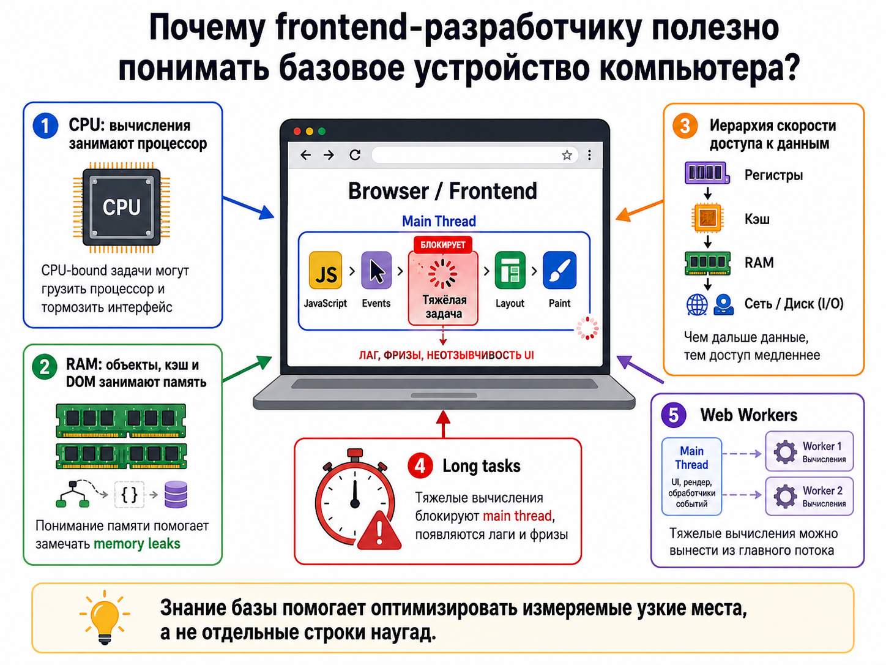
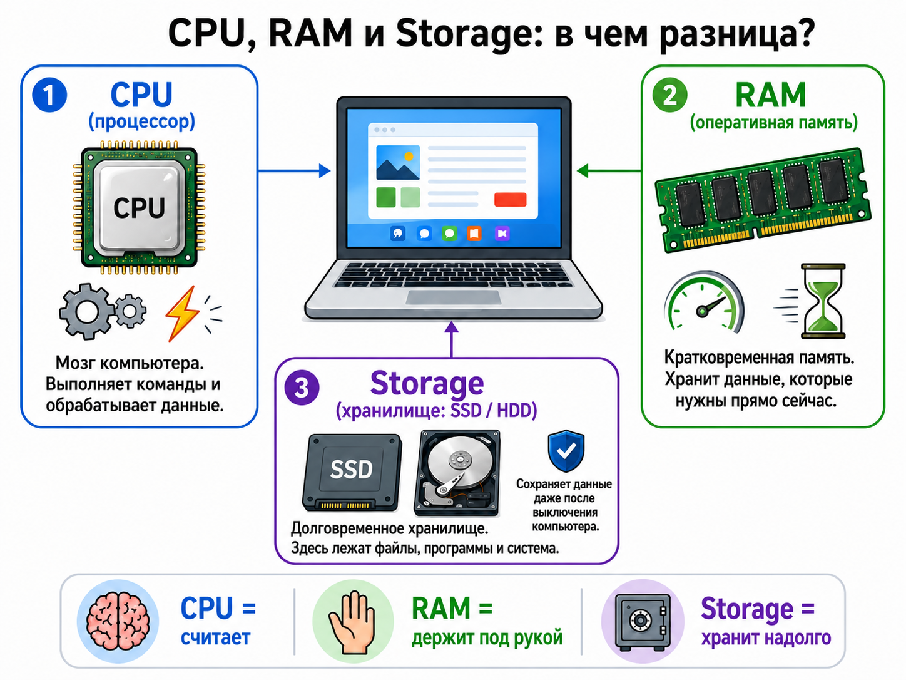
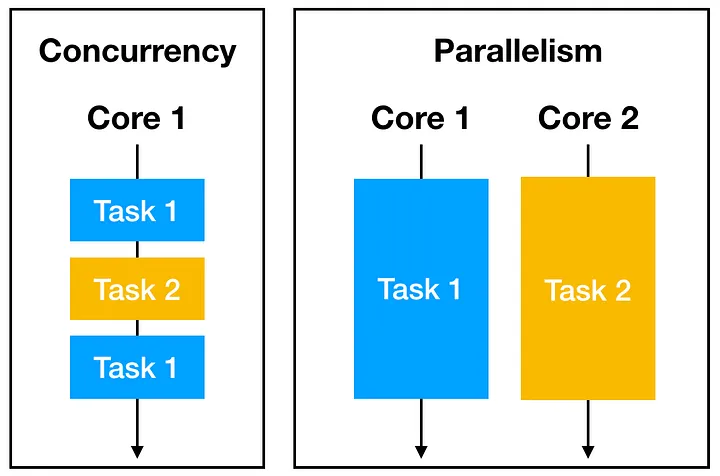

## Computer Science basics

### Архитектура компьютера

<details>
<summary>Что такое принцип фон Неймана (фоннеймановская архитектура)?</summary><br>
<table><tr><td>

Программа и данные хранятся в общей памяти, а процессор читает и выполняет инструкции последовательно, если управление
не изменено переходом. Классическая модель включает память, устройство управления, арифметико-логическое устройство и
ввод/вывод.

**Главные принципы**:

- Единое хранилище для программ и данных
- Однородность памяти
- Адресуемость памяти
- Последовательное программное управление


</td></tr></table>

</details>

<details>
<summary>Из каких основных частей состоит компьютер по архитектуре фон Неймана?</summary><br>
<table><tr><td>

Основные части:

- память (RAM)
- устройство управления (Central Unit, CU)
- арифметико-логическое устройство (Arithmetic Logic Unit, ALU)
- устройства ввода и вывода (I/O)

CPU объединяет управление и вычисления, RAM хранит активные инструкции и данные, а ввод/вывод связывает программу с
внешним миром. Современные компьютеры сложнее, но эта модель полезна как базовая абстракция.

Строго говоря, **CU + ALU ≠ CPU**: это важные части процессора, но не весь процессор целиком.

Помимо устройства управления (CU) и арифметико‑логического устройства (ALU), в современном CPU есть и другие критически
важные компоненты:

- Регистры. Это сверхбыстрая память прямо внутри ядра. В них временно держат операнды и результаты, чтобы ALU не тянул
  данные из медленной RAM. Без регистров цикл «взять данные — посчитать — вернуть» был бы слишком долгим.
- Кэш‑память (L1, L2, иногда L3). Она хранит часто используемые данные и инструкции поближе к ядру. Кэш сильно смягчает
  проблему «бутылочного горлышка» фон Неймана.
- Блок предсказания переходов и конвейер. В современных процессорах инструкции не выполняются строго по одной: их
  «нанизывают» в конвейер, а блок предсказания заранее загружает нужные данные. Этим всем управляет именно логика внутри
  CU, но сам блок — отдельная сложная структура.
- Исполнительные блоки помимо ALU. Например, FPU (для чисел с плавающей точкой) и векторные блоки (SIMD, как SSE/AVX в
  x86). Они делают вычисления параллельно и отдельно от «обычного» ALU.
- Интерконнект и контроллеры. Внутри кристалла нужно соединять все эти блоки между собой и с внешней памятью; часто
  прямо на кристалле размещают и контроллер памяти, и части PCIe‑интерфейса.

На уровне базовой архитектуры (учебники, фон Нейман): часто говорят «CPU = CU + ALU», потому что цель — показать самую
суть: есть тот, кто управляет (CU), и тот, кто считает (ALU). Это упрощение, удобное для понимания принципов.

На уровне реального современного процессора: CPU — это сложная система из десятков и сотен подблоков, где CU и ALU —
важные, но не единственные части.

</td></tr></table>

</details>

<details>
<summary>Почему frontend-разработчику полезно понимать базовое устройство компьютера?</summary><br>
<table><tr><td>

Frontend-разработчику эта модель помогает понимать CPU-bound задачи, main thread (главный поток) и стоимость доступа к
памяти. JavaScript выполняется не в вакууме: вычисления занимают CPU, объекты расходуют RAM, а сеть и диск (I/O)
работают существенно медленнее регистров и кешей процессора. Это помогает объяснять long tasks (тяжелые задачи), лаги
main thread, memory leaks (утечки памяти) и пользу Web Workers. Знание базы позволяет оптимизировать измеряемые узкие
места, а не отдельные строки наугад.



</td></tr></table>

</details>

<details>
<summary>Что такое CPU, RAM и storage?</summary><br>
<table><tr><td>

CPU выполняет машинные инструкции и вычисления. RAM быстро хранит данные работающих процессов, но очищается после
выключения питания. Storage, например SSD, хранит файлы долговременно, но обычно имеет большую задержку доступа.



</td></tr></table>

</details>

<details>
<summary>Что CPU-bound задача?</summary><br>
<table><tr><td>

- **CPU-bound** — это состояние системы или задачи в информатике, при котором время её выполнения определяется
  преимущественно скоростью центрального процессора (CPU), а не другими ресурсами системы, такими как память или
  операции ввода-вывода (I/O). При этом загрузка процессора высока, зачастую достигая 100% в течение нескольких секунд
  или минут.
- **Примеры CPU-bound-задач**:
  - сложные математические вычисления;
  - обработка больших массивов данных;
  - шифрование и сжатие информации;
  - парсинг больших структур данных;
  - рендеринг сложной графики;
  - научные вычисления;
  - обработка изображений;
  - задачи в системах машинного обучения, где требуется постоянная обработка больших объёмов информации.


</td></tr></table>

</details>

<details>
<summary>Чем оперативная память отличается от диска?</summary><br>
<table><tr><td>

RAM быстрее и используется как рабочая память процессов, а диск предназначен для долговременного хранения. Данные с
диска обычно сначала читаются в память, после чего CPU может с ними работать. Недостаток RAM приводит к сборке мусора,
выгрузке страниц памяти и ухудшению отзывчивости.

</td></tr></table>

</details>

<details>
<summary>Что такое машинная инструкция?</summary><br>
<table><tr><td>

Это элементарная команда, которую CPU умеет декодировать и выполнять: загрузить данные, сложить значения, сравнить или
перейти к другому адресу. JavaScript сначала преобразуется движком в промежуточное представление и машинный код. Одна
строка исходника может потребовать много инструкций.

</td></tr></table>

</details>

<details>
<summary>Что такое процесс и поток?</summary><br>
<table><tr><td>

Процесс имеет собственное адресное пространство и ресурсы операционной системы. Поток выполняет последовательность
инструкций внутри процесса и разделяет его память с другими потоками. Браузер использует несколько процессов и потоков,
хотя JavaScript страницы обычно выполняется на одном main thread.

</td></tr></table>

</details>

<details>
<summary>Чем concurrency отличается от parallelism?</summary><br>
<table><tr><td>



- Concurrency (конкурентность или одновременность) означает, что несколько задач находятся в работе и чередуются во
  времени.

- Parallelism (параллелизм) означает их фактическое одновременное выполнение на разных ядрах или процессорах. Browser
  event loop дает concurrency, а Web Workers могут добавить parallelism для вычислений.

</td></tr></table>

</details>

### Память, stack и heap

<details>
<summary>Что такое stack и heap?</summary><br>
<table><tr><td>

Stack хранит frames вызовов функций и имеет строгий порядок LIFO. Heap используется для динамически создаваемых объектов
с менее предсказуемым временем жизни. Конкретная реализация зависит от JavaScript engine, но эта модель полезна для
понимания рекурсии и утечек.

</td></tr></table>

</details>

<details>
<summary>Что обычно хранится в stack?</summary><br>
<table><tr><td>

В stack обычно находятся call frames: адрес возврата, локальный контекст и служебные данные вызова. Небольшие значения
движок также может хранить рядом с frame, но спецификация JavaScript не закрепляет физическое размещение. Важно, что
глубина stack ограничена.

</td></tr></table>

</details>

<details>
<summary>Что обычно хранится в heap?</summary><br>
<table><tr><td>

В heap живут объекты, массивы, функции, замыкания и другие значения с динамическим lifetime. Сборщик мусора освобождает
их, когда они становятся недостижимыми. Большое число удерживаемых объектов увеличивает memory usage и паузы GC.

</td></tr></table>

</details>

<details>
<summary>Почему объекты обычно живут в heap?</summary><br>
<table><tr><td>

Размер и lifetime объекта часто неизвестны во время входа в функцию. Heap позволяет нескольким ссылкам указывать на один
объект и сохранять его после завершения создавшего вызова. Stack с LIFO-порядком для такого времени жизни неудобен.

</td></tr></table>

</details>

<details>
<summary>Почему рекурсия может привести к stack overflow?</summary><br>
<table><tr><td>

Каждый рекурсивный вызов добавляет новый frame. Если базовый случай отсутствует или глубина слишком велика, stack
заканчивается и runtime выбрасывает `RangeError`. Для больших входов используют итерацию, явный stack данных или
разбиение работы.

</td></tr></table>

</details>

<details>
<summary>Что такое memory leak?</summary><br>
<table><tr><td>

Это память, которая больше не нужна приложению, но остается достижимой и не освобождается GC. Утечка проявляется ростом
heap, замедлением работы и иногда падением вкладки. Причина обычно в забытых ссылках, а не в отсутствии сборщика мусора.

</td></tr></table>

</details>

<details>
<summary>Какие memory leaks бывают во frontend?</summary><br>
<table><tr><td>

Частые причины: неснятые event listeners, timers, subscriptions, глобальные коллекции, кеш без ограничения и detached
DOM nodes. Замыкание может удерживать большой объект через одну ненужную ссылку. Особенно важно очищать ресурсы
долгоживущих SPA-компонентов.

</td></tr></table>

</details>

<details>
<summary>Как найти memory leak в браузере?</summary><br>
<table><tr><td>

В Chrome DevTools используют Memory: Heap snapshot, Allocation instrumentation и сравнение snapshots после повторения
сценария. Ищут растущее число объектов, retaining paths и detached DOM nodes. Performance Monitor помогает увидеть
устойчивый рост JS heap и DOM nodes.

</td></tr></table>

</details>

### GC и управление памятью

<details>
<summary>Что такое Garbage Collector?</summary><br>
<table><tr><td>

GC автоматически находит и освобождает память недостижимых объектов. Современные движки используют несколько поколений и
инкрементальные фазы, чтобы уменьшить длинные паузы. Автоматическая очистка не защищает от логически ненужных, но
достижимых данных.

</td></tr></table>

</details>

<details>
<summary>Как GC понимает, что объект больше не нужен?</summary><br>
<table><tr><td>

Движок начинает с roots: global objects, stack frames и внутренних ссылок runtime. Затем отмечает все объекты, до
которых можно дойти по ссылкам. Неотмеченные объекты считаются недостижимыми и могут быть освобождены.

</td></tr></table>

</details>

<details>
<summary>Что такое reachability?</summary><br>
<table><tr><td>

Reachability — возможность добраться до значения из корневых ссылок по цепочке объектов. Пока существует такая цепочка,
GC считает объект нужным. Поэтому одна ссылка из глобального кеша может удерживать большое дерево данных.

</td></tr></table>

</details>

<details>
<summary>Почему замыкания могут удерживать память?</summary><br>
<table><tr><td>

Функция сохраняет доступ к переменным внешней lexical scope даже после завершения внешнего вызова. Если callback живет
долго, связанные данные тоже могут оставаться достижимыми. Следует не захватывать крупный контекст без необходимости и
удалять долгоживущие callbacks.

</td></tr></table>

</details>

<details>
<summary>Как event listeners могут создавать memory leaks?</summary><br>
<table><tr><td>

Event target хранит ссылку на handler, а handler через замыкание может удерживать компонент и данные. Listener нужно
удалять тем же function reference или регистрировать с `AbortSignal`.

```js
const handler = () => updateLargeViewModel();

window.addEventListener('resize', handler);

// При уничтожении владельца:
window.removeEventListener('resize', handler);
```

</td></tr></table>

</details>

<details>
<summary>Почему detached DOM nodes могут быть проблемой?</summary><br>
<table><tr><td>

Узел удален из документа, но JavaScript-ссылка или listener продолжает удерживать его и дочернее дерево. Он не виден
пользователю, но занимает память. DevTools показывает такие узлы как detached elements и помогает найти retaining path.

</td></tr></table>

</details>

<details>
<summary>Как WeakMap и WeakSet помогают с памятью?</summary><br>
<table><tr><td>

Они не удерживают объект-ключ от сборки мусора. Это удобно для metadata и кеша, lifetime которого должен совпадать с
lifetime объекта. Их содержимое нельзя надежно перечислять, потому что GC работает недетерминированно.

</td></tr></table>

</details>

<details>
<summary>Можно ли вручную вызвать GC в JavaScript?</summary><br>
<table><tr><td>

В обычном web-коде нет стандартного API для принудительного GC. Движок сам выбирает момент сборки на основе давления на
память и внутренних эвристик. Правильное решение — удалить ненужные ссылки и ресурсы, а не пытаться управлять GC.

</td></tr></table>

</details>
