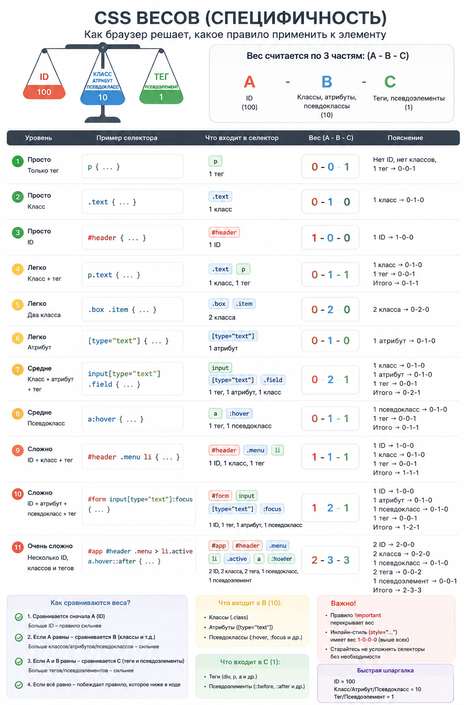

## CSS

### CSS Core

<details>
<summary>Что такое CSS и как браузер применяет его к HTML?</summary><br>
<table><tr><td>

CSS описывает presentation документа. Браузер разбирает stylesheets в CSSOM, сопоставляет selectors с DOM, разрешает
cascade и inheritance, вычисляет значения, а затем использует их для layout, paint и compositing.

</td></tr></table>

</details>

<details>
<summary>Что такое selector и declaration?</summary><br>
<table><tr><td>

Selector выбирает элементы, declaration задает пару property/value внутри rule. Несколько selectors могут совпасть с
одним элементом, после чего cascade определяет победившее значение каждого property.

</td></tr></table>

</details>

<details>
<summary>Что такое cascade?</summary><br>
<table><tr><td>

Cascade разрешает конфликт declarations по relevance, origin и importance, cascade layer, specificity, scope proximity и
порядку. Specificity — только один этап, поэтому «самый тяжелый selector всегда побеждает» — неверное упрощение.

</td></tr></table>

</details>

<details>
<summary>Что такое inheritance в CSS?</summary><br>
<table><tr><td>

Некоторые properties, например `color` и `font-family`, по умолчанию наследуют computed value родителя; размеры и box
properties обычно нет. Наследование применяется после cascade, когда для элемента нет собственного выигравшего значения.

</td></tr></table>

</details>

<details>
<summary>Что такое initial value и что делают <code>inherit</code>, <code>initial</code>, <code>unset</code>, <code>revert</code>?</summary><br>
<table><tr><td>

Каждое property имеет initial value. `inherit` берет значение родителя, `initial` возвращает specification default,
`unset` выбирает inherit или initial по природе property, `revert` откатывает текущий cascade origin/layer к более
раннему результату.

</td></tr></table>

</details>

<details>
<summary>Что такое CSS box model?</summary><br>
<table><tr><td>

Box состоит из content, padding, border и margin. При `content-box` заданная ширина относится только к content, а при
`border-box` включает padding и border. Margin находится снаружи и не входит в размер border box.

</td></tr></table>

</details>

<details>
<summary>Чем единицы <code>em</code>, <code>rem</code>, <code>%</code>, <code>vw</code>, <code>vh</code> и <code>px</code> отличаются?</summary><br>
<table><tr><td>

`rem` зависит от root font size, `em` — от font size текущего контекста, `%` — от property-specific containing value,
viewport units — от viewport, `px` — CSS pixel. Выбор определяется тем, относительно чего размер должен изменяться.

</td></tr></table>

</details>

<details>
<summary>Что такое CSS custom properties?</summary><br>
<table><tr><td>

Custom properties объявляются как `--color` и читаются через `var()`. Они участвуют в cascade, наследуются и могут
меняться runtime. Sass variables вычисляются при сборке и не существуют в browser CSSOM после compilation.

</td></tr></table>

</details>

<details>
<summary>Что такое <code>currentColor</code>?</summary><br>
<table><tr><td>

`currentColor` означает вычисленное значение property `color`. Его удобно использовать для borders, shadows и SVG
иконок, чтобы они автоматически следовали цвету текста и состояниям компонента.

</td></tr></table>

</details>

<details>
<summary>Веса в CSS</summary><br>
<table><tr><td>

Специфичность селектора записывают как три числа: `ID - классы - типы`.

- универсальный селектор `*`: `0-0-0`;
- селектор типа `button`: `0-0-1`;
- class, attribute и pseudo-class: `0-1-0`;
- ID selector: `1-0-0`.

```css
button {
}

.button {
}

#button {
}
```

Если все три селектора подходят одному элементу, победит `#button` со специфичностью `1-0-0`, затем `.button` с `0-1-0`,
затем `button` с `0-0-1`. При одинаковой специфичности выигрывает правило, расположенное позже в cascade.

Inline style рассматривают отдельно: он сильнее обычной специфичности selector. `!important` тоже не является частью
специфичности: он меняет приоритет declaration в cascade, после чего сравниваются origin, layer, specificity и порядок.



</td></tr></table>

</details>

<details>
<summary>Что такое user agent style?</summary><br>
<table><tr><td>

То есть CSS, который браузер сам применяет к HTML-элементам, даже если ты не написал свой CSS.

```html
<h1>Hello</h1>
<p>Text</p>
<button>Click</button>
```

Даже без CSS у них уже есть внешний вид:

```css
h1 {
  font-size: 2em;
  font-weight: bold;
  margin-block-start: 0.67em;
  margin-block-end: 0.67em;
}

button {
  appearance: auto;
}
```

</td></tr></table>

</details>

<details>
<summary>Что делает box-sizing: border-box?</summary><br>
<table><tr><td>

При `border-box` заданные `width` и `height` уже включают padding и border. Это делает размеры элементов предсказуемее.

```css
*,
*::before,
*::after {
  box-sizing: border-box;
}
```

</td></tr></table>

</details>

### CSS Layout

<details>
<summary>Что такое normal flow?</summary><br>
<table><tr><td>

Normal flow — стандартное размещение элементов без positioning, float и специальных layout-контекстов. Block-элементы
идут сверху вниз, inline-контент располагается внутри строк. Flex и Grid создают собственные правила раскладки для
дочерних элементов.

</td></tr></table>

</details>

<details>
<summary>Что такое block formatting context?</summary><br>
<table><tr><td>

BFC — изолированный контекст раскладки block-элементов. Он удерживает floats и предотвращает схлопывание внешних margin
с содержимым в ряде случаев. Его создают, например, `display: flow-root`, flex/grid containers и некоторые значения
`overflow`.

</td></tr></table>

</details>

<details>
<summary>Что такое inline formatting context?</summary><br>
<table><tr><td>

В нем текст и inline boxes формируют строки внутри контейнера. На расположение влияют `line-height`, baseline,
`vertical-align` и доступная ширина. Перенос строки создает новый line box.

</td></tr></table>

</details>

<details>
<summary>Чем <code>display: block</code>, <code>inline</code>, <code>inline-block</code>, <code>flex</code>, <code>grid</code> отличаются друг от друга?</summary><br>
<table><tr><td>

`block` занимает доступную строку, `inline` участвует в тексте и не принимает обычные width/height, `inline-block`
сохраняет inline-размещение с размером box. `flex` управляет элементами преимущественно по одной оси, `grid` — по
строкам и колонкам. Выбор определяется задачей layout, а не внешним видом элемента.

</td></tr></table>

</details>

<details>
<summary>Что такое margin collapsing?</summary><br>
<table><tr><td>

Вертикальные margin соседних block boxes в normal flow могут объединиться в один margin вместо суммы. Обычно остается
наибольший положительный отступ, а отрицательные значения участвуют по отдельным правилам. Flex и Grid items не
схлопывают margin.

</td></tr></table>

</details>

<details>
<summary>Когда margin схлопывается?</summary><br>
<table><tr><td>

Между соседними block-элементами, а также между parent и первым или последним child при отсутствии border, padding,
inline content и разделяющей высоты. Может схлопываться margin пустого блока. Это относится к block formatting context.

</td></tr></table>

</details>

<details>
<summary>Как избежать схлопывания margin?</summary><br>
<table><tr><td>

Предпочесть `gap`, добавить осмысленный padding/border или создать BFC через `display: flow-root`. Не стоит добавлять
случайный `overflow: hidden`, если обрезание содержимого нежелательно. Решение должно соответствовать layout-смыслу.

</td></tr></table>

</details>

<details>
<summary>Когда margin не схлопывается?</summary><br>
<table><tr><td>

У flex/grid items, absolutely positioned elements, floats и элементов в разных BFC. Border, padding или inline content
между parent и child также разделяют margin. Горизонтальные margin не схлопываются.

</td></tr></table>

</details>

<details>
<summary>Что такое positioning в CSS?</summary><br>
<table><tr><td>

Свойство `position` определяет, участвует ли box в normal flow и относительно чего работают inset-свойства `top`,
`right`, `bottom`, `left`. Positioning используют для overlays, sticky headers и локального смещения. Основной layout
обычно лучше строить Flexbox или Grid.

</td></tr></table>

</details>

<details>
<summary>Чем отличаются <code>relative</code>, <code>absolute</code>, <code>fixed</code> и <code>sticky</code>?</summary><br>
<table><tr><td>

`relative` сохраняет место в flow и создает containing block для потомков. `absolute` исключается из flow, `fixed`
обычно привязан к viewport, `sticky` ведет себя как normal flow до заданного scroll threshold. Sticky требует
подходящего scroll container и inset, например `top: 0`.

</td></tr></table>

</details>

<details>
<summary>Что такое stacking context?</summary><br>
<table><tr><td>

Это локальная система наложения элементов. Новый context создают, например, positioned element с `z-index`, `opacity`
меньше 1, `transform` и `isolation: isolate`. Дочерний элемент не может выйти своим `z-index` за пределы context
родителя.

</td></tr></table>

</details>

<details>
<summary>Что такое z-index и почему он иногда не работает?</summary><br>
<table><tr><td>

`z-index` задает порядок внутри текущего stacking context, а не глобально на странице. Большое число проиграет элементу
из context, который целиком расположен выше. Нужно искать родителей, создающих contexts, а не увеличивать значение.

</td></tr></table>

</details>

<details>
<summary>Что такое overflow?</summary><br>
<table><tr><td>

Overflow описывает поведение содержимого, выходящего за padding box. Он может обрезать содержимое или создать scroll
container. Это влияет на sticky positioning, доступность скрытого контента и layout.

</td></tr></table>

</details>

<details>
<summary>Чем отличаются <code>overflow: hidden</code>, <code>auto</code>, <code>scroll</code> и <code>clip</code>?</summary><br>
<table><tr><td>

`hidden` обрезает содержимое, но контейнер остается программно прокручиваемым. `auto` показывает scrollbars при
необходимости, `scroll` резервирует прокрутку всегда, `clip` обрезает без scroll container. Выбор должен сохранять
доступность контента с клавиатуры.

</td></tr></table>

</details>

<details>
<summary>Что такое scroll-snap?</summary><br>
<table><tr><td>

Scroll Snap позволяет контейнеру после прокрутки остановиться у заданных snap positions. Контейнер задает ось и
строгость, элементы — точки выравнивания. Это CSS-enhancement, а не замена доступной навигации carousel.

```css
.carousel {
  display: flex;
  overflow-x: auto;
  scroll-snap-type: x mandatory;
}

.slide {
  flex: 0 0 100%;
  scroll-snap-align: start;
}
```

</td></tr></table>

</details>

<details>
<summary>Когда стоит использовать scroll-snap?</summary><br>
<table><tr><td>

Для горизонтальных галерей, paged sections и сценариев, где остановка на целом элементе ожидаема пользователем. Нужно
оставить обычную прокрутку и элементы управления. Для длинного читаемого контента mandatory snapping часто мешает.

</td></tr></table>

</details>

<details>
<summary>Какие проблемы бывают у scroll-snap на мобильных устройствах?</summary><br>
<table><tr><td>

Слишком строгий snap может бороться с жестом пользователя, затруднять диагональную прокрутку и перескакивать после
изменения размера контента. Safe areas и browser chrome меняют viewport. Поведение нужно проверять на touch devices и с
увеличенным шрифтом.

</td></tr></table>

</details>

<details>
<summary>Что такое containing block?</summary><br>
<table><tr><td>

Containing block — прямоугольник, относительно которого вычисляются position и percentage sizes элемента. Его источник
зависит от `position`, formatting context и properties ancestors; для absolute element это не всегда непосредственный
родитель.

</td></tr></table>

</details>

### Практика по CSS

- [Примеры Flexbox](./examples/flexbox/)
- [Примеры CSS Grid](./examples/grid/)

### CSS Flexbox

Практический пример: [`css/examples/flexbox`](./examples/flexbox/)

<details>
<summary id="flexbox-what">Что такое Flexbox?</summary><br>
<table><tr><td>

Flexbox — одномерная модель раскладки для строки или колонки. Она распределяет свободное пространство, выравнивает
элементы и управляет их ростом и сжатием. Подходит для toolbar, sidebar/content и элементов компонента.

```css
.layout {
  display: flex;
  gap: 16px;
}

.sidebar {
  flex: 0 0 280px;
}

.content {
  flex: 1 1 auto;
  min-width: 0;
}
```

Практика: [`Flexbox: оси и выравнивание`](./examples/flexbox/example1/)

</td></tr></table>

</details>

<details>
<summary id="flexbox-tasks">Какие задачи решает Flexbox?</summary><br>
<table><tr><td>

Flexbox помогает строить одномерные раскладки: строку, колонку, toolbar, группу кнопок, карточку или пару sidebar и
content. Он распределяет свободное место, выравнивает элементы, управляет переносом, ростом и сжатием flex items.

Практика: [`Flexbox: оси и выравнивание`](./examples/flexbox/example1/)

</td></tr></table>

</details>

<details>
<summary id="flexbox-axes">Что такое main axis и cross axis?</summary><br>
<table><tr><td>

Main axis задается `flex-direction`: горизонтально для `row` и вертикально для `column`. Cross axis перпендикулярна
главной. Поэтому смысл `justify-content` и `align-items` зависит от направления контейнера.

Практика: [`Flexbox: column direction`](./examples/flexbox/example2/)

</td></tr></table>

</details>

<details>
<summary id="flexbox-justify-align">Чем <code>justify-content</code> отличается от <code>align-items</code>?</summary><br>
<table><tr><td>

`justify-content` распределяет элементы и свободное пространство вдоль main axis. `align-items` выравнивает flex items
вдоль cross axis. Для отдельного элемента cross-axis выравнивание можно изменить через `align-self`.

Практика: [`Flexbox: justify-content и align-items`](./examples/flexbox/example1/)

</td></tr></table>

</details>

<details>
<summary id="flexbox-direction">Что делает <code>flex-direction</code>?</summary><br>
<table><tr><td>

`flex-direction` задает направление main axis: `row`, `row-reverse`, `column` или `column-reverse`. От него зависит,
куда раскладываются flex items и по какой оси работает `justify-content`.

Практика: [`Flexbox: column direction`](./examples/flexbox/example2/)

</td></tr></table>

</details>

<details>
<summary id="flexbox-wrap">Что делает <code>flex-wrap</code>?</summary><br>
<table><tr><td>

`flex-wrap` определяет, должны ли элементы оставаться в одной строке или могут переноситься на новые flex lines. При
переносе расстояния между строками можно контролировать через `row-gap`, а распределение строк — через `align-content`.

Практика: [`Flexbox: wrap`](./examples/flexbox/example3/)

</td></tr></table>

</details>

<details>
<summary id="flexbox-gap">Что делает <code>gap</code> во Flexbox?</summary><br>
<table><tr><td>

`gap` задает расстояние между flex items и между flex lines, если элементы переносятся. Он принадлежит контейнеру и не
добавляет внешний отступ по краям раскладки.

Практика: [`Flexbox: row-gap и column-gap`](./examples/flexbox/example4/)

</td></tr></table>

</details>

<details>
<summary id="flexbox-gap-vs-margin">Почему <code>gap</code> часто удобнее, чем margin между элементами?</summary><br>
<table><tr><td>

`gap` описывает внутреннее расстояние между соседними элементами на уровне контейнера. Не нужны отдельные правила для
первого или последнего элемента, отрицательные margin и компенсация краев. Margin лучше оставлять для внешнего
расстояния между независимыми блоками.

Практика: [`Flexbox: gap`](./examples/flexbox/example3/)

</td></tr></table>

</details>

<details>
<summary id="flexbox-grow-shrink-basis">Что делают <code>flex-grow</code>, <code>flex-shrink</code> и <code>flex-basis</code>?</summary><br>
<table><tr><td>

`flex-basis` задает базовый размер до распределения пространства. `flex-grow` определяет долю положительного свободного
места, `flex-shrink` — участие в сжатии при нехватке места. Итоговый размер также зависит от min/max constraints.

Практика: [`Flexbox: flex-grow`](./examples/flexbox/example8/) и [`Flexbox: flex-shrink`](./examples/flexbox/example6/)

</td></tr></table>

</details>

<details>
<summary id="flexbox-flex-1">Что значит <code>flex: 1</code>?</summary><br>
<table><tr><td>

В современном CSS это обычно раскрывается примерно в `flex: 1 1 0%`. Элемент начинает с нулевого basis, может расти и
сжиматься, деля доступное пространство с соседями. Для контента часто дополнительно нужен `min-width: 0`.

Практика: [`Flexbox: flex-grow`](./examples/flexbox/example7/)

</td></tr></table>

</details>

<details>
<summary id="flexbox-basis-0-auto">Чем <code>flex-basis: 0</code> отличается от <code>flex-basis: auto</code>?</summary><br>
<table><tr><td>

`flex-basis: 0` начинает распределение свободного места от нулевой базы, поэтому элементы с одинаковым `flex-grow` чаще
получают равные доли. `flex-basis: auto` сначала учитывает `width`, `height` или размер содержимого, а уже потом
распределяет оставшееся пространство.

Практика: [`Flexbox: flex-grow`](./examples/flexbox/example8/)

</td></tr></table>

</details>

<details>
<summary id="flexbox-min-width-0">Почему во Flexbox часто нужен <code>min-width: 0</code>?</summary><br>
<table><tr><td>

Flex items по умолчанию имеют automatic minimum size, часто равный min-content width. Длинный текст или вложенный блок
может растягивать колонку и ломать layout. `min-width: 0` разрешает элементу сжиматься внутри flex-контейнера, после
чего работают wrapping, ellipsis или overflow.

Практика: [`Flexbox: flex-shrink`](./examples/flexbox/example6/)

</td></tr></table>

</details>

<details>
<summary id="flexbox-fixed-fluid-columns">Как сделать две колонки, где одна занимает фиксированную ширину, а вторая все остальное место?</summary><br>
<table><tr><td>

Контейнеру задают `display: flex`, фиксированной колонке — `flex: 0 0 280px`, а гибкой — `flex: 1 1 auto` и часто
`min-width: 0`. Так sidebar сохраняет ширину, а content занимает оставшееся пространство.

Практика: [`Flexbox: flex-grow`](./examples/flexbox/example7/)

</td></tr></table>

</details>

<details>
<summary id="flexbox-equal-columns">Как сделать равные колонки через Flexbox?</summary><br>
<table><tr><td>

Для равных колонок обычно задают элементам одинаковое сокращение, например `flex: 1 1 0`. Нулевой basis убирает влияние
начального размера контента, а одинаковый `flex-grow` делит свободное место поровну.

Практика: [`Flexbox: flex-grow`](./examples/flexbox/example7/)

</td></tr></table>

</details>

<details>
<summary id="flexbox-card-bottom">Как прижать кнопку или блок к низу карточки через Flexbox?</summary><br>
<table><tr><td>

Карточку делают flex-контейнером с `flex-direction: column`, а нужному нижнему блоку задают `margin-top: auto`. Auto
margin забирает свободное пространство и отталкивает блок к нижнему краю карточки.

Практика: [`Flexbox: auto margin`](./examples/flexbox/example10/)

</td></tr></table>

</details>

<details>
<summary id="flexbox-centering">Как центрировать элемент по горизонтали и вертикали через Flexbox?</summary><br>
<table><tr><td>

Контейнеру задают `display: flex`, `justify-content: center` и `align-items: center`. При `flex-direction: row`
горизонтальное центрирование идет по main axis, а вертикальное — по cross axis.

Практика: [`Flexbox: центрирование items`](./examples/flexbox/example5/)

</td></tr></table>

</details>

<details>
<summary id="flexbox-common-mistakes">Какие типичные ошибки бывают при использовании Flexbox?</summary><br>
<table><tr><td>

Частые ошибки: путать main axis и cross axis, ждать от Flexbox полноценной двумерной сетки, забывать про `flex-wrap`,
использовать margin вместо `gap` для внутренних расстояний, не учитывать `flex-shrink` и не задавать `min-width: 0` для
колонок с длинным контентом.

Практика: [`Примеры Flexbox`](./examples/flexbox/)

</td></tr></table>

</details>

### CSS Grid

Практический пример: [`css/examples/grid`](./examples/grid/)

<details>
<summary id="flexbox-vs-grid-when">Когда лучше использовать Flexbox, а когда CSS Grid?</summary><br>
<table><tr><td>

Flexbox выбирают для строки, колонки, выравнивания и неизвестного числа элементов. Grid — когда важны согласованные
колонки, строки или двумерные области. Если приходится имитировать строки вложенными flex-контейнерами, Grid обычно
проще.

Практика: [`Flexbox: wrap`](./examples/flexbox/example3/) и
[`CSS Grid: адаптивная сетка товаров`](./examples/grid/example11/)

</td></tr></table>

</details>

<details>
<summary id="grid-what">Что такое CSS Grid?</summary><br>
<table><tr><td>

Grid — двумерная система раскладки со строками, колонками и областями. Она позволяет определить структуру контейнера, а
элементам — занимать одну или несколько ячеек. Grid удобен для карточек и page-level layout.

Практика: [`CSS Grid: явная сетка 3 на 3`](./examples/grid/example1/) и
[`CSS Grid: адаптивная сетка товаров`](./examples/grid/example11/)

</td></tr></table>

</details>

<details>
<summary id="grid-vs-flexbox">Чем Grid отличается от Flexbox?</summary><br>
<table><tr><td>

Grid управляет двумя измерениями одновременно и начинает с структуры контейнера. Flexbox распределяет элементы вдоль
одной основной оси и лучше адаптируется к содержимому. Их часто комбинируют: Grid для страницы, Flexbox внутри
компонентов.

Практика: [`CSS Grid: именованные области`](./examples/grid/example6/) и [`Flexbox: wrap`](./examples/flexbox/example3/)

</td></tr></table>

</details>

<details>
<summary id="grid-when">Когда лучше использовать Grid вместо Flexbox?</summary><br>
<table><tr><td>

Grid лучше выбирать для двумерной структуры: согласованных строк, колонок, областей страницы и карточных сеток. Flexbox
удобнее для одномерного распределения элементов внутри компонента. Если layout одновременно зависит и от строк, и от
колонок, Grid обычно проще и устойчивее.

Практика: [`CSS Grid: page layout`](./examples/grid/example3/) и
[`CSS Grid: grid-template-areas`](./examples/grid/example6/)

</td></tr></table>

</details>

<details>
<summary id="grid-template-tracks">Что делают <code>grid-template-columns</code> и <code>grid-template-rows</code>?</summary><br>
<table><tr><td>

Они описывают явные tracks сетки и их размеры. Можно использовать px, `%`, `fr`, `minmax()`, `repeat()` и intrinsic
keywords. Неявные tracks создаются автоматически для элементов вне заданной сетки.

Практика: [`CSS Grid: фиксированные tracks`](./examples/grid/example1/) и
[`CSS Grid: fr-единицы`](./examples/grid/example2/)

</td></tr></table>

</details>

<details>
<summary id="grid-minmax">Что такое <code>minmax()</code>?</summary><br>
<table><tr><td>

`minmax(min, max)` задает диапазон размера grid track. Например, колонка может быть не уже `240px`, но растягиваться до
доли свободного пространства. Это основа многих responsive grids без media queries.

Практика: [`CSS Grid: адаптивная сетка товаров`](./examples/grid/example11/)

</td></tr></table>

</details>

<details>
<summary id="grid-auto-fit-fill">Что такое <code>auto-fit</code> и <code>auto-fill</code>?</summary><br>
<table><tr><td>

Оба значения создают столько повторяющихся tracks, сколько помещается. `auto-fill` сохраняет пустые tracks, а `auto-fit`
схлопывает их и растягивает занятые. Разница заметна, когда элементов меньше доступных колонок.

```css
.cards {
  display: grid;
  grid-template-columns: repeat(auto-fit, minmax(240px, 1fr));
  gap: 16px;
}
```

Практика: [`CSS Grid: auto-fit и minmax`](./examples/grid/example11/)

</td></tr></table>

</details>

<details>
<summary id="grid-stacking">Что такое Grid stacking?</summary><br>
<table><tr><td>

Grid stacking — прием, при котором несколько grid items размещают в одной и той же области сетки или в пересекающихся
grid lines. Элементы накладываются друг на друга, а порядок слоя определяется обычными правилами stacking context:
порядком в DOM, `z-index`, `position`, `opacity`, `transform` и другими свойствами.

Это удобно для overlay: текст поверх изображения, badge на карточке, декоративный слой или controlled overlap без
`position: absolute`. Grid при этом продолжает задавать общую геометрию и размер области.

```css
.card {
  display: grid;
}

.card img,
.card .content {
  grid-column: 1 / 2;
  grid-row: 1 / 2;
}
```

Практика: [`CSS Grid: пересекающиеся линии`](./examples/grid/example9/) и
[`CSS Grid: текст поверх изображения`](./examples/grid/example10/)

</td></tr></table>

</details>

<details>
<summary id="grid-wrapping">Как сделать Grid wrapping?</summary><br>
<table><tr><td>

В Grid нет прямого аналога `flex-wrap`, потому что grid items автоматически переходят в новые строки или колонки по
правилам auto-placement. Для карточных сеток обычно задают повторяющиеся колонки через `repeat()`, `auto-fit` или
`auto-fill`, а минимальный и максимальный размер колонки описывают через `minmax()`.

Так сетка сама вычисляет, сколько колонок помещается в контейнер, и переносит лишние элементы на следующую строку без
media queries.

```css
.cards {
  display: grid;
  grid-template-columns: repeat(auto-fit, minmax(240px, 1fr));
  gap: 16px;
}
```

Практика: [`CSS Grid: auto-fit и minmax`](./examples/grid/example11/)

</td></tr></table>

</details>

### CSS Responsive

<details>
<summary>Чем responsive design отличается от adaptive design?</summary><br>
<table><tr><td>

Responsive layout плавно подстраивается под доступное пространство, а adaptive обычно выбирает несколько заранее
подготовленных layouts для диапазонов устройств. На практике подходы комбинируют, а границы выбирают по content, не по
моделям телефонов.

</td></tr></table>

</details>

<details>
<summary>Что такое mobile-first?</summary><br>
<table><tr><td>

Mobile-first начинает с базового layout для узкого экрана и добавляет возможности через `min-width` queries. Это
помогает приоритизировать content и progressive enhancement, но не отменяет тестирование desktop, touch, keyboard и
разных input capabilities.

</td></tr></table>

</details>

<details>
<summary>Что такое media query?</summary><br>
<table><tr><td>

`@media` применяет rules при совпадении характеристик viewport или устройства: width, orientation, hover, pointer,
preferences пользователя. Breakpoints выбирают там, где ломается layout, а не по названиям устройств.

</td></tr></table>

</details>

<details>
<summary>Что такое container query и чем она отличается от media query?</summary><br>
<table><tr><td>

Media query смотрит на viewport или device features, container query — на размер или styles ближайшего query container.
Container queries делают компонент адаптивным к месту использования, независимо от ширины всей страницы.

</td></tr></table>

</details>

<details>
<summary>Что такое fluid typography и как работает <code>clamp()</code>?</summary><br>
<table><tr><td>

Fluid typography плавно меняет размер между границами. `clamp(min, preferred, max)` ограничивает вычисленное значение:

```css
.title {
  font-size: clamp(1.5rem, 1rem + 2vw, 3rem);
}
```

Границы сохраняют читаемость на очень узких и широких экранах.

</td></tr></table>

</details>

<details>
<summary>Что такое safe area?</summary><br>
<table><tr><td>

Safe area учитывает вырезы, скругления и системные overlays устройства. Значения `env(safe-area-inset-*)` добавляют
необходимые padding при подходящем viewport configuration, особенно для fixed controls у краев экрана.

</td></tr></table>

</details>

<details>
<summary>Как учитывать разные плотности экранов?</summary><br>
<table><tr><td>

Layout строят в CSS pixels, а raster assets предоставляют с подходящим resolution через `srcset` или image-set. SVG
масштабируется независимо от DPR. Не следует умножать все CSS-размеры на device pixel ratio вручную.

</td></tr></table>

</details>

<details>
<summary>Как responsive images связаны с responsive layout?</summary><br>
<table><tr><td>

Layout определяет отображаемую ширину, а `sizes` сообщает ее браузеру для выбора кандидата из `srcset`. Если `sizes` не
соответствует реальному layout, браузер может загрузить слишком большой или размытый ресурс.

</td></tr></table>

</details>

### CSS Architecture

<details>
<summary>Какие плюсы и минусы у БЭМ?</summary><br>
<table><tr><td>

БЭМ дает предсказуемые глобальные имена и явно показывает block, element и modifier. Цена — длинные class names,
дисциплина соглашений и возможное дублирование контекста там, где framework уже изолирует component styles.

</td></tr></table>

</details>

<details>
<summary>Чем CSS Modules, CSS-in-JS и utility-first CSS отличаются?</summary><br>
<table><tr><td>

CSS Modules генерируют локальные class names, CSS-in-JS связывает styles с JavaScript runtime или build step,
utility-first собирает UI из небольших готовых classes. Выбор влияет на isolation, runtime cost, theming, tooling,
server rendering и читаемость markup.

</td></tr></table>

</details>

<details>
<summary>Какие плюсы и минусы у Tailwind-подхода?</summary><br>
<table><tr><td>

Utilities ускоряют композицию, ограничивают произвольные значения и удаляют неиспользуемые rules при сборке. Минусы —
шумная markup, необходимость соглашений для повторяющихся patterns и риск смешать design decisions со случайными
utilities без tokens и component boundaries.

</td></tr></table>

</details>

<details>
<summary>Что такое design tokens?</summary><br>
<table><tr><td>

Tokens — именованные design decisions: colors, spacing, typography, radii, motion. Их хранят в нейтральном source of
truth и преобразуют в CSS custom properties, platform constants и design-tool variables. Семантические tokens вроде
`--color-danger` устойчивее прямых названий оттенков.

</td></tr></table>

</details>

<details>
<summary>Как сделать theme и dark theme?</summary><br>
<table><tr><td>

Компоненты используют semantic custom properties, а theme переопределяет их на root container. Начальный выбор может
учитывать `prefers-color-scheme`, пользовательская настройка должна иметь приоритет и сохраняться. Проверяют contrast,
media assets и browser controls через `color-scheme`.

</td></tr></table>

</details>

<details>
<summary>Почему глобальные стили могут быть проблемой?</summary><br>
<table><tr><td>

Широкие selectors создают неявные зависимости, conflicts и regressions в далеких features. Global layer оставляют для
reset, tokens, typography и действительно общих primitives; component и feature styles ограничивают понятными
boundaries.

</td></tr></table>

</details>

<details>
<summary>Что такое cascade layers <code>@layer</code>?</summary><br>
<table><tr><td>

Cascade layers задают явный порядок групп styles до сравнения specificity. Например, `reset`, `base`, `components` и
`utilities` можно упорядочить один раз, уменьшая войны selectors и `!important`.

</td></tr></table>

</details>

<details>
<summary>Что такое Shadow DOM style encapsulation?</summary><br>
<table><tr><td>

Shadow DOM создает отдельное tree boundary: обычные document selectors не проникают внутрь, а внутренние styles не
выходят наружу. Наследуемые properties, CSS custom properties, `::part` и `::slotted` формируют контролируемые точки
настройки.

</td></tr></table>

</details>

<details>
<summary>Что такое BEM?</summary><br>
<table><tr><td>

BEM делит CSS-имена на block, element и modifier:

```css
.user-card {
}
.user-card__title {
}
.user-card--compact {
}
```

Соглашение делает связи явными и снижает конфликты глобальных стилей, но длинные имена и ручная дисциплина могут быть
избыточны при надежной component style isolation.

</td></tr></table>

</details>

<details>
<summary>Чем SCSS @import отличается от @use?</summary><br>
<table><tr><td>

Legacy `@import` глобально объединяет файлы, может загружать их повторно и создает конфликты имен.

`@use` загружает module один раз и предоставляет namespace:

```scss
@use 'tokens';

.button {
  color: tokens.$primary;
}
```

Для нового Sass-кода используют `@use` и `@forward`.

</td></tr></table>

</details>

<details>
<summary>Какие есть способы изоляции стилей?</summary><br>
<table><tr><td>

Основные варианты:

- соглашения именования, например BEM;
- Angular style encapsulation;
- CSS Modules;
- Shadow DOM;
- utility-классы;
- ограничение стилей через feature/component boundaries.

Изоляция уменьшает конфликты, но global tokens, typography и overlays все равно требуют продуманного общего слоя.

</td></tr></table>

</details>

<details>
<summary>Какие плюсы и минусы готового UI Kit?</summary><br>
<table><tr><td>

Плюсы: единый дизайн, accessibility primitives, быстрый старт, готовые сложные компоненты и меньше дублирования.

Минусы: ограниченная кастомизация, лишний bundle, зависимость от release cycle и сложные обновления. Перед выбором
проверяют accessibility, theming, SSR, forms integration, поддержку Angular-версий и качество API.

</td></tr></table>

</details>

### CSS Rendering и Performance

<details>
<summary>Что такое reflow/layout?</summary><br>
<table><tr><td>

Layout вычисляет геометрию render tree: размеры и координаты элементов. Изменение ширины, шрифта или структуры может
потребовать пересчета части или всей страницы. Стоимость растет с размером и связанностью layout.

</td></tr></table>

</details>

<details>
<summary>Почему GPU не делает любую анимацию бесплатной?</summary><br>
<table><tr><td>

Compositor может дешево перемещать готовый layer, но его сначала нужно rasterize и хранить в GPU memory. Большие layers,
filters, uploads и частые изменения content создают overhead. Производительность подтверждают trace, а не наличием
`transform: translateZ(0)`.

</td></tr></table>

</details>

<details>
<summary>Что делают <code>contain</code> и <code>content-visibility</code>?</summary><br>
<table><tr><td>

`contain` ограничивает влияние layout, paint, size или style элемента на остальную страницу. `content-visibility: auto`
позволяет пропускать rendering вне viewport, сохраняя content для поиска и accessibility tree. Для стабильной прокрутки
часто задают `contain-intrinsic-size`.

</td></tr></table>

</details>

<details>
<summary>Что такое repaint?</summary><br>
<table><tr><td>

Paint рисует пиксели для фона, текста, border, shadow и других визуальных свойств. Он может выполняться без нового
layout, если геометрия не изменилась. Большие painted areas и сложные эффекты увеличивают стоимость.

</td></tr></table>

</details>

<details>
<summary>Что такое compositing?</summary><br>
<table><tr><td>

Compositing собирает ранее нарисованные слои в итоговый кадр, применяя трансформации и прозрачность. Эту работу часто
можно передать compositor thread/GPU. Но создание и хранение слоев расходует память.

</td></tr></table>

</details>

<details>
<summary>Чем reflow отличается от repaint?</summary><br>
<table><tr><td>

Reflow пересчитывает геометрию и обычно приводит к последующему paint. Repaint меняет пиксели без обязательного
пересчета размеров. Compositing может обновить итоговый кадр без обоих этапов для подходящих свойств.

</td></tr></table>

</details>

<details>
<summary>Какие CSS-свойства чаще вызывают layout?</summary><br>
<table><tr><td>

Свойства размеров и геометрии: `width`, `height`, margin, padding, border, position offsets, font metrics и изменения
DOM. Точная область пересчета зависит от layout и containment. Проверять нужно в Performance panel.

</td></tr></table>

</details>

<details>
<summary>Какие CSS-свойства чаще вызывают paint?</summary><br>
<table><tr><td>

Цвета, backgrounds, borders, shadows и часть filters обычно требуют paint, но не layout. Чем больше область и сложнее
эффект, тем дороже операция. Реальная pipeline зависит от браузера и layer structure.

</td></tr></table>

</details>

<details>
<summary>Почему <code>transform</code> и <code>opacity</code> обычно лучше для анимаций?</summary><br>
<table><tr><td>

Они часто применяются на этапе compositing без повторного layout и paint содержимого. Это уменьшает работу main thread и
делает кадры стабильнее. Гарантии нет: сложная сцена и лишние layers тоже могут быть дорогими.

</td></tr></table>

</details>

<details>
<summary>Что выполняется на CPU, а что может уйти на GPU?</summary><br>
<table><tr><td>

JavaScript, style calculation и layout в основном выполняются CPU/main thread. GPU часто ускоряет rasterization и
compositing слоев. Он не делает произвольную CSS-анимацию бесплатной и не исправляет long JavaScript tasks.

</td></tr></table>

</details>

<details>
<summary>Что такое compositor layer?</summary><br>
<table><tr><td>

Это поверхность, которую браузер может независимо перемещать и смешивать при сборке кадра. Layers полезны для
анимируемых элементов, fixed content и video. Каждый слой требует памяти и может увеличить raster/compositing work.

</td></tr></table>

</details>

<details>
<summary>Что такое layer promotion?</summary><br>
<table><tr><td>

Браузер решает вынести элемент в отдельный compositor layer из-за transform, animation или других эвристик. Разработчик
может подсказать намерение через `will-change`, но итог контролирует engine. Promotion нужно подтверждать Layers panel.

</td></tr></table>

</details>

<details>
<summary>Что делает <code>will-change</code>?</summary><br>
<table><tr><td>

Он заранее сообщает браузеру, какое свойство скоро изменится, чтобы подготовить оптимизацию. Использовать его следует
незадолго до анимации и для ограниченного числа элементов. После завершения долгой подготовки hint можно убрать.

</td></tr></table>

</details>

<details>
<summary>Почему <code>will-change</code> нельзя ставить на все элементы?</summary><br>
<table><tr><td>

Браузер может создать слишком много слоев и потратить GPU memory. Это увеличивает rasterization, compositing и иногда
ухудшает производительность сильнее исходной проблемы. `will-change` — точечный hint, а не reset.

</td></tr></table>

</details>

<details>
<summary>Почему <code>top/left</code> часто хуже для анимаций, чем <code>transform</code>?</summary><br>
<table><tr><td>

Offsets меняют геометрию positioned element и могут запускать layout и paint. Transform обычно перемещает готовый слой
на этапе compositing. Итог зависит от элемента, поэтому анимацию измеряют.

```css
/* Плохо для частых анимаций */
.box {
  left: 100px;
}

/* Обычно лучше */
.box {
  transform: translateX(100px);
}
```

</td></tr></table>

</details>

<details>
<summary>Почему <code>box-shadow</code> и <code>filter</code> могут быть дорогими?</summary><br>
<table><tr><td>

Они требуют вычисления пикселей вокруг элемента, размытия и дополнительных offscreen surfaces. Большой blur radius и
анимация на крупной области особенно дороги. Иногда дешевле использовать подготовленный asset или меньшую область.

</td></tr></table>

</details>

<details>
<summary>Что такое layout thrashing?</summary><br>
<table><tr><td>

Это повторное чередование DOM writes и layout reads, вынуждающее браузер синхронно пересчитывать геометрию много раз за
кадр. Проблема часто возникает в циклах. Чтения и записи нужно группировать.

</td></tr></table>

</details>

<details>
<summary>Как избежать layout thrashing?</summary><br>
<table><tr><td>

Сначала прочитать необходимые размеры, затем пакетно изменить DOM. Для кадра использовать `requestAnimationFrame`, для
списков — class changes вместо множества inline writes. Профилировщик покажет forced synchronous layout.

</td></tr></table>

</details>

<details>
<summary>Почему чтение <code>offsetWidth</code> после записи стилей может быть проблемой?</summary><br>
<table><tr><td>

После write вычисленные размеры становятся устаревшими. Чтение `offsetWidth` требует актуального значения и заставляет
браузер немедленно завершить style/layout вместо отложенной пакетной работы. Повторение этого паттерна создает forced
reflow.

</td></tr></table>

</details>

<details>
<summary>Как DevTools Performance помогает искать reflow/repaint?</summary><br>
<table><tr><td>

Запись trace показывает scripting, style recalculation, layout, paint и compositing по кадрам. Можно открыть дорогой
event, увидеть call stack и affected nodes. Paint flashing и Layers дополняют анализ.

</td></tr></table>

</details>

<details>
<summary>Что такое FPS?</summary><br>
<table><tr><td>

FPS — число отображенных кадров в секунду. Низкий или нестабильный FPS заметен как рывки анимации и scrolling. Важно
смотреть не только среднее, но и пропущенные кадры.

</td></tr></table>

</details>

<details>
<summary>Почему 60 FPS означает бюджет около 16.6ms на кадр?</summary><br>
<table><tr><td>

Секунда делится на 60 интервалов: примерно `1000 / 60 = 16.6ms`. В этот бюджет входят input, JavaScript, style, layout,
paint и compositing. На дисплеях 120Hz бюджет еще меньше.

</td></tr></table>

</details>

<details>
<summary>Как <code>requestAnimationFrame</code> помогает с анимациями?</summary><br>
<table><tr><td>

Callback вызывается перед следующим paint и синхронизирует обновление с refresh cycle. Браузер может приостанавливать
его в фоновой вкладке. Тяжелая работа внутри callback все равно блокирует кадр.

</td></tr></table>

</details>

### Modern CSS

<details>
<summary>Что такое CSS nesting?</summary><br>
<table><tr><td>

Native nesting позволяет вкладывать relative selectors внутрь style rule. Оно уменьшает повторение context, но глубокая
вложенность повышает specificity и связанность. Синтаксис и результат следует отличать от дополнительных возможностей
Sass.

</td></tr></table>

</details>

<details>
<summary>Чем <code>:is()</code> отличается от <code>:where()</code>?</summary><br>
<table><tr><td>

Обе pseudo-classes группируют selectors. Specificity `:is()` равна самому специфичному аргументу, а `:where()` всегда
имеет нулевую specificity. Поэтому `:where()` удобен для легко переопределяемых defaults.

</td></tr></table>

</details>

<details>
<summary>Что такое <code>:has()</code>?</summary><br>
<table><tr><td>

`:has()` выбирает element по совпадению relative selector внутри или рядом, например form group с invalid input. Это
позволяет стилизовать parent без JavaScript, но слишком широкие selectors на больших деревьях следует применять
осознанно.

</td></tr></table>

</details>

<details>
<summary>Что такое style queries?</summary><br>
<table><tr><td>

Style container queries применяют rules по computed style container, прежде всего по custom properties. Это позволяет
компоненту реагировать на semantic state контекста. Поддержку конкретного синтаксиса нужно проверять для целевых
браузеров.

</td></tr></table>

</details>

<details>
<summary>Для чего нужны <code>accent-color</code> и <code>color-scheme</code>?</summary><br>
<table><tr><td>

`accent-color` настраивает accent native form controls, сохраняя их поведение. `color-scheme` сообщает браузеру, какие
цветовые схемы поддерживает область, чтобы он согласовал controls, scrollbars и системные colors.

</td></tr></table>

</details>

<details>
<summary>Как работают <code>prefers-color-scheme</code> и <code>prefers-reduced-motion</code>?</summary><br>
<table><tr><td>

Эти media features отражают системные предпочтения пользователя. Первая помогает выбрать начальную theme, вторая —
уменьшить необязательное движение. Reduced motion означает не «выключить все», а убрать потенциально проблемные эффекты,
сохранив понятную обратную связь.

</td></tr></table>

</details>

<details>
<summary>Что такое logical properties?</summary><br>
<table><tr><td>

Logical properties описывают flow-relative стороны: `margin-inline-start`, `padding-block`, `inset-inline-end`. В
отличие от `left` и `right`, они адаптируются к writing mode и направлению LTR/RTL, уменьшая отдельные overrides для
локализации.

</td></tr></table>

</details>

<details>
<summary>Для чего нужны <code>aspect-ratio</code> и <code>object-fit</code>?</summary><br>
<table><tr><td>

`aspect-ratio` задает предпочтительное соотношение сторон box и помогает резервировать место. `object-fit` определяет,
как replaced content вроде image или video вписывается в заданный box: `contain` сохраняет весь content, `cover`
заполняет область с crop.

</td></tr></table>

</details>

<details>
<summary>Что делают <code>overscroll-behavior</code> и <code>scrollbar-gutter</code>?</summary><br>
<table><tr><td>

`overscroll-behavior` управляет scroll chaining и browser overscroll actions на границах container. `scrollbar-gutter`
может заранее резервировать место под scrollbar, предотвращая layout shift. Оба свойства применяют точечно, не ломая
ожидаемую прокрутку страницы.

</td></tr></table>

</details>
