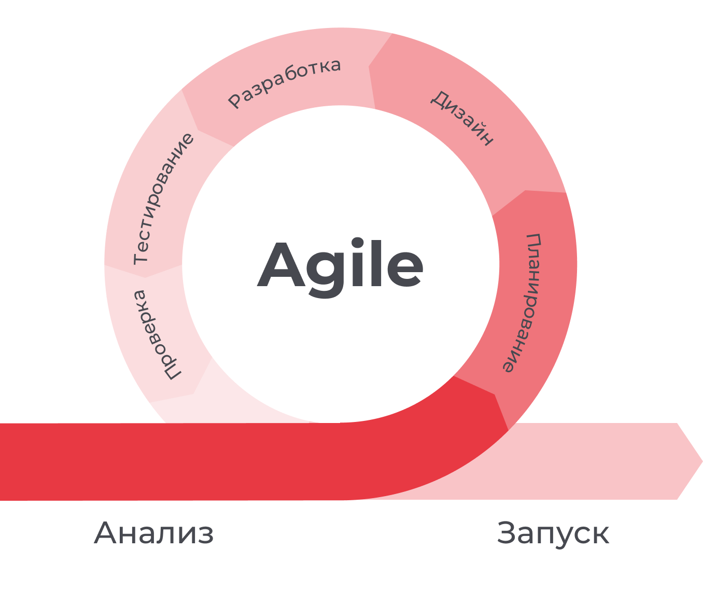
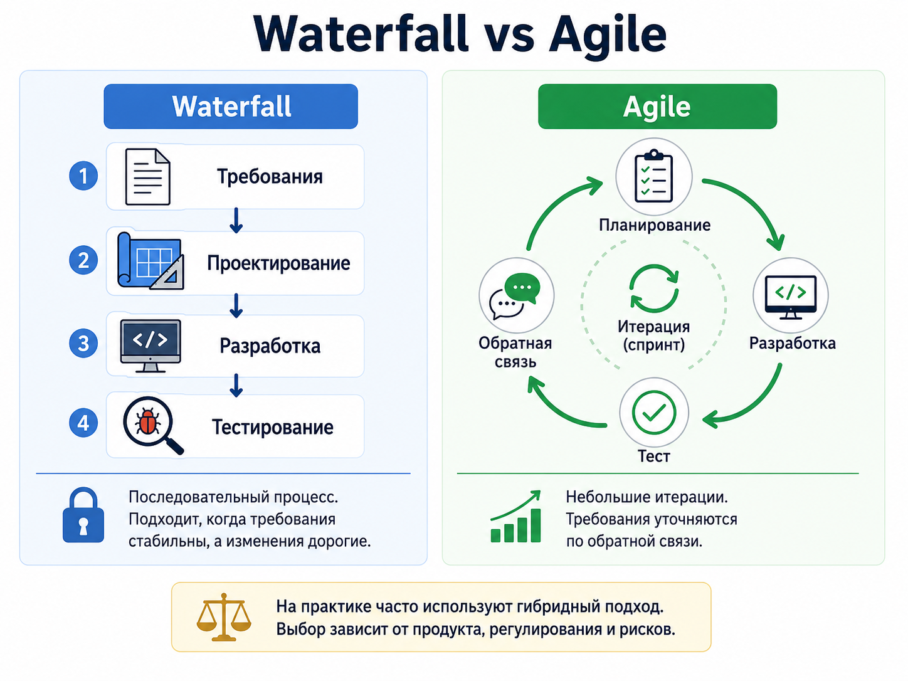
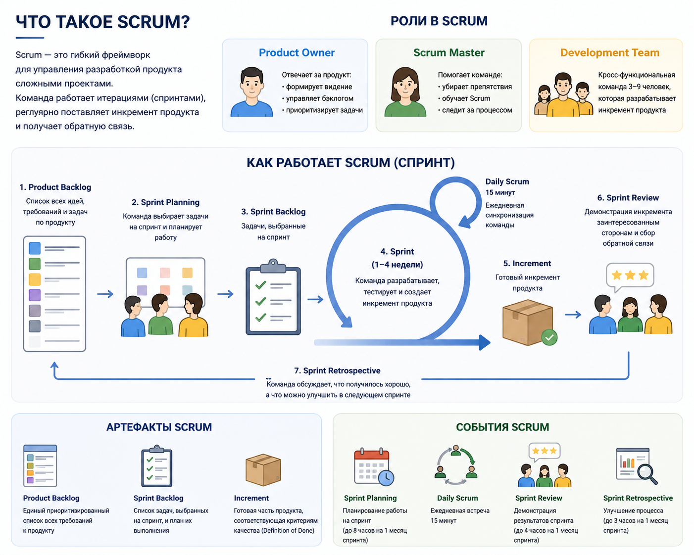

## Методологии и процессы

<details>
<summary>Что такое Agile?</summary><br>
<table><tr><td>



Agile - набор принципов итеративной разработки: короткие циклы, частая поставка работающего результата, обратная связь и
готовность менять план.

Agile не означает отсутствие документации или сроков. Команда сохраняет необходимый процесс, но быстрее проверяет
гипотезы и снижает риск большой поставки в конце проекта.

</td></tr></table>

</details>

### Организационные модели и бирюзовые компании

<details>
<summary>Что такое бирюзовая организация?</summary><br>
<table><tr><td>

Бирюзовая организация в модели Фредерика Лалу — это компания, где больше ответственности распределено между командами и
людьми, а не сосредоточено только в иерархии. На практике для разработчика это означает больше автономии, ожидание
ownership и участие в решениях, которые влияют на продукт и команду.

</td></tr></table>

</details>

<details>
<summary>Какие ключевые идеи есть у бирюзовых организаций?</summary><br>
<table><tr><td>

Обычно выделяют self-management, wholeness и evolutionary purpose. Self-management означает самоуправление через
договоренности и прозрачные решения, wholeness — возможность приносить в работу не только формальную роль, но и зрелую
человеческую позицию, evolutionary purpose — ориентацию на развитие продукта и организации, а не только на выполнение
плана сверху.

</td></tr></table>

</details>

<details>
<summary>Чем самоуправление отличается от анархии?</summary><br>
<table><tr><td>

Self-management не отменяет правила, ответственность и leadership. В зрелой команде понятны роли, границы решений,
способы эскалации, критерии Done и ожидания к коммуникации. Анархия начинается там, где нет владельцев, прозрачности и
последствий решений.

</td></tr></table>

</details>

<details>
<summary>Как бирюзовый подход связан с ownership?</summary><br>
<table><tr><td>

Бирюзовый подход усиливает ownership: разработчик не просто берет задачу из backlog, а понимает цель, риски, зависимости
и влияние решения. Для frontend это проявляется в уточнении UX, API contract, accessibility, качества delivery и
готовности поднимать проблемы до того, как они станут дорогими.

</td></tr></table>

</details>

<details>
<summary>Чем бирюзовая организация отличается от Agile-команды?</summary><br>
<table><tr><td>

Agile чаще описывает способ поставки продукта: итерации, feedback, backlog и адаптацию плана. Бирюзовая организация
шире: она про распределение власти, самоуправление, доверие и смысл работы. Agile-команда может работать в обычной
иерархии, а бирюзовые принципы требуют зрелых договоренностей за пределами sprint rituals.

</td></tr></table>

</details>

<details>
<summary>Какие преимущества может дать бирюзовый подход IT-команде?</summary><br>
<table><tr><td>

Он может ускорить решения, снизить микроменеджмент и повысить вовлеченность, потому что люди ближе к проблеме получают
право действовать. Для IT-команды это полезно в архитектуре, incident response, техническом долге и улучшении DX, если
есть прозрачные приоритеты и зрелая ответственность за результат.

</td></tr></table>

</details>

<details>
<summary>Какие риски есть у бирюзовой организации?</summary><br>
<table><tr><td>

Главные риски — размытые роли, скрытая иерархия, усталость от постоянных обсуждений и перекладывание сложных решений на
команду без реальных полномочий. Если нет ясных границ, self-management превращается в стресс: все отвечают за все, но
никто не может принять финальное решение.

</td></tr></table>

</details>

<details>
<summary>Как понять, что компания только притворяется бирюзовой?</summary><br>
<table><tr><td>

Сигналы: говорят про доверие, но требуют согласовывать каждую мелочь; обещают автономию, но наказывают за решения без
разрешения; нет прозрачности по целям, зарплатам, приоритетам или ответственности. На интервью стоит просить конкретные
примеры решений, которые команда действительно приняла сама.

</td></tr></table>

</details>

<details>
<summary>Какие вопросы можно задать команде на интервью, чтобы понять уровень автономии?</summary><br>
<table><tr><td>

Полезно спросить, какие решения команда принимает сама, кто владеет приоритетами, как выбирают технические улучшения,
что происходит при ошибке и когда нужна эскалация. Хороший ответ содержит примеры: кто недавно принял решение, как его
зафиксировали и какие последствия команда сама довела до результата.

</td></tr></table>

</details>

<details>
<summary>Почему бирюзовый подход подходит не всем разработчикам?</summary><br>
<table><tr><td>

Высокая автономия требует инициативы, зрелой коммуникации и готовности жить с неопределенностью. Если человеку
комфортнее работать только по детальным инструкциям и не участвовать в принятии решений, такая среда может вызывать
стресс. Это вопрос team fit, а не «хорошего» или «плохого» разработчика.

</td></tr></table>

</details>

<details>
<summary>Как frontend-разработчику проявлять себя в команде с высокой автономией?</summary><br>
<table><tr><td>

Нужно брать ownership за пользовательский сценарий, заранее уточнять требования, предлагать варианты и делать риски
видимыми. Полезно приносить данные: проблемы accessibility, performance, analytics, support cases или DX. Автономия
ценится, когда разработчик не просто действует самостоятельно, а помогает команде принимать более надежные решения.

</td></tr></table>

</details>

<details>
<summary>Когда бирюзовый подход может быть вреден?</summary><br>
<table><tr><td>

Он вреден, если используется как оправдание отсутствия менеджмента, приоритетов или ответственности. В кризисе,
регулируемой области, незрелой команде или при сильных зависимостях нужна более явная координация. Самоуправление
работает только там, где есть прозрачные правила, доверие и способность принимать решения.

</td></tr></table>

</details>

<details>
<summary>Чем waterfall отличается от agile-подхода?</summary><br>
<table><tr><td>



Waterfall последовательно проходит этапы требований, проектирования, разработки и тестирования. Он удобен при стабильных
требованиях и дорогих изменениях.

Agile-подход поставляет результат небольшими итерациями и уточняет требования по обратной связи. В реальных проектах
часто используют гибрид, а выбор зависит от продукта, регулирования и рисков.

Формально в классическом Waterfall спринтов нет. Waterfall — это последовательная модель:

Требования -> Проектирование -> Разработка -> Тестирование -> Релиз

Каждый этап обычно заканчивается перед началом следующего. Поэтому там чаще говорят:

```text
этапы
фазы
milestones / контрольные точки
план-график
релизные даты
```

А спринт — это термин из Scrum / Agile. Спринт означает короткую итерацию, например 1–2 недели, внутри которой команда
планирует, разрабатывает, тестирует и получает обратную связь.

```text
Sprint 1 -> результат -> feedback
Sprint 2 -> результат -> feedback
Sprint 3 -> результат -> feedback
```

</td></tr></table>

</details>

<details>
<summary>Что такое Scrum?</summary><br>
<table><tr><td>



Scrum организует работу короткими sprints. Есть product backlog, sprint planning, daily, review и retrospective; роли
включают product owner, scrum master и developers.

Для frontend-разработчика важны понятная цель спринта, согласованный объем и прозрачное обсуждение блокеров.

</td></tr></table>

</details>

<details>
<summary>Что такое Kanban?</summary><br>
<table><tr><td>

Kanban визуализирует поток задач по состояниям и ограничивает work in progress. Новая задача берется, когда освободилась
пропускная способность.

Метод подходит для непрерывного потока support, bugs и небольших улучшений, где фиксированный sprint менее удобен.

</td></tr></table>

</details>

<details>
<summary>Что такое sprint и backlog?</summary><br>
<table><tr><td>

Sprint - ограниченный период, обычно одна-две недели, с конкретной целью и выбранными задачами.

Backlog - упорядоченный список product work: features, bugs, technical debt и исследования. Перед реализацией задачи
уточняют, декомпозируют и снабжают acceptance criteria.

</td></tr></table>

</details>

<details>
<summary>Для чего нужны daily и retrospective?</summary><br>
<table><tr><td>

Daily помогает синхронизировать движение к цели и быстро обнаружить blockers. Это не отчет руководителю и не место для
длинного технического обсуждения.

Retrospective проводится после итерации: команда выбирает, что сохранить, что улучшить и какое конкретное действие
проверить дальше.

</td></tr></table>

</details>

<details>
<summary>Что такое bug tracker?</summary><br>
<table><tr><td>

Bug tracker хранит задачи, defects, приоритеты, владельцев, статусы и историю обсуждения. Примеры: Jira, YouTrack,
GitHub Issues.

Хороший bug report содержит шаги воспроизведения, ожидаемый и фактический результат, окружение, severity и
диагностические материалы.

</td></tr></table>

</details>

<details>
<summary>Чем CI отличается от CD?</summary><br>
<table><tr><td>

CI регулярно объединяет изменения и автоматически запускает проверки. CD отвечает за доставку проверенного artifact в
окружения.

Continuous delivery оставляет production release под ручным подтверждением, а continuous deployment автоматически
публикует каждое прошедшее изменение.

</td></tr></table>

</details>

<details>
<summary>Чем отличаются GitFlow, GitHub Flow и Trunk-Based Development?</summary><br>
<table><tr><td>

- GitFlow использует долгоживущие `develop`, release и hotfix branches; процесс формальный, но интеграция может быть
  медленной.
- GitHub Flow использует короткие feature branches, pull requests и merge в основную ветку.
- Trunk-Based Development предполагает очень короткие branches или работу близко к trunk, частую интеграцию и feature
  flags.

Выбор зависит от release process, размера команды и автоматизации тестов.

</td></tr></table>

</details>
