## Computer Science basics

### Архитектура компьютера

#### Junior

<details>
<summary>Что такое принцип фон Неймана (фоннеймановская архитектура)?</summary><br>
<table><tr><td>

**Уровень:** Junior

Программа и данные хранятся в общей памяти, а процессор читает и выполняет инструкции последовательно, если управление
не изменено переходом. Классическая модель включает память, устройство управления, арифметико-логическое устройство и
ввод/вывод.

**Главные принципы**:

- Единое хранилище для программ и данных
- Однородность памяти
- Адресуемость памяти
- Последовательное программное управление


</td></tr></table>

</details>

<details>
<summary>Из каких основных частей состоит компьютер по архитектуре фон Неймана?</summary><br>
<table><tr><td>

**Уровень:** Junior

Основные части:

- память (RAM)
- устройство управления (Central Unit, CU)
- арифметико-логическое устройство (Arithmetic Logic Unit, ALU)
- устройства ввода и вывода (I/O)

CPU объединяет управление и вычисления, RAM хранит активные инструкции и данные, а ввод/вывод связывает программу с
внешним миром. Современные компьютеры сложнее, но эта модель полезна как базовая абстракция.

Строго говоря, **CU + ALU ≠ CPU**: это важные части процессора, но не весь процессор целиком.

Помимо устройства управления (CU) и арифметико‑логического устройства (ALU), в современном CPU есть и другие критически
важные компоненты:

- Регистры. Это сверхбыстрая память прямо внутри ядра. В них временно держат операнды и результаты, чтобы ALU не тянул
  данные из медленной RAM. Без регистров цикл «взять данные — посчитать — вернуть» был бы слишком долгим.
- Кэш‑память (L1, L2, иногда L3). Она хранит часто используемые данные и инструкции поближе к ядру. Кэш сильно смягчает
  проблему «бутылочного горлышка» фон Неймана.
- Блок предсказания переходов и конвейер. В современных процессорах инструкции не выполняются строго по одной: их
  «нанизывают» в конвейер, а блок предсказания заранее загружает нужные данные. Этим всем управляет именно логика внутри
  CU, но сам блок — отдельная сложная структура.
- Исполнительные блоки помимо ALU. Например, FPU (для чисел с плавающей точкой) и векторные блоки (SIMD, как SSE/AVX в
  x86). Они делают вычисления параллельно и отдельно от «обычного» ALU.
- Интерконнект и контроллеры. Внутри кристалла нужно соединять все эти блоки между собой и с внешней памятью; часто
  прямо на кристалле размещают и контроллер памяти, и части PCIe‑интерфейса.

На уровне базовой архитектуры (учебники, фон Нейман): часто говорят «CPU = CU + ALU», потому что цель — показать самую
суть: есть тот, кто управляет (CU), и тот, кто считает (ALU). Это упрощение, удобное для понимания принципов.

На уровне реального современного процессора: CPU — это сложная система из десятков и сотен подблоков, где CU и ALU —
важные, но не единственные части.

</td></tr></table>

</details>

<details>
<summary>Почему frontend-разработчику полезно понимать базовое устройство компьютера?</summary><br>
<table><tr><td>

**Уровень:** Junior

Frontend-разработчику эта модель помогает понимать CPU-bound задачи, main thread (главный поток) и стоимость доступа к
памяти. JavaScript выполняется не в вакууме: вычисления занимают CPU, объекты расходуют RAM, а сеть и диск (I/O)
работают существенно медленнее регистров и кешей процессора. Это помогает объяснять long tasks (тяжелые задачи), лаги
main thread, memory leaks (утечки памяти) и пользу Web Workers. Знание базы позволяет оптимизировать измеряемые узкие
места, а не отдельные строки наугад.


</td></tr></table>

</details>

<details>
<summary>Что такое CPU, RAM и storage?</summary><br>
<table><tr><td>

**Уровень:** Junior

CPU выполняет машинные инструкции и вычисления. RAM быстро хранит данные работающих процессов, но очищается после
выключения питания. Storage, например SSD, хранит файлы долговременно, но обычно имеет большую задержку доступа.


</td></tr></table>

</details>

<details>
<summary>Чем оперативная память отличается от диска?</summary><br>
<table><tr><td>

**Уровень:** Junior

RAM быстрее и используется как рабочая память процессов, а диск предназначен для долговременного хранения. Данные с
диска обычно сначала читаются в память, после чего CPU может с ними работать. Недостаток RAM приводит к сборке мусора,
выгрузке страниц памяти и ухудшению отзывчивости.

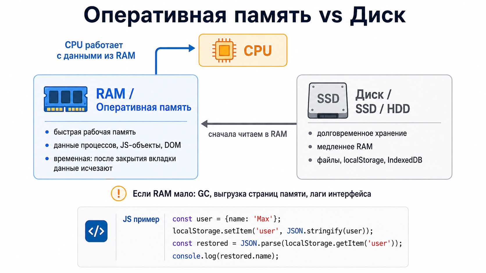

</td></tr></table>

</details>

<details>
<summary>Что такое машинная инструкция?</summary><br>
<table><tr><td>

**Уровень:** Junior

Это элементарная команда, которую CPU умеет декодировать и выполнять: загрузить данные, сложить значения, сравнить или
перейти к другому адресу. JavaScript сначала преобразуется движком в промежуточное представление и машинный код. Одна
строка исходника может потребовать много инструкций.


</td></tr></table>

</details>

#### Middle

<details>
<summary>Что CPU-bound задача?</summary><br>
<table><tr><td>

**Уровень:** Middle

- **CPU-bound** — это состояние системы или задачи в информатике, при котором время её выполнения определяется
  преимущественно скоростью центрального процессора (CPU), а не другими ресурсами системы, такими как память или
  операции ввода-вывода (I/O). При этом загрузка процессора высока, зачастую достигая 100% в течение нескольких секунд
  или минут.
- **Примеры CPU-bound-задач**:
  - сложные математические вычисления;
  - обработка больших массивов данных;
  - шифрование и сжатие информации;
  - парсинг больших структур данных;
  - рендеринг сложной графики;
  - научные вычисления;
  - обработка изображений;
  - задачи в системах машинного обучения, где требуется постоянная обработка больших объёмов информации.


</td></tr></table>

</details>

<details>
<summary>Что такое процесс и поток?</summary><br>
<table><tr><td>

**Уровень:** Middle

Процесс имеет собственное адресное пространство и ресурсы операционной системы. Поток выполняет последовательность
инструкций внутри процесса и разделяет его память с другими потоками. Браузер использует несколько процессов и потоков,
хотя JavaScript страницы обычно выполняется на одном main thread.

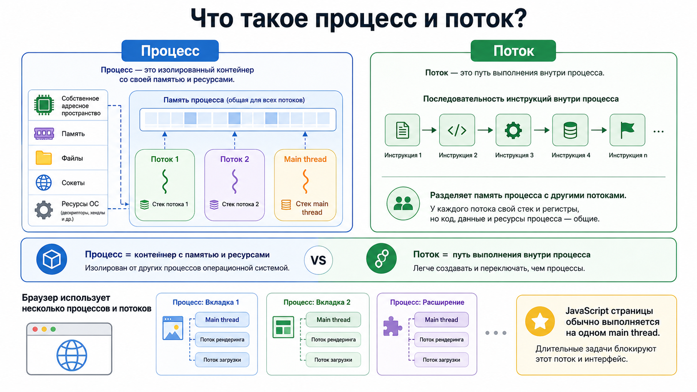

</td></tr></table>

</details>

<details>
<summary>Чем concurrency (конкурентность) отличается от parallelism (параллелизм)?</summary><br>
<table><tr><td>

**Уровень:** Middle

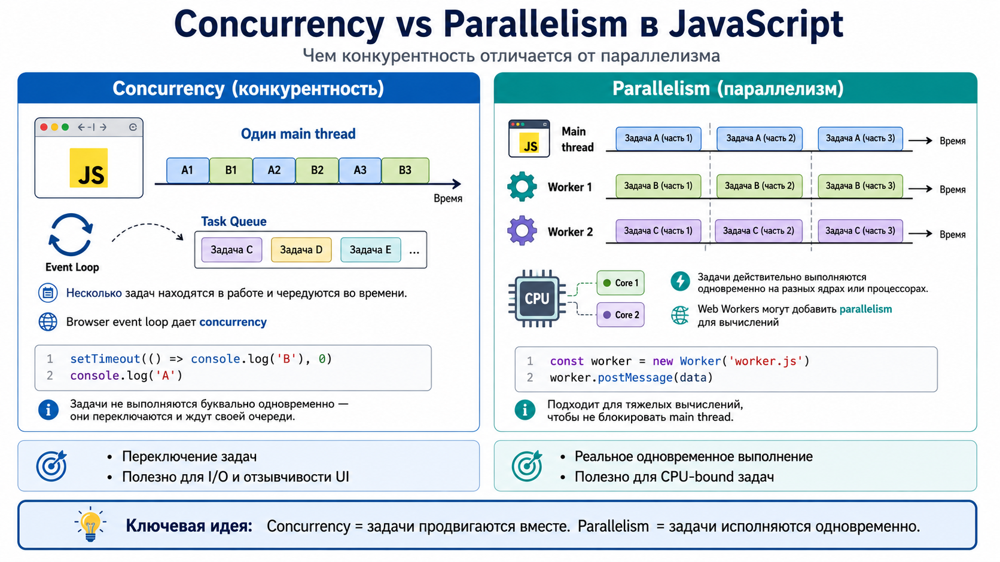

- Concurrency (конкурентность или одновременность) означает, что несколько задач находятся в работе и чередуются во
  времени.

- Parallelism (параллелизм) означает их фактическое одновременное выполнение на разных ядрах или процессорах. Browser
  event loop дает concurrency, а Web Workers могут добавить parallelism для вычислений.


</td></tr></table>

</details>

### Память, stack и heap

#### Middle+ or Senior

<details>
<summary>Что такое stack и heap?</summary><br>
<table><tr><td>

**Уровень:** Middle+

Stack хранит frames вызовов функций и имеет строгий порядок LIFO. Heap используется для динамически создаваемых объектов
с менее предсказуемым временем жизни. Конкретная реализация зависит от JavaScript engine, но эта модель полезна для
понимания рекурсии и утечек.

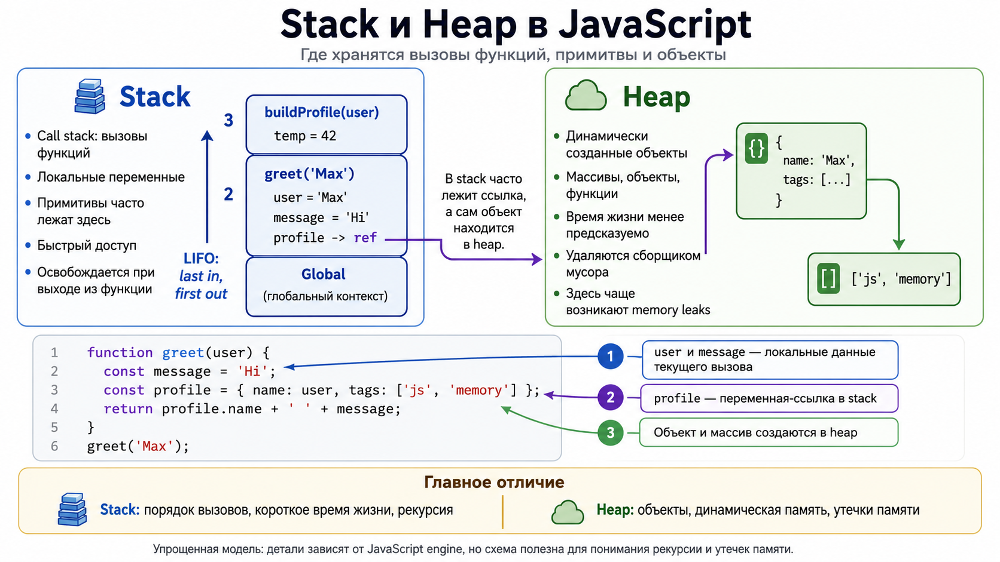

</td></tr></table>

</details>

<details>
<summary>Что обычно хранится в stack?</summary><br>
<table><tr><td>

**Уровень:** Middle+

В stack обычно находятся call frames: адрес возврата, локальный контекст и служебные данные вызова. Небольшие значения
движок также может хранить рядом с frame, но спецификация JavaScript не закрепляет физическое размещение. Важно, что
глубина stack ограничена.

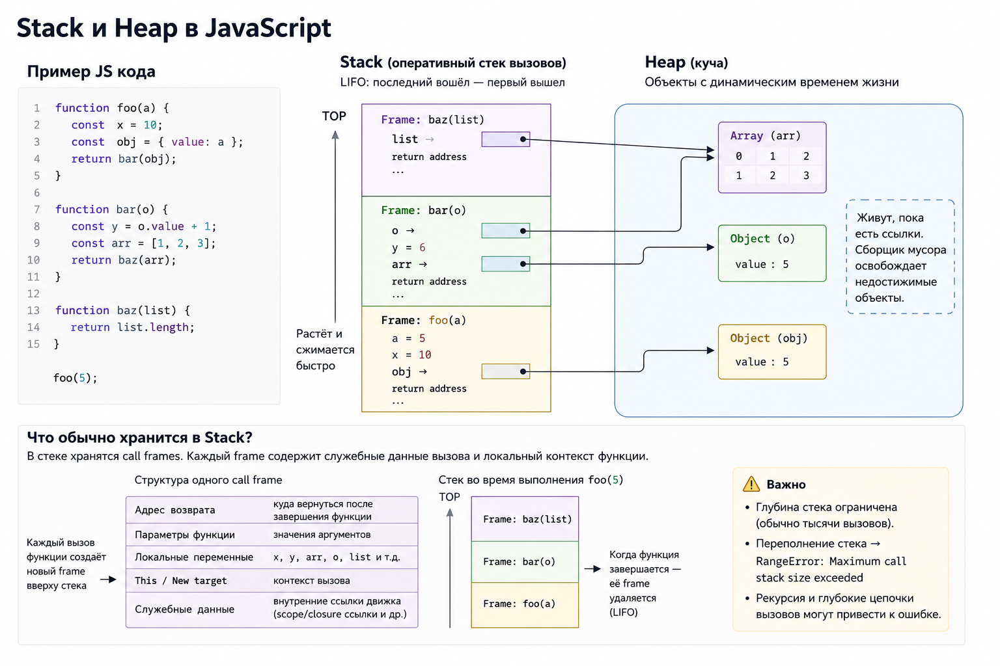

</td></tr></table>

</details>

<details>
<summary>Что обычно хранится в heap?</summary><br>
<table><tr><td>

**Уровень:** Middle+

В heap живут объекты, массивы, функции, замыкания и другие значения с динамическим lifetime. Сборщик мусора освобождает
их, когда они становятся недостижимыми. Большое число удерживаемых объектов увеличивает memory usage и паузы GC.

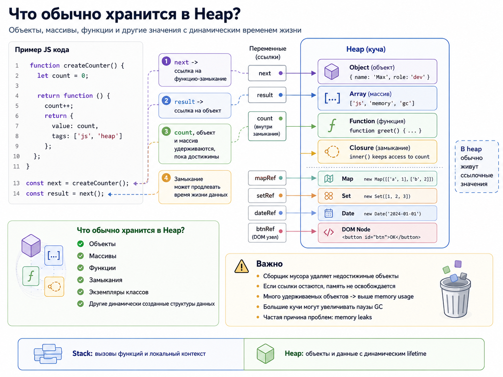

</td></tr></table>

</details>

<details>
<summary>Почему объекты обычно живут в heap?</summary><br>
<table><tr><td>

**Уровень:** Middle+

Размер и lifetime объекта часто неизвестны во время входа в функцию. Heap позволяет нескольким ссылкам указывать на один
объект и сохранять его после завершения создавшего вызова. Stack с LIFO-порядком для такого времени жизни неудобен.

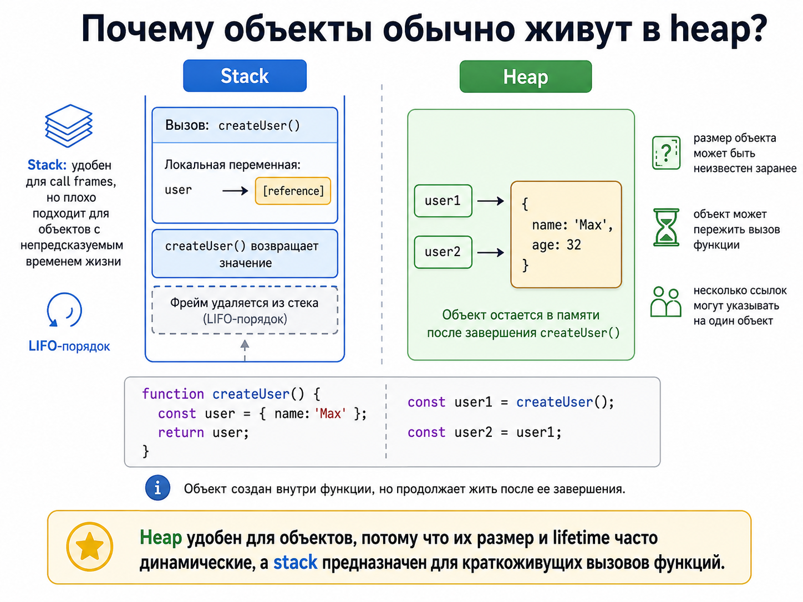

</td></tr></table>

</details>

<details>
<summary>Почему рекурсия может привести к stack overflow?</summary><br>
<table><tr><td>

**Уровень:** Middle+

Каждый рекурсивный вызов добавляет новый frame. Если базовый случай отсутствует или глубина слишком велика, stack
заканчивается и runtime выбрасывает `RangeError`. Для больших входов используют итерацию, явный stack данных или
разбиение работы.

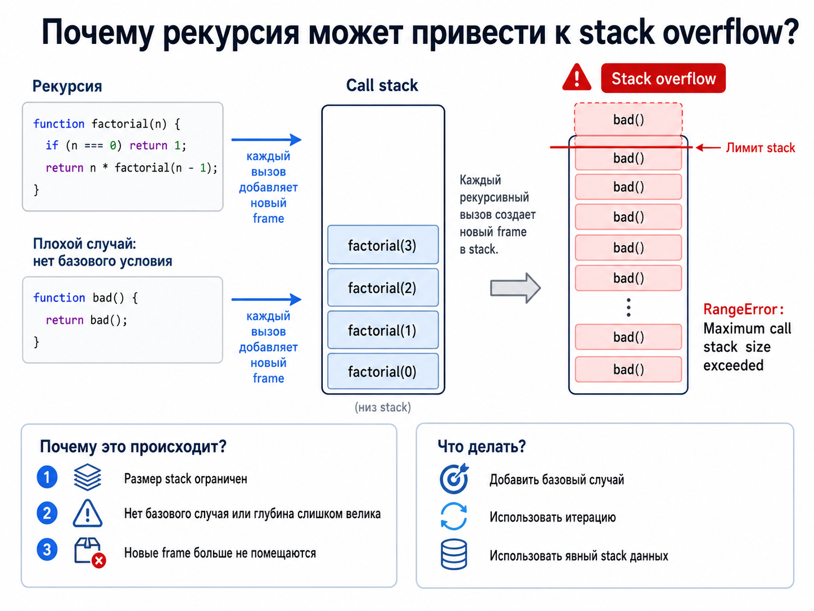

</td></tr></table>

</details>

<details>
<summary>Что такое memory leak?</summary><br>
<table><tr><td>

**Уровень:** Middle+

Это память, которая больше не нужна приложению, но остается достижимой и не освобождается GC. Утечка проявляется ростом
heap, замедлением работы и иногда падением вкладки. Причина обычно в забытых ссылках, а не в отсутствии сборщика мусора.

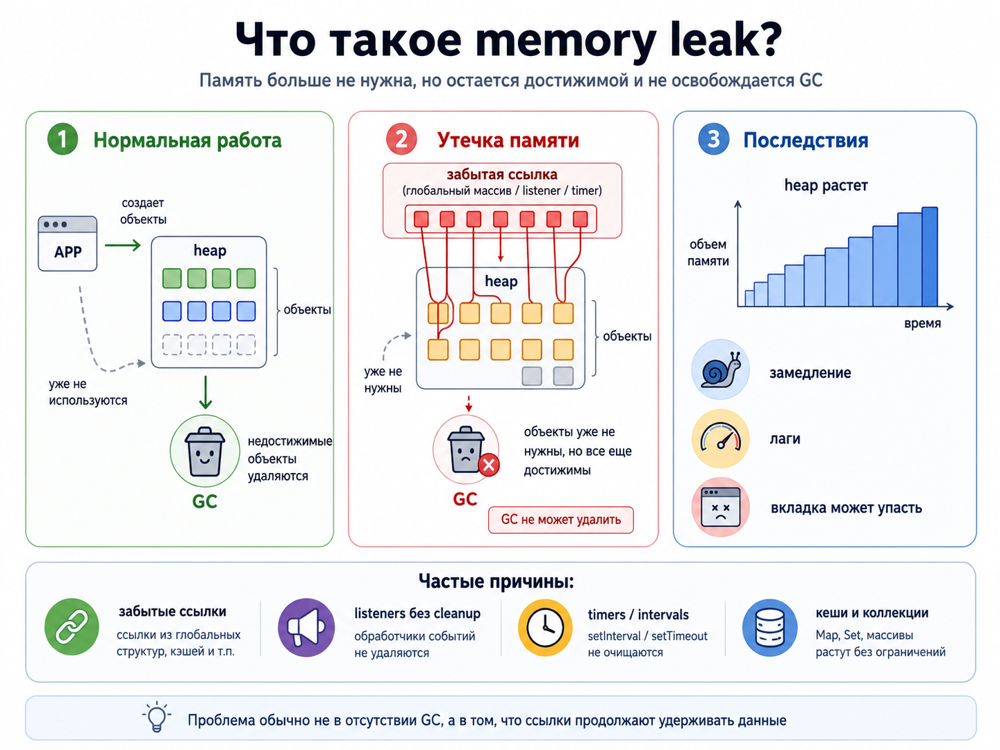

</td></tr></table>

</details>

<details>
<summary>Какие memory leaks бывают во frontend?</summary><br>
<table><tr><td>

**Уровень:** Middle+

Частые причины: неснятые event listeners, timers, subscriptions, глобальные коллекции, кеш без ограничения и detached
DOM nodes. Замыкание может удерживать большой объект через одну ненужную ссылку. Особенно важно очищать ресурсы
долгоживущих SPA-компонентов.

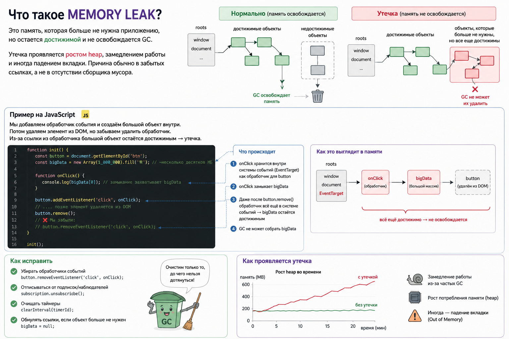

</td></tr></table>

</details>

<details>
<summary>Как найти memory leak в браузере?</summary><br>
<table><tr><td>

**Уровень:** Middle+

В Chrome DevTools используют Memory: Heap snapshot, Allocation instrumentation и сравнение snapshots после повторения
сценария. Ищут растущее число объектов, retaining paths и detached DOM nodes. Performance Monitor помогает увидеть
устойчивый рост JS heap и DOM nodes.

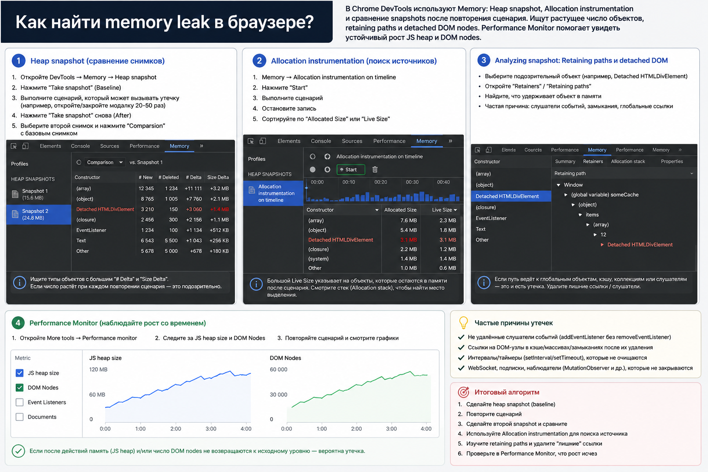

#### Пример с Detached Elements

Откройте [пример с карточками](../examples/computer-science/example1/memory-leak.html).

- **Шаг 1**. Открой: DevTools → Memory → Heap snapshot. Сделай первый snapshot.
- **Шаг 2**. Нажми: Create 20 leaky cards. Подожди, пока карточки исчезнут.
- **Шаг 3**. Сделай второй snapshot. Выбери: Comparison. Ищи: Detached HTMLDivElement
- **Шаг 4**. Нажми: Clear leaks. Потом в DevTools нажми: Collect garbage. Сделай третий snapshot. После этого количество
  удерживаемых объектов должно уменьшиться.

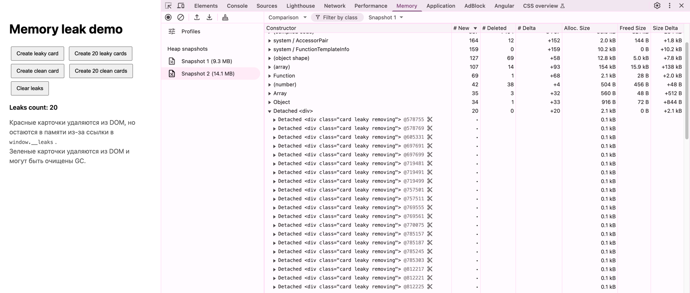

###### Главная мысль

Элемент исчез со страницы ≠ объект исчез из памяти. Утечка возникает не из-за setTimeout, а из-за этой строки:

```js
window.__leaks.push({
  node,
  payload,
  handleClick,
});
```

Именно она оставляет объект достижимым.

#### Пример с setInterval

Откройте [пример с setInterval](../examples/computer-science/example2/memory-leak-set-interval.html). Проделайте
аналогичные шаги примеру 1.

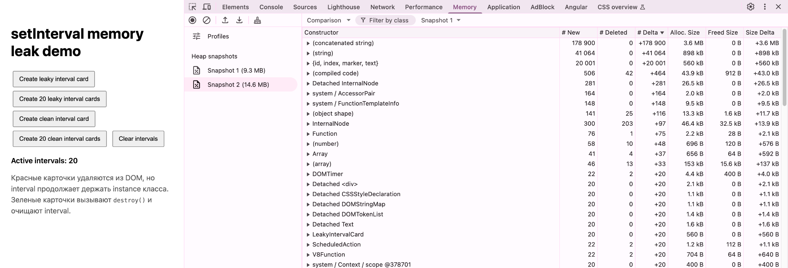

Главные строки:

```text
LeakyIntervalCard         # Delta +20
DOMTimer                  # Delta +20
ScheduledAction           # Delta +20
V8Function                # Delta +20
system / Context / scope  # Delta +20
Detached <div>            # Delta +20
```

| Строка в Heap snapshot         | Что означает                                                                                     | Почему важна для поиска leak                                                                                                              |
| ------------------------------ | ------------------------------------------------------------------------------------------------ | ----------------------------------------------------------------------------------------------------------------------------------------- |
| `LeakyIntervalCard`            | Instance нашего JS-класса. В примере каждая карточка создается как `new LeakyIntervalCard(...)`. | Если `# Delta +20`, значит после сценария в памяти осталось 20 instance класса. Это прямой признак, что объекты приложения не очистились. |
| `DOMTimer`                     | Внутренний объект браузера для `setInterval` / `setTimeout`.                                     | Если `DOMTimer # Delta +20`, значит появилось 20 активных timer/interval. Для `setInterval` leak это важный маркер.                       |
| `ScheduledAction`              | Запланированное действие, которое браузер должен выполнить по timer.                             | Показывает, что callback интервала все еще запланирован и не очищен.                                                                      |
| `V8Function`                   | JS-функция внутри движка V8. В нашем примере это callback, переданный в `setInterval`.           | Callback держит замыкание. Через него могут удерживаться `this`, `payload`, DOM node и другие данные.                                     |
| `system / Context / scope`     | Scope / closure, где хранятся захваченные переменные callback-функции.                           | Очень важный признак: interval callback может держать `this`, а `this` держит весь объект `LeakyIntervalCard`.                            |
| `Detached <div>`               | DOM-элемент `div`, который удален со страницы, но все еще находится в памяти.                    | Если `Detached <div> # Delta +20`, значит 20 карточек исчезли из DOM, но не были очищены GC.                                              |
| `Detached Text`                | Текстовый DOM-узел внутри удаленного DOM-элемента.                                               | Обычно идет рядом с `Detached <div>`. Сам по себе не главная причина, а следствие удержания DOM-элемента.                                 |
| `Detached CSSStyleDeclaration` | Внутренний объект стилей для удаленного DOM-элемента.                                            | Часто появляется вместе с detached DOM node. Это сопутствующий объект, а не основная причина leak.                                        |
| `Detached DOMTokenList`        | Объект для `classList` удаленного DOM-элемента.                                                  | В нашем примере карточка имеет классы `card`, `leaky`, `removing`, поэтому DevTools показывает связанный `DOMTokenList`.                  |
| `(concatenated string)`        | Строки, созданные через конкатенацию или template string.                                        | В примере большой `payload` создает много строк. Если они растут вместе с leak, значит данные тоже удерживаются в памяти.                 |
| `(string)`                     | Обычные строки в heap.                                                                           | Может быть частью payload, логов, текста DOM или служебных данных. Смотреть стоит только если `Size Delta` стабильно растет.              |
| `{id, index, marker, text}`    | Объекты payload из нашего примера.                                                               | Если таких объектов стало `+20001`, значит массивы данных остались в памяти вместе с `LeakyIntervalCard`.                                 |
| `Array` / `(array)`            | Массивы JS. В примере это массив `payload`.                                                      | Само по себе не значит leak. Нужно смотреть `# Delta`, `Size Delta` и `Retainers`.                                                        |
| `Object`                       | Обычные JS-объекты.                                                                              | Слишком общий тип. Полезен только вместе с `Retainers`, чтобы понять, кто держит эти объекты.                                             |
| `Function`                     | JS-функции.                                                                                      | Может указывать на callback, listener или closure. В interval leak полезно смотреть рядом с `DOMTimer` и `V8Function`.                    |
| `InternalNode`                 | Внутренний объект браузера / V8 / Blink.                                                         | Часто это шум DevTools или служебные структуры. Не считать leak без анализа `Retainers` и стабильного роста.                              |
| `Detached InternalNode`        | Внутренний объект браузера, который помечен как detached.                                        | Может выглядеть подозрительно, но часто не относится к твоему коду. Важнее смотреть на размер, рост и `Retainers`.                        |

| Что смотреть первым | Зачем                                                       |
| ------------------- | ----------------------------------------------------------- |
| `LeakyIntervalCard` | Показывает, что живы объекты твоего приложения              |
| `DOMTimer`          | Показывает, что interval не очищен                          |
| `Detached <div>`    | Показывает, что DOM удален со страницы, но остался в памяти |
| `# Delta`           | Показывает прирост количества объектов                      |
| `Size Delta`        | Показывает прирост памяти                                   |
| `Retainers`         | Показывает, кто именно держит объект                        |

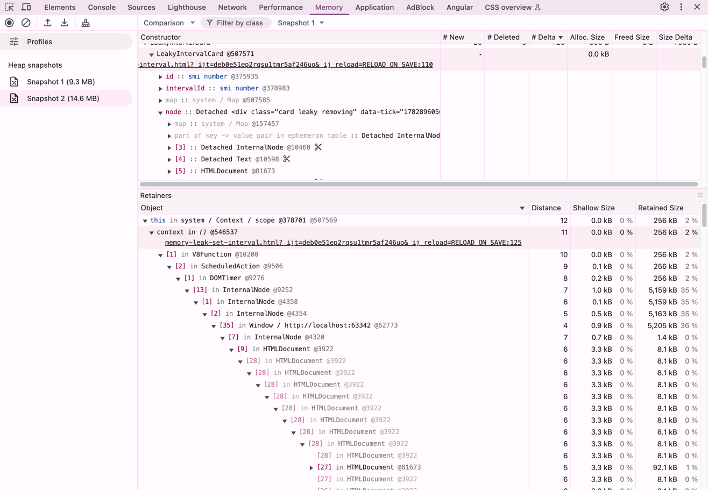

| Что видно в Retainers                   | Что означает                                                 | Почему это важно                                                                                         |
| --------------------------------------- | ------------------------------------------------------------ | -------------------------------------------------------------------------------------------------------- |
| `this in system / Context / scope`      | В замыкании callback-функции сохранен `this`.                | Это главный признак: callback интервала держит instance `LeakyIntervalCard`.                             |
| `context in ()`                         | Scope / closure callback-функции.                            | В этом scope лежат захваченные значения, включая `this`.                                                 |
| `memory-leak-set-interval.html?...:125` | Строка кода, где создана или используется callback-функция.  | Это полезная привязка к исходному коду. Скорее всего, это место с `setInterval(() => this.tick(), ...)`. |
| `V8Function`                            | JS-функция внутри движка V8.                                 | Это callback, который браузер должен периодически выполнять.                                             |
| `ScheduledAction`                       | Запланированное действие таймера.                            | Показывает, что callback все еще запланирован и не очищен.                                               |
| `DOMTimer`                              | Внутренний объект браузера для `setInterval` / `setTimeout`. | Главный маркер interval leak. Пока `DOMTimer` жив, callback тоже жив.                                    |
| `Window / http://localhost:63342`       | Глобальный объект страницы.                                  | Через `Window` браузер держит активные таймеры страницы.                                                 |
| `LeakyIntervalCard @...`                | Instance твоего класса.                                      | Он не очищается, потому что его держит callback интервала.                                               |
| `node :: Detached <div ...>`            | DOM-элемент удален со страницы, но остался в памяти.         | Instance `LeakyIntervalCard` держит его через поле `this.node`.                                          |
| `intervalId :: smi number`              | ID активного interval.                                       | По нему можно вызвать `clearInterval(intervalId)`.                                                       |

</td></tr></table>

</details>

### GC и управление памятью

#### Middle+ or Senior

<details>
<summary>Что такое Garbage Collector?</summary><br>
<table><tr><td>

**Уровень:** Middle+

GC автоматически находит и освобождает память недостижимых объектов. Современные движки используют несколько поколений и
инкрементальные фазы, чтобы уменьшить длинные паузы. Автоматическая очистка не защищает от логически ненужных, но
достижимых данных.

</td></tr></table>

</details>

<details>
<summary>Как GC понимает, что объект больше не нужен?</summary><br>
<table><tr><td>

**Уровень:** Middle+

Движок начинает с roots: global objects, stack frames и внутренних ссылок runtime. Затем отмечает все объекты, до
которых можно дойти по ссылкам. Неотмеченные объекты считаются недостижимыми и могут быть освобождены.

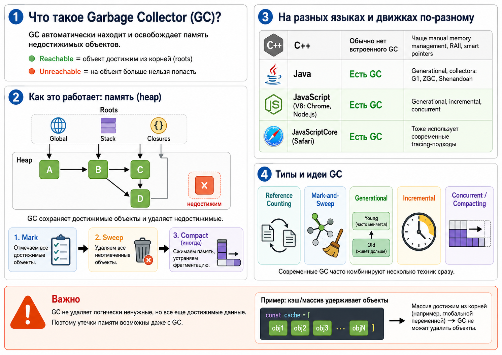

</td></tr></table>

</details>

<details>
<summary>Что такое reachability?</summary><br>
<table><tr><td>

**Уровень:** Middle+

Reachability — возможность добраться до значения из корневых ссылок по цепочке объектов. Пока существует такая цепочка,
GC считает объект нужным. Поэтому одна ссылка из глобального кеша может удерживать большое дерево данных.

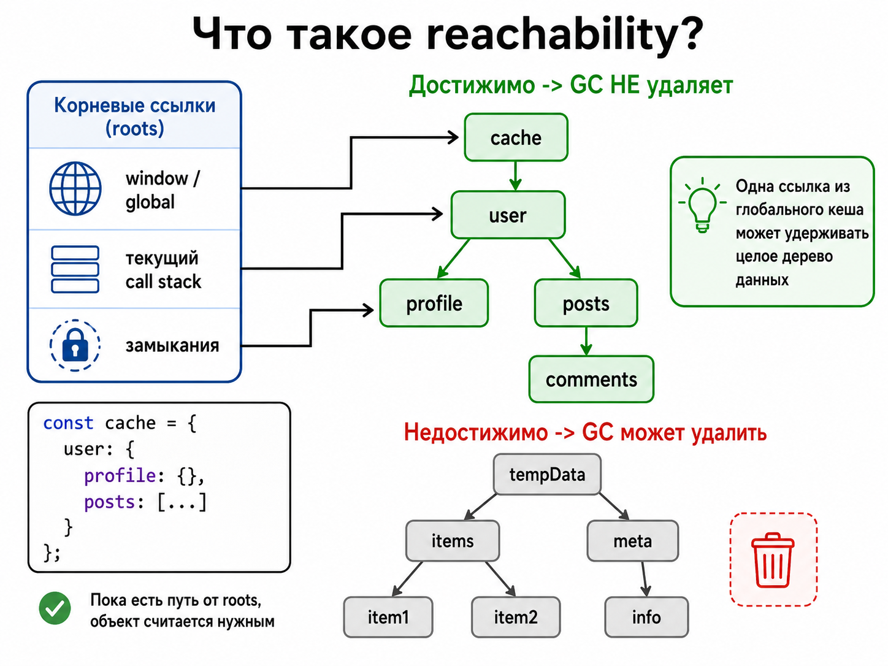

</td></tr></table>

</details>

<details>
<summary>Почему замыкания могут удерживать память?</summary><br>
<table><tr><td>

**Уровень:** Middle+

Функция сохраняет доступ к переменным внешней lexical scope даже после завершения внешнего вызова. Если callback живет
долго, связанные данные тоже могут оставаться достижимыми. Следует не захватывать крупный контекст без необходимости и
удалять долгоживущие callbacks.

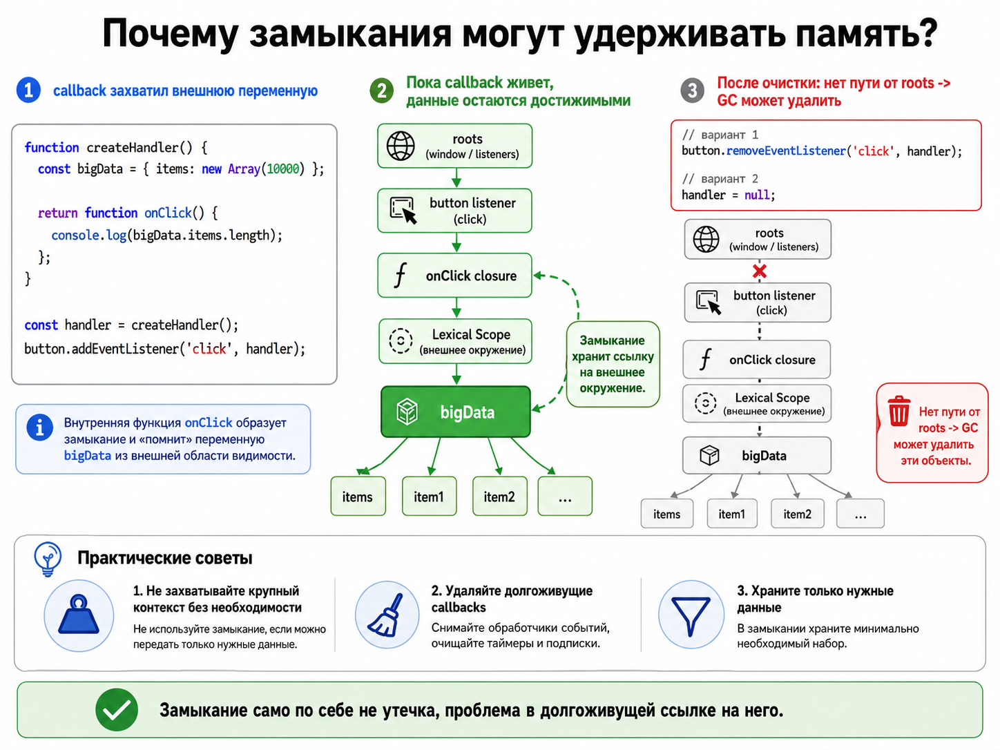

</td></tr></table>

</details>

<details>
<summary>Как event listeners могут создавать memory leaks?</summary><br>
<table><tr><td>

**Уровень:** Middle+

Event target хранит ссылку на handler, а handler через замыкание может удерживать компонент и данные. Listener нужно
удалять тем же function reference или регистрировать с `AbortSignal`.

```js
const handler = () => updateLargeViewModel();

window.addEventListener('resize', handler);

// При уничтожении владельца:
window.removeEventListener('resize', handler);
```

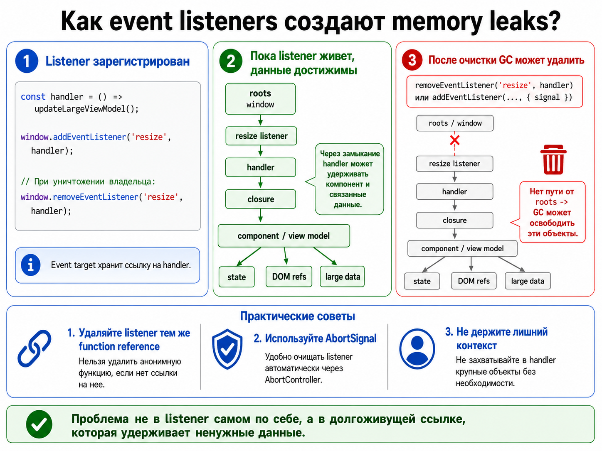

</td></tr></table>

</details>

<details>
<summary>Почему detached DOM nodes могут быть проблемой?</summary><br>
<table><tr><td>

**Уровень:** Middle+

Узел удален из документа, но JavaScript-ссылка или listener продолжает удерживать его и дочернее дерево. Он не виден
пользователю, но занимает память. DevTools показывает такие узлы как detached elements и помогает найти retaining path.

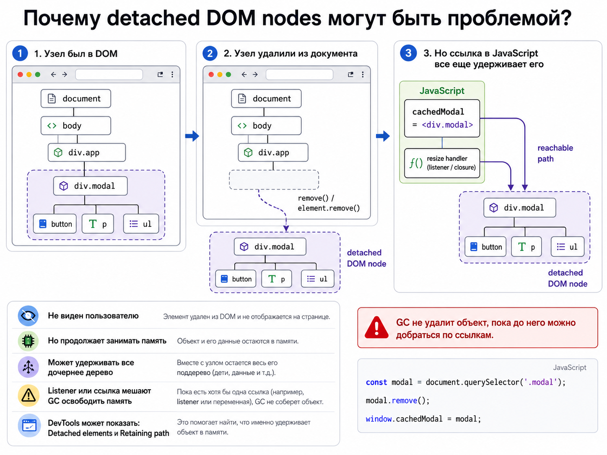

</td></tr></table>

</details>

<details>
<summary>Как WeakMap и WeakSet помогают с памятью?</summary><br>
<table><tr><td>

**Уровень:** Middle+

Они не удерживают объект-ключ от сборки мусора. Это удобно для metadata и кеша, lifetime которого должен совпадать с
lifetime объекта. Их содержимое нельзя надежно перечислять, потому что GC работает недетерминированно.

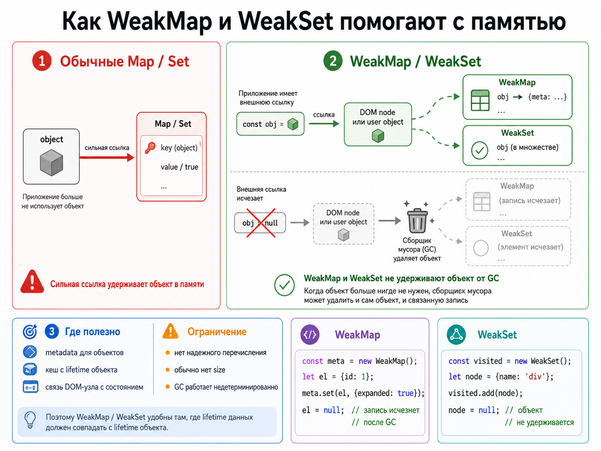

</td></tr></table>

</details>

<details>
<summary>Можно ли вручную вызвать GC в JavaScript?</summary><br>
<table><tr><td>

**Уровень:** Middle+

В обычном web-коде нет стандартного API для принудительного GC. Движок сам выбирает момент сборки на основе давления на
память и внутренних эвристик. Правильное решение — удалить ненужные ссылки и ресурсы, а не пытаться управлять GC.

</td></tr></table>

</details>

### Алгоритмы и структуры данных для frontend

#### Junior

<details>
<summary>Что такое дерево и где деревья встречаются в Angular-приложении?</summary><br>
<table><tr><td>

**Уровень:** Junior

Дерево — иерархическая структура из узлов, где у узла может быть родитель и дочерние узлы. Во frontend деревья
встречаются постоянно: DOM tree, accessibility tree, component tree, Angular Router tree, DI tree, Reactive Forms tree,
AST в TypeScript/ESLint/Babel.

Обход дерева нужен для поиска узла, валидации вложенной формы, построения меню, анализа AST или сериализации состояния.
DFS удобно идет вглубь ветки, BFS обходит уровень за уровнем.

```ts
function collectInvalidControls(control: AbstractControl): AbstractControl[] {
  const invalidControls: AbstractControl[] = [];
  const stack: AbstractControl[] = [control];

  while (stack.length > 0) {
    const current = stack.pop();

    if (current === undefined) {
      continue;
    }

    if (current.invalid) {
      invalidControls.push(current);
    }

    if ('controls' in current) {
      stack.push(...Object.values(current.controls));
    }
  }

  return invalidControls;
}
```

</td></tr></table>

</details>

<details>
<summary>Что такое граф и где графы встречаются во frontend-разработке?</summary><br>
<table><tr><td>

**Уровень:** Junior

Граф состоит из вершин и связей между ними. Directed graph имеет направленные ребра, undirected graph — связи без
направления. Граф может храниться как adjacency list или adjacency matrix.

Во frontend графы встречаются в routing flows, state machines, dependency graph bundler-а, Nx affected graph, module
federation dependencies, диаграммах, permission models и формах с зависимыми полями.

Cycle в dependency graph часто означает архитектурную проблему: модули начинают зависеть друг от друга, сборка и тесты
становятся хрупкими. DFS помогает находить cycle, BFS — искать кратчайший путь по числу переходов в простом графе.

</td></tr></table>

</details>

<details>
<summary>Что такое NP-complete и нужно ли это frontend-разработчику?</summary><br>
<table><tr><td>

**Уровень:** Junior

NP-complete — класс задач, для которых неизвестен быстрый алгоритм общего вида, а перебор вариантов быстро становится
непрактичным. Для frontend это редко повседневная тема, но идея полезна при обсуждении scheduling, layout, оптимизации
маршрутов, упаковки элементов и сложных combinatorial constraints.

На интервью достаточно объяснить практический вывод: если точное решение слишком дорогое, выбирают ограничения,
эвристики, приближенный алгоритм, предварительный расчет на сервере или упрощение продукта.

</td></tr></table>

</details>

#### Middle

<details>
<summary>Почему <code>Array.includes</code> внутри <code>filter</code> может случайно дать <code>O(n²)</code>?</summary><br>
<table><tr><td>

**Уровень:** Middle

`includes()` ищет элемент линейно. Если вызвать его для каждого элемента другого массива, получится вложенный перебор.
На маленьком списке это нормально, но на тысячах строк таблицы может стать bottleneck.

```ts
const selectedUsers = users.filter((user) => selectedIds.includes(user.id));
```

Если `selectedIds` большой и используется многократно, лучше построить `Set` один раз:

```ts
const selectedIdSet = new Set(selectedIds);
const selectedUsers = users.filter((user) => selectedIdSet.has(user.id));
```

Так поиск по выбранным id становится в среднем `O(1)`, а общий проход — `O(n + m)` по времени ценой дополнительной
памяти.

</td></tr></table>

</details>

<details>
<summary>Как выбрать между <code>Array</code>, <code>Object</code>, <code>Map</code> и <code>Set</code>?</summary><br>
<table><tr><td>

**Уровень:** Middle

| Структура | Когда использовать                                                      | Важный компромисс                   |
| --------- | ----------------------------------------------------------------------- | ----------------------------------- |
| `Array`   | Упорядоченный список, rendering через `@for`, последовательный обход    | Поиск по значению обычно `O(n)`     |
| `Object`  | Простая JSON-like запись со строковыми ключами                          | Не подходит для произвольных ключей |
| `Map`     | Индекс по id, кеш по объекту или составному ключу, частые lookup/delete | Больше overhead, чем у plain object |
| `Set`     | Уникальные значения, проверка принадлежности, дедупликация              | Хранит только значения, без payload |

Для UI-состояния структура должна выражать сценарий. Если список нужен для отображения, часто оставляют `Array`. Если
нужны частые проверки выбранности, рядом хранят `Set` id. Если нужно быстро получить сущность по id, добавляют `Map`.

</td></tr></table>

</details>

<details>
<summary>Что значит stable sort и почему это важно для UI?</summary><br>
<table><tr><td>

**Уровень:** Middle

Stable sort сохраняет относительный порядок элементов, которые считаются равными comparator-ом. Это важно для таблиц:
если пользователь сначала отсортировал список по имени, а потом по роли, элементы с одинаковой ролью могут сохранить
предыдущий порядок по имени.

Современный JavaScript требует стабильную сортировку `Array.prototype.sort`. Но comparator все равно должен быть
корректным: возвращать отрицательное число, ноль или положительное число согласованно и не зависеть от случайного
состояния.

```ts
const sorted = users.toSorted((first, second) => {
  const byRole = first.role.localeCompare(second.role);

  return byRole === 0 ? first.name.localeCompare(second.name) : byRole;
});
```

</td></tr></table>

</details>

<details>
<summary>Чем отличаются preorder, inorder, postorder, DFS и BFS?</summary><br>
<table><tr><td>

**Уровень:** Middle

DFS идет в глубину. Preorder обрабатывает узел до детей, postorder — после детей, inorder применим прежде всего к
бинарным деревьям и обходит левую ветку, узел, правую ветку.

BFS идет по уровням и обычно использует очередь. Он удобен, когда нужно найти ближайший подходящий узел или обработать
иерархию слоями.

В Angular-практике preorder похож на обработку route/config tree сверху вниз, postorder удобен для агрегации валидности
детей формы, а BFS может пригодиться для поиска ближайшего видимого пункта в древовидном UI.

</td></tr></table>

</details>

<details>
<summary>Что такое BST и почему он не всегда дает <code>O(log n)</code>?</summary><br>
<table><tr><td>

**Уровень:** Middle

Binary Search Tree хранит меньшие значения в левом поддереве, большие — в правом. Если дерево сбалансировано, поиск,
вставка и удаление работают за `O(log n)`.

Если добавлять уже отсортированные значения в обычный BST без балансировки, дерево может выродиться в цепочку, и поиск
станет `O(n)`. Поэтому на практике используют самобалансирующиеся деревья или другие структуры.

Frontend-разработчику редко нужно писать BST руками. Важнее понимать идею упорядоченной структуры и почему обычный
массив с бинарным поиском, `Map` или серверный индекс часто практичнее.

</td></tr></table>

</details>

<details>
<summary>Чем adjacency list отличается от adjacency matrix?</summary><br>
<table><tr><td>

**Уровень:** Middle

Adjacency list хранит для каждой вершины список соседей. Он обычно экономнее для sparse graph, где связей мало
относительно числа возможных связей.

Adjacency matrix хранит таблицу `n * n`, где быстро проверять наличие ребра между двумя вершинами, но память стоит
`O(n²)`. Для больших dependency graph это часто слишком дорого.

```ts
const dependencies = new Map<string, readonly string[]>([
  ['checkout', ['shared-ui', 'payments']],
  ['payments', ['shared-ui']],
]);
```

Для большинства frontend-задач adjacency list через `Map<string, string[]>` читаемее и дешевле.

</td></tr></table>

</details>

<details>
<summary>Когда рекурсию лучше заменить итерацией во frontend-коде?</summary><br>
<table><tr><td>

**Уровень:** Middle

Рекурсия хорошо выражает дерево или вложенную структуру, но глубина call stack ограничена. Если данные могут прийти от
API и быть очень глубокими, рекурсивный обход рискует упасть с `RangeError`.

Итерация с явным stack или queue безопаснее для больших структур и позволяет проще разбивать работу на chunks, чтобы не
блокировать main thread.

```ts
const stack: TreeNode[] = [root];

while (stack.length > 0) {
  const node = stack.pop();

  if (node === undefined) {
    continue;
  }

  processNode(node);
  stack.push(...node.children);
}
```

</td></tr></table>

</details>

<details>
<summary>Что такое bitwise operations и почему в JavaScript с ними нужно быть осторожным?</summary><br>
<table><tr><td>

**Уровень:** Middle

Bitwise operations работают с битовым представлением числа: `&`, `|`, `^`, `~`, `<<`, `>>`, `>>>`. В JavaScript такие
операции приводят `number` к 32-bit integer, поэтому большие значения, дроби и `NaN` ведут себя не как обычная
арифметика `number`.

Битовые маски могут пригодиться для компактного набора flags, permissions или низкоуровневой работы с binary data. Но в
обычном frontend-бизнес-коде читаемый объект, `Set` или enum-like union чаще безопаснее и понятнее.

```ts
const enum Permission {
  Read = 1 << 0,
  Write = 1 << 1,
}

const canWrite = (permissions: number): boolean => (permissions & Permission.Write) !== 0;
```

</td></tr></table>

</details>

#### Middle+ or Senior

<details>
<summary>Зачем frontend-разработчику понимать Big O?</summary><br>
<table><tr><td>

**Уровень:** Middle+

Big O помогает оценить, как растет стоимость операции при увеличении входных данных. Для frontend это не абстрактная
математика: фильтрация таблицы, группировка списка, сортировка на клиенте, поиск выбранных элементов и построение дерева
меню могут выполняться на main thread и напрямую влиять на отзывчивость UI.

Важно помнить, что Big O не заменяет профилирование. `O(n)` на маленьком массиве может быть незаметен, а `O(n log n)` с
дорогим comparator, большим DOM update или лишними allocation может давать long task. На практике сначала оценивают
порядок роста, затем подтверждают проблему Performance panel, профилировщиком Angular или пользовательскими метриками.

</td></tr></table>

</details>

<details>
<summary>Как оценить сложность фильтрации, сортировки и группировки списка на клиенте?</summary><br>
<table><tr><td>

**Уровень:** Middle+

Фильтрация одним проходом обычно стоит `O(n)`. Группировка через `Map` тоже обычно `O(n)`, если lookup по ключу
амортизированно константный. Сортировка чаще стоит `O(n log n)`, но реальная стоимость зависит от comparator и размера
элементов.

```ts
const usersByRole = users.reduce((groups, user) => {
  const roleUsers = groups.get(user.role) ?? [];

  roleUsers.push(user);
  groups.set(user.role, roleUsers);

  return groups;
}, new Map<string, User[]>());
```

Для Angular важно не только вычисление, но и rendering. Даже быстрый алгоритм может привести к лагам, если после него
отрисовать тысячи DOM-узлов без virtual scroll, pagination или server-side filtering.

</td></tr></table>

</details>

<details>
<summary>Где во frontend встречаются stack, queue и priority queue?</summary><br>
<table><tr><td>

**Уровень:** Middle+

Stack работает по LIFO. Во frontend он встречается как call stack, undo/redo history, breadcrumbs навигации назад, обход
дерева DFS без рекурсии.

Queue работает по FIFO. Примеры: очередь toast-уведомлений, upload tasks, последовательные save operations через
`concatMap`, message queue между main thread и Web Worker.

Priority queue отдает элемент с наибольшим или наименьшим приоритетом. В UI она нужна редко, но может пригодиться для
планирования фоновых задач, обработки событий по важности или алгоритмов графов. В обычном бизнес-коде часто лучше
начать с читаемого массива и сортировки, если объем маленький и профиль не показывает проблему.

</td></tr></table>

</details>

<details>
<summary>Что такое binary search и где он может пригодиться во frontend?</summary><br>
<table><tr><td>

**Уровень:** Middle+

Binary search ищет значение в отсортированном массиве, каждый шаг отбрасывая половину диапазона. Сложность поиска —
`O(log n)`, но данные должны быть отсортированы и доступны по индексу.

Во frontend бинарный поиск редко нужен для обычных UI-списков. Он полезнее в больших данных: поиск позиции в timeline,
виртуальный скролл с переменной высотой строк, графики, диапазоны дат, nearest point на canvas.

```ts
function findFirstGreaterOrEqual(values: readonly number[], target: number): number {
  let left = 0;
  let right = values.length;

  while (left < right) {
    const middle = Math.floor((left + right) / 2);

    if (values[middle] < target) {
      left = middle + 1;
    } else {
      right = middle;
    }
  }

  return left;
}
```

</td></tr></table>

</details>

<details>
<summary>Чем quicksort, mergesort и heapsort отличаются на уровне идеи?</summary><br>
<table><tr><td>

**Уровень:** Middle+

Quicksort выбирает pivot и делит данные на элементы меньше и больше pivot. В среднем он быстрый, но плохой выбор pivot
может привести к `O(n²)`.

Mergesort делит массив пополам, сортирует части и сливает их. Он стабильно дает `O(n log n)`, но обычно требует
дополнительную память `O(n)`.

Heapsort строит heap и последовательно извлекает минимум или максимум. Он работает за `O(n log n)` и может обходиться
малой дополнительной памятью, но часто менее дружелюбен к cache locality и стабильности порядка.

В прикладном JS/TS-коде обычно используют встроенный `toSorted()` или `sort()`, а на собеседовании важно понимать
trade-offs и уметь написать корректный comparator.

</td></tr></table>

</details>

<details>
<summary>Что такое heap и как он связан с priority queue?</summary><br>
<table><tr><td>

**Уровень:** Middle+

Heap — деревообразная структура, где родитель имеет приоритет не ниже или не выше детей. Binary heap обычно хранится в
массиве: для индекса `i` дети находятся около `2 * i + 1` и `2 * i + 2`.

Priority queue часто реализуют через heap: вставка и извлечение приоритетного элемента стоят `O(log n)`, чтение верхнего
элемента — `O(1)`.

Во frontend это может пригодиться для планировщика фоновых задач, графовых алгоритмов или обработки большого потока
событий по приоритетам. Для обычного UI-состояния heap обычно избыточен.

</td></tr></table>

</details>

<details>
<summary>Что такое memoization и чем она отличается от caching?</summary><br>
<table><tr><td>

**Уровень:** Middle+

Memoization — частный случай кеширования результата чистой функции по ее аргументам. Если вход тот же, можно вернуть
сохраненный результат без повторного вычисления.

Caching шире: можно кешировать HTTP-ответы, изображения, compiled templates, computed state или expensive selectors. У
кеша появляются вопросы invalidation, TTL, размера и прав доступа.

Во frontend memoization встречается в Angular `computed()`, selector-ах state management, pure pipes и ручных индексах
через `Map`. Она полезна только если вычисление дорогое или часто повторяется на тех же входах.

</td></tr></table>

</details>

<details>
<summary>Что такое dynamic programming на базовом уровне?</summary><br>
<table><tr><td>

**Уровень:** Middle+

Dynamic programming разбивает задачу на пересекающиеся подзадачи и переиспользует их результаты. Обычно это memoization
сверху вниз или табличное вычисление снизу вверх.

Для Angular-разработчика важнее не заучивать академические задачи, а узнавать паттерн: если одно и то же производное
значение пересчитывается много раз, можно сохранить результат по ключу.

```ts
const priceBySku = new Map<string, number>();

function getPrice(sku: string): number {
  const cachedPrice = priceBySku.get(sku);

  if (cachedPrice !== undefined) {
    return cachedPrice;
  }

  const price = calculatePrice(sku);
  priceBySku.set(sku, price);

  return price;
}
```

</td></tr></table>

</details>

<details>
<summary>Что такое CPU cache и locality of reference?</summary><br>
<table><tr><td>

**Уровень:** Middle+

CPU cache — быстрая память рядом с процессором. Она отличается от browser cache и HTTP cache: CPU cache ускоряет доступ
к данным в памяти во время вычислений, а browser/HTTP cache уменьшает сетевые загрузки и чтение ресурсов.

Locality of reference означает, что программа часто обращается к близким участкам памяти или повторно использует недавно
прочитанные данные. Последовательный обход массива обычно дружелюбнее к CPU cache, чем хаотичные переходы по ссылкам.

Во frontend это редко оптимизируют руками. Но понимание помогает объяснить, почему большие CPU-bound вычисления лучше
измерять, упрощать алгоритмически, переносить в Web Worker или выполнять на сервере.

</td></tr></table>

</details>
