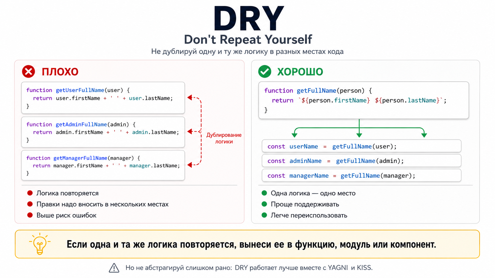
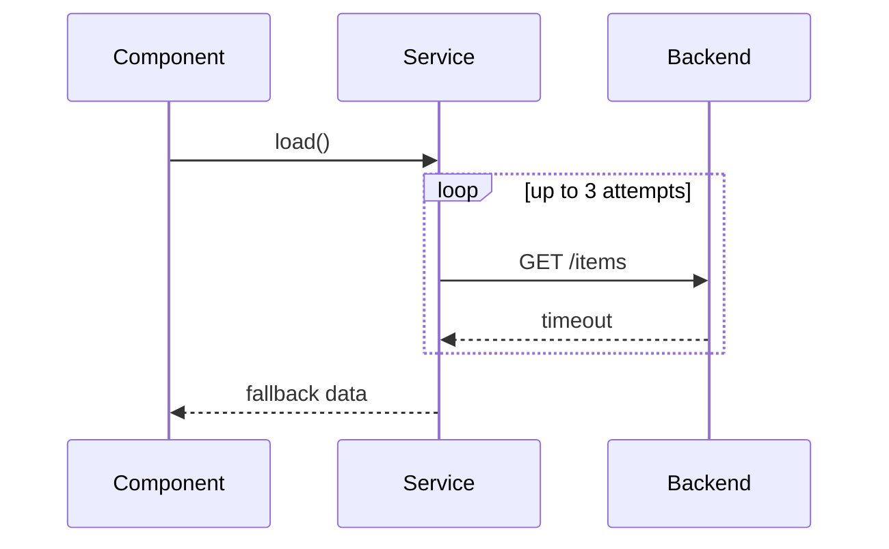
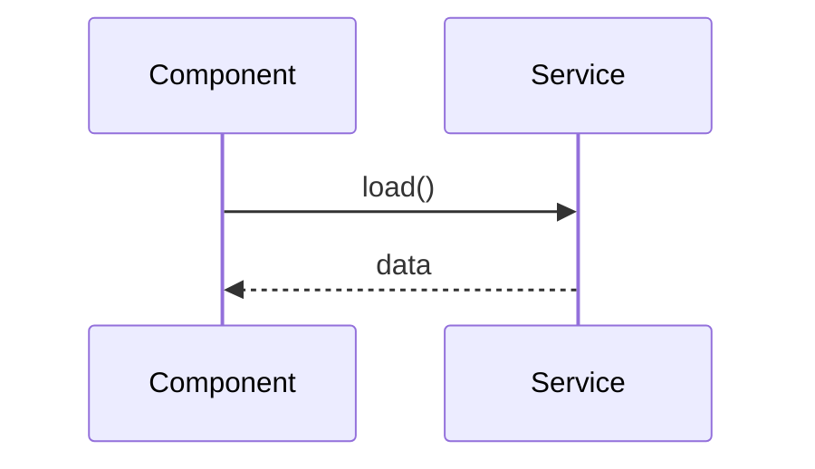
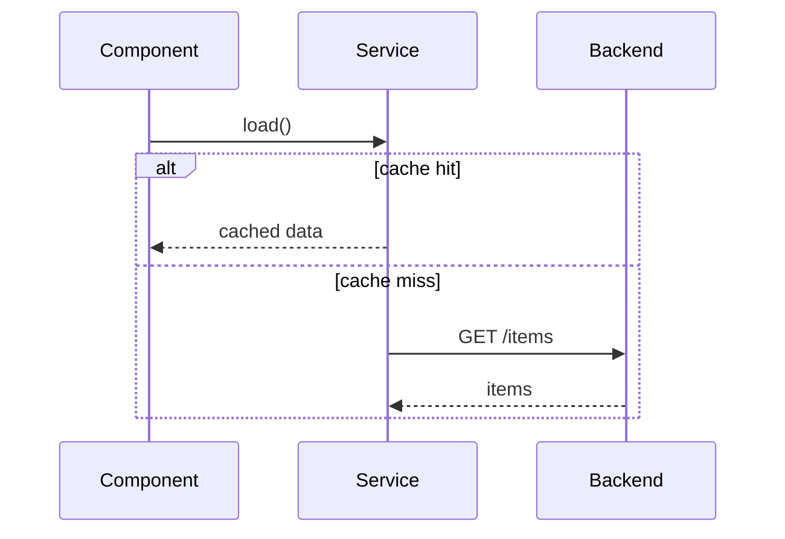
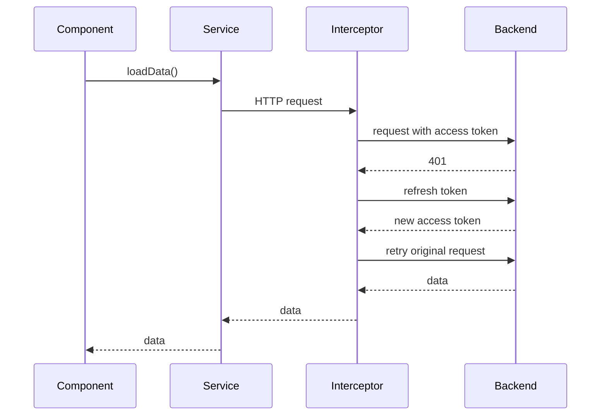
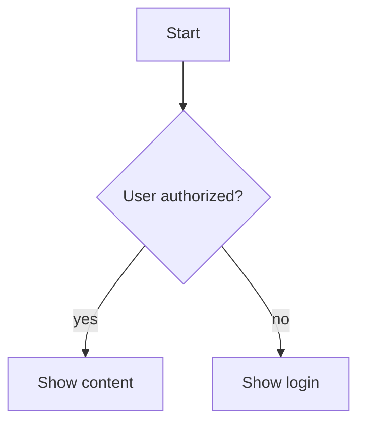
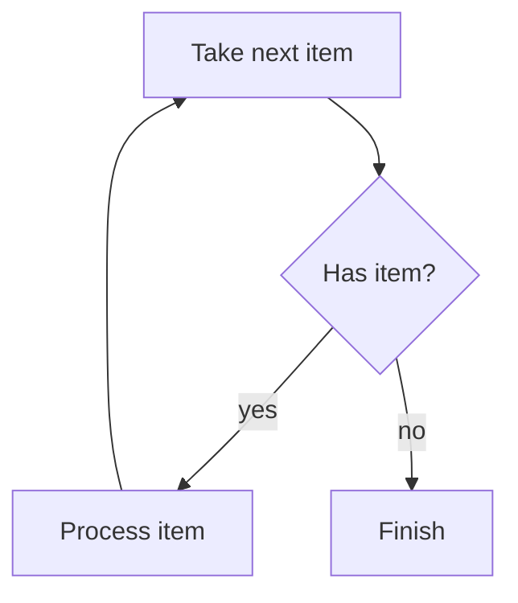
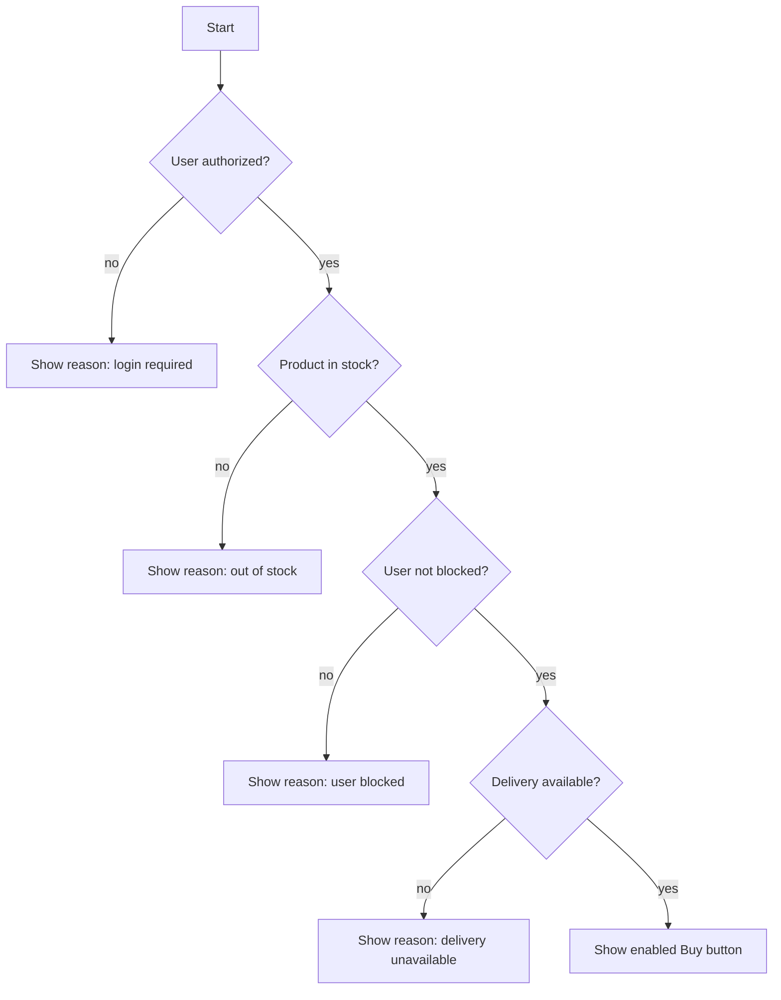
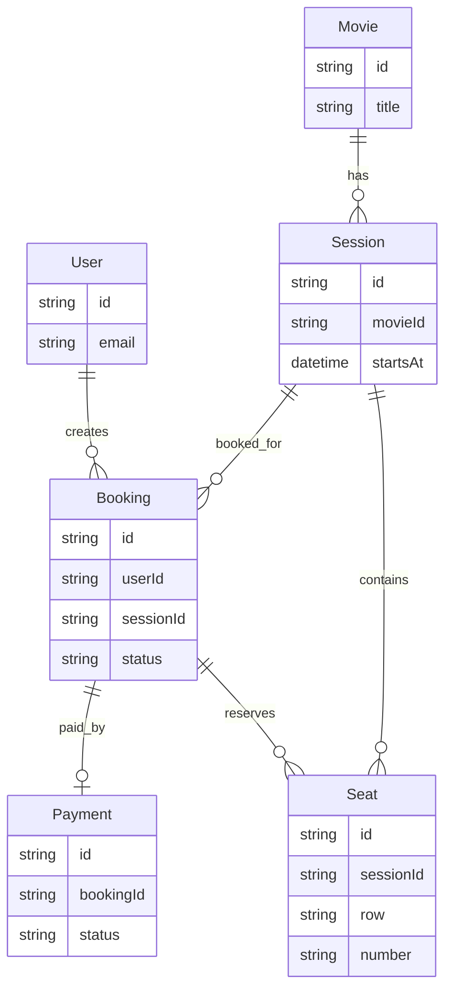

## Основы программирования и проектирования

### Frontend fundamentals

#### Middle

<details>
<summary>В чем отличие фреймворка от библиотеки (приведите примеры и отличия)?</summary><br>
<table><tr><td>

**Уровень:** Middle

**Библиотека** решает отдельную задачу, а приложение само определяет архитектуру и момент вызова библиотеки. Примеры:
RxJS, Lodash, date-fns.

**Фреймворк** задает каркас приложения, жизненный цикл, правила организации кода и сам вызывает пользовательский код в
нужный момент. Это называют inversion of control. Примеры: Angular, NestJS.

Angular предоставляет не только рендеринг, но и DI, Router, формы, HTTP-клиент, компиляцию шаблонов, CLI и инструменты
тестирования. Поэтому Angular является платформой и фреймворком, а не просто UI-библиотекой.

</td></tr></table>

</details>

<details>
<summary>Какие популярные CSS, JS библиотеки вы знаете?</summary><br>
<table><tr><td>

**Уровень:** Middle

Примеры, которые уместно назвать вместе с их назначением:

- UI и CSS: Angular Material, Taiga UI, Bootstrap, Tailwind CSS.
- Реактивность: RxJS.
- Работа с датами: date-fns, Luxon.
- Утилиты: Lodash.
- Графики: D3.js, Chart.js, ECharts.
- Тестирование: Vitest, Jest, Jasmine, Cypress, Playwright.
- Управление состоянием Angular: NgRx, NGXS.

На собеседовании важнее объяснить, какую проблему решает библиотека и почему она была выбрана, чем перечислить много
названий.

</td></tr></table>

</details>

### Принципы проектирования

#### Junior

<details>
<summary>Что такое SOLID?</summary><br>
<table><tr><td>

**Уровень:** Junior


SOLID - пять принципов проектирования:

- **SRP**: у модуля должна быть одна основная причина для изменения.
- **OCP**: поведение лучше расширять через новые реализации, а не растущий `if`.
- **LSP**: реализация должна соблюдать контракт базового типа.
- **ISP**: лучше несколько узких интерфейсов, чем один универсальный.
- **DIP**: бизнес-логика должна зависеть от абстракций, а не от HTTP, storage или других деталей.

На практике SOLID помогает уменьшить связанность и упростить тестирование. Это ориентиры, а не требование создавать
отдельный класс для каждой функции.

</td></tr></table>

</details>

<details>
<summary>Что такое DRY?</summary><br>
<table><tr><td>

**Уровень:** Junior



DRY означает, что одно бизнес-правило должно иметь один источник истины. Если порог бесплатной доставки используется в
нескольких местах, его лучше вынести в общую функцию или доменный сервис.

Одинаковые строки кода не всегда являются дублированием: два похожих сценария можно оставить раздельными, если они
меняются по разным причинам.

</td></tr></table>

</details>

<details>
<summary>Что такое KISS?</summary><br>
<table><tr><td>

**Уровень:** Junior


KISS предлагает выбирать самое простое решение, которое корректно выполняет текущие требования.

Если обычной функции или небольшого компонента достаточно, не нужны фабрики, глубокое наследование и универсальная
конфигурация. Простота не отменяет типизацию, обработку ошибок и тесты.

</td></tr></table>

</details>

<details>
<summary>Что такое YAGNI?</summary><br>
<table><tr><td>

**Уровень:** Junior


YAGNI означает: не реализовывать функциональность, пока для нее нет подтвержденной потребности.

Код «на будущее» увеличивает объем поддержки и часто основан на неверном прогнозе. При этом текущее решение должно
оставаться понятным и допускать безопасные изменения.

</td></tr></table>

</details>

<details>
<summary>Что такое cohesion и coupling?</summary><br>
<table><tr><td>

**Уровень:** Junior

**Cohesion** показывает, насколько логика внутри модуля относится к одной задаче. **Coupling** показывает, насколько
сильно модуль зависит от деталей других модулей.

Обычно стремятся к высокой cohesion и низкому явному coupling: например, состояние корзины и расчет суммы можно хранить
вместе, а аналитику и HTTP вынести за ее границы.

</td></tr></table>

</details>

<details>
<summary>Что такое code smell и technical debt?</summary><br>
<table><tr><td>

**Уровень:** Junior

Code smell - признак возможной проблемы дизайна: большой компонент, длинный список зависимостей, boolean-флаги с
противоречивыми состояниями или повторение бизнес-правил.

Technical debt - будущая стоимость сделанного упрощения. Он допустим как осознанный компромисс с ограниченным риском,
тестовой страховкой и планом пересмотра.

</td></tr></table>

</details>

<details>
<summary>Что такое рефакторинг?</summary><br>
<table><tr><td>

**Уровень:** Junior

Рефакторинг улучшает внутреннюю структуру кода без изменения наблюдаемого поведения. Его выполняют небольшими шагами под
тестами.

Если небольшое бизнес-правило нельзя проверить без большого `TestBed`, его стоит отделить от I/O и Angular APIs,
например вынести в чистую функцию или узкий сервис.

</td></tr></table>

</details>

#### Middle

<details>
<summary>Как могут конфликтовать SOLID, DRY, KISS и YAGNI?</summary><br>
<table><tr><td>

**Уровень:** Middle

Принципы могут подталкивать к разным решениям:

- DRY предлагает вынести повторение, а KISS может оставить два простых независимых фрагмента.
- OCP предлагает точку расширения, а YAGNI не позволяет проектировать ее без реального сценария.
- SRP помогает разделить обязанности, но чрезмерное дробление ухудшает навигацию.

Приоритет отдают текущим требованиям и стоимости изменений. Сначала пишут ясное рабочее решение, а абстракцию добавляют
после появления устойчивого повторения или вариативности.

</td></tr></table>

</details>

<details>
<summary>Как применять инженерные принципы в Angular?</summary><br>
<table><tr><td>

**Уровень:** Middle

- Компонент отвечает за UI и события пользователя.
- Сервис или facade координирует сценарий.
- Чистая функция содержит вычисления и преобразования.
- DI и `InjectionToken` позволяют заменить инфраструктурную реализацию.
- Signals подходят для локального синхронного состояния, RxJS - для сложных асинхронных потоков.

```ts
export interface UserRepository {
  findById(id: string): Observable<User>;
}

export const USER_REPOSITORY = new InjectionToken<UserRepository>('USER_REPOSITORY');

@Injectable({providedIn: 'root'})
export class UserFacade {
  private readonly repository = inject(USER_REPOSITORY);

  load(id: string): Observable<User> {
    return this.repository.findById(id);
  }
}
```

`UserFacade` зависит от узкого контракта, а HTTP-реализацию можно заменить provider-ом или тестовым fake.

</td></tr></table>

</details>

<details>
<summary>Что лучше: композиция или наследование?</summary><br>
<table><tr><td>

**Уровень:** Middle

Во frontend чаще выбирают композицию: компоненты, сервисы, директивы, content projection, host directives и DI можно
сочетать без глубокой иерархии классов.

Наследование уместно, когда существует устойчивое отношение «является» и подкласс полностью соблюдает контракт базового
типа.

</td></tr></table>

</details>

### Парадигмы и базовые CS-темы

#### Junior

<details>
<summary>Что такое функциональное программирование?</summary><br>
<table><tr><td>

**Уровень:** Junior

Функциональное программирование строит вычисления вокруг функций и преобразований данных. Практические идеи:

- pure functions без скрытых side effects;
- immutable data;
- композиция небольших функций;
- декларативные операции `map`, `filter`, `reduce`;
- явное отделение вычислений от I/O.

Во frontend это упрощает тестирование и предсказуемость состояния. Полностью избегать мутаций не обязательно: важно
локализовать их на понятных границах.

</td></tr></table>

</details>

#### Middle

<details>
<summary>Назовите основные принципы ООП?</summary><br>
<table><tr><td>

**Уровень:** Middle

- **Инкапсуляция** — объект скрывает внутреннее состояние и предоставляет контролируемый API.
- **Абстракция** — наружу выносится существенное поведение, детали реализации скрываются.
- **Наследование** — новый тип переиспользует и расширяет поведение базового типа.
- **Полиморфизм** — разные реализации используются через общий контракт.

ООП не требует применять наследование везде. В Angular чаще полезны композиция компонентов и сервисов, DI и небольшие
интерфейсы.

Пример сочетает четыре принципа:

```ts
interface NotificationChannel {
  send(message: string): void;
}

abstract class BaseNotificationChannel implements NotificationChannel {
  constructor(private readonly prefix: string) {}

  protected format(message: string): string {
    return `${this.prefix}: ${message}`;
  }

  abstract send(message: string): void;
}

class EmailChannel extends BaseNotificationChannel {
  send(message: string): void {
    sendEmail(this.format(message));
  }
}

class PushChannel extends BaseNotificationChannel {
  send(message: string): void {
    sendPush(this.format(message));
  }
}

function notify(channel: NotificationChannel, message: string): void {
  channel.send(message);
}
```

- `private prefix` демонстрирует инкапсуляцию.
- `NotificationChannel` и `BaseNotificationChannel` задают абстракцию.
- `EmailChannel` и `PushChannel` используют наследование.
- `notify()` работает полиморфно с любой реализацией контракта.

Отдельно часто спрашивают SOLID: пять принципов проектирования, которые помогают уменьшать связанность и делать код
расширяемым и тестируемым.

</td></tr></table>

</details>

### Диаграммы и моделирование

**Sequence diagram / диаграмма последовательности**

#### Junior

<details>
<summary>Что такое participant, lifeline, message и response?</summary><br>
<table><tr><td>

**Уровень:** Junior

Participant - участник сценария, например Component, Service, Interceptor или Backend. Lifeline - вертикальная линия
жизни участника во времени. Message - вызов или событие между участниками. Response - ответ на вызов или результат
обработки.

</td></tr></table>

</details>

#### Middle

<details>
<summary>Как показать retry, timeout или fallback?</summary><br>
<table><tr><td>

**Уровень:** Middle

Retry удобно показывать через `loop`, timeout - через отдельный error/timeout branch, fallback - как альтернативный путь
после неуспешного вызова. На диаграмме должно быть видно условие перехода и кто принимает решение о повторе или
fallback.



</td></tr></table>

</details>

#### Middle+ or Senior

<details>
<summary>Что такое sequence diagram и для чего она нужна?</summary><br>
<table><tr><td>

**Уровень:** Middle+

Sequence diagram показывает, как участники системы обмениваются сообщениями во времени. Она помогает разобрать порядок
вызовов, границы ответственности, async flows, ошибки и интеграции между frontend, backend и внешними сервисами.

</td></tr></table>

</details>

<details>
<summary>Чем sequence diagram отличается от flowchart?</summary><br>
<table><tr><td>

**Уровень:** Middle+

Sequence diagram фокусируется на взаимодействии участников и порядке сообщений между ними. Flowchart фокусируется на
ветвлениях, шагах алгоритма и принятии решений внутри процесса.

</td></tr></table>

</details>

<details>
<summary>Почему sequence diagram читается сверху вниз?</summary><br>
<table><tr><td>

**Уровень:** Middle+

Вертикальная ось показывает ход времени: верхние сообщения происходят раньше нижних. Поэтому порядок строк важен и
позволяет увидеть, что произошло до запроса, после ответа, при ошибке или повторной попытке.

</td></tr></table>

</details>

<details>
<summary>Как на sequence diagram показать синхронный вызов, асинхронное сообщение и ответ?</summary><br>
<table><tr><td>

**Уровень:** Middle+

Обычно синхронный вызов показывают сплошной стрелкой, асинхронное сообщение - отдельной нотацией инструмента, а ответ -
обратной пунктирной стрелкой. Важно не столько оформление стрелки, сколько явный порядок: кто вызывает, кого вызывает и
когда получает результат.



</td></tr></table>

</details>

<details>
<summary>Как показать альтернативные сценарии: success / error, cache hit / cache miss?</summary><br>
<table><tr><td>

**Уровень:** Middle+

Альтернативы показывают через блоки `alt` / `else`. В каждом блоке оставляют только сообщения, которые относятся к этому
варианту, чтобы success, error, cache hit и cache miss не смешивались в одну линию.



</td></tr></table>

</details>

<details>
<summary>Когда sequence diagram полезна frontend-разработчику?</summary><br>
<table><tr><td>

**Уровень:** Middle+

Она полезна при разборе авторизации, refresh token flow, загрузки данных, race conditions, optimistic updates,
interceptors, guards, WebSocket-сценариев и взаимодействия нескольких сервисов. Диаграмма быстро показывает, где живет
логика и какие ошибки нужно обработать.

</td></tr></table>

</details>

<details>
<summary>Какие признаки плохой или перегруженной sequence diagram?</summary><br>
<table><tr><td>

**Уровень:** Middle+

Слишком много участников, смешение нескольких независимых сценариев, отсутствие условий, неясные названия сообщений,
детали реализации вместо бизнес-событий и попытка показать всю систему на одной диаграмме. Хорошая диаграмма отвечает на
один конкретный вопрос.

</td></tr></table>

</details>

<details>
<summary>Нарисуйте sequence diagram для сценария refresh token в Angular.</summary><br>
<table><tr><td>

**Уровень:** Middle+



В ответе важно показать, что refresh выполняет interceptor, исходный запрос повторяется после получения нового access
token, а component получает результат как обычный ответ сервиса.

</td></tr></table>

</details>

**Flowchart / блок-схема**

#### Junior

<details>
<summary>Что такое flowchart и для чего она нужна?</summary><br>
<table><tr><td>

**Уровень:** Junior

Flowchart, или блок-схема, показывает шаги процесса, условия и переходы между ними. Она помогает обсудить алгоритм,
валидацию, бизнес-правила или decision tree без привязки к конкретному коду.

</td></tr></table>

</details>

#### Middle

<details>
<summary>Какие базовые элементы flowchart вы знаете: start/end, process, decision, input/output?</summary><br>
<table><tr><td>

**Уровень:** Middle

Start/end обозначает начало и завершение процесса. Process - действие или вычисление. Decision - условие с несколькими
ветками. Input/output - получение входных данных или вывод результата.

</td></tr></table>

</details>

<details>
<summary>Как на flowchart показать условие if/else?</summary><br>
<table><tr><td>

**Уровень:** Middle

Условие показывают decision-блоком с двумя или несколькими исходящими ветками. Ветки подписывают значениями условия,
например `yes` / `no`, `valid` / `invalid`, `success` / `error`.



</td></tr></table>

</details>

<details>
<summary>Как на flowchart показать цикл?</summary><br>
<table><tr><td>

**Уровень:** Middle

Цикл показывают обратной связью к предыдущему шагу или условию. Важно подписать условие продолжения и условие выхода,
иначе схема превращается в неясное повторение.



</td></tr></table>

</details>

<details>
<summary>Как flowchart помогает разобрать сложную бизнес-логику?</summary><br>
<table><tr><td>

**Уровень:** Middle

Она делает явными входные данные, порядок проверок, причины отказа, крайние случаи и дублирующиеся условия. По такой
схеме проще договориться с аналитиком, backend и QA до написания кода.

</td></tr></table>

</details>

<details>
<summary>Какие проблемы появляются, если пытаться описать слишком большую систему одной flowchart?</summary><br>
<table><tr><td>

**Уровень:** Middle

Схема становится нечитаемой: слишком много веток, пересечений, уровней детализации и скрытых правил. Лучше разделять ее
на несколько схем: общий happy path, ошибки, отдельные доменные процессы и редкие edge cases.

</td></tr></table>

</details>

<details>
<summary>Нарисуйте flowchart для логики показа кнопки "Купить".</summary><br>
<table><tr><td>

**Уровень:** Middle



Хороший ответ показывает не только итог `enabled`, но и причину, которую нужно отобразить пользователю при каждом
неуспешном условии.

</td></tr></table>

</details>

#### Middle+ or Senior

<details>
<summary>Чем flowchart отличается от sequence diagram?</summary><br>
<table><tr><td>

**Уровень:** Middle+

Flowchart отвечает на вопрос "какие шаги и условия есть в процессе". Sequence diagram отвечает на вопрос "какие
участники обмениваются сообщениями и в каком порядке".

</td></tr></table>

</details>

<details>
<summary>Когда flowchart лучше подходит, чем sequence diagram?</summary><br>
<table><tr><td>

**Уровень:** Middle+

Flowchart лучше подходит для условий, алгоритмов, валидации формы, расчета статуса, показа UI-состояний и бизнес-правил,
где важнее decision logic, чем обмен сообщениями между несколькими участниками.

</td></tr></table>

</details>

**ER diagram / Entity Relationship Diagram**

#### Junior

<details>
<summary>Что такое attribute / field?</summary><br>
<table><tr><td>

**Уровень:** Junior

Attribute или field - свойство сущности: `id`, `email`, `status`, `createdAt`, `price`. В ER diagram поля помогают
увидеть, какие данные обязательны, какие являются идентификаторами и какие участвуют в связях.

</td></tr></table>

</details>

<details>
<summary>Что такое primary key?</summary><br>
<table><tr><td>

**Уровень:** Junior

Primary key - поле или набор полей, которые уникально идентифицируют запись. Для frontend это часто стабильный `id`,
который используют в URL, normalized state, списках, track expressions и API-запросах.

</td></tr></table>

</details>

<details>
<summary>Что такое foreign key?</summary><br>
<table><tr><td>

**Уровень:** Junior

Foreign key - поле, которое ссылается на primary key другой сущности. Например, `booking.userId` связывает бронирование
с пользователем, а `session.movieId` связывает сеанс с фильмом.

</td></tr></table>

</details>

<details>
<summary>Что такое junction table / linking table?</summary><br>
<table><tr><td>

**Уровень:** Junior

Junction table, или linking table, - таблица-связка для many-to-many. Например, `BookingSeat` может связывать Booking и
Seat, если в одном бронировании может быть несколько мест, а место участвует в разных бронированиях для разных сеансов.

</td></tr></table>

</details>

#### Middle

<details>
<summary>Чем entity отличается от table?</summary><br>
<table><tr><td>

**Уровень:** Middle

Entity - сущность предметной области, например User или Booking. Table - конкретное хранение этой сущности в базе
данных. В простой системе они могут почти совпадать, но entity описывает смысл, а table - техническую реализацию.

</td></tr></table>

</details>

#### Middle+ or Senior

<details>
<summary>Что такое ER diagram и для чего она нужна?</summary><br>
<table><tr><td>

**Уровень:** Middle+

ER diagram показывает сущности предметной области, их поля и связи. Она помогает понять структуру данных, ограничения,
отношения между объектами и то, как эти данные могут приходить во frontend через API.

</td></tr></table>

</details>

<details>
<summary>Какие бывают связи между сущностями: one-to-one, one-to-many, many-to-many?</summary><br>
<table><tr><td>

**Уровень:** Middle+

One-to-one: одной записи соответствует одна другая запись. One-to-many: одна запись связана со многими, например Movie и
Sessions. Many-to-many: многие записи связаны со многими, например Users и Roles или Students и Courses.

</td></tr></table>

</details>

<details>
<summary>Как смоделировать many-to-many связь?</summary><br>
<table><tr><td>

**Уровень:** Middle+

Many-to-many обычно моделируют через отдельную связующую сущность. Она хранит ссылки на обе стороны связи и может иметь
собственные поля: дату создания, статус, порядок, роль или цену.

</td></tr></table>

</details>

<details>
<summary>Почему frontend-разработчику полезно понимать ER diagrams?</summary><br>
<table><tr><td>

**Уровень:** Middle+

Так проще понимать API, нормализовать данные, проектировать state, ловить неоднозначности в DTO и задавать backend
правильные вопросы. ER diagram помогает увидеть, какие данные являются справочниками, какие зависят от пользователя, а
какие являются результатом операции.

</td></tr></table>

</details>

<details>
<summary>Как ER diagram помогает понять API и структуру данных на frontend?</summary><br>
<table><tr><td>

**Уровень:** Middle+

Она показывает, какие объекты могут приходить вложенными, где нужны ids, какие связи надо дозагружать и какие поля
нельзя редактировать напрямую. Это влияет на типы DTO, формы, кеширование, optimistic updates и normalized stores.

</td></tr></table>

</details>

<details>
<summary>Чем ER diagram отличается от class diagram?</summary><br>
<table><tr><td>

**Уровень:** Middle+

ER diagram описывает данные и связи предметной области. Class diagram описывает классы, методы, наследование, интерфейсы
и объектную модель кода. Они могут пересекаться по названиям сущностей, но отвечают на разные вопросы.

</td></tr></table>

</details>

<details>
<summary>Нарисуйте ER diagram для простой системы бронирования билетов в кино.</summary><br>
<table><tr><td>

**Уровень:** Middle+



На собеседовании можно обсудить, нужна ли отдельная сущность `BookingSeat`, если одно бронирование содержит несколько
мест или если у места есть цена на момент покупки.

</td></tr></table>

</details>

**Инструменты**

#### Middle

<details>
<summary>Почему Mermaid удобно использовать в GitHub README?</summary><br>
<table><tr><td>

**Уровень:** Middle

GitHub умеет рендерить Mermaid прямо в Markdown. Диаграмма хранится как текст рядом с документацией, ее легко читать в
diff, ревьюить, менять вместе с кодом и поддерживать без отдельных бинарных файлов.

</td></tr></table>

</details>

#### Middle+ or Senior

<details>
<summary>Какие инструменты можно использовать для описания диаграмм в документации: Mermaid, PlantUML, draw.io / diagrams.net?</summary><br>
<table><tr><td>

**Уровень:** Middle+

Mermaid и PlantUML описывают диаграммы текстом, поэтому хорошо подходят для version control и code review. draw.io /
diagrams.net удобен для визуального редактирования, особенно когда нужна свободная компоновка или схема для презентации.

</td></tr></table>

</details>

### Алгоритмы и структуры данных

#### Junior

<details>
<summary>Что такое структура данных и какие виды вы знаете (Стек, etc)?</summary><br>
<table><tr><td>

**Уровень:** Junior

Структура данных — способ организовать данные и операции над ними.

- Массив: быстрый доступ по индексу, последовательное хранение.
- Связный список: удобные вставки и удаления при наличии ссылки на узел.
- Стек: LIFO, пример — call stack.
- Очередь: FIFO, пример — очередь задач.
- `Map`: пары ключ-значение с ключами любого типа.
- `Set`: множество уникальных значений.
- Дерево: иерархия, пример — DOM и дерево компонентов.
- Граф: вершины и связи, пример — зависимости модулей.
- Heap: структура для быстрого получения минимального или максимального элемента.

На собеседовании полезно сравнить сложность основных операций по времени и памяти, а не только дать определения.

</td></tr></table>

</details>

#### Middle

<details>
<summary>Чем Θ-нотация отличается от O-нотации?</summary><br>
<table><tr><td>

**Уровень:** Middle

`O(f(n))` задает верхнюю границу роста, а `Θ(f(n))` - точную асимптотическую оценку сверху и снизу.

Например, полный проход по массиву всегда выполняет пропорциональное `n` число шагов: это `Θ(n)` и одновременно `O(n)`.
На frontend-собеседованиях чаще используют Big O, но важно понимать, что это оценка роста, а не точное время в
миллисекундах.

</td></tr></table>

</details>

<details>
<summary>Как оптимизировать перебор двумя циклами?</summary><br>
<table><tr><td>

**Уровень:** Middle

Часто один набор заранее индексируют через `Map` или `Set`, заменяя повторный линейный поиск на lookup:

```ts
const usersById = new Map(users.map((user) => [user.id, user]));

const ordersWithUsers = orders.map((order) => ({
  ...order,
  user: usersById.get(order.userId),
}));
```

Вместо примерно `O(n * m)` получается `O(n + m)` по времени ценой дополнительной памяти.

</td></tr></table>

</details>

<details>
<summary>Чем линейный поиск отличается от бинарного?</summary><br>
<table><tr><td>

**Уровень:** Middle

Линейный поиск проверяет элементы последовательно и работает за `O(n)`. Он подходит для небольшого или
неотсортированного списка.

Бинарный поиск делит область поиска пополам и работает за `O(log n)`, но требует отсортированных данных и доступа по
индексу. Предварительная сортировка стоит `O(n log n)`, поэтому она не всегда окупается для одного поиска.

</td></tr></table>

</details>

<details>
<summary>Какой алгоритм сортировки полезно знать?</summary><br>
<table><tr><td>

**Уровень:** Middle

Merge sort делит массив пополам, сортирует части и сливает их. Временная сложность - `O(n log n)`, дополнительная
память - `O(n)`.

В прикладном frontend-коде обычно используют встроенный `toSorted(comparator)`. Важно уметь написать comparator и
понимать, что сортировка больших таблиц может потребовать memoization, worker или переноса на сервер.

</td></tr></table>

</details>

<details>
<summary>Как следить за чистотой кода?</summary><br>
<table><tr><td>

**Уровень:** Middle

Помогают небольшие функции, точные имена, строгие типы, явные состояния, отсутствие скрытых side effects и регулярное
удаление мертвого кода.

ESLint, Prettier и тесты автоматизируют проверки, но не заменяют ясные границы модулей и ответственность разработчика.

</td></tr></table>

</details>

#### Middle+ or Senior

<details>
<summary>Что такое сложность алгоритмов?</summary><br>
<table><tr><td>

**Уровень:** Middle+

Big O показывает верхнюю асимптотическую границу роста времени или памяти при увеличении входных данных. Константы и
небольшие слагаемые обычно отбрасывают.

- `O(1)` - доступ к элементу `Map` в среднем;
- `O(log n)` - бинарный поиск в отсортированном массиве;
- `O(n)` - один проход по массиву;
- `O(n log n)` - типичная сортировка;
- `O(n²)` - вложенное сравнение всех элементов.

Один цикл по `n` элементам обычно имеет `O(n)`, два независимых последовательных цикла тоже `O(n)`, а два вложенных
цикла часто дают `O(n²)`.

</td></tr></table>

</details>

<details>
<summary>Как измерять сложность алгоритма?</summary><br>
<table><tr><td>

**Уровень:** Middle+

Определяют размер входа `n`, считают наиболее часто выполняемые операции и оставляют доминирующий член.

Помимо времени учитывают память, реальные размеры данных и стоимость операций. Профилирование дополняет асимптотическую
оценку: алгоритм с лучшим Big O не всегда быстрее на маленьком входе.

</td></tr></table>

</details>

<details>
<summary>Какова сложность доступа в основных структурах данных?</summary><br>
<table><tr><td>

**Уровень:** Middle+

- Массив: доступ по индексу `O(1)`, поиск по значению `O(n)`, вставка в середину `O(n)`.
- Связный список: доступ по позиции `O(n)`, вставка по известной ссылке `O(1)`.
- `Map` и `Set`: lookup, добавление и удаление в среднем `O(1)`.
- Стек и очередь: добавление и удаление с рабочего конца обычно `O(1)`.

В JavaScript для очереди частый `shift()` массива имеет `O(n)`. Для большой очереди лучше использовать индекс начала или
специализированную структуру.

</td></tr></table>

</details>

### Практические задачи по алгоритмам и design primitives

#### Middle

<details>
<summary>Как спроектировать debounce и throttle как reusable utility?</summary><br>
<table><tr><td>

**Уровень:** Middle

Debounce откладывает вызов до паузы в событиях, throttle ограничивает частоту вызовов. Для reusable utility важно
заранее определить API: leading/trailing вызовы, `cancel`, `flush`, сохранение `this`, аргументы последнего вызова и тип
возвращаемого значения.

На frontend-интервью полезно привести примеры:

- debounce - search input, autosave, resize после остановки;
- throttle - scroll/drag metrics, pointer move, progress updates.

Частая ошибка - использовать одну технику для всех сценариев. Для network search debounce обычно лучше, а для scroll
position чаще нужен throttle или `requestAnimationFrame`.

</td></tr></table>

</details>

#### Middle+ or Senior

<details>
<summary>Реализуйте LRU cache.</summary><br>
<table><tr><td>

**Уровень:** Middle+

**Что проверяет:** `Map`, порядок доступа, сложность `O(1)`.

В JavaScript `Map` хранит порядок вставки, поэтому простую LRU cache можно реализовать через удаление и повторную
вставку ключа при чтении.

```ts
class LruCache<TKey, TValue> {
  private readonly values = new Map<TKey, TValue>();

  constructor(private readonly capacity: number) {}

  get(key: TKey): TValue | undefined {
    if (!this.values.has(key)) {
      return undefined;
    }

    const value = this.values.get(key);

    if (value === undefined) {
      return undefined;
    }

    this.values.delete(key);
    this.values.set(key, value);

    return value;
  }

  set(key: TKey, value: TValue): void {
    if (this.values.has(key)) {
      this.values.delete(key);
    }

    this.values.set(key, value);

    if (this.values.size > this.capacity) {
      const oldestKey = this.values.keys().next().value;

      if (oldestKey !== undefined) {
        this.values.delete(oldestKey);
      }
    }
  }
}
```

На интервью стоит обсудить, почему `undefined` как значение усложняет `get`, как обработать `capacity <= 0`, и когда
нужен doubly linked list вместо reliance on `Map` order.

</td></tr></table>

</details>
