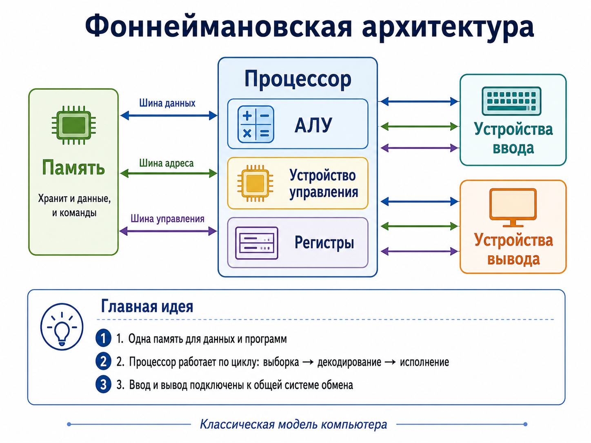
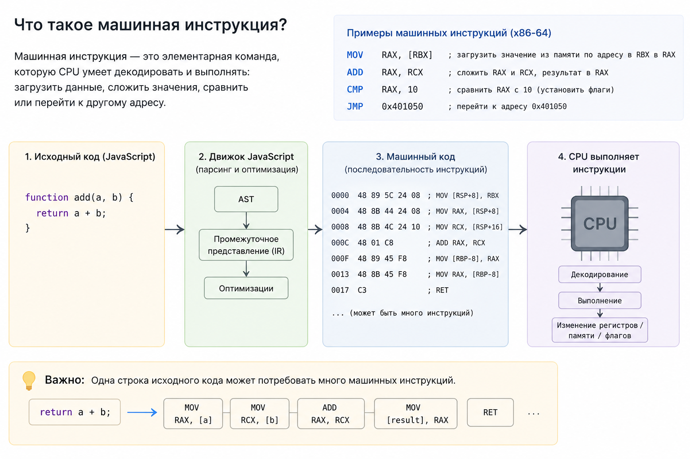

## Основы

### Архитектура компьютера

#### Junior

Что такое принцип фон Неймана (фоннеймановская архитектура)?
 
<table><tr><td>

Программа и данные хранятся в общей памяти, а процессор читает и выполняет инструкции последовательно, если управление
не изменено переходом. Классическая модель включает память, устройство управления, арифметико-логическое устройство и
ввод/вывод.

**Главные принципы**:

- Единое хранилище для программ и данных
- Однородность памяти
- Адресуемость памяти
- Последовательное программное управление

</td></tr></table>

Из каких основных частей состоит компьютер по архитектуре фон Неймана?
 
<table><tr><td>

Основные части:

- память (RAM)
- устройство управления (Central Unit, CU)
- арифметико-логическое устройство (Arithmetic Logic Unit, ALU)
- устройства ввода и вывода (I/O)

CPU объединяет управление и вычисления, RAM хранит активные инструкции и данные, а ввод/вывод связывает программу с
внешним миром. Современные компьютеры сложнее, но эта модель полезна как базовая абстракция.

Строго говоря, **CU + ALU ≠ CPU**: это важные части процессора, но не весь процессор целиком.

Помимо устройства управления (CU) и арифметико‑логического устройства (ALU), в современном CPU есть и другие критически
важные компоненты:

- Регистры. Это сверхбыстрая память прямо внутри ядра. В них временно держат операнды и результаты, чтобы ALU не тянул
  данные из медленной RAM. Без регистров цикл «взять данные — посчитать — вернуть» был бы слишком долгим.
- Кэш‑память (L1, L2, иногда L3). Она хранит часто используемые данные и инструкции поближе к ядру. Кэш сильно смягчает
  проблему «бутылочного горлышка» фон Неймана.
- Блок предсказания переходов и конвейер. В современных процессорах инструкции не выполняются строго по одной: их
  «нанизывают» в конвейер, а блок предсказания заранее загружает нужные данные. Этим всем управляет именно логика внутри
  CU, но сам блок — отдельная сложная структура.
- Исполнительные блоки помимо ALU. Например, FPU (для чисел с плавающей точкой) и векторные блоки (SIMD, как SSE/AVX в
  x86). Они делают вычисления параллельно и отдельно от «обычного» ALU.
- Интерконнект и контроллеры. Внутри кристалла нужно соединять все эти блоки между собой и с внешней памятью; часто
  прямо на кристалле размещают и контроллер памяти, и части PCIe‑интерфейса.

На уровне базовой архитектуры (учебники, фон Нейман): часто говорят «CPU = CU + ALU», потому что цель — показать самую
суть: есть тот, кто управляет (CU), и тот, кто считает (ALU). Это упрощение, удобное для понимания принципов.

На уровне реального современного процессора: CPU — это сложная система из десятков и сотен подблоков, где CU и ALU —
важные, но не единственные части.

</td></tr></table>

Почему frontend-разработчику полезно понимать базовое устройство компьютера?
 
<table><tr><td>

Frontend-разработчику эта модель помогает понимать CPU-bound задачи, main thread (главный поток) и стоимость доступа к
памяти. JavaScript выполняется не в вакууме: вычисления занимают CPU, объекты расходуют RAM, а сеть и диск (I/O)
работают существенно медленнее регистров и кешей процессора. Это помогает объяснять long tasks (тяжелые задачи), лаги
main thread, memory leaks (утечки памяти) и пользу Web Workers. Знание базы позволяет оптимизировать измеряемые узкие
места, а не отдельные строки наугад.

</td></tr></table>

Что такое CPU, RAM и storage?
 
<table><tr><td>

CPU выполняет машинные инструкции и вычисления. RAM быстро хранит данные работающих процессов, но очищается после
выключения питания. Storage, например SSD, хранит файлы долговременно, но обычно имеет большую задержку доступа.

</td></tr></table>

Чем оперативная память отличается от диска?
 
<table><tr><td>

RAM быстрее и используется как рабочая память процессов, а диск предназначен для долговременного хранения. Данные с
диска обычно сначала читаются в память, после чего CPU может с ними работать. Недостаток RAM приводит к сборке мусора,
выгрузке страниц памяти и ухудшению отзывчивости.

</td></tr></table>

Что такое машинная инструкция?
 
<table><tr><td>

Это элементарная команда, которую CPU умеет декодировать и выполнять: загрузить данные, сложить значения, сравнить или
перейти к другому адресу. JavaScript сначала преобразуется движком в промежуточное представление и машинный код. Одна
строка исходника может потребовать много инструкций.

</td></tr></table>

### ОС, процессы, сеть и терминал

#### Junior

Что такое программа?
 
<table><tr><td>

Программа - это набор инструкций и данных, описывающих, что должен сделать компьютер. В исходном коде программа понятна
разработчику, а для выполнения она должна быть интерпретирована, скомпилирована или запущена внутри runtime.

Например, файл `main.ts` - это исходный код. После сборки и запуска его результат становится частью работающего
процесса.

</td></tr></table>

Чем программа отличается от процесса?
 
<table><tr><td>

Программа - это пассивное описание: файлы на диске, исходный код или исполняемый файл. Процесс - это уже запущенный
экземпляр программы в операционной системе.

У процесса есть память, идентификатор процесса (PID), открытые файлы, переменные окружения, права доступа и состояние
выполнения. Одну и ту же программу можно запустить несколько раз, и операционная система создаст несколько разных
процессов.

</td></tr></table>

Что происходит, когда пользователь запускает программу?
 
<table><tr><td>

Операционная система находит исполняемый файл или runtime, создает процесс, выделяет ему память, передает аргументы и
переменные окружения, подключает стандартные потоки ввода/вывода и передает управление начальной точке программы.

Дальше программа выполняет инструкции, обращается к памяти, файлам, сети и другим ресурсам через API операционной
системы.

</td></tr></table>

Что такое операционная система?
 
<table><tr><td>

Операционная система - это слой между программами и аппаратным обеспечением. Она управляет процессами, памятью, файлами,
устройствами ввода/вывода, сетью, пользователями и правами доступа.

Для разработчика ОС важна потому, что любая программа работает не напрямую с железом, а через правила и API операционной
системы.

</td></tr></table>

Что такое ядро операционной системы?
 
<table><tr><td>

Ядро - центральная часть операционной системы, которая управляет самыми низкоуровневыми ресурсами: CPU, памятью,
процессами, драйверами, файловой системой и сетевым вводом/выводом.

Обычная программа не должна напрямую управлять железом. Она обращается к ядру через системные вызовы, например чтобы
прочитать файл, открыть сетевое соединение или создать новый процесс.

</td></tr></table>

Чем kernel space отличается от user space?
 
<table><tr><td>

Kernel space - область, где работает ядро ОС и код с максимальными правами. User space - область, где работают обычные
пользовательские программы.

Разделение нужно для безопасности и устойчивости: ошибка в обычной программе не должна ломать всю систему. Если
программе нужен файл, сеть или устройство, она просит об этом ядро через системный вызов.

</td></tr></table>

Что такое поток выполнения?
 
<table><tr><td>

Поток выполнения - это последовательность инструкций внутри процесса, которую планировщик ОС может выполнять на CPU.
Процесс может иметь один или несколько потоков.

Потоки одного процесса обычно разделяют общую память процесса, поэтому обмениваться данными между ними дешевле, чем
между разными процессами. Но из-за общей памяти появляются риски гонок данных и необходимость синхронизации.

</td></tr></table>

Чем процесс отличается от потока?
 
<table><tr><td>

Процесс - изолированный экземпляр программы со своей памятью и ресурсами. Поток - линия выполнения внутри процесса.

Разные процессы обычно не могут напрямую читать память друг друга. Потоки одного процесса разделяют память процесса и
часть ресурсов, поэтому они легче, но требуют аккуратной работы с общим состоянием.

</td></tr></table>

Что такое параллельность и конкурентность?
 
<table><tr><td>

Конкурентность означает, что несколько задач продвигаются во времени независимо: одна ждет сеть, другая обрабатывает
ввод, третья готовится к выполнению. Параллельность означает, что несколько задач действительно выполняются одновременно
на разных ядрах CPU.

Однопоточная программа тоже может быть конкурентной, если она умеет переключаться между задачами во время ожидания I/O.
Но для настоящего одновременного CPU-выполнения нужны несколько потоков, процессов, ядер или рабочих окружений.

</td></tr></table>

Что такое CPU-bound и I/O-bound задачи?
 
<table><tr><td>

CPU-bound задача упирается в вычисления процессора: парсинг большого объема данных, сжатие, криптография, сложная
агрегация. I/O-bound задача больше ждет внешний ресурс: диск, сеть, базу данных или файловую систему.

Это различие важно для оптимизации. CPU-bound работу часто ускоряют параллельным выполнением или алгоритмическими
улучшениями. I/O-bound работу чаще улучшают кешированием, батчингом, асинхронностью и уменьшением числа обращений к
внешним ресурсам.

</td></tr></table>

Что такое терминал?
 
<table><tr><td>

Терминал - это интерфейс для ввода команд и просмотра текстового вывода программ. В современных системах чаще всего это
приложение-эмулятор терминала: Terminal, iTerm, Windows Terminal или встроенный терминал IDE.

Сам терминал не обязательно понимает команды. Обычно он запускает shell, а уже shell интерпретирует введенную строку.

</td></tr></table>

Чем terminal отличается от shell?
 
<table><tr><td>

Terminal отвечает за окно, ввод, вывод и отображение текста. Shell - это программа, которая читает команду, разбирает
аргументы, ищет исполняемые файлы, запускает процессы и связывает их ввод/вывод.

Примеры shell: `bash`, `zsh`, `fish`, `PowerShell`. Поэтому одна и та же команда может работать по-разному в разных
shell или на разных операционных системах.

</td></tr></table>

Что такое stdin, stdout и stderr?
 
<table><tr><td>

Это стандартные потоки процесса:

- `stdin` - стандартный ввод
- `stdout` - стандартный вывод обычного результата
- `stderr` - стандартный вывод ошибок и диагностики

Shell может перенаправлять эти потоки: передавать вывод одной программы на вход другой, писать результат в файл или
разделять обычный output и ошибки.

</td></tr></table>

Что такое переменные окружения?
 
<table><tr><td>

Переменные окружения - это пары ключ-значение, которые ОС или shell передают процессу при запуске. Они часто
используются для конфигурации: режим окружения, адрес API, токены, порты, feature flags.

Процесс получает собственный набор environment variables при старте. Если изменить переменную в терминале после запуска
программы, уже работающий процесс обычно не узнает об этом автоматически.

</td></tr></table>

Что такое exit code?
 
<table><tr><td>

Exit code - числовой код завершения процесса. Обычно `0` означает успешное завершение, а ненулевое значение означает
ошибку или особое состояние.

Exit code важен для shell scripts, CI/CD и package scripts. Например, если тесты завершаются с ненулевым кодом, pipeline
понимает, что проверка не прошла.

</td></tr></table>

Что такое порт?
 
<table><tr><td>

Порт - это числовой идентификатор сетевого endpoint внутри компьютера. IP-адрес помогает найти машину в сети, а порт
помогает понять, какой программе на этой машине предназначено соединение.

Например, в адресе `http://localhost:3000` число `3000` - это порт. На одном компьютере могут одновременно работать
разные серверные процессы на разных портах.

</td></tr></table>

Что значит "программа слушает порт"?
 
<table><tr><td>

Это значит, что программа попросила ОС привязать сетевой socket к конкретному порту и готова принимать входящие
соединения или пакеты.

Например, dev server может слушать `localhost:3000`. Когда браузер открывает этот адрес, ОС направляет сетевое
соединение процессу, который слушает порт `3000`.

</td></tr></table>

Почему порт может быть занят?
 
<table><tr><td>

Обычно один и тот же адрес и порт не могут быть заняты двумя разными процессами одновременно. Если dev server уже
слушает `localhost:3000`, второй сервер при попытке занять тот же порт получит ошибку вроде `EADDRINUSE`.

Решение зависит от ситуации: остановить старый процесс, выбрать другой порт или проверить, не остался ли фоновый процесс
после закрытия терминала или IDE.

</td></tr></table>

Что такое localhost?
 
<table><tr><td>

`localhost` - имя, которое указывает на текущий компьютер. Обычно оно разрешается в loopback-адрес `127.0.0.1` для IPv4
или `::1` для IPv6.

Когда браузер открывает `http://localhost:3000`, запрос не уходит во внешнюю сеть. Он направляется на программу,
работающую на этом же компьютере и слушающую порт `3000`.

</td></tr></table>

Что такое сервер?
 
<table><tr><td>

Сервером могут называть и физическую или виртуальную машину, и программу, и роль в сетевом взаимодействии. В базовом
смысле сервер - это сторона, которая принимает запросы и возвращает ответы или предоставляет ресурс.

Ноутбук разработчика тоже может быть сервером, если на нем запущена программа, принимающая соединения. Например,
локальный dev server Angular, Vite или Astro обслуживает браузер во время разработки.

</td></tr></table>

Что такое клиент?
 
<table><tr><td>

Клиент - это сторона, которая инициирует запрос к серверу. Браузер, мобильное приложение, CLI-утилита или другой сервис
могут выступать клиентом.

Роли клиента и сервера зависят от конкретного взаимодействия. Одна и та же программа может быть сервером для одного
соединения и клиентом для другого.

</td></tr></table>

Что такое IP-адрес?
 
<table><tr><td>

IP-адрес - это адрес устройства или сетевого интерфейса в IP-сети. Он нужен, чтобы пакеты могли быть доставлены от
одного узла к другому.

IP-адрес отвечает на вопрос "к какой машине или сетевому интерфейсу обратиться", а порт отвечает на вопрос "к какой
программе внутри этой машины обратиться".

</td></tr></table>

Что такое DNS?
 
<table><tr><td>

DNS - система, которая сопоставляет доменные имена с сетевыми адресами и другой служебной информацией. Благодаря DNS
пользователь вводит `example.com`, а не запоминает IP-адрес сервера.

Перед сетевым соединением клиент обычно должен узнать, в какой IP-адрес разрешается доменное имя. Ответ может прийти из
локального кеша, от провайдера, корпоративного DNS или публичного DNS-сервера.

</td></tr></table>

Что такое socket?
 
<table><tr><td>

Socket - программная абстракция сетевого соединения или сетевого endpoint. Через socket программа отправляет и получает
данные по сети.

Для TCP-соединения socket связан с адресом, портом и состоянием соединения. Для UDP socket может отправлять и принимать
отдельные datagrams без постоянного соединения.

</td></tr></table>

Почему `npm run dev` запускает сервер?
 
<table><tr><td>

`npm run dev` запускает script из `package.json`. Обычно этот script стартует dev server фреймворка или сборщика:
Angular CLI, Vite, Astro, Next.js и другие инструменты.

Dev server - это обычный процесс на компьютере разработчика. Он слушает порт, отдает файлы браузеру, пересобирает проект
при изменениях и может поддерживать hot reload или HMR.

</td></tr></table>

Почему закрытие вкладки браузера не всегда останавливает dev server?
 
<table><tr><td>

Браузер и dev server - разные процессы. Вкладка браузера является клиентом, а dev server продолжает работать в терминале
или IDE, пока его процесс не завершится.

Поэтому закрытие вкладки обычно прекращает только клиентское соединение. Чтобы остановить сервер, нужно остановить
процесс dev server, например через `Ctrl+C` в терминале, кнопку stop в IDE или команду управления процессами.

</td></tr></table>

