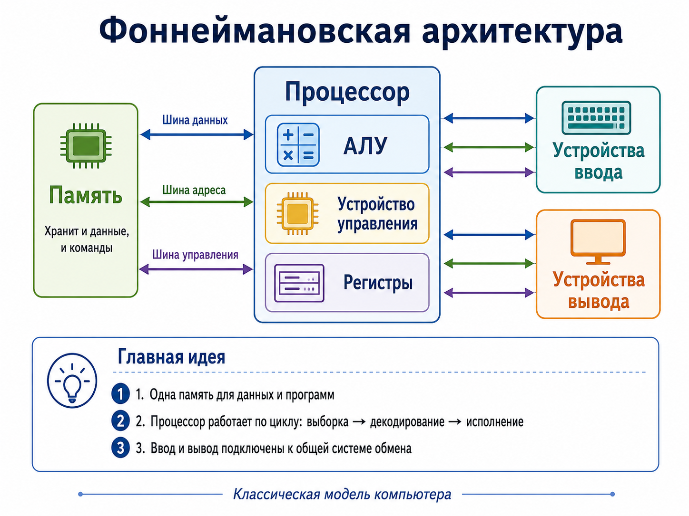
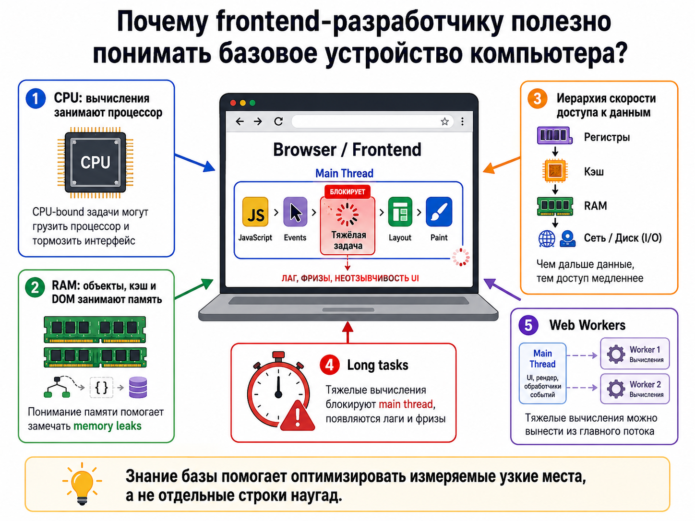
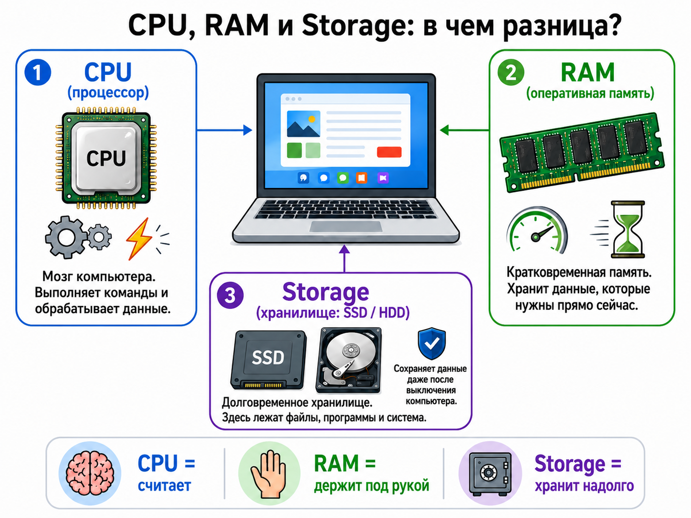
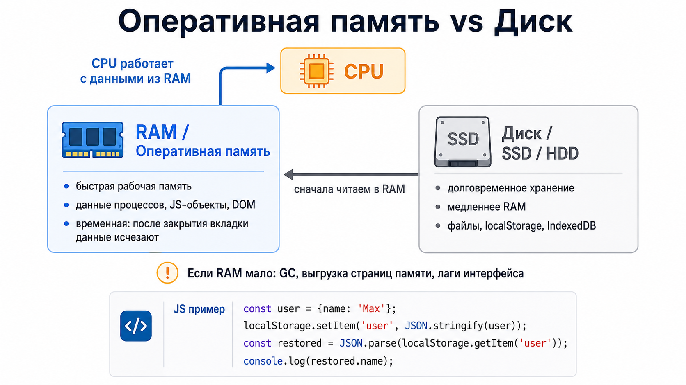
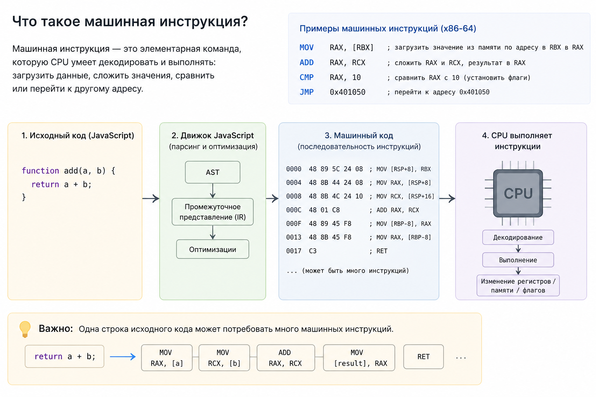

## Архитектура компьютера

<details>
<summary>Что такое принцип фон Неймана (фоннеймановская архитектура)?</summary><br>
<table><tr><td>

**Короткий ответ**

Программа и данные хранятся в общей памяти, а процессор читает и выполняет инструкции последовательно, если управление
не изменено переходом. Классическая модель включает память, устройство управления, арифметико-логическое устройство и
ввод/вывод.

**Полный ответ**

Архитектура фон Неймана описывает компьютер как систему, в которой **инструкции программы и обрабатываемые данные лежат в
одной адресуемой памяти**. Процессор получает из нее очередную инструкцию, декодирует ее, выполняет и переходит к следующей,
если сама инструкция не изменила поток управления.

Этот процесс обычно объясняют циклом **fetch — decode — execute**:

1. **Fetch** — устройство управления читает инструкцию по адресу из счетчика команд.
2. **Decode** — процессор определяет операцию и необходимые операнды.
3. **Execute** — ALU или другой исполнительный блок выполняет операцию.
4. **Store** — результат сохраняется в регистр или память, после чего обновляется счетчик команд.

**Главные принципы**:

- единое хранилище для программ и данных;
- однородность памяти: ячейки различаются адресами, а не назначением;
- адресуемость: процессор обращается к конкретным ячейкам;
- последовательное программное управление с возможностью переходов.

Общая память и общий путь к ней создают **бутылочное горлышко фон Неймана**: CPU может выполнять операции быстрее, чем
память успевает поставлять инструкции и данные. Поэтому современные процессоры используют регистры, несколько уровней
кеша, предварительную выборку и параллельное выполнение. Внутри процессора кеш инструкций и кеш данных могут быть
разделены, но на уровне программной модели компьютер все равно часто остается фоннеймановским.

Например, при выполнении цикла над большим массивом производительность зависит не только от числа арифметических операций,
но и от того, насколько последовательно программа читает память и попадают ли данные в кеш.



</td></tr></table>

</details>

<details>
<summary>Из каких основных частей состоит компьютер по архитектуре фон Неймана?</summary><br>
<table><tr><td>

**Короткий ответ**

Классическая модель включает память, устройство управления, арифметико-логическое устройство и устройства ввода/вывода.
Устройство управления и ALU являются ключевыми частями CPU, но современный процессор содержит и другие блоки.

**Полный ответ**

В классической архитектуре фон Неймана выделяют четыре основные части:

- **память** хранит инструкции программы и данные;
- **устройство управления (CU)** получает и декодирует инструкции, а затем координирует работу остальных блоков;
- **арифметико-логическое устройство (ALU)** выполняет арифметические и логические операции;
- **устройства ввода и вывода (I/O)** связывают компьютер с диском, сетью, клавиатурой, экраном и другими устройствами.

CPU объединяет управление и вычисления, RAM хранит активные инструкции и данные, а ввод/вывод связывает программу с
внешним миром. Упрощенно выполнение команды выглядит так: CU читает инструкцию из памяти, подготавливает операнды,
направляет их в исполнительный блок и сохраняет результат.

Строго говоря, **CU + ALU не равны всему CPU**. Это важные части процессора, но современный CPU дополнительно содержит:

- **регистры** — самую быструю память для текущих операндов, адресов и результатов;
- **кеш L1, L2 и L3** — копии часто используемых данных и инструкций ближе к ядрам;
- **FPU и SIMD-блоки** — вычисления с плавающей точкой и обработку нескольких значений одной инструкцией;
- **конвейер и предсказатель переходов** — параллельную подготовку этапов инструкций и попытку заранее выбрать нужную
  ветку;
- **декодеры, планировщики и reorder buffer** — внутреннее управление выполнением инструкций;
- **контроллеры памяти и внутренние шины** — обмен между ядрами, кешами, RAM и периферией.

Например, выражение `total += prices[i]` требует не только сложения в ALU: нужно вычислить адрес элемента, получить данные
из регистра, кеша или RAM, выполнить операцию и сохранить результат. Поэтому скорость программы определяется всей
иерархией, а не только частотой ALU.

На интервью полезно сначала назвать учебную модель, а затем уточнить, что реальный CPU значительно сложнее. Это показывает,
что кандидат понимает границу между полезной абстракцией и физической реализацией.

</td></tr></table>

</details>

<details>
<summary>Почему frontend-разработчику полезно понимать базовое устройство компьютера?</summary><br>
<table><tr><td>

**Короткий ответ**

Frontend-разработчику эта модель помогает понимать CPU-bound задачи, main thread и стоимость доступа к памяти.
JavaScript-вычисления занимают CPU, объекты расходуют RAM, а сеть и диск работают существенно медленнее регистров и кешей.
Это объясняет long tasks, лаги интерфейса, memory leaks и пользу Web Workers.

**Полный ответ**

Браузер скрывает детали железа, но производительность интерфейса все равно ограничена процессором, памятью и вводом/выводом.
Базовая модель помогает связать симптомы в DevTools с реальными причинами.

**CPU-bound работа** занимает вычислительные ресурсы:

- сортировка или агрегация большого массива;
- `JSON.parse()` большого ответа;
- синхронное преобразование изображений;
- сложный JavaScript во время рендера;
- style calculation, layout и часть paint pipeline.

Если такая работа надолго занимает main thread, браузер не может вовремя обработать ввод пользователя и отрисовать
следующий кадр. Пользователь видит задержку клика, зависший scroll или пропущенную анимацию. Для тяжелых независимых
вычислений можно использовать Web Worker, но DOM остается доступен только из main thread.

**Память** важна не только из-за утечек. Большие графы объектов увеличивают давление на garbage collector, а частые
выделения временных объектов могут вызывать заметные паузы. Например, хранение нескольких копий большого API-ответа в
store, кеше и view model повышает расход RAM без пользовательской пользы.

**I/O-bound работа** чаще ждет сеть, диск или другой внешний ресурс. Здесь помогают HTTP-кеш, дедупликация запросов,
pagination, streaming, prefetch и правильная отмена устаревших операций, а не перенос кода в Worker.

Практический порядок оптимизации:

1. воспроизвести проблему и записать Performance profile;
2. определить, что ограничивает сценарий: CPU, память, сеть, layout или GPU;
3. найти самый дорогой участок;
4. изменить архитектуру или алгоритм;
5. повторить измерение и проверить пользовательскую метрику.

Например, для таблицы на 100 000 строк правильное решение обычно не в микроправке одной функции. Нужны виртуализация,
меньше создаваемых DOM-узлов, стабильные ссылки на данные и перенос необязательных вычислений из критического пути.



</td></tr></table>

</details>

<details>
<summary>Что такое CPU, RAM и storage?</summary><br>
<table><tr><td>

**Короткий ответ**

CPU выполняет машинные инструкции и вычисления. RAM быстро хранит данные работающих процессов, но теряет их после
выключения питания. Storage, например SSD, хранит файлы долговременно, однако обычно имеет большую задержку доступа.

**Полный ответ**

**CPU** выполняет машинные инструкции. Он читает команды, работает с регистрами и кешами, выполняет арифметические,
логические и управляющие операции. Несколько ядер позволяют действительно выполнять несколько потоков одновременно, хотя
конкретное распределение работы определяют операционная система и runtime.

**RAM** — рабочая энергозависимая память. В ней находятся код и данные запущенных процессов: heap JavaScript, DOM,
буферы, библиотеки и другие активные структуры. RAM значительно больше кеша процессора, но доступ к ней медленнее.

**Storage** — долговременное хранилище: SSD, HDD или флеш-память. На нем лежат файлы приложения, операционная система,
браузерный профиль и данные между перезапусками. Перед обработкой файл обычно читается со storage в RAM, после чего CPU
работает с загруженными данными.

Упрощенная иерархия выглядит так:

`регистры -> кеш CPU -> RAM -> SSD/HDD -> сеть`

Чем ближе уровень к CPU, тем обычно меньше объем и ниже задержка. Поэтому последовательный доступ к уже загруженным данным
обычно дешевле случайного чтения большого числа мелких файлов или сетевых ресурсов.

Frontend-пример:

- JavaScript bundle хранится на сервере и может кешироваться на storage;
- браузер загружает его по сети и помещает необходимые данные в RAM;
- CPU парсит, компилирует и выполняет код;
- созданные объекты остаются в heap, пока доступны приложению или пока их не удалит garbage collector.

Важно не смешивать физическую память с Web Storage API. `localStorage` и IndexedDB являются браузерными механизмами
долговременного хранения, а не прямым доступом JavaScript к RAM или SSD.



</td></tr></table>

</details>

<details>
<summary>Чем оперативная память отличается от диска?</summary><br>
<table><tr><td>

**Короткий ответ**

RAM быстрее и используется как рабочая память процессов, а диск предназначен для долговременного хранения. Данные с
диска обычно сначала читаются в RAM, после чего CPU может их обрабатывать.

**Полный ответ**

RAM и диск различаются назначением, скоростью и временем жизни данных.

| Свойство | RAM | SSD/HDD |
| --- | --- | --- |
| Назначение | Активные данные процессов | Долговременные файлы |
| Сохранение без питания | Нет | Да |
| Задержка доступа | Ниже | Выше |
| Типичный объем | Меньше | Больше |
| Доступ CPU | Через память и кеши | После операции ввода/вывода |

Когда программа открывает файл, операционная система обычно читает нужные блоки с диска в RAM. После этого процессор
работает с данными в памяти. ОС также использует page cache, поэтому повторное чтение файла иногда обслуживается из RAM и
происходит быстрее.

Если физической RAM недостаточно, операционная система может выгружать неактивные страницы в swap или page file на диск.
Это помогает продолжить работу, но из-за более высокой задержки storage система может начать заметно тормозить. Сам по
себе недостаток RAM не означает, что garbage collector обязательно запустится: GC управляет памятью конкретного runtime,
а paging управляет операционная система. Эти механизмы связаны давлением на память, но не являются одним и тем же.

Frontend-пример: загруженное изображение может занимать на диске 2 MB в сжатом JPEG, но после декодирования в RGBA-буфер
размером 4000 x 3000 пикселей потребовать около 48 MB RAM. Поэтому размер сетевого файла и фактическое потребление памяти
интерфейсом могут сильно различаться.



</td></tr></table>

</details>

<details>
<summary>Что такое машинная инструкция?</summary><br>
<table><tr><td>

**Короткий ответ**

Машинная инструкция — элементарная команда из набора команд процессора: загрузить данные, выполнить арифметическую
операцию, сравнить значения или перейти к другому адресу. Одна строка JavaScript обычно превращается во множество таких
инструкций.

**Полный ответ**

Машинная инструкция — команда, закодированная в формате, который понимает конкретная архитектура процессора, например
x86-64 или ARM64. Набор поддерживаемых команд и правила их кодирования называют **ISA — Instruction Set Architecture**.

Инструкция обычно содержит:

- **opcode** — какую операцию выполнить;
- **операнды** — регистры, константы или адреса памяти;
- иногда режим адресации и дополнительные флаги.

Примеры категорий инструкций:

- загрузка и сохранение данных между памятью и регистрами;
- сложение, умножение и побитовые операции;
- сравнение значений;
- условные и безусловные переходы;
- вызов функции и возврат;
- SIMD-операции над несколькими значениями.

JavaScript не содержит прямых машинных инструкций. Движок браузера сначала парсит исходный код, строит внутреннее
представление, интерпретирует его и может JIT-компилировать часто выполняемые участки в машинный код. При изменении
предположений о типах оптимизированный код иногда деоптимизируется.

Например, выражение:

```js
const total = price + tax;
```

может потребовать проверить типы значений, загрузить их из памяти, выполнить сложение, обработать представление числа и
сохранить результат. Точное число инструкций зависит от движка, архитектуры CPU, контекста и примененных оптимизаций,
поэтому нельзя надежно оценивать производительность по числу строк исходного кода.

Практический вывод: оптимизировать следует алгоритмы, объем данных и измеренные hot paths, а не пытаться вручную угадать
машинный код обычного JavaScript.



</td></tr></table>

</details>
