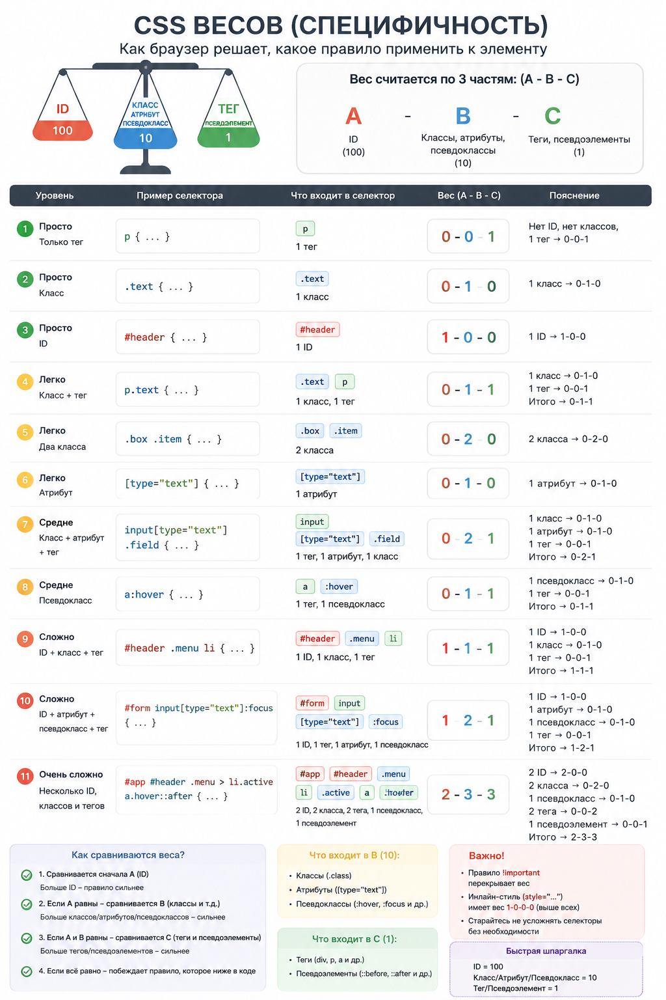

## CSS

### CSS Core

<details>
<summary>Что такое CSS и как браузер применяет его к HTML?</summary><br>
<table><tr><td>

**Короткий ответ**

CSS описывает presentation документа. Браузер разбирает stylesheets в CSSOM, сопоставляет selectors с DOM, разрешает
cascade и inheritance, вычисляет значения, а затем использует их для layout, paint и compositing.

**Полный ответ**

CSS задает правила presentation для DOM: какие элементы участвуют в layout, какие у них размеры, цвета, шрифты, эффекты
и как эти значения меняются в разных состояниях.

Упрощенно browser проходит несколько этапов:

1. разбирает stylesheets и строит CSSOM;
2. находит rules, selectors которых подходят DOM elements;
3. для каждого property разрешает cascade;
4. применяет inheritance и CSS-wide values;
5. получает computed values;
6. использует результат при построении layout, paint и compositing.

Например:

```css
.button {
  color: white;
  background: royalblue;
  padding: 0.75rem 1rem;
}
```

Selector `.button` определяет область применения rule, а declarations становятся кандидатами на значения конкретных
properties. Если другой rule тоже задает `color`, browser не просто берет «последний CSS»: сначала учитываются cascade
origin, importance/layer, specificity и другие этапы cascade.

CSS parsing устойчив к ошибкам. Если browser не понимает отдельную declaration, например неизвестное property или
невалидное value, он обычно игнорирует ее и продолжает разбирать stylesheet. Это позволяет писать progressive fallback:

```css
.card {
  background: rgb(20 20 20);
  background: color(display-p3 0.1 0.1 0.1);
}
```

Если DOM, class, media/container condition или используемая custom property меняется, browser может выполнить style
recalculation. Но изменение CSS не означает автоматически полный layout: `color` в основном влияет на paint, а `width`
может потребовать layout; `transform` часто можно обработать на compositing stage.

На интервью полезно связать CSS с rendering pipeline: **selector matching и cascade дают computed styles, после чего
конкретные properties определяют, понадобится ли layout, paint или только compositing**.

</td></tr></table>

</details>

<details>
<summary>Что такое selector и declaration?</summary><br>
<table><tr><td>

**Короткий ответ**

Selector выбирает элементы, declaration задает пару `property: value` внутри rule. Несколько rules могут задавать одно
property одному элементу, после чего cascade выбирает итоговое значение.

**Полный ответ**

CSS rule обычно состоит из **selector** и блока **declarations**:

```css
.card > .title {
  color: darkslateblue;
  font-weight: 600;
}
```

`.card > .title` — selector. Он описывает, каким DOM elements подходит правило.

Внутри блока две declarations:

```text
color: darkslateblue
font-weight: 600
```

У каждой declaration есть property и value. Browser рассматривает конфликт **по каждому property отдельно**: один rule
может победить для `color`, а другое подходящее правило — для `font-size`.

Selectors бывают разного типа:

```css
button {
} /* type selector */
.action {
} /* class selector */
[aria-expanded='true'] {
} /* attribute selector */
.card > .title {
} /* combinators */
.button:hover {
} /* pseudo-class */
.button::before {
} /* pseudo-element */
```

Shorthand declaration может задавать сразу несколько longhand properties:

```css
.card {
  margin: 1rem 2rem;
}
```

Она влияет на `margin-top`, `margin-right`, `margin-bottom` и `margin-left`, поэтому более поздний longhand способен
переопределить только одну сторону.

Важно не связывать selector с application state сильнее необходимого. Например, `.sidebar > ul > li > button` сильно
зависит от DOM structure, а `.sidebar-action` переживет дополнительный wrapper гораздо легче.

На интервью: **selector отвечает «кому», declaration — «какое property/value», а cascade разрешает конфликты между
подходящими declarations независимо для каждого property**.

</td></tr></table>

</details>

<details>
<summary>Что такое cascade?</summary><br>
<table><tr><td>

**Короткий ответ**

Cascade разрешает конфликт declarations по relevance, origin/importance, cascade layer, specificity, scope proximity и
порядку объявления. Specificity — только один из этапов.

**Полный ответ**

Cascade отвечает на вопрос: **какая declaration победит, если одному element подходят несколько значений одного
property?**

Упрощенный порядок принятия решения:

1. **Relevance** — rule вообще должен быть активен, например совпадает ли `@media` condition.
2. **Origin и importance** — user-agent, user и author styles, normal/`!important`, animations/transitions.
3. **Cascade layers** — внутри origin учитывается порядок `@layer`.
4. **Specificity** — сравнивается вес selectors, которые еще остаются кандидатами.
5. **Scoping proximity** — для конфликтующих `@scope` rules ближний scope root может получить приоритет.
6. **Order of appearance** — если предыдущие условия равны, побеждает более поздняя declaration.

Пример layers:

```css
@layer reset, components, overrides;

@layer components {
  .button {
    color: blue;
  }
}

@layer overrides {
  .button {
    color: purple;
  }
}
```

Для обычных declarations более поздний layer имеет больший приоритет, поэтому `purple` победит без увеличения
specificity. Это позволяет управлять архитектурой cascade явно вместо гонки selectors.

Важный нюанс: `!important` не «добавляет specificity». Сначала declaration попадает в другой importance bucket, и уже
внутри конкурирующих important declarations применяются остальные правила. Порядок layers для important declarations
также инвертируется, чтобы ранние защитные layers нельзя было случайно перебить поздними overrides.

Поэтому такой подход хрупок:

```css
#app .page .form .button.primary {
  color: red !important;
}
```

Он создает escalation: следующему разработчику приходится писать еще более сильный selector или новый `!important`. Чаще
лучше уменьшить specificity, использовать component boundary или cascade layers.

На интервью сильный ответ: **specificity не равна cascade; сначала browser определяет cascade bucket/layer, затем
сравнивает specificity, scope proximity и только потом source order**.

</td></tr></table>

</details>

<details>
<summary>Что такое inheritance в CSS?</summary><br>
<table><tr><td>

**Короткий ответ**

Некоторые properties, например `color` и `font-family`, по умолчанию наследуют computed value родителя; box/layout
properties обычно нет. `inherit` позволяет запросить наследование явно.

**Полный ответ**

Inheritance позволяет descendant element получить значение property от parent, если у него нет собственного результата
cascade и само property является inherited.

Типичные inherited properties относятся к тексту:

```css
body {
  color: #222;
  font-family: system-ui;
}
```

Большая часть текста внутри `body` автоматически получит эти значения без отдельного rule для каждого element.

Layout properties обычно не наследуются:

```css
.parent {
  margin: 2rem;
  border: 1px solid;
}
```

Child не получает `margin` и `border`, иначе layout быстро стал бы непредсказуемым.

Наследуется не source text declaration, а **computed value** родителя. Это особенно заметно с relative values:

```css
.parent {
  color: currentColor;
}
```

и custom properties, которые по умолчанию тоже наследуются:

```css
.theme-dark {
  --surface: #111;
}

.card {
  background: var(--surface);
}
```

Наследование можно включить явно даже для non-inherited property:

```css
.child {
  border-color: inherit;
}
```

или сбросить через `initial`, `unset`, `revert` и другие CSS-wide keywords.

Важно не путать inheritance с descendant selectors. Rule `.parent .child` применяется из-за selector matching, а не
потому, что CSS property «унаследовалось».

Практически inheritance полезно использовать для typography, color и design tokens, но опасно строить на нем скрытые
component contracts. Если component работает только потому, что где-то далеко ancestor задает случайную custom property,
его reuse становится сложнее.

На интервью: **inheritance — это передача computed value по DOM parent-child relation для определенных properties, а не
механизм выбора selector**.

</td></tr></table>

</details>

<details>
<summary>Что такое initial value и что делают <code>inherit</code>, <code>initial</code>, <code>unset</code>, <code>revert</code>?</summary><br>
<table><tr><td>

**Короткий ответ**

Каждое property имеет specification initial value. `inherit` берет значение parent, `initial` возвращает specification
default, `unset` выбирает `inherit` или `initial` по природе property, `revert` откатывает текущий cascade origin. Для
отката текущего layer есть `revert-layer`.

**Полный ответ**

У каждого CSS property есть **initial value**, определенное спецификацией. Это не обязательно то, что browser визуально
показывает элементу по умолчанию, потому что поверх initial values работают user-agent styles.

Например:

```css
div {
  display: initial;
}
```

Initial value для `display` — `inline`, поэтому это не то же самое, что browser default `display: block` для `div`.

CSS-wide keywords решают разные задачи.

**`inherit`** — взять computed value parent независимо от того, наследуется ли property обычно:

```css
.child {
  border-color: inherit;
}
```

**`initial`** — использовать specification initial value:

```css
.element {
  color: initial;
}
```

**`unset`** — вести себя как `inherit` для inherited property и как `initial` для остальных:

```css
.component {
  all: unset;
}
```

`all: unset` выглядит как удобный reset, но может убрать display, interaction-related styles и ожидаемые browser
defaults, поэтому использовать его нужно осознанно.

**`revert`** — убрать влияние declarations текущего cascade origin и вернуться к результату предыдущего origin. Для
author styles это часто позволяет снова увидеть user/user-agent behavior:

```css
button {
  font: revert;
}
```

**`revert-layer`** — более локальный вариант: игнорирует declaration текущего cascade layer и ищет значение в предыдущих
layers того же origin.

```css
@layer base, components;

@layer components {
  .special {
    color: revert-layer;
  }
}
```

На интервью важно не говорить «initial возвращает browser default». **Initial — значение из specification, revert —
возврат по cascade origin, revert-layer — возврат по layer**.

</td></tr></table>

</details>

<details>
<summary>Что такое CSS box model?</summary><br>
<table><tr><td>

**Короткий ответ**

Box состоит из content, padding, border и margin. При `content-box` `width`/`height` относятся к content, при
`border-box` включают padding и border. Margin находится снаружи border box.

**Полный ответ**

Большинство visual elements browser представляет как boxes. Классическая box model состоит из четырех областей:

```text
margin
  border
    padding
      content
```

При default `box-sizing: content-box`:

```css
.card {
  width: 200px;
  padding: 20px;
  border: 2px solid;
}
```

`200px` относится только к content box. Фактическая ширина border box будет:

```text
200 + 20 + 20 + 2 + 2 = 244px
```

При `box-sizing: border-box` те же `width: 200px` уже включают content + padding + border, поэтому внешний размер
предсказуемее.

Margin находится за border и не входит в `width` border box. У vertical margins обычных block elements в normal flow
есть еще один важный edge case — **margin collapsing**: соседние vertical margins могут схлопываться вместо простого
сложения. Во Flexbox/Grid такого классического collapsing между items нет.

Не все visual effects входят в box model. Например, `outline` и `box-shadow` могут рисоваться за border box, но обычно
не увеличивают layout size элемента.

Sizing также ограничивают `min-width`, `max-width`, intrinsic sizes и правила конкретного layout mode. Поэтому
`width: 100%` не всегда означает «ровно ширина родителя» — padding, box-sizing, min-content constraints и containing
block тоже имеют значение.

На интервью: **box model объясняет, из каких областей складывается layout size; затем нужно связать ее с `box-sizing`,
margin collapsing и тем, что paint effects не обязательно участвуют в layout**.

</td></tr></table>

</details>

<details>
<summary>Чем единицы <code>em</code>, <code>rem</code>, <code>%</code>, <code>vw</code>, <code>vh</code> и <code>px</code> отличаются?</summary><br>
<table><tr><td>

**Короткий ответ**

`rem` зависит от root font size, `em` — от font size контекста, `%` — от правила конкретного property, viewport units —
от viewport, `px` — CSS pixel. Единицу выбирают по тому, относительно чего значение должно масштабироваться.

**Полный ответ**

Универсально «лучшей» CSS unit нет. Вопрос в том, **какую зависимость мы хотим выразить**.

**`px`** — CSS pixel, логическая единица browser, а не гарантированно один physical pixel экрана. Удобен для значений,
которые не должны зависеть от typography: например, тонкий border или конкретный minimum size.

**`rem`** зависит от computed `font-size` root element (`html`):

```css
.card {
  padding: 1rem;
}
```

Это удобно для глобальной typography/spacing scale, которая реагирует на root font size.

**`em`** зависит от font size текущего контекста. Для `font-size` самого element reference берется из parent font size,
а для большинства других properties — из computed font size самого element:

```css
.badge {
  font-size: 0.875rem;
  padding-inline: 0.75em;
}
```

Так padding badge масштабируется вместе с его текстом.

**`%`** зависит от property. Например, `width: 50%` обычно связан с containing block, а percentage в `transform` может
относиться к box самого transformed element. Поэтому `%` нельзя объяснить одной фразой «процент от родителя».

**Viewport units**:

```css
.hero {
  min-height: 100dvh;
}
```

`vw`/`vh` относятся к viewport, но на mobile классический `100vh` исторически неудобен из-за browser chrome. Современные
`svh`, `lvh`, `dvh` различают small, large и dynamic viewport size и позволяют выбрать нужное поведение.

Практический выбор часто выглядит так:

- typography и scalable spacing — `rem`;
- размеры, связанные с локальным text — `em`;
- fluid layout — `%`, `fr`, container/viewport units;
- точные технические ограничения — иногда `px`.

Не стоит запрещать `px` догматически. Accessibility определяется тем, может ли интерфейс zoom/reflow и уважает ли
пользовательские настройки, а не самим наличием символов `px` в stylesheet.

На интервью: **unit — это dependency. Сильный ответ объясняет reference value каждой единицы и выбирает ее из desired
responsive behavior**.

</td></tr></table>

</details>

<details>
<summary>Что такое CSS custom properties?</summary><br>
<table><tr><td>

**Короткий ответ**

Custom properties объявляются как `--token` и используются через `var()`. Они участвуют в cascade, по умолчанию
наследуются и вычисляются runtime; `@property` может задать тип, initial value и управление inheritance.

**Полный ответ**

CSS custom property — настоящее CSS property с именем, начинающимся на `--`:

```css
:root {
  --color-accent: #5b5bd6;
}

.button {
  background: var(--color-accent);
}
```

В отличие от Sass variable, custom property существует **в browser runtime**. Поэтому она участвует в cascade и
inheritance, может меняться под class/media condition и через DOM API.

Это делает custom properties удобной основой themes/design tokens:

```css
:root {
  --surface: white;
  --text: #222;
}

[data-theme='dark'] {
  --surface: #151515;
  --text: #f5f5f5;
}

.card {
  color: var(--text);
  background: var(--surface);
}
```

У `var()` есть fallback:

```css
.card {
  color: var(--card-color, currentColor);
}
```

Fallback используется, когда custom property недоступна/invalid для substitution, а не как polyfill для browsers без
поддержки custom properties.

Есть важный edge case: обычная `--custom-property` принимает почти произвольный token stream. Ошибка может проявиться
только **at computed-value time**:

```css
:root {
  --theme-color: 45deg;
}

.card {
  background-color: var(--theme-color);
}
```

`--theme-color` сама по себе syntactically допустима, но после substitution `45deg` не является цветом. Итоговое
`background-color` станет invalid at computed-value time и откатится по правилам property, что иногда дает неожиданный
результат.

`@property` позволяет зарегистрировать typed custom property:

```css
@property --progress {
  syntax: '<number>';
  inherits: false;
  initial-value: 0;
}
```

Это дает validation, initial value, контроль inheritance и более предсказуемую animation/interpolation.

Ограничение: `var()` подставляет values, но не может динамически создавать property names, selectors или conditions в
`@media`/container query.

На интервью: **custom properties — часть cascade/runtime model CSS, а не просто текстовая замена переменных; нужно
упомянуть inheritance, fallback и `@property`**.

</td></tr></table>

</details>

<details>
<summary>Что такое <code>currentColor</code>?</summary><br>
<table><tr><td>

**Короткий ответ**

`currentColor` означает computed значение property `color`. Его используют в borders, SVG, shadows и других color
positions, чтобы visual parts автоматически следовали цвету текста/состоянию компонента.

**Полный ответ**

`currentColor` — CSS keyword, который подставляет текущее computed значение `color` элемента.

Например:

```css
.link {
  color: royalblue;
  border-bottom: 1px solid currentColor;
}
```

При `:hover` достаточно изменить одно property:

```css
.link:hover {
  color: darkblue;
}
```

Border автоматически станет `darkblue`, потому что его цвет связан с `currentColor`.

Особенно полезен этот pattern для monochrome SVG icons:

```html
<svg
  viewBox="0 0 24 24"
  class="icon"
  aria-hidden="true"
>
  <path
    fill="currentColor"
    d="..."
  />
</svg>
```

```css
.icon-button {
  color: var(--icon-color);
}
```

Так icon следует hover/disabled/theme state без отдельного asset или selector для внутреннего `path`.

Некоторые properties и так используют `currentColor` как initial color behavior, например border colors. Явная запись
все равно может быть полезна как documentation intent в component API.

Trade-off: `currentColor` связывает два визуальных канала. Для multi-color illustration или border, который должен иметь
независимый semantic token, такая связь уже не подходит.

На интервью: **currentColor позволяет выразить dependency «этот цвет такой же, как text color» и уменьшает количество
синхронизируемых state rules**.

</td></tr></table>

</details>

<details>
<summary>Веса в CSS</summary><br>
<table><tr><td>

**Короткий ответ**

Specificity selector обычно сравнивают как `ID - class/attribute/pseudo-class - type/pseudo-element`. `!important`,
origin и cascade layer не являются частью specificity и обрабатываются раньше в cascade.

**Полный ответ**

Specificity — один из tie-breakers cascade. Ее удобно представлять тремя группами:

```text
ID | CLASS | TYPE
```

Примеры:

```css
* {
} /* 0-0-0 */
button {
} /* 0-0-1 */
.button {
} /* 0-1-0 */
[type='button'] {
} /* 0-1-0 */
.button:hover {
} /* 0-2-0 */
#checkout .button {
} /* 1-1-0 */
```

Если competing declarations уже находятся в одном cascade bucket/layer, более высокая specificity побеждает. При равной
specificity дальше учитываются scope proximity и source order.

Есть важные modern pseudo-class rules.

**`:where()` имеет нулевую specificity:**

```css
:where(.card .title) {
  margin: 0;
}
```

Это удобно для defaults, которые consumers должны легко переопределять.

**`:is()`, `:not()` и `:has()` сами не добавляют обычный class-weight; их specificity определяется наиболее специфичным
selector из переданного списка:**

```css
:is(.button, #critical) {
  /* specificity учитывает #critical */
}
```

Поэтому случайный ID внутри `:is()` способен неожиданно усилить rule.

Inline style имеет отдельный высокий author priority относительно обычных selector rules. `!important` тоже не является
«четвертой цифрой» specificity: он переводит declaration в important cascade, где затем снова сравниваются layers,
specificity и остальные criteria.

Практическая проблема — specificity escalation. Если component требует selectors вроде `#app .page .dialog .button`,
переопределения становятся дорогими. Cascade layers, low-specificity defaults через `:where()` и component boundaries
обычно масштабируются лучше.

На интервью: **specificity нужно уметь считать, но еще важнее сказать, где она находится внутри cascade и почему
`!important`/layers нельзя смешивать с ее весом**.



</td></tr></table>

</details>

<details>
<summary>Что такое user agent style?</summary><br>
<table><tr><td>

**Короткий ответ**

User agent stylesheet — встроенные browser styles для HTML elements. Благодаря им headings, links, buttons, inputs и
другие native elements имеют базовый вид и behavior даже без author CSS.

**Полный ответ**

Browser поставляет собственный **user agent stylesheet**. Поэтому страница без единой author declaration все равно не
выглядит как неформатированный текст:

```html
<h1>Hello</h1>
<p>Text</p>
<button>Click</button>
```

Browser обычно задает heading размер/weight/margins, link — color/decoration, button/input — platform form appearance.
Конкретные defaults могут отличаться между browser/OS.

Упрощенный пример UA rules:

```css
h1 {
  display: block;
  font-size: 2em;
  font-weight: bold;
}
```

Author styles в обычной ситуации переопределяют normal UA declarations через cascade:

```css
h1 {
  margin: 0;
}
```

Но важно различать **UA default и specification initial value**. Например, `display: initial` не означает «верни обычный
display этого HTML tag»: initial value `display` — `inline`, тогда как UA stylesheet делает `div` block. Для возврата к
более раннему cascade origin чаще подходит `revert`.

UA styles также несут полезное platform behavior: focus outlines, form control appearance, disabled states. Aggressive
reset вида `button { all: unset; }` может удалить важные affordances, которые потом придется восстанавливать вручную.

В DevTools user agent rules обычно видны рядом с author styles, поэтому при странном margin/input appearance стоит
сначала проверить cascade, а не считать это «магией браузера».

На интервью: **UA stylesheet — самый базовый style origin browser; reset/normalize взаимодействуют именно с этими
defaults, а не меняют HTML semantics**.

</td></tr></table>

</details>

<details>
<summary>Что делает box-sizing: border-box?</summary><br>
<table><tr><td>

**Короткий ответ**

При `box-sizing: border-box` заданные `width` и `height` включают content, padding и border. Это делает внешние размеры
компонента предсказуемее.

**Полный ответ**

Default `box-sizing` для большинства elements — `content-box`. Поэтому:

```css
.card {
  width: 300px;
  padding: 20px;
  border: 2px solid;
}
```

дает border box шириной `344px`.

С `border-box`:

```css
.card {
  box-sizing: border-box;
  width: 300px;
  padding: 20px;
  border: 2px solid;
}
```

внешняя ширина до margin остается `300px`, а content area уменьшается, чтобы освободить место padding/border.

Поэтому многие projects задают global baseline:

```css
*,
*::before,
*::after {
  box-sizing: border-box;
}
```

или наследуемый вариант:

```css
html {
  box-sizing: border-box;
}

*,
*::before,
*::after {
  box-sizing: inherit;
}
```

Второй pattern позволяет отдельному subtree при необходимости сменить sizing model и передать ее descendants.

`border-box` не означает, что element всегда физически поместится в parent. `min-width`, intrinsic content, long
unbreakable text, grid/flex sizing и margin все равно могут создать overflow.

Также `margin` никогда не включается в `border-box`, а `outline`/shadow не участвуют в вычислении declared width.

На интервью: **border-box меняет интерпретацию declared width/height, но не отменяет остальные правила intrinsic и
layout sizing**.

</td></tr></table>

</details>

<details>
<summary>Как браузер сопоставляет CSS selector с элементами?</summary><br>
<table><tr><td>

**Короткий ответ**

Browser engines оптимизируют selector matching и концептуально проверяют selector от правой части к ancestors. Глубокие
или слишком общие selectors могут увеличить работу, но чаще реальные CSS bottlenecks связаны со style invalidation,
layout/paint и размером DOM.

**Полный ответ**

Для rule:

```css
.sidebar .menu > li.active a {
  color: red;
}
```

browser должен найти elements, которые удовлетворяют всей цепочке relationships. Удобная mental model — matching идет
справа налево: сначала рассматривается `a`, затем проверяются нужные ancestors/siblings/conditions слева.

Но современные engines используют индексы, bloom filters, caches и другие оптимизации, поэтому правило «любой длинный
selector медленный» слишком грубое. На обычной странице замена `.list .item` на `.item` редко даст заметный performance
win сама по себе.

Важнее **style invalidation**. Когда class/attribute/DOM relation меняется, browser должен понять, какие elements могли
потерять или получить matching rules и для каких computed styles нужен пересчет.

Например relational selectors вроде `:has()` позволяют parent зависеть от descendants:

```css
.card:has(.error) {
  border-color: red;
}
```

Engines оптимизируют и такие cases, но dependency graph становится шире, поэтому на очень больших/часто меняющихся trees
важно измерять реальные invalidation costs, а не полагаться на intuition.

Еще одна причина избегать глубоких selectors — maintainability:

```css
.page > .sidebar > ul > li > a {
}
```

сломается от дополнительного wrapper гораздо раньше, чем простой component class.

Для performance investigation полезнее смотреть DevTools Performance trace: время Recalculate Style, Layout, Paint,
размер DOM и frequency mutations. Selector micro-benchmark без реального scenario часто оптимизирует не тот bottleneck.

На интервью: **matching — только часть style calculation; архитектурно важны простые selectors, а performance решается
через measurement style invalidation + rendering pipeline**.

</td></tr></table>

</details>

<details>
<summary>Чем reset CSS отличается от normalize CSS?</summary><br>
<table><tr><td>

**Короткий ответ**

Reset CSS aggressively убирает browser defaults, Normalize сохраняет полезные defaults и точечно выравнивает browser
различия. Современный project часто использует небольшой собственный base layer вместо полного универсального reset.

**Полный ответ**

Оба подхода пытаются сделать стартовые styles предсказуемее, но философия разная.

**Reset CSS** обычно удаляет большую часть UA styling:

```css
h1,
h2,
p {
  margin: 0;
}
```

Плюс — design system получает почти чистый canvas. Минус — полезные defaults нужно восстановить: typography, list
markers, focus indicators, form control behavior и spacing.

**Normalize CSS** старается сохранить нормальные browser conventions, но исправить известные cross-browser differences.
То есть цель не «все обнулить», а «сделать разумные defaults более согласованными».

В современном application/design system часто достаточно небольшого **base layer**:

```css
@layer base {
  *,
  *::before,
  *::after {
    box-sizing: border-box;
  }

  body {
    margin: 0;
  }

  button,
  input,
  textarea,
  select {
    font: inherit;
  }
}
```

После этого component library явно определяет остальные contracts.

Опасный reset:

```css
* {
  all: unset;
}
```

может убрать display, inherited behavior и accessibility-related visual defaults. Особенно опасно удалять focus outline
без равноценной замены.

Выбор reset/normalize зависит от продукта: content site часто выигрывает от browser typography defaults, а строгая
cross-platform design system может хотеть больше контроля.

На интервью: **reset покупает контроль ценой восстановления defaults; normalize покупает совместимость, сохраняя
platform behavior. Сильный production answer — иметь минимальный осознанный base layer**.

</td></tr></table>

</details>

<details>
<summary>Какие ошибки делают CSS неэффективным?</summary><br>
<table><tr><td>

**Короткий ответ**

Проблемы бывают на разных стадиях: oversized/unused CSS, частый style recalculation, layout thrashing, дорогой paint,
лишние layers и тяжелые animations. Оптимизировать нужно по Performance/Coverage data, а не по мифам о selectors.

**Полный ответ**

«Медленный CSS» полезно разделять по стадиям rendering pipeline.

**1. Delivery/parsing**

Большой global stylesheet с десятками килобайт unused rules увеличивает network, parse и style data. Code splitting,
critical CSS strategy и удаление legacy rules часто дают больше, чем micro-optimization selector syntax.

**2. Style recalculation**

Частые DOM/class mutations на большом tree могут постоянно инвалидировать styles. Особенно стоит проверить components,
которые на scroll/mousemove меняют classes у большого числа descendants.

**3. Layout**

Анимация geometry properties:

```css
.panel {
  transition: width 300ms;
}
```

может запускать layout каждый frame и затрагивать соседние elements. Для purely visual movement часто лучше `transform`,
если semantics/layout действительно не должны меняться.

**4. Paint**

Большие blurred shadows, filters, masks, gradients и massive areas с frequent repaint могут быть дорогими даже без
layout.

**5. Compositing**

`transform`/`opacity` часто compositor-friendly, но это не означает «бесплатно». Принудительное создание множества
layers через бессистемный `will-change` расходует memory и может ухудшить performance.

Типичные anti-patterns:

```css
* {
  transition: all 300ms;
}
```

`transition: all` трудно контролировать: будущая declaration неожиданно начинает анимироваться. Лучше перечислять
конкретные properties.

Также performance и maintainability часто деградируют вместе из-за огромных global selectors, duplicated rules и styles,
жестко связанных с глубокой DOM structure.

Проверять нужно реальный scenario в DevTools: Coverage для unused CSS, Performance trace для Recalculate Style/Layout/
Paint, FPS/long frames для animations и field metrics для user-visible результата.

На интервью: **не существует одной категории «CSS performance». Нужно определить stage — bytes, style, layout, paint или
composite — и оптимизировать измеренный bottleneck**.

</td></tr></table>

</details>

### CSS Layout

<details>
<summary>Что такое normal flow?</summary><br>
<table><tr><td>

**Короткий ответ**

Normal flow — стандартное размещение элементов без positioning, float и специальных layout-контекстов. Block-элементы
идут сверху вниз, inline-контент располагается внутри строк. Flex и Grid создают собственные правила раскладки для
дочерних элементов.

**Полный ответ**

Normal flow — базовая модель раскладки, в которой boxes участвуют в обычном document flow, если их не выводят из него
`float`, `position: absolute/fixed` или другие специальные механизмы.

Внутри normal flow browser использует formatting contexts. Например, block-level boxes в block formatting context обычно
идут один за другим по block axis, а inline-level content формирует line boxes:

```html
<article>
  <h2>Заголовок</h2>
  <p>
    Текст
    <strong>в строке</strong>
    продолжается дальше.
  </p>
</article>
```

`h2` и `p` участвуют в block layout, а текст и `strong` внутри `p` — в inline formatting context.

Важно: элемент может сам участвовать в outer normal flow, но создавать другой layout context для детей. Например:

```css
.toolbar {
  display: flex;
}
```

`.toolbar` как box остается частью layout своего parent, но ее children уже раскладываются по правилам Flexbox.

`position: relative` тоже не выводит box из normal flow: исходное место сохраняется, даже если box визуально смещен
через inset properties. `absolute` и `fixed`, наоборот, out-of-flow и не резервируют обычное место среди siblings.

На интервью полезно объяснить normal flow как **baseline layout model**, от которой уже отличаются float, positioning,
Flexbox и Grid.

</td></tr></table>

</details>

<details>
<summary>Что такое block formatting context?</summary><br>
<table><tr><td>

**Короткий ответ**

BFC — независимый контекст block layout. Он содержит floats и разделяет некоторые случаи margin collapsing. Его явно
создают через `display: flow-root`; также BFC создают floats, `inline-block`, absolute/fixed positioning и block
containers с `overflow`, отличным от `visible`/`clip`. Flex/Grid создают собственные formatting contexts, а не BFC для
items.

**Полный ответ**

Block formatting context (BFC) — независимая область block layout. Block boxes внутри нее раскладываются по своим
правилам, а влияние floats и collapsing margins не пересекает некоторые границы BFC.

Типичные способы создать BFC:

```css
.component {
  display: flow-root;
}
```

Также BFC создают, например, floats, absolutely/fixed positioned block containers, `inline-block` и block containers с
`overflow`, отличным от `visible` и `clip`.

`display: flow-root` обычно лучший явный способ, когда нужен именно новый BFC без побочных эффектов:

```html
<div class="article">
  
  <p>Текст рядом с изображением</p>
</div>
```

```css
.article {
  display: flow-root;
}

.preview {
  float: left;
}
```

Теперь parent учитывает float при вычислении своей высоты — исторический clearfix больше не нужен.

BFC также помогает изолировать обтекание float: внешний float не должен перекрывать содержимое соседнего BFC так, как он
мог бы влиять на обычный block content.

Важно не смешивать термины. Flex и Grid containers создают **свои independent formatting contexts**, а не block
formatting context для flex/grid children. При этом они действительно устраняют ряд похожих эффектов, например margin
collapsing между items.

На интервью: **BFC — не generic «изоляция CSS», а конкретный block-layout context; `flow-root` — современный способ
запросить его явно**.

</td></tr></table>

</details>

<details>
<summary>Что такое inline formatting context?</summary><br>
<table><tr><td>

**Короткий ответ**

В нем текст и inline boxes формируют строки внутри контейнера. На расположение влияют line-height, baseline,
vertical-align и доступная ширина. Перенос строки создает новый line box.

**Полный ответ**

Inline formatting context появляется, когда inline-level content раскладывается внутри block container. Text fragments и
inline boxes собираются в line boxes, а при нехватке inline-size создается следующая строка.

```html
<p>
  Текст
  <strong>важный фрагмент</strong>
  и продолжение.
</p>
```

Browser разбивает содержимое `p` на строки с учетом доступной ширины, font metrics, whitespace, bidi/writing mode и
возможностей переноса.

На вертикальное расположение inline content влияют baseline, `line-height` и `vertical-align`:

```css
.icon {
  vertical-align: middle;
}
```

Но `vertical-align` здесь не является универсальным способом «центрировать что угодно по вертикали». Он работает в
inline/table-cell context и выравнивает inline-level boxes относительно line box/baseline.

У обычного non-replaced inline element `width`/`height` не работают так, как у block box: его геометрия определяется
содержимым и фрагментацией по строкам. У replaced inline elements вроде `img` sizing behavior другой.

Частый практический edge case — слишком маленький `line-height`: glyphs могут визуально пересекаться между строками,
хотя сами line boxes формально существуют отдельно.

На интервью: **inline formatting context нужно связывать с line boxes, baseline и переносом текста, а не просто с
`display: inline`**.

</td></tr></table>

</details>

<details>
<summary>Что такое margin collapsing?</summary><br>
<table><tr><td>

**Короткий ответ**

Вертикальные margin соседних block boxes в normal flow могут объединиться в один margin вместо суммы. Обычно остается
наибольший положительный отступ, а отрицательные значения участвуют по отдельным правилам. Flex и Grid items не
схлопывают margin.

**Полный ответ**

Margin collapsing — правило normal block layout, при котором adjoining vertical margins некоторых block boxes
объединяются в один collapsed margin вместо обычного сложения.

```html
<section class="first"></section>
<section class="second"></section>
```

```css
.first {
  margin-bottom: 24px;
}

.second {
  margin-top: 16px;
}
```

Расстояние между блоками обычно будет `24px`, а не `40px`.

Если все adjoining margins положительные, берется максимальный. Если есть отрицательные значения, результат считается
как максимальный положительный margin плюс наиболее отрицательный. Если все margins отрицательные, остается наиболее
отрицательный.

Collapsing бывает не только между siblings: margin первого/последнего child иногда может схлопнуться с parent, а у
пустого block top/bottom margins способны схлопнуться друг с другом.

Горизонтальные margins не схлопываются. Flex/Grid items также не используют классический margin collapsing.

Практический вывод: когда spacing — часть layout container, `gap` обычно выражает намерение лучше, чем зависимость от
collapsing margins.

На интервью: **margin collapsing — специальное правило adjoining vertical margins в block flow, а не баг browser**.

</td></tr></table>

</details>

<details>
<summary>Когда margin схлопывается?</summary><br>
<table><tr><td>

**Короткий ответ**

Между соседними block-элементами, а также между parent и первым или последним child при отсутствии border, padding,
inline content и разделяющей высоты. Может схлопываться margin пустого блока. Это относится к block formatting context.

**Полный ответ**

Margin collapsing возникает только для определенных adjoining vertical margins block-level boxes в normal flow.

Основные случаи:

1. **Соседние siblings** в одном block formatting context:

```css
.a {
  margin-bottom: 2rem;
}

.b {
  margin-top: 1rem;
}
```

Между ними получится один collapsed margin.

2. **Parent и первый child** — если между их top margins нет border, padding, inline content, clearance или другого
   разделителя.

3. **Parent и последний child** — при подходящих условиях, когда bottom edge parent не отделен border/padding и sizing
   не запрещает collapsing.

4. **Пустой block** — его top/bottom margins могут collapse через сам element, если внутри нет content, padding, border
   и sizing, разделяющих эти margins.

Из-за parent-child collapsing отступ иногда визуально оказывается «снаружи parent», что часто воспринимают как странный
баг:

```html
<div class="card">
  <h2>Title</h2>
</div>
```

Если у `h2` есть `margin-top`, а у `.card` нет top padding/border, margin может участвовать в collapsing с parent.

На интервью лучше назвать **siblings, parent-child и empty block**, а затем добавить, что collapsing требует normal
block flow и adjoining margins.

</td></tr></table>

</details>

<details>
<summary>Как избежать схлопывания margin?</summary><br>
<table><tr><td>

**Короткий ответ**

Предпочесть gap, добавить осмысленный padding/border или создать BFC через display: flow-root. Не стоит добавлять
случайный overflow: hidden, если обрезание содержимого нежелательно. Решение должно соответствовать layout-смыслу.

**Полный ответ**

Способ зависит от того, какое layout-намерение нужно выразить. Не стоит лечить collapsing случайным CSS side effect.

Если нужен контролируемый spacing между items, предпочтительнее `gap`:

```css
.stack {
  display: flex;
  flex-direction: column;
  gap: 1rem;
}
```

Если parent действительно должен иметь внутренний отступ, используйте `padding`. Если по дизайну нужен border — border
также разделит parent/child margins.

Когда нужен новый block formatting context без визуальных побочных эффектов:

```css
.container {
  display: flow-root;
}
```

Это обычно лучше исторического хака:

```css
.container {
  overflow: hidden;
}
```

`overflow: hidden` тоже может прекратить collapsing через создание independent formatting context, но одновременно
обрезает overflow и делает box scroll container для программной прокрутки. Это уже другой semantic/behavior contract.

Flex/Grid containers также убирают классическое collapsing между своими items, но переводить layout на Flexbox только
ради одного margin не всегда оправданно.

На интервью: **выбирать `gap`, padding/border или `flow-root` по смыслу; не добавлять `overflow: hidden` как магический
clearfix/margin hack без учета clipping**.

</td></tr></table>

</details>

<details>
<summary>Когда margin не схлопывается?</summary><br>
<table><tr><td>

**Короткий ответ**

У flex/grid items, absolutely positioned elements, floats и элементов в разных BFC. Border, padding или inline content
между parent и child также разделяют margin. Горизонтальные margin не схлопываются.

**Полный ответ**

Классическое margin collapsing не происходит во многих layout situations:

- horizontal margins не collapse;
- margins flex/grid items не collapse друг с другом или с container;
- out-of-flow absolutely/fixed positioned boxes не участвуют в таком collapsing;
- floats не collapse своими margins с обычными block boxes;
- margins boxes из разных block formatting contexts не collapse через границу context;
- `inline-block` создает boundary, через которую его внутренние margins не collapse наружу.

Для parent-child случая collapsing также прерывают реальные разделители вроде `border`, `padding`, inline content или
clearance.

```css
.card {
  padding-block-start: 1px;
}
```

технически разорвет collapsing, но добавлять фиктивный `1px` только ради этого — плохой contract. Если нужна именно
formatting boundary, лучше:

```css
.card {
  display: flow-root;
}
```

А если задача — spacing между children, обычно лучше container layout + `gap`.

На интервью: **margin collapsing принадлежит normal block flow; смена formatting context или появление разделяющего box
edge прекращает его**.

</td></tr></table>

</details>

<details>
<summary>Что такое positioning в CSS?</summary><br>
<table><tr><td>

**Короткий ответ**

Свойство position определяет, участвует ли box в normal flow и относительно чего работают inset-свойства top, right,
bottom, left. Positioning используют для overlays, sticky headers и локального смещения. Основной layout обычно лучше
строить Flexbox или Grid.

**Полный ответ**

`position` выбирает positioning scheme для box и определяет две важные вещи: остается ли element в normal flow и
относительно какого containing block работают inset properties.

Основные значения:

```css
.element {
  position: static | relative | absolute | fixed | sticky;
}
```

`static` — обычный flow; inset properties для него не позиционируют box. `relative` оставляет element в flow, но
разрешает visual offset. `absolute` и `fixed` выводят box из flow. `sticky` остается in-flow, но при scroll может
смещаться внутри заданных constraints.

Вместо физических `top/right/bottom/left` в component library полезно помнить и logical insets:

```css
.badge {
  position: absolute;
  inset-block-start: 0;
  inset-inline-end: 0;
}
```

Они лучше работают с разными writing modes/directions.

Positioning тесно связан с **containing block** и **stacking**. Например, absolute descendant часто позиционируют
относительно ближайшего подходящего ancestor:

```css
.card {
  position: relative;
}

.badge {
  position: absolute;
  inset: 0 auto auto 0;
}
```

Основную раскладку страницы обычно не стоит строить absolute coordinates: siblings перестают автоматически учитывать
размеры друг друга, и responsive layout становится хрупким.

На интервью: **positioning — это не просто `top/left`, а flow participation + containing block + inset resolution +
stacking behavior**.

</td></tr></table>

</details>

<details>
<summary>Чем отличаются <code>relative</code>, <code>absolute</code>, <code>fixed</code> и <code>sticky</code>?</summary><br>
<table><tr><td>

**Короткий ответ**

relative сохраняет место в flow и создает containing block для потомков. absolute исключается из flow, fixed обычно
привязан к viewport, sticky ведет себя как normal flow до заданного scroll threshold. Sticky требует подходящего scroll
container и inset, например top: 0.

**Полный ответ**

У этих schemes разное участие в flow и разные reference rectangles.

| Значение   | В normal flow | Основная идея                                                      |
| ---------- | ------------- | ------------------------------------------------------------------ |
| `relative` | да            | сместить in-flow box относительно его обычной позиции              |
| `absolute` | нет           | позиционировать относительно absolute-positioning containing block |
| `fixed`    | нет           | как absolute, но обычно относительно viewport/page area            |
| `sticky`   | да            | in-flow box, который ограниченно «прилипает» при scroll            |

**`relative`** сохраняет исходное место. Сдвиг через inset не заставляет siblings занять новое положение:

```css
.item {
  position: relative;
  inset-inline-start: 8px;
}
```

Он также часто используется, чтобы установить containing block для absolute descendants.

**`absolute`** не влияет на обычное размещение siblings. Его containing block формирует ближайший ancestor, который
устанавливает absolute-positioning containing block; это не обязательно непосредственный parent.

**`fixed`** обычно привязан к viewport, но не всегда: transform/filter/contain и некоторые другие properties ancestor
могут сформировать fixed-positioning containing block. Поэтому `position: fixed` внутри transformed container способен
вести себя не как глобальный overlay.

**`sticky`** сначала участвует в flow, затем смещается относительно ближайшего scrollport при достижении inset
constraint:

```css
.header {
  position: sticky;
  top: 0;
}
```

Без подходящего inset вроде `top: 0` «прилипать» нечему. Sticky также ограничен containing block и может неожиданно
перестать работать из-за ancestor со scrollable `overflow` или отсутствия пространства для движения.

`fixed` и `sticky` сами создают stacking contexts. Для overlays это тоже влияет на поведение `z-index`.

На интервью лучше раскрыть **flow, containing block и scroll behavior**, а не просто перечислить четыре определения.

</td></tr></table>

</details>

<details>
<summary>Что такое stacking context?</summary><br>
<table><tr><td>

**Короткий ответ**

Это локальная система наложения элементов. Новый context создают, например, positioned element с z-index, opacity меньше
1, transform и isolation: isolate. Дочерний элемент не может выйти своим z-index за пределы context родителя.

**Полный ответ**

Stacking context — локальная координатная система по оси наложения. Его descendants сравнивают `z-index` между собой, а
затем весь context участвует во внешнем stacking order как единое целое.

Поэтому child с огромным `z-index` не может «выпрыгнуть» из parent context:

```css
.panel {
  position: relative;
  z-index: 1;
}

.panel__tooltip {
  position: absolute;
  z-index: 999999;
}

.modal {
  position: relative;
  z-index: 2;
}
```

Если `.panel` и `.modal` находятся в одном внешнем context, tooltip остается внутри слоя `z-index: 1` и не перекроет
`.modal` с `2`.

Stacking context создают, среди прочего:

- root element;
- positioned element с integer `z-index`;
- `position: fixed` и `position: sticky`;
- `opacity < 1`;
- `transform`, `filter`, `perspective`;
- `mix-blend-mode` не `normal`;
- `isolation: isolate`;
- некоторые `contain`/`will-change` cases.

Это одна из причин, почему случайный `transform: translateZ(0)` может неожиданно поменять layering.

Для dialogs/popovers есть еще **top layer** platform: native `<dialog>`/popover могут находиться выше обычной document
stacking hierarchy, поэтому гонка `z-index: 999999` не является заменой правильному overlay primitive.

При отладке нужно подниматься по ancestors и искать, где появился новый stacking context.

На интервью: **stacking context делает `z-index` локальным; сначала сравниваются contexts, а не все descendants страницы
глобально**.

</td></tr></table>

</details>

<details>
<summary>Что такое z-index и почему он иногда не работает?</summary><br>
<table><tr><td>

**Короткий ответ**

z-index задает порядок внутри текущего stacking context, а не глобально на странице. Большое число проиграет элементу из
context, который целиком расположен выше. Нужно искать родителей, создающих contexts, а не увеличивать значение.

**Полный ответ**

`z-index` задает stack level box внутри его текущего stacking context. Это не глобальный номер слоя страницы.

Типичная ошибка:

```css
.tooltip {
  position: absolute;
  z-index: 10000;
}
```

и ожидание, что tooltip теперь выше всего. Если ancestor tooltip находится в stacking context `z-index: 1`, а соседний
context имеет `z-index: 2`, весь первый subtree остается ниже независимо от `10000` внутри него.

Новый stacking context часто создают незаметные properties: `transform`, `opacity < 1`, `filter`, `isolation`, `contain`
и другие. Поэтому debug начинается не с увеличения числа, а с проверки ancestors.

Еще один нюанс: `z-index` применяется к positioned boxes, а Flexbox/Grid разрешают `z-index` своим items без
обязательного `position`. Для обычного static block добавление одного `z-index` само по себе не превращает его в
positioned element.

Integer `z-index` у подходящего element обычно также создает собственный stacking context, поэтому архитектурно полезно
держать небольшой осмысленный scale:

```css
:root {
  --z-dropdown: 10;
  --z-overlay: 20;
  --z-toast: 30;
}
```

Но design tokens не исправят неправильно вложенные contexts — иногда overlay нужно portal-нуть выше или использовать
platform top layer.

На интервью: **если `z-index` «не работает», сначала найти stacking context boundary и сравнить stack level parents**.

</td></tr></table>

</details>

<details>
<summary>Что такое overflow?</summary><br>
<table><tr><td>

**Короткий ответ**

Overflow описывает поведение содержимого, выходящего за padding box. Он может обрезать содержимое или создать scroll
container. Это влияет на sticky positioning, доступность скрытого контента и layout.

**Полный ответ**

Overflow описывает, что происходит с содержимым, которое выходит за box в inline/block axis. Управление задается через
`overflow`, `overflow-x`/`overflow-y` и logical variants.

Initial value — `visible`: overflow может рисоваться за box, и сам box не становится scroll container.

```css
.code {
  overflow-x: auto;
}
```

В таком случае horizontal overflow можно прокрутить, не ломая ширину layout.

`hidden`, `auto` и `scroll` относятся к scrollable overflow values и создают scroll container. Для block box они также
устанавливают independent formatting context. `clip`, в отличие от `hidden`, не создает scroll container и не дает
программно прокручивать clipped content.

Overflow влияет не только на scrollbar:

- может обрезать shadows, focus rings и positioned descendants;
- меняет ближайший scroll container, что важно для `position: sticky`;
- влияет на scroll APIs и переход к focused descendant;
- может скрыть важный content от пользователя, если UI не дает способа его увидеть.

Отдельный edge case — axes взаимодействуют: если одна ось использует scrollable value, `visible`/`clip` другой оси могут
вычисляться иначе, чем ожидается. Поэтому `overflow-x: hidden; overflow-y: visible` не всегда означает независимые
behaviors.

Для длинного текста overflow часто не нужно скрывать: лучше сначала проверить `overflow-wrap`, `word-break`, intrinsic
sizing и `min-width: 0` во Flex/Grid.

На интервью: **overflow — это clipping + scroll-container semantics + влияние на formatting/sticky, а не просто
«показать scrollbar»**.

</td></tr></table>

</details>

<details>
<summary>Чем отличаются <code>overflow: hidden</code>, <code>auto</code>, <code>scroll</code> и <code>clip</code>?</summary><br>
<table><tr><td>

**Короткий ответ**

`hidden` обрезает content, но оставляет программную прокрутку и scroll-container semantics. `auto` дает scrolling UI при
необходимости, `scroll` запрашивает его всегда, `clip` обрезает без scroll container и запрещает scrolling. `clip` сам
по себе не создает formatting context.

**Полный ответ**

Все четыре значения работают с overflow по-разному.

**`hidden`** — content обрезается по padding box, пользовательский scrolling UI не показывается, но box остается scroll
container и его можно прокрутить программно:

```js
container.scrollTo({left: 100});
```

То есть `hidden` не означает «прокрутки не существует».

**`auto`** — box становится scroll container; scrolling UI появляется, когда есть scrollable overflow и platform
действительно показывает scrollbars.

**`scroll`** — тоже scroll container, но UA должен предоставлять scrolling mechanism даже когда overflow отсутствует. На
системах с overlay scrollbars это не обязательно означает постоянно занятую полосу layout.

**`clip`** — content обрезается по overflow clip edge, но box **не** становится scroll container и не поддерживает
programmatic scrolling. В отличие от `hidden`, сам `clip` не создает новый formatting context. Если нужны и clipping, и
formatting boundary:

```css
.box {
  overflow: clip;
  display: flow-root;
}
```

Практический выбор:

- scrollable panel/code/table — обычно `auto`;
- намеренно скрытая область, которую code может прокручивать — иногда `hidden`;
- жесткое clipping без scroll semantics — `clip`;
- `scroll` полезен, когда стабильное наличие scrolling mechanism важнее появления по необходимости; для layout stability
  также существует `scrollbar-gutter`.

Нельзя скрывать overflow только ради визуальной чистоты, если так пользователь теряет focusable или значимый content.

На интервью особенно важно различить **`hidden` vs `clip`: первый остается scroll container, второй запрещает scrolling
полностью**.

</td></tr></table>

</details>

<details>
<summary>Что такое scroll-snap?</summary><br>
<table><tr><td>

**Короткий ответ**

Scroll Snap позволяет контейнеру после прокрутки остановиться у заданных snap positions. Контейнер задает ось и
строгость, элементы — точки выравнивания. Это CSS-enhancement, а не замена доступной навигации carousel.

**Полный ответ**

CSS Scroll Snap позволяет scroll container после прокрутки выравниваться по заранее определенным snap positions вместо
остановки в произвольной точке.

Контейнер задает ось и строгость snapping:

```css
.carousel {
  display: flex;
  overflow-x: auto;
  scroll-snap-type: x proximity;
}
```

А children объявляют, как их snap area должна выравниваться со snapport контейнера:

```css
.slide {
  flex: 0 0 80%;
  scroll-snap-align: start;
}
```

Важно различать два понятия:

- `scroll-snap-type` — включает snapping на container и выбирает axis/strictness;
- `scroll-snap-align` — задает snap position для item.

`proximity` оставляет browser больше свободы и обычно ощущается как enhancement обычной прокрутки. `mandatory` требует
завершать scroll на допустимой snap position, поэтому может быть слишком агрессивным для длинного или неоднородного
content.

На фактическую точку выравнивания также влияют `scroll-padding` и `scroll-margin`:

```css
.carousel {
  scroll-padding-inline: 1rem;
}

.slide {
  scroll-margin-inline: 0.5rem;
}
```

Это особенно полезно, если начало content не должно прилипать прямо к edge scrollport или сверху есть sticky header.

Scroll Snap применяется и к programmatic scrolling: browser выбирает итоговую snap position после поддерживаемой
операции прокрутки. Поэтому JavaScript-карусель не должна одновременно вручную «дотягивать» scroll и конкурировать с CSS
snapping без необходимости.

На интервью: **Scroll Snap описывает допустимые позиции завершения прокрутки; container управляет axis/strictness, items
— alignment, а `scroll-padding`/`scroll-margin` корректируют геометрию snapping**.

</td></tr></table>

</details>

<details>
<summary>Когда стоит использовать scroll-snap?</summary><br>
<table><tr><td>

**Короткий ответ**

Для горизонтальных галерей, paged sections и сценариев, где остановка на целом элементе ожидаема пользователем. Нужно
оставить обычную прокрутку и элементы управления. Для длинного читаемого контента mandatory snapping часто мешает.

**Полный ответ**

Scroll Snap полезен, когда content естественно состоит из дискретных visual units и пользователю ожидаемо
останавливаться на границе одного из них.

Хорошие сценарии:

- горизонтальная gallery/carousel;
- список карточек, где следующий item должен аккуратно входить в viewport;
- paged onboarding;
- короткие полноэкранные sections, если такой interaction действительно соответствует продукту.

Например:

```css
.gallery {
  display: grid;
  grid-auto-flow: column;
  grid-auto-columns: min(80%, 24rem);
  overflow-x: auto;
  gap: 1rem;
  scroll-snap-type: inline proximity;
}

.gallery > * {
  scroll-snap-align: start;
}
```

Здесь `proximity` улучшает обычную horizontal scroll, но не заставляет пользователя обязательно перескакивать на
соседнюю карточку.

`mandatory` оправдан, когда каждая snap area действительно является отдельной page/state и промежуточное положение не
имеет пользы. Oversized snap area сама по себе обрабатывается UA: пока area полностью покрывает snapport, пользователь
может свободно прокручивать внутри нее. Риск возникает, если mandatory snap positions привязаны к далеко разнесенным
elements, например только к headings: content между snap areas может стать недоступным.

CSS snapping не заменяет controls и semantics carousel. Если пользователю нужны «назад/вперед», индикатор текущего
slide, keyboard navigation или announcement для assistive technologies, это отдельные interaction/accessibility задачи.

Также полезно сохранять базовую прокрутку рабочей без snapping: Scroll Snap должен улучшать layout, а не быть
единственным способом добраться до content.

На интервью: **использовать snap там, где UX уже дискретный по своей природе; для обычной ленты чаще начинать с
`proximity`, а не превращать каждую прокрутку в mandatory paging**.

</td></tr></table>

</details>

<details>
<summary>Какие проблемы бывают у scroll-snap на мобильных устройствах?</summary><br>
<table><tr><td>

**Короткий ответ**

Слишком строгий snap может бороться с жестом пользователя, затруднять диагональную прокрутку и перескакивать после
изменения размера контента. Safe areas и browser chrome меняют viewport. Поведение нужно проверять на touch devices и с
увеличенным шрифтом.

**Полный ответ**

На touch devices Scroll Snap взаимодействует не с отдельным mouse wheel tick, а с gesture, momentum scrolling, nested
scroll containers и меняющейся геометрией viewport/content. Поэтому слишком строгий snapping быстро становится заметным.

Типичный проблемный сценарий — horizontal carousel внутри вертикальной страницы:

```css
.carousel {
  overflow-x: auto;
  scroll-snap-type: x mandatory;
}
```

Пользователь начинает диагональный gesture, browser выбирает scroll axis, а mandatory snap после momentum может увести
carousel дальше, чем ожидалось. Поэтому `proximity` часто дает более естественный результат.

Еще несколько edge cases:

- после lazy-loading image или изменения размера item browser может пересчитать snap positions и повторно выровнять
  container;
- sticky controls/header могут перекрыть snapped content — помогает `scroll-padding`;
- nested scroll containers усложняют понимание, какой container должен получить gesture;
- очень широкие/высокие snap areas плохо сочетаются с `mandatory`, потому что пользователь хочет читать content внутри
  item, а не постоянно возвращаться к его boundary;
- zoom, увеличенный text и orientation change меняют размеры карточек и доступные snap positions.

Не стоит блокировать native scrolling JavaScript-обработчиками `touchmove` только ради более «идеального» carousel. Это
легко ухудшает responsiveness и accessibility.

Проверять нужно не только эмуляцию desktop DevTools, но и реальные touch interactions: медленный drag, быстрый fling,
изменение orientation, zoom/text scaling и navigation controls.

На интервью: **главный trade-off Scroll Snap на mobile — баланс между предсказуемым alignment и сохранением контроля
пользователя над native scrolling**.

</td></tr></table>

</details>

<details>
<summary>Что такое containing block?</summary><br>
<table><tr><td>

**Короткий ответ**

Containing block — прямоугольник, относительно которого вычисляются position и percentage sizes элемента. Его источник
зависит от position, formatting context и properties ancestors; для absolute element это не всегда непосредственный
родитель.

**Полный ответ**

Containing block — reference rectangle, относительно которого CSS вычисляет геометрию некоторых descendants: percentage
sizes и inset coordinates positioned elements.

Это не обязательно непосредственный DOM parent.

Для обычного in-flow block percentage width обычно связан с containing block, сформированным content box его block
container:

```css
.parent {
  width: 600px;
}

.child {
  width: 50%;
}
```

`child` получает reference size из containing block и в простом случае становится `300px` шириной.

Для `position: absolute` containing block часто создается ближайшим ancestor, который устанавливает absolute-positioning
containing block. Классический пример:

```css
.card {
  position: relative;
}

.badge {
  position: absolute;
  inset-block-start: 0;
  inset-inline-end: 0;
}
```

`.card` здесь становится reference для offsets `.badge`.

Но правило «absolute всегда относительно ближайшего `position: relative`» — только удобное упрощение. Containing block
могут устанавливать и другие свойства/механизмы, например transforms или containment. Поэтому при странном positioning
нужно искать не просто DOM parent, а ancestor, который реально establishes containing block.

`position: fixed` обычно позиционируется относительно viewport/initial containing block, но некоторые ancestors,
например с transform, способны создать для fixed descendant другой containing block. Это объясняет распространенный баг
«fixed внезапно прокручивается вместе с component».

Containing block связан с sizing, а не со stacking order: его не нужно путать со stacking context. Один ancestor может
создавать оба механизма, но это разные обязанности CSS.

На интервью: **containing block — геометрическая система координат для sizing/positioning; конкретный ancestor зависит
от positioning scheme и properties, а не только от DOM hierarchy**.

</td></tr></table>

</details>

<details>
<summary>Что такое float и почему сейчас его редко используют для layout?</summary><br>
<table><tr><td>

**Короткий ответ**

float изначально нужен для обтекания изображений и вставок текстом. Раньше на нем строили колонки, но это требовало
clearfix, ломало высоты контейнеров и плохо выражало намерение layout. Для современной раскладки обычно выбирают Flexbox
или Grid, а float оставляют для настоящего text wrapping.

**Полный ответ**

`float` перемещает box к inline-start/inline-end стороне container, позволяя последующему inline content обтекать его.
Именно text wrapping вокруг media — исходный и до сих пор хороший use case.

```html
<article>
  
  <p>Длинный текст статьи...</p>
</article>
```

```css
.photo {
  float: inline-start;
  inline-size: 10rem;
  margin-inline-end: 1rem;
}
```

Текстовые line boxes адаптируются вокруг float — это поведение сложно и бессмысленно воспроизводить Flexbox/Grid, потому
что здесь float выражает именно semantics layout.

Исторически floats использовали для колонок:

```css
.sidebar {
  float: left;
  width: 30%;
}

.content {
  float: left;
  width: 70%;
}
```

Но это был workaround до появления layout systems. Возникали проблемы:

- parent мог не расширяться визуально под floating children;
- требовались clearfix/`clear` hacks;
- vertical alignment и equal-height columns были неудобны;
- source order и wrapping влияли на layout неочевидно;
- responsive перестройка требовала больше специальных правил.

Flexbox и Grid напрямую моделируют rows/columns, alignment, gap, flexible sizing и order constraints, поэтому для
application layout они почти всегда выразительнее.

Важно не говорить, что float «устарел». Устарело использование float как универсальной grid system; для обтекания
editorial content это по-прежнему подходящий CSS primitive.

На интервью: **float нужен для flow-around-content; Flexbox/Grid вытеснили его из общего page layout, потому что
моделируют layout intent напрямую и не требуют clearing hacks**.

</td></tr></table>

</details>

<details>
<summary>Какие способы clearing существуют и когда они нужны?</summary><br>
<table><tr><td>

**Короткий ответ**

Clearing нужен, когда контейнер должен учитывать плавающие элементы. Исторически использовали clear: both и clearfix
через pseudo-element; современный простой вариант — создать BFC через display: flow-root. Лучше сначала проверить, нужен
ли float вообще, потому что Flexbox и Grid обычно снимают эту проблему.

**Полный ответ**

Clearing решает две связанные исторические задачи: остановить обтекание конкретного float и заставить container
корректно охватывать floating descendants.

Property `clear` применяется к следующему box:

```css
.footer {
  clear: both;
}
```

Так block начинает располагаться ниже соответствующих floats вместо обтекания рядом с ними.

Для container с floating children долго использовали clearfix:

```css
.container::after {
  content: '';
  display: table;
  clear: both;
}
```

Pseudo-element после floats заставляет parent layout учитывать нужную высоту. Это важно знать при поддержке legacy CSS,
но в новом коде обычно есть более прямой способ.

Современный вариант — явно создать block formatting context:

```css
.container {
  display: flow-root;
}
```

`flow-root` описывает намерение «этот element является root нового block formatting context» без искусственного
pseudo-element и без clipping side effects `overflow: hidden`.

`overflow: hidden/auto` исторически тоже использовали как clearfix, потому что они могут создать новый formatting
context, но это связывает две независимые задачи: float containment и overflow behavior. Если content должен выходить за
bounds, такой hack ломает интерфейс.

Если clearing понадобился только потому, что floats используются для columns/cards, лучший fix часто не clearfix, а
миграция layout на Flexbox/Grid. Но если float реально нужен для editorial wrapping, `clear` и `flow-root` остаются
корректными инструментами.

На интервью: **`clear` управляет отношением следующего box к float, clearfix — legacy pattern, `flow-root` — современная
явная boundary для float containment**.

</td></tr></table>

</details>

<details>
<summary>Как решать browser-specific CSS issues?</summary><br>
<table><tr><td>

**Короткий ответ**

Сначала нужно воспроизвести проблему в конкретном браузере, проверить поддержку свойства, cascade, computed styles и
минимальный пример. Затем выбирают feature detection через @supports, progressive enhancement, fallback или ограниченный
workaround. User agent sniffing оставляют как последний вариант для документированного browser bug.

**Полный ответ**

Начинать нужно не с browser hack, а с классификации проблемы: unsupported feature, различие defaults, ошибка
собственного cascade/layout или реальный browser bug.

Практический порядок:

1. воспроизвести проблему в минимальном example;
2. проверить computed styles и layout в DevTools;
3. сверить поддержку конкретного property/value/selector;
4. понять, можно ли дать рабочий baseline без новой возможности;
5. добавить enhancement через normal cascade или `@supports`;
6. только для подтвержденного engine bug использовать локальный документированный workaround.

CSS уже умеет graceful fallback через invalid-at-parse-time declarations:

```css
.card {
  width: 100%;
  width: min(100%, 40rem);
}
```

Browser, который не понимает второе value, игнорирует declaration и сохраняет первое.

Когда enhancement состоит из группы связанных rules, подходит feature query:

```css
.layout {
  display: block;
}

@supports (display: grid) {
  .layout {
    display: grid;
    grid-template-columns: 16rem 1fr;
  }
}
```

`@supports` проверяет, принимает ли implementation запрошенную syntax/property-value (а в modern syntax может проверять
selector support), но это не доказательство отсутствия behavioral bugs. Поэтому feature detection не отменяет testing.

User-agent sniffing и browser-specific selectors/hacks хрупки: version string меняется, workaround переживает исходный
bug и начинает ломать будущие engines. Если без него нельзя, scope должен быть минимальным, с comment/link на bug и
условием удаления.

Также vendor prefixes лучше получать из toolchain/browser-support policy, а не писать вручную по памяти.

На интервью: **progressive enhancement и feature detection — default strategy; browser sniffing допустим только как
последний локальный workaround для подтвержденного engine bug**.

</td></tr></table>

</details>

<details>
<summary>Что такое feature-constrained browser?</summary><br>
<table><tr><td>

**Короткий ответ**

Это не стандартный CSS-термин. Обычно так называют browser/WebView с ограниченной поддержкой нужных platform features.
Базовый UI должен оставаться рабочим, а новые возможности добавляются через progressive enhancement и feature detection.
Слабое устройство само по себе — performance constraint, а не feature support.

**Полный ответ**

`feature-constrained browser` — не формальный термин CSS specification. В практическом разговоре так можно назвать
browser/WebView, который не поддерживает часть возможностей, на которые рассчитывает современный application.

Причины могут быть разными:

- старый engine в корпоративной среде;
- embedded WebView, обновляемый отдельно от system browser;
- kiosk/TV/in-app browser с ограниченным engine;
- target environment, где конкретное CSS/API feature отключено или еще не реализовано.

Важно отделять **feature support** от **device performance**. Слабый CPU или режим энергосбережения может сделать
animations дорогими, но сам по себе не означает, что browser «не поддерживает CSS Grid». Это уже performance constraint,
а не feature constraint.

Рабочая стратегия — baseline first:

```css
.toolbar {
  display: flex;
  flex-wrap: wrap;
}

@supports (container-type: inline-size) {
  .card-list {
    container-type: inline-size;
  }
}
```

Baseline должен сохранять content и основные действия. Новая feature добавляет удобство/layout enhancement, когда
environment ее понимает.

Но `@supports` нужен не всегда. CSS parsing уже игнорирует unsupported declarations, поэтому простой ordered fallback
часто дешевле:

```css
.title {
  color: #663399;
  color: oklch(50% 0.2 300);
}
```

Для product decision нужна явная browser support policy: какие environments поддерживаются, насколько деградация
допустима и какие сценарии обязательно тестируются. Иначе команда либо тащит бесконечные polyfills/hacks, либо случайно
ломает реальные user environments.

На интервью: **это скорее архитектурная категория environment constraints, а не специальный тип браузера; решение —
capability-based progressive enhancement и заранее определенный support contract**.

</td></tr></table>

</details>

<details>
<summary>Какие плюсы и минусы у CSS preprocessors?</summary><br>
<table><tr><td>

**Короткий ответ**

Sass/Less дают nesting, mixins, functions, modules и удобства для дизайн-систем. Минусы: дополнительная сборка, риск
глубокой вложенности, абстракций поверх CSS и расхождения с runtime-возможностями браузера. Многие задачи сегодня
закрывают native CSS custom properties, nesting, cascade layers и modern selectors.

**Полный ответ**

CSS preprocessor принимает source вроде Sass/Less и **до браузера** компилирует его в обычный CSS. Поэтому его
возможности делятся на две группы: удобный authoring syntax и compile-time programming.

Например, Sass может дать variables, mixins, functions, loops и modules:

```scss
$space: 8px;

@mixin focus-ring {
  outline: 2px solid currentColor;
  outline-offset: 2px;
}

.button {
  padding: $space $space * 2;

  &:focus-visible {
    @include focus-ring;
  }
}
```

После build browser видит только сгенерированный CSS. Sass variable `$space` уже не существует в runtime, поэтому
JavaScript, cascade или media query не могут изменить ее значение после загрузки страницы.

Это важное отличие от CSS custom properties:

```css
:root {
  --space: 0.5rem;
}

.card {
  padding: var(--space);
}
```

`--space` остается частью CSSOM, участвует в cascade/inheritance и может меняться в runtime. Поэтому Sass variables и
custom properties решают пересекающиеся, но не одинаковые задачи.

Плюсы preprocessors:

- compile-time functions/mixins помогают генерировать повторяющиеся patterns;
- modules позволяют организовать большую style codebase;
- зрелые ecosystems дают utilities для color/math и design-token generation;
- legacy projects могут иметь большой объем готовых Sass/Less abstractions.

Минусы:

- дополнительная build dependency и время compilation;
- source map/debugging сложнее прямого CSS;
- легко создать слишком глубокую nesting и огромный generated output;
- compile-time abstractions иногда скрывают реальную cascade/specificity;
- часть старых причин использовать preprocessor теперь закрывает native CSS.

Например, browser уже поддерживает CSS nesting:

```css
.card {
  padding: 1rem;

  & > .title {
    font-weight: 600;
  }
}
```

Но native nesting **не является Sass один-в-один**. Например, Sass-паттерн `&__title` конкатенирует selector name, а CSS
nesting так делать не умеет. Поэтому миграция с Sass не всегда сводится к удалению build step.

Современный выбор обычно такой: если проекту нужны в основном variables, nesting и cascade organization, стоит сначала
проверить native CSS custom properties, nesting и `@layer`. Если реально нужны compile-time loops, reusable functions
или существующая Sass ecosystem, preprocessor по-прежнему оправдан.

На интервью: **preprocessor — compile-time layer над CSS. Он полезен там, где нужна генерация/абстракция до browser, но
runtime theming и cascade лучше решать native CSS primitives**.

</td></tr></table>

</details>

<details>
<summary>Зачем нужны CSS postprocessors?</summary><br>
<table><tr><td>

**Короткий ответ**

CSS postprocessors обрабатывают уже написанный CSS: добавляют vendor prefixes, оптимизируют output, раскрывают
современный синтаксис или проверяют правила. Типичный пример — PostCSS с Autoprefixer. Это снижает ручную работу, но
должно опираться на реальную browser support policy, а не на настройки на всякий случай.

**Полный ответ**

CSS postprocessor работает с CSS как с входными данными и преобразует его в build pipeline. На практике чаще всего речь
идет об инструментах на базе PostCSS, которые разбирают CSS в AST и запускают plugins.

Классический пример — Autoprefixer:

```css
.example {
  user-select: none;
}
```

В зависимости от target browsers pipeline может добавить только реально необходимые vendor-prefixed declarations. Важно,
что решение принимается по browser support policy, обычно через Browserslist, а не по памяти разработчика.

Другие типичные задачи postprocessing:

- преобразование части нового CSS syntax для выбранных targets;
- minification и объединение безопасных rules;
- удаление comments/dead artifacts;
- linting или custom AST checks;
- нормализация output сторонних generators.

Например, `postcss-preset-env` может позволить писать часть современного CSS и преобразовать ее в форму, понятную target
browsers. Но такое преобразование не означает, что **любую** новую browser feature можно polyfill-ить
CSS-трансформацией. Если feature зависит от runtime layout algorithm или platform API, build tool может быть бессилен.

Postprocessor также не должен превращаться в безусловный набор «всех prefix на свете»:

```css
/* плохо поддерживать вручную */
-webkit-something: value;
-moz-something: value;
something: value;
```

Ручные prefixes устаревают вместе с browser matrix. Лучше иметь единую target policy и воспроизводимый pipeline.

Trade-offs тоже есть:

- больше plugins — больше complexity и update surface;
- transform может изменить semantics нового syntax или затруднить debugging;
- minifier должен сохранять observable behavior;
- source maps нужны, чтобы DevTools указывал на исходный source, а не только generated CSS.

Термин «postprocessor» исторический: современный PostCSS pipeline может стоять на разных этапах build и работать не
только «после всего CSS». Важнее понимать функцию — **AST transformation готового CSS syntax**.

На интервью: **postprocessing автоматизирует compatibility/optimization policy; Autoprefixer должен следовать target
browsers, а не заменять понимание browser support**.

</td></tr></table>

</details>

<details>
<summary>Как подключать нестандартные шрифты?</summary><br>
<table><tr><td>

**Короткий ответ**

Шрифты подключают через @font-face, задают font-family, src, font-weight, font-style и font-display. Используют WOFF2,
preload только для критичных начертаний и fallback stack с похожими метриками, чтобы снизить CLS. Слишком много
начертаний ухудшает LCP и first render.

**Полный ответ**

Web font обычно объявляют через `@font-face`, после чего используют его обычным `font-family`.

Минимальный пример:

```css
@font-face {
  font-family: 'Product Sans';
  src: url('/fonts/product-sans-regular.woff2') format('woff2');
  font-weight: 400;
  font-style: normal;
  font-display: swap;
}

body {
  font-family: 'Product Sans', system-ui, sans-serif;
}
```

Для web обычно предпочитают WOFF2: он сжат специально для доставки fonts. Каждое реально используемое начертание должно
быть корректно описано через `font-weight`/`font-style`, иначе browser может синтезировать bold/italic или загрузить не
тот face.

Variable font способен покрыть диапазон weights одним resource:

```css
@font-face {
  font-family: 'Product Sans Variable';
  src: url('/fonts/product-sans.woff2') format('woff2');
  font-weight: 100 900;
  font-style: normal;
  font-display: swap;
}
```

Но variable file не автоматически меньше любого набора static fonts: нужно сравнивать реальные assets/subsets.

`font-display` задает стратегию между invisible text, fallback font и поздней заменой. Часто выбирают `swap`, `fallback`
или `optional` в зависимости от важности brand font и допустимого layout shift.

Для performance важны не только CSS declarations:

- preload нужен только для действительно critical font resource, который понадобится на первом render;
- URL в preload должен совпадать с URL в `@font-face`;
- cross-origin правила должны быть настроены корректно;
- subset/`unicode-range` может не загружать glyphs, которые странице не нужны;
- не стоит загружать пять weights, если интерфейс использует два.

Web font способен вызвать layout shift, если fallback сильно отличается по metrics. Помимо выбора похожего system
fallback, CSS Fonts дает descriptors вроде `size-adjust`, `ascent-override`, `descent-override` и `line-gap-override`,
которыми можно приблизить fallback metrics к web font. Их поддержку нужно учитывать в target browsers.

```css
@font-face {
  font-family: 'Product Fallback';
  src: local('Arial');
  size-adjust: 102%;
}
```

Preload не нужно использовать «на всякий случай»: каждый preload конкурирует за network priority с CSS, images и другими
critical resources.

На интервью: **правильное подключение font — это не только `@font-face`: нужно описать faces, выбрать loading strategy,
минимизировать bytes и контролировать fallback metrics/CLS**.

</td></tr></table>

</details>

<details>
<summary>Что такое FOUT и FOIT?</summary><br>
<table><tr><td>

**Короткий ответ**

FOUT означает, что браузер сначала показывает fallback font, а потом заменяет его на custom font. FOIT означает, что
текст временно невидим, пока custom font не загрузится. Обычно этим управляют через font-display, preload только
критичных fonts, subset и fallback с близкими метриками.

**Полный ответ**

FOUT и FOIT описывают, что пользователь видит, пока downloadable web font еще не готов.

**FOIT — Flash of Invisible Text**: browser некоторое время скрывает glyphs, ожидая web font. Текст занимает место через
invisible fallback, но визуально пользователь его не видит.

**FOUT — Flash of Unstyled Text**: browser сразу показывает fallback font, а после загрузки заменяет его web font.
Контент доступен раньше, но при заметно разных metrics возможен layout shift.

Этим поведением управляет `font-display` внутри `@font-face`:

```css
@font-face {
  font-family: 'Brand';
  src: url('/brand.woff2') format('woff2');
  font-display: swap;
}
```

У font loading есть block period, swap period и затем failure behavior. Конкретная продолжительность зависит от user
agent, поэтому не стоит заучивать одно универсальное число миллисекунд.

Основные стратегии:

- `block` допускает короткий период invisible text, затем длительный swap period;
- `swap` почти сразу показывает fallback и разрешает заменить его позже;
- `fallback` дает небольшой шанс font загрузиться быстро, но ограничивает поздний swap;
- `optional` минимизирует блокировку и может оставить fallback до следующей navigation/session, если font не пришел
  достаточно быстро;
- `auto` оставляет стратегию browser.

`swap` часто улучшает perceived availability текста, но не гарантирует лучший UX автоматически. Если brand font сильно
шире fallback, поздняя замена может двигать строки и элементы.

Для снижения проблемы комбинируют:

- небольшой WOFF2/subset;
- preload только critical face;
- хороший fallback stack;
- metric matching через `size-adjust` и font metric overrides там, где это подходит support policy;
- отказ от ненужных weights/styles.

FOIT/FOUT — не отдельные CSS bugs, а trade-off между **скоростью появления текста, визуальной стабильностью и brand
typography**.

На интервью: **`font-display` управляет timeline загрузки; FOUT показывает fallback раньше, FOIT временно скрывает text,
а оптимизация должна учитывать и readability, и CLS**.

</td></tr></table>

</details>

<details>
<summary>Что такое pseudo-element?</summary><br>
<table><tr><td>

**Короткий ответ**

Pseudo-element создает стилизуемую часть элемента, которой нет как отдельного DOM-узла: ::before, ::after, ::marker,
::placeholder, ::selection. Его используют для декоративного контента, markers и визуальных деталей. Смысловой текст
лучше хранить в HTML, чтобы он был доступен assistive technologies и копированию.

**Полный ответ**

Pseudo-element позволяет выбрать и стилизовать **часть/абстрактный элемент render tree**, которой не обязательно
соответствует отдельный DOM node.

Синтаксис использует двойное двоеточие:

```css
selector::pseudo-element {
  /* declarations */
}
```

Примеры решают разные задачи:

```css
li::marker {
  color: tomato;
}

input::placeholder {
  color: gray;
}

p::first-line {
  font-weight: 600;
}
```

`::marker` адресует marker list item, `::placeholder` — placeholder form control, `::first-line` — первую formatted
line. Это показывает, почему pseudo-element нельзя сводить только к «виртуальному `div`».

`::before` и `::after` создают generated boxes, когда `content` приводит к их генерации:

```css
.external-link::after {
  content: ' ↗';
}
```

Но meaningful content лучше не хранить только в CSS. Generated content может по-разному попадать в accessibility tree,
не всегда удобно копируется и исчезает вместе со styles. Для обязательной подписи/инструкции правильнее HTML.

Pseudo-element также не является обычным DOM `Element`:

```js
document.querySelector('.external-link::after'); // не возвращает pseudo-element
```

Его existence и допустимые properties определяются конкретной CSS specification. Например, набор свойств для
`::first-line` ограничен сильнее, чем для обычного element.

Ранние pseudo-elements исторически поддерживали syntax с одним colon (`:before`), но современная запись — `::before`,
чтобы визуально отличать pseudo-elements от pseudo-classes.

На интервью: **pseudo-element адресует часть formatting/render structure без отдельного DOM node; `::before`/`::after` —
только два частных примера**.

</td></tr></table>

</details>

<details>
<summary>Что такое pseudo-class?</summary><br>
<table><tr><td>

**Короткий ответ**

Pseudo-class выбирает элемент по состоянию или отношению: :hover, :focus-visible, :checked, :disabled, :first-child,
:has(). Она не создает новый box, а уточняет selector. Для accessibility особенно важны :focus-visible, disabled states
и состояния form controls.

**Полный ответ**

Pseudo-class добавляет к selector условие, которое определяется state, structure или relation элемента, а не отдельным
class attribute в markup.

Примеры state:

```css
button:hover {
}
button:focus-visible {
}
input:checked {
}
input:disabled {
}
```

Structural pseudo-classes описывают положение среди siblings:

```css
li:first-child {
}
li:nth-child(odd) {
}
```

Functional pseudo-classes могут выражать более сложные relations:

```css
.card:has(> img) {
}
:is(h1, h2, h3) > a {
}
button:not(:disabled) {
}
```

В отличие от pseudo-element, pseudo-class **не создает и не адресует отдельную часть render tree** — она уточняет, когда
сам element совпадает с selector.

Важно помнить specificity. Большинство pseudo-classes дают вес class selector. Но есть специальные rules:

- `:where(...)` всегда имеет нулевую specificity;
- `:is(...)`, `:not(...)` и `:has(...)` сами не добавляют обычный class-weight — итоговый вклад определяется наиболее
  специфичным selector из их аргументов.

Например:

```css
:where(.dialog, .popover) button {
  font: inherit;
}
```

удобен для low-specificity base rules, которые потом легко переопределять.

Accessibility edge case: `:hover` нельзя считать единственным способом открыть важное управление, потому что
touch/keyboard users могут не иметь hover. Для keyboard focus обычно нужен `:focus-visible`/`:focus-within` или явное
application state.

На интервью: **pseudo-class выбирает существующий element по состоянию/структуре/отношению; pseudo-element выбирает
часть formatting/render structure**.

</td></tr></table>

</details>

<details>
<summary>Чем <code>nth-child()</code> отличается от <code>nth-of-type()</code>?</summary><br>
<table><tr><td>

**Короткий ответ**

:nth-child() считает элемент среди всех siblings, а :nth-of-type() — только среди siblings того же tag name. Например,
p:nth-child(2) выберет p, только если он второй child вообще, а p:nth-of-type(2) выберет второй p. Разница важна, когда
структура содержит смешанные элементы.

**Полный ответ**

Обе pseudo-classes используют формулу `An+B`, но считают разные наборы siblings.

`p:nth-child(2)` означает: **element должен быть `p` и одновременно вторым child среди всех element siblings**.

```html
<section>
  <h2>Title</h2>
  <p>First paragraph</p>
  <p>Second paragraph</p>
</section>
```

```css
p:nth-child(2) {
  color: red;
}
```

Выберет `First paragraph`, потому что этот `p` — второй child вообще.

`p:nth-of-type(2)` сначала рассматривает siblings с тем же type selector `p` и выбирает второй из них:

```css
p:nth-of-type(2) {
  color: blue;
}
```

Здесь будет выбран `Second paragraph`.

Поэтому эти selectors легко перепутать, если между одинаковыми tags добавляется другой element: `:nth-child()` реагирует
на общую sibling structure, `:nth-of-type()` — на позицию среди того же element type.

У современного `:nth-child()` есть дополнительная форма `of <selector-list>`:

```css
tr:nth-child(even of :not([hidden])) {
  background: var(--stripe);
}
```

Она сначала фильтрует siblings по selector list, а затем применяет `An+B`. Это полезно для zebra striping, когда часть
rows скрыта: counting идет только по видимому subset.

Это не делает `:nth-of-type()` ненужным. `:nth-of-type()` лаконично выражает именно counting одного tag type;
`:nth-child(... of S)` умеет считать произвольный filtered set, например `.item:not(.disabled)`.

При динамическом DOM position пересчитывается автоматически, поэтому selector может начать matching другой element после
insert/remove sibling. Если выбор должен отражать business identity, positional pseudo-class не заменяет semantic
class/data attribute.

На интервью: **`nth-child` считает общий или явно отфильтрованный sibling set, `nth-of-type` — siblings того же element
type; сначала определите, какой набор вы вообще хотите нумеровать**.

</td></tr></table>

</details>

<details>
<summary>Чем responsive layout отличается от mobile-first strategy?</summary><br>
<table><tr><td>

**Короткий ответ**

Responsive layout — результат: интерфейс адаптируется к доступному пространству и возможностям среды. Mobile-first —
стратегия authoring, где базовый layout рассчитан на узкое пространство, а более широкие варианты добавляются через
`min-width`/range media queries. Mobile-first не обязателен для responsive UI и сам по себе не гарантирует performance.

**Полный ответ**

**Responsive design** и **mobile-first** отвечают на разные вопросы.

Responsive layout описывает **поведение интерфейса**: content и controls должны оставаться удобными при разных размерах
container/viewport, zoom, orientation и input capabilities.

Например, layout может плавно менять количество колонок без привязки к конкретным device names:

```css
.cards {
  display: grid;
  grid-template-columns: repeat(auto-fit, minmax(min(16rem, 100%), 1fr));
  gap: 1rem;
}
```

А когда нужен явный structural breakpoint, можно использовать media query:

```css
.page {
  display: block;
}

@media (width >= 48rem) {
  .page {
    display: grid;
    grid-template-columns: 16rem minmax(0, 1fr);
  }
}
```

Это **mobile-first authoring**: narrow layout является baseline, а правило для большего пространства добавляет новое
состояние.

Desktop-first тоже может быть responsive:

```css
.page {
  display: grid;
  grid-template-columns: 16rem minmax(0, 1fr);
}

@media (width < 48rem) {
  .page {
    display: block;
  }
}
```

Поэтому mobile-first — не требование responsive design, а способ организовать cascade.

Breakpoints лучше выбирать там, где **ломается content**, а не по каталогам «phone/tablet/desktop». Устройства меняются,
окна desktop browser могут быть узкими, а component может находиться в sidebar. Для component-level adaptation часто
лучше подходят container queries, потому что они реагируют на доступное пространство component, а не всего viewport.

Responsive design также не ограничивается width. Media features позволяют учитывать, например, `hover`, `pointer`,
`prefers-reduced-motion`, contrast/color preferences и другие возможности среды.

Важный trade-off: mobile-first **не означает автоматически более быстрый mobile page**. Browser все равно загружает
stylesheet, а network/images/JavaScript и rendering cost зависят от отдельной performance architecture. Его реальное
преимущество — удобный baseline и часто более простой progressive cascade, если продукт действительно проектируется от
минимально доступного пространства.

На интервью: **responsive — свойство результата, mobile-first — стратегия написания CSS; выбирайте breakpoints по
content constraints и не выдавайте mobile-first за performance optimization сам по себе**.

</td></tr></table>

</details>

<details>
<summary>Что такое fixed, fluid и responsive layout?</summary><br>
<table><tr><td>

**Короткий ответ**

Fixed layout опирается на жесткие размеры/constraints, fluid использует доступное пространство через flexible units, а
responsive меняет layout при изменении условий. На практике чаще используют hybrid: fluid sizing внутри `min`/`max`
constraints плюс media/container queries там, где действительно меняется структура.

**Полный ответ**

Эти термины описывают разные способы связывать layout с доступным пространством.

**Fixed layout** задает размеры, которые почти не зависят от viewport:

```css
.page {
  inline-size: 60rem;
}
```

Такой layout предсказуем, но на viewport уже `60rem` появится overflow или потребуется отдельная adaptation logic.
«Fixed» не обязательно означает только `px`: суть в жестком constraint, а не конкретной CSS unit.

**Fluid layout** использует flexible sizing:

```css
.page {
  inline-size: 100%;
}

.sidebar {
  inline-size: 30%;
}
```

Современный fluid CSS обычно богаче простых percentages:

```css
.page {
  inline-size: min(100% - 2rem, 75rem);
  margin-inline: auto;
}

.title {
  font-size: clamp(1.5rem, 1rem + 2vw, 3rem);
}
```

`min()`, `max()`, `clamp()`, `fr`, `minmax()` и intrinsic sizing позволяют layout плавно адаптироваться без большого
числа breakpoints.

**Responsive layout** меняет presentation в ответ на conditions:

```css
.layout {
  display: grid;
  grid-template-columns: 1fr;
}

@media (width >= 60rem) {
  .layout {
    grid-template-columns: 18rem minmax(0, 1fr);
  }
}
```

Для reusable component условием может быть container, а не viewport:

```css
.card-list {
  container-type: inline-size;
}

@container (width >= 40rem) {
  .card {
    grid-template-columns: 12rem 1fr;
  }
}
```

В production эти подходы обычно смешиваются: wrapper имеет fluid width с `max-inline-size`, typography использует
`clamp()`, Grid/Flexbox распределяют свободное пространство, а media/container query применяется только в точке, где
нужна **структурная** перестройка.

Нежелательный pattern — десятки breakpoints только потому, что существует много device resolutions. Это привязывает CSS
к каталогу устройств вместо реальных constraints интерфейса.

На интервью: **fixed = жесткие constraints, fluid = плавное использование доступного пространства, responsive = смена
layout state по conditions; современный UI обычно hybrid**.

</td></tr></table>

</details>

<details>
<summary>Чем <code>display: block</code>, <code>inline</code>, <code>inline-block</code>, <code>flex</code>, <code>grid</code> отличаются друг от друга?</summary><br>
<table><tr><td>

**Короткий ответ**

`display` определяет и внешнюю роль box в layout родителя, и внутренний formatting context для children. `block` —
block-level flow box, `inline` — inline flow, `inline-block` — inline-level `flow-root`, `flex` — block-level flex
container, `grid` — block-level grid container.

**Полный ответ**

Полезнее понимать `display` не как список несвязанных keywords, а как комбинацию **outer** и **inner display type**.

- outer type отвечает, как principal box участвует в layout родителя;
- inner type определяет formatting context для descendants.

CSS Display описывает common значения так:

| Короткая запись | Концептуально      | Что происходит                                           |
| --------------- | ------------------ | -------------------------------------------------------- |
| `block`         | `block flow`       | block-level box, children используют normal flow         |
| `inline`        | `inline flow`      | inline box внутри line boxes родителя                    |
| `inline-block`  | `inline flow-root` | atomic inline-level box с собственным formatting context |
| `flex`          | `block flex`       | block-level flex container                               |
| `grid`          | `block grid`       | block-level grid container                               |

`block` в обычном horizontal writing mode с `inline-size: auto` часто растягивается на доступную ширину, но фраза «block
всегда занимает всю строку» — упрощение. Его реальная роль — block-level participation в flow layout.

```css
.block {
  display: block;
}
```

Non-replaced `inline` участвует в inline formatting context и может разбиваться по строкам. Обычные `width`/`height` не
задают ему box size так же, как block box:

```css
.label {
  display: inline;
}
```

`inline-block` остается единым atomic inline-level box рядом с текстом, но внутри создает `flow-root`, поэтому ему
удобно задавать dimensions/padding:

```css
.badge {
  display: inline-block;
  inline-size: 6rem;
}
```

`flex` и `grid` отличаются прежде всего **inner layout model**:

```css
.toolbar {
  display: flex;
}

.dashboard {
  display: grid;
}
```

Flex formatting context оптимизирован под распределение items преимущественно по одной main axis с cross-axis alignment.
Grid моделирует tracks по двум осям и relationships rows/columns.

Если container должен сам быть inline-level, существуют `inline-flex` и `inline-grid`: меняется outer participation, но
внутри остается flex/grid formatting context.

`display` не меняет semantic meaning HTML element. Например, `nav { display: grid }` остается navigation landmark;
layout и document semantics — разные уровни.

На интервью: **`display` задает outer participation + inner formatting context; поэтому `inline-block` — не просто
«inline, которому разрешили width», а `inline flow-root`, а `flex/grid` меняют layout model children**.

</td></tr></table>

</details>

<details>
<summary>Как визуально скрыть элемент, но оставить его доступным для screen reader?</summary><br>
<table><tr><td>

**Короткий ответ**

Используют visually-hidden pattern: элемент остается в DOM/accessibility tree, но его visual box сводят к 1px и
clipping. `display: none`, `visibility: hidden`, `hidden` и `aria-hidden="true"` не подходят, если content должен
читаться assistive technology. Focusable skip-link должен становиться видимым при focus.

**Полный ответ**

Если content нужен assistive technology, но не должен занимать visual space, используют специальный visually-hidden
utility, а не `display: none`.

Один из patterns, приведенных WAI:

```css
.visually-hidden {
  position: absolute;
  width: 1px;
  height: 1px;
  overflow: hidden;
  clip: rect(1px, 1px, 1px, 1px);
  clip-path: inset(100%);
  white-space: nowrap;
}
```

Так element остается в document/accessibility tree, но visual box становится практически незаметным и не влияет на
обычный layout.

Важно не подменять эту задачу другими способами скрытия:

```css
.hidden {
  display: none;
}
```

`display: none` убирает subtree из box tree и в обычном случае из accessibility presentation. Аналогично
`visibility: hidden` не является screen-reader-only pattern. `aria-hidden="true"` прямо сообщает accessibility API, что
content нужно скрыть от assistive technology — это противоположная задача.

`opacity: 0` тоже плохая generic замена: element продолжает занимать место, а interactive control может остаться
невидимо focusable/clickable.

Особый случай — skip link. Keyboard user должен **увидеть** control, когда тот получает focus:

```css
.skip-link:not(:focus) {
  position: absolute;
  width: 1px;
  height: 1px;
  overflow: hidden;
  clip-path: inset(100%);
  white-space: nowrap;
}

.skip-link:focus {
  position: fixed;
  inset: 1rem auto auto 1rem;
}
```

WAI отдельно отмечает, что скрытый skip link допустим, если при keyboard focus он становится хорошо видимым.

Не стоит превращать visually-hidden в способ дублировать весь visual UI для screen readers. Semantic HTML, корректные
labels и accessible names обычно лучше отдельного параллельного текста.

На интервью: **screen-reader-only pattern визуально clips content, но сохраняет его для AT; interactive hidden content
требует отдельного focus behavior, а `display:none`/`aria-hidden` решают обратную задачу**.

</td></tr></table>

</details>

<details>
<summary>Какие media types кроме <code>screen</code> существуют?</summary><br>
<table><tr><td>

**Короткий ответ**

В Media Queries Level 4 актуальны `all`, `print` и `screen`. Старые `speech`, `handheld`, `tv`, `projection`, `tty`,
`braille`, `embossed`, `aural` deprecated: authors не должны их использовать, а user agents должны заставлять их match
nothing. Обычно важнее media features, чем media types.

**Полный ответ**

Современная Media Queries specification оставляет всего три media types:

- `all` — все устройства/среды;
- `print` — печать и Print Preview;
- `screen` — все устройства, которые не относятся к `print`.

Например, print stylesheet может убрать application chrome и настроить документ для бумаги:

```css
@media print {
  nav,
  .toolbar {
    display: none;
  }

  a[href]::after {
    content: ' (' attr(href) ')';
  }
}
```

`all` обычно писать не нужно: query без media type уже применяется ко всем media types, если его conditions true.

```css
@media (width >= 60rem) {
  /* effectively all + width condition */
}
```

Исторически существовали `tty`, `tv`, `projection`, `handheld`, `braille`, `embossed`, `aural`, `speech`. В Media
Queries Level 4 они **deprecated**. Specification требует, чтобы user agents распознавали их как valid media types, но
они должны match nothing. Поэтому совет «используйте `speech` для screen reader» сегодня неверен.

Почему старые categories ушли: device category слишком грубо описывает capabilities. Phone может иметь high-resolution
screen, mouse/keyboard и print support; desktop window может быть узким. Поэтому modern CSS чаще спрашивает конкретную
feature:

```css
@media (hover: hover) and (pointer: fine) {
  .menu-item:hover {
    text-decoration: underline;
  }
}

@media (prefers-reduced-motion: reduce) {
  * {
    scroll-behavior: auto;
  }
}
```

Media features отвечают на реальное условие лучше, чем попытка угадать тип устройства.

На интервью: **сейчас media types — `all`, `print`, `screen`; остальные исторические types deprecated и match nothing, а
device capabilities выражают media features**.

</td></tr></table>

</details>

<details>
<summary>Что такое retina graphics и какие техники использовать?</summary><br>
<table><tr><td>

**Короткий ответ**

Retina — marketing term для high-density displays. В web важно не название устройства, а effective pixel density. Для
растровых `` используют `srcset`: `x` descriptors при фиксированном rendered size или `w` + `sizes`, когда размер
зависит от layout. Для vector graphics обычно подходит SVG; background images могут использовать `image-set()`.

**Полный ответ**

«Retina» — брендовый/исторический термин. Для web-разработки полезнее говорить о **high-density display** и соотношении
CSS pixels с device pixels.

Одна и та же картинка, растянутая на `200 × 100` CSS pixels, на high-density screen может потребовать resource с большей
intrinsic resolution, чтобы не выглядеть размытой.

Если rendered size известен, `srcset` с density descriptors описывает варианты одного изображения:

```html

```

User agent выбирает candidate не только по nominal screen density: HTML specification позволяет учитывать pixel density,
zoom и другие факторы, включая network conditions.

Если rendered width зависит от responsive layout, обычно правильнее `w` descriptors + `sizes`:

```html

```

Browser знает candidate intrinsic widths и ожидаемый rendered size, вычисляет effective density и сам выбирает resource.
Это лучше, чем JavaScript-проверка `devicePixelRatio` и ручная замена `src`: browser может начать image preload еще до
выполнения script.

Для SVG отдельный 2x asset обычно не нужен: vector geometry масштабируется без потери четкости. SVG хорошо подходит для
icons, logos и diagram-like graphics, но фотографию не следует превращать в SVG только ради density.

Для CSS background можно использовать `image-set()`:

```css
.hero {
  background-image: image-set(url('/hero.webp') 1x, url('/hero@2x.webp') 2x);
}
```

Не нужно всегда отправлять самый большой raster «на всякий случай»: high-resolution image увеличивает transfer/decode
cost. Responsive images позволяют browser выбрать достаточный, а не максимальный resource.

Также стоит задавать intrinsic `width`/`height` для ``, чтобы browser мог зарезервировать aspect-ratio space до
загрузки и уменьшить layout shift.

На интервью: **retina-specific CSS почти не нужен; решайте задачу density через declarative responsive images,
используйте SVG для vector content и не заставляйте high-DPR devices всегда скачивать максимальный raster**.

</td></tr></table>

</details>

### Практика по CSS

- [Примеры Flexbox](/examples/css/flexbox/index.html)
- [Примеры CSS Grid](/examples/css/grid/index.html)

### CSS Flexbox

Практический пример: [`examples/css/flexbox`](/examples/css/flexbox/index.html)

<details>
<summary id="flexbox-what">Что такое Flexbox?</summary><br>
<table><tr><td>

**Короткий ответ**

Flexbox — одномерная layout model для распределения и выравнивания flex items вдоль main axis с управлением cross-axis
alignment. `display: flex` делает in-flow children flex items; их размеры могут расти, сжиматься и учитывать доступное
пространство.

**Полный ответ**

Flexbox — отдельная CSS layout model, оптимизированная под интерфейсные раскладки. Элемент с `display: flex` становится
flex container, а его in-flow children — flex items.

Главная идея: container раскладывает items вдоль **main axis**, а затем позволяет управлять:

- направлением этой оси через `flex-direction`;
- переносом на несколько flex lines через `flex-wrap`;
- распределением свободного места через flex sizing;
- выравниванием по main/cross axis;
- расстояниями через `gap`.

```css
.toolbar {
  display: flex;
  align-items: center;
  gap: 0.75rem;
}
```

Flexbox называют **одномерной** моделью не потому, что он всегда рисует одну физическую строку. `flex-wrap` может
создать несколько flex lines, но sizing и распределение элементов выполняются по каждой line отдельно. Между строками
нет общей системы tracks, как в Grid.

Например, карточка может сама быть column flex container:

```css
.card {
  display: flex;
  flex-direction: column;
}
```

а ее footer можно прижать вниз через auto margin. Это типичный пример того, что Flexbox хорошо решает component-level
layout, а не только горизонтальные menus.

Еще один важный момент: физические направления зависят от `writing-mode` и `direction`. `row` следует inline axis,
поэтому фраза «Flexbox — это горизонтальная раскладка» слишком упрощает модель.

На интервью: **Flexbox — одномерная модель, где container управляет main/cross axes, flexing и alignment своих items;
для независимых двухмерных tracks обычно лучше Grid**.

Практика: [`Flexbox: оси и выравнивание`](/examples/css/flexbox/example1/index.html)

</td></tr></table>

</details>

<details>
<summary id="flexbox-tasks">Какие задачи решает Flexbox?</summary><br>
<table><tr><td>

**Короткий ответ**

Flexbox лучше всего подходит для одномерных component layouts: toolbar, navigation, button group, sidebar/content,
вертикальной карточки и распределения свободного места. Если нужны согласованные строки и колонки одновременно, обычно
лучше Grid.

**Полный ответ**

Flexbox особенно удобен, когда главная задача формулируется как **«расположить набор элементов вдоль одной оси и
правильно распределить свободное место»**.

Типичные сценарии:

- toolbar или navigation row;
- группа кнопок с выравниванием;
- avatar + text + actions;
- sidebar + flexible content;
- вертикальная карточка, где footer должен уйти вниз;
- равномерное распределение items;
- переносимый список tags/chips.

Например, header с гибким центральным блоком:

```css
.header {
  display: flex;
  align-items: center;
  gap: 1rem;
}

.header__title {
  flex: 1 1 auto;
  min-width: 0;
}
```

Flexbox полезен не только для визуального выравнивания. Его sizing algorithm умеет распределять **positive free space**
и **negative free space**, поэтому элементы могут расти и сжиматься относительно своей flex base size.

Но есть граница применения. Если элементы должны согласованно стоять по строкам **и** колонкам, например dashboard
matrix или таблицеподобный layout, Flexbox часто приводит к ручным widths и синхронизации между отдельными lines. Для
этого Grid обычно выражает намерение лучше.

Еще один anti-pattern — применять Flexbox только ради `display: flex` на каждом wrapper. Layout model стоит выбирать по
задаче: обычный document flow, Flexbox и Grid имеют разные algorithms и semantics размещения.

На интервью: **Flexbox выбирают для one-dimensional distribution/alignment; если появляется необходимость
синхронизировать обе оси, это сигнал проверить Grid**.

Практика: [`Flexbox: оси и выравнивание`](/examples/css/flexbox/example1/index.html)

</td></tr></table>

</details>

<details>
<summary id="flexbox-axes">Что такое main axis и cross axis?</summary><br>
<table><tr><td>

**Короткий ответ**

Main axis — основная ось размещения flex items, cross axis ей перпендикулярна. Их физическое направление зависит от
`flex-direction`, `writing-mode` и `direction`: `row` следует inline axis, `column` — block axis.

**Полный ответ**

Flexbox использует flow-relative термины вместо жестких «horizontal/vertical».

**Main axis** — ось, вдоль которой раскладываются flex items. **Cross axis** ей перпендикулярна.

```css
.container {
  display: flex;
  flex-direction: row;
}
```

Для обычного horizontal writing mode `row` визуально идет слева направо при `direction: ltr`, поэтому main axis кажется
горизонтальной. Но формально `row` следует **inline axis**, а `column` — **block axis**.

Из-за этого нужно учитывать writing direction:

```css
.rtl-toolbar {
  direction: rtl;
  display: flex;
  flex-direction: row;
}
```

Здесь main-start находится с другой физической стороны, хотя `flex-direction` по-прежнему `row`.

Связь properties с axes:

- `justify-content` работает вдоль main axis;
- `align-items` / `align-self` — вдоль cross axis;
- `align-content` распределяет flex lines вдоль cross axis у multi-line container.

Поэтому вопрос «почему `justify-content` вдруг центрирует по вертикали?» обычно означает, что container переключили на
`flex-direction: column`: main axis стала соответствовать block axis.

На интервью: **не привязывайте main axis к horizontal, а cross axis к vertical; сначала определите `flex-direction` +
writing mode, затем уже интерпретируйте alignment properties**.

Практика: [`Flexbox: column direction`](/examples/css/flexbox/example2/index.html)

</td></tr></table>

</details>

<details>
<summary id="flexbox-direction">Что делает <code>flex-direction</code>?</summary><br>
<table><tr><td>

**Короткий ответ**

`flex-direction` задает main axis и ее направление: `row`, `row-reverse`, `column`, `column-reverse`. `row` следует
inline axis, `column` — block axis; `*-reverse` меняет визуальное направление, но не DOM/source order.

**Полный ответ**

`flex-direction` определяет, какая flow-relative ось станет main axis и где будут main-start/main-end.

Значения:

- `row` — main axis совпадает с inline axis;
- `row-reverse` — та же ось, но main-start/main-end меняются местами;
- `column` — main axis совпадает с block axis;
- `column-reverse` — block axis в обратном направлении.

```css
.stack {
  display: flex;
  flex-direction: column;
}
```

Такой container удобен для вертикального layout карточки или dialog content.

Важно: `row` не означает буквально «left → right». При RTL или другом `writing-mode` физическое направление будет иным.

`row-reverse` и `column-reverse` требуют осторожности:

```css
.actions {
  display: flex;
  flex-direction: row-reverse;
}
```

Они меняют **визуальное** направление flex items, но source order в DOM не переписывают. Screen readers, sequential
keyboard navigation и логический порядок документа могут по-прежнему следовать source order. Поэтому reverse/order не
стоит использовать, чтобы исправлять неправильную семантическую последовательность markup.

Если нужно одновременно задать direction и wrapping, есть shorthand:

```css
.list {
  display: flex;
  flex-flow: row wrap;
}
```

На интервью: **`flex-direction` управляет flow-relative main axis, а reverse — presentation tool, не замена правильному
DOM order**.

Практика: [`Flexbox: column direction`](/examples/css/flexbox/example2/index.html)

</td></tr></table>

</details>

<details>
<summary id="flexbox-wrap">Что делает <code>flex-wrap</code>?</summary><br>
<table><tr><td>

**Короткий ответ**

`flex-wrap` определяет, будет container single-line (`nowrap`) или сможет создавать несколько flex lines
(`wrap`/`wrap-reverse`). Каждая line выполняет flex sizing отдельно; `align-content` управляет распределением нескольких
lines по cross axis.

**Полный ответ**

По умолчанию flex container имеет `flex-wrap: nowrap`: все items пытаются остаться в одной flex line. Если суммарного
места не хватает, дальше вступают flex shrinking и min-size constraints.

```css
.tags {
  display: flex;
  flex-wrap: wrap;
  gap: 0.5rem;
}
```

При `wrap` browser создает дополнительные flex lines, когда items больше не помещаются вдоль main axis.

Значения:

- `nowrap` — одна flex line;
- `wrap` — разрешены новые lines в обычном cross direction;
- `wrap-reverse` — разрешены lines, но cross-start/cross-end меняются местами.

Ключевой нюанс: multi-line Flexbox не превращается в Grid. Каждая flex line раскладывается независимо при распределении
свободного места. Поэтому items во второй строке не обязаны совпадать по ширине с items в первой.

```css
.cards {
  display: flex;
  flex-wrap: wrap;
}

.card {
  flex: 1 1 16rem;
}
```

Если последняя строка содержит меньше карточек, они могут растянуться иначе, чем элементы предыдущих строк. Если нужны
общие column tracks между строками, Grid обычно подходит лучше.

`align-content` относится к **flex lines**, а не отдельным items, и имеет смысл для multi-line container при наличии
свободного места по cross axis. `align-items` при этом продолжает выравнивать items внутри каждой line.

На интервью: **`flex-wrap` создает несколько независимых flex lines; wrapping решает перенос, но не дает двухмерную
track system Grid**.

Практика: [`Flexbox: wrap`](/examples/css/flexbox/example3/index.html)

</td></tr></table>

</details>

<details>
<summary id="flexbox-gap">Что делает <code>gap</code> во Flexbox?</summary><br>
<table><tr><td>

**Короткий ответ**

`gap` задает минимальные gutters между flex items и flex lines без добавления отступа по внешним краям container. В row
flexbox `column-gap` разделяет items по main axis, `row-gap` — соседние lines по cross axis; для column направление
меняется.

**Полный ответ**

`gap`, `row-gap` и `column-gap` задают spacing **между** соседними boxes внутри layout context.

```css
.toolbar {
  display: flex;
  gap: 0.75rem;
}
```

В отличие от margin, `gap` принадлежит container и не добавляет такой же отступ перед первым или после последнего item.

Для row flex container:

```css
.tags {
  display: flex;
  flex-wrap: wrap;
  row-gap: 0.75rem;
  column-gap: 0.5rem;
}
```

- `column-gap` оказывается на main axis и разделяет items внутри flex line;
- `row-gap` оказывается на cross axis и разделяет соседние flex lines.

Для `flex-direction: column` соответствие main/cross axes меняется, поэтому не стоит мысленно переводить `row-gap` в
«vertical gap для любого Flexbox».

Еще один нюанс: `gap` задает **минимальный gutter**. Distributed alignment вроде `justify-content: space-between` может
добавить дополнительное свободное пространство между items сверх указанного gap.

```css
.actions {
  display: flex;
  justify-content: space-between;
  gap: 1rem;
}
```

Здесь видимое расстояние между controls может быть больше `1rem`.

Margin все еще нужен, когда spacing относится к конкретному item или должен участвовать в auto-margin alignment. `gap`
лучше описывает регулярный внутренний ритм siblings.

На интервью: **`gap` — container-level gutter, а не замена всех margins; в Flexbox его row/column axes нужно
интерпретировать вместе с `flex-direction`**.

Практика: [`Flexbox: row-gap и column-gap`](/examples/css/flexbox/example4/index.html)

</td></tr></table>

</details>

<details>
<summary id="flexbox-flex-1">Что значит <code>flex: 1</code>?</summary><br>
<table><tr><td>

**Короткий ответ**

`flex: 1` — числовая форма shorthand `flex`, концептуально `flex: 1 1 0`: item может расти и сжиматься, а распределение
начинается с нулевой flex basis. Это не означает `width: 100%`. Automatic minimum size все еще действует, поэтому для
сжимаемого контента часто нужен `min-width: 0`.

**Полный ответ**

`flex` — shorthand для трех свойств в порядке `flex-grow`, `flex-shrink`, `flex-basis`.

Для одного положительного числа:

```css
.item {
  flex: 1;
}
```

смысл соответствует:

```css
.item {
  flex: 1 1 0;
}
```

То есть:

- `flex-grow: 1` — item участвует в распределении positive free space;
- `flex-shrink: 1` — item может участвовать в распределении negative free space;
- `flex-basis: 0` — flexing начинается с нулевой базы, а не с preferred/content size.

Поэтому три одинаковых item обычно делят доступное main-axis пространство поровну:

```css
.columns {
  display: flex;
  gap: 1rem;
}

.column {
  flex: 1;
  min-width: 0;
}
```

Важно: `flex: 1` **не равно** `width: 100%`. `width` задает preferred main size, а `flex` участвует в отдельном
алгоритме, который сначала определяет flex base sizes, затем распределяет свободное пространство и применяет min/max
constraints.

Также нулевая basis не отменяет automatic minimum size flex item. Длинная строка, `white-space: nowrap` или широкий
вложенный элемент могут не дать колонке сжаться. Для row Flexbox типичный opt-out:

```css
.column {
  flex: 1;
  min-width: 0;
}
```

В DevTools/browser serialization числовой shorthand может отображаться с `0%` basis. Для понимания layout важнее идея:
**числовой `flex` использует нулевую basis**, в отличие от `flex: auto` (`1 1 auto`).

Сравнение частых shorthand:

```css
.initial {
  flex: initial;
} /* 0 1 auto */
.auto {
  flex: auto;
} /* 1 1 auto */
.none {
  flex: none;
} /* 0 0 auto */
.one {
  flex: 1;
} /* numeric flex, zero basis */
```

На интервью: **`flex: 1` означает не «занять всю ширину», а grow/shrink от нулевой flex basis; итоговый размер все равно
ограничивают siblings, gaps и min/max sizes**.

Практика: [`Flexbox: flex-grow`](/examples/css/flexbox/example7/index.html)

</td></tr></table>

</details>

<details>
<summary id="flexbox-card-bottom">Как прижать кнопку или блок к низу карточки через Flexbox?</summary><br>
<table><tr><td>

**Короткий ответ**

Карточку делают flex-контейнером с flex-direction: column, а нужному нижнему блоку задают margin-top: auto. Auto margin
забирает свободное пространство и отталкивает блок к нижнему краю карточки.

**Полный ответ**

Надежный pattern — сделать карточку column flex container, а нижнему блоку отдать свободное место перед ним через auto
margin:

```css
.card {
  display: flex;
  flex-direction: column;
  min-block-size: 18rem;
}

.card__actions {
  margin-block-start: auto;
}
```

В column Flexbox main axis идет по block direction. После того как browser вычислил размеры обычного content, оставшееся
**positive free space** может быть поглощено auto margin. Поэтому `margin-block-start: auto` растягивается и отталкивает
`.card__actions` к main-end.

Физическая запись `margin-top: auto` работает в обычном horizontal writing mode, но logical property лучше выражает
намерение и не привязывает component к конкретному writing mode.

Важно, чтобы у карточки действительно было свободное пространство. Если ее высота равна сумме content, auto margin будет
`0` и ничего визуально не сдвинет. В card grid одинаковую высоту часто дает сам Grid/Flex parent или явный
`min-block-size`.

Этот pattern обычно точнее, чем:

```css
.card {
  display: flex;
  flex-direction: column;
  justify-content: space-between;
}
```

`space-between` распределяет свободное место **между всеми** flex items. Если между заголовком, описанием и footer есть
несколько элементов, интервалы могут неожиданно растянуться. Auto margin создает один явный flexible separator перед
нужным блоком.

Если content становится выше карточки, footer не накладывается на него: свободного места больше нет, и нижний блок идет
после content в normal flex flow. Если дизайн требует фиксированную высоту с прокруткой body, это уже отдельный
contract: обычно scrollable section получает `min-height: 0` и `overflow: auto`.

На интервью: **auto margin во Flexbox поглощает оставшееся пространство по main axis; для footer карточки это локальнее
и предсказуемее, чем распределять весь content через `space-between`**.

Практика: [`Flexbox: auto margin`](/examples/css/flexbox/example10/index.html)

</td></tr></table>

</details>

<details>
<summary id="flexbox-centering">Как центрировать элемент по горизонтали и вертикали через Flexbox?</summary><br>
<table><tr><td>

**Короткий ответ**

Для обычного `flex-direction: row` центрирование по обеим осям задают `justify-content: center` и `align-items: center`.
Но корректнее мыслить main/cross axes: при `column` те же properties поменяют физические направления.

**Полный ответ**

Базовый рецепт центрирования flex item:

```css
.center {
  display: flex;
  justify-content: center;
  align-items: center;
}
```

Но важно понимать **почему** он работает:

- `justify-content: center` распределяет свободное пространство вдоль main axis;
- `align-items: center` задает cross-axis alignment flex items.

При default `flex-direction: row` в horizontal writing mode main axis обычно горизонтальная, а cross axis вертикальная.
Поэтому визуально получается центрирование по X и Y.

Если направление изменить:

```css
.center {
  display: flex;
  flex-direction: column;
  justify-content: center;
  align-items: center;
}
```

`justify-content` теперь центрирует вдоль block/main axis, а `align-items` — вдоль inline/cross axis. CSS не меняет
meaning properties на «horizontal/vertical» — меняется mapping axes.

Для вертикального центрирования container должен иметь **свободное пространство** по нужной оси:

```css
.viewport-center {
  min-block-size: 100dvh;
  display: flex;
  align-items: center;
  justify-content: center;
}
```

Если высота container равна высоте content, распределять по вертикали просто нечего.

Для одного item cross-axis alignment можно переопределить через `align-self`. А иногда вместо `justify-content` нужен
auto margin, если надо прижать один элемент к краю, а не распределять всю группу.

На интервью: **центрирование Flexbox — это center по main + cross axes при наличии свободного пространства, а не
магическая пара horizontal/vertical properties**.

Практика: [`Flexbox: центрирование items`](/examples/css/flexbox/example5/index.html)

</td></tr></table>

</details>

<details>
<summary id="flexbox-justify-align">Чем <code>justify-content</code> отличается от <code>align-items</code>?</summary><br>
<table><tr><td>

**Короткий ответ**

`justify-content` распределяет flex items и свободное пространство в каждой flex line вдоль main axis. `align-items`
задает default cross-axis alignment items внутри line; отдельный item может переопределить его через `align-self`.

**Полный ответ**

Главное различие — **какая axis и какой alignment subject**.

`justify-content` работает вдоль main axis и распределяет items **внутри каждой flex line** после того, как sizing
algorithm определил их размеры.

```css
.toolbar {
  display: flex;
  justify-content: space-between;
}
```

Если после sizing осталось положительное свободное место, оно может быть размещено в начале, конце, по центру или
распределено между items.

`align-items` задает default alignment flex items вдоль cross axis:

```css
.toolbar {
  display: flex;
  align-items: center;
}
```

Для отдельного item есть `align-self`:

```css
.toolbar__badge {
  align-self: flex-start;
}
```

Важно не путать `align-items` и `align-content`:

- `align-items` — items внутри flex line;
- `align-content` — сами flex lines внутри multi-line flex container.

Еще один нюанс: `justify-content` не заменяет flex sizing. Если `flex-grow` уже поглотил все positive free space,
`justify-content` может практически не иметь пространства для распределения.

```css
.item {
  flex: 1 1 0;
}
```

Несколько таких items могут занять всю main axis, поэтому `justify-content: space-between` уже нечего распределять между
ними.

На интервью: **`justify-content` = content distribution по main axis; `align-items` = default self-alignment items по
cross axis; `align-content` = alignment flex lines**.

Практика: [`Flexbox: justify-content и align-items`](/examples/css/flexbox/example1/index.html)

</td></tr></table>

</details>

<details>
<summary id="flexbox-gap-vs-margin">Почему <code>gap</code> часто удобнее, чем margin между элементами?</summary><br>
<table><tr><td>

**Короткий ответ**

`gap` описывает внутреннее расстояние между соседними элементами на уровне контейнера. Не нужны отдельные правила для
первого или последнего элемента, отрицательные margin и компенсация краев. Margin лучше оставлять для внешнего
расстояния между независимыми блоками.

**Полный ответ**

`gap` принадлежит layout container и задает регулярный gutter **между** соседними flex items или flex lines:

```css
.actions {
  display: flex;
  flex-wrap: wrap;
  gap: 0.75rem;
}
```

Если item добавится, удалится или перейдет на следующую line, browser сам сохранит spacing там, где есть соседство. Не
нужны selectors вроде `:not(:last-child)`, отрицательные margins или компенсация внешних краев.

С margin тот же layout часто требует item-level rules:

```css
.actions > *:not(:last-child) {
  margin-inline-end: 0.75rem;
}
```

Такой вариант хуже переживает `flex-wrap`: последний item визуальной строки не обязательно является `:last-child`,
поэтому горизонтальный margin может остаться в неожиданном месте. `gap` знает структуру flex lines и решает эту задачу
на уровне layout algorithm.

Еще одно различие — **ownership**. `gap` говорит: «этот container управляет ритмом своих children». Margin говорит:
«конкретный item требует пространство вокруг себя». Для component architecture первое часто устойчивее: reusable child
не обязан знать, с каким расстоянием его поставят рядом с siblings.

Но `gap` не заменяет margin полностью. Margin нужен, например, когда:

- отступ относится только к одному item;
- нужно внешнее расстояние между независимыми blocks;
- используется auto margin для поглощения free space;
- нужен intentional negative offset.

Также `gap` задает минимальный gutter. Если container использует `justify-content: space-between`, distributed free
space добавится **сверх** gap, поэтому фактическое расстояние между items может быть больше указанного значения.

На интервью: **`gap` — container-owned spacing между items/lines, margin — property конкретного box; для регулярного
внутреннего ритма `gap` обычно проще и лучше переживает динамический content и wrapping**.

Практика: [`Flexbox: gap`](/examples/css/flexbox/example3/index.html)

</td></tr></table>

</details>

<details>
<summary id="flexbox-grow-shrink-basis">Что делают <code>flex-grow</code>, <code>flex-shrink</code> и <code>flex-basis</code>?</summary><br>
<table><tr><td>

**Короткий ответ**

`flex-basis` задает исходную main size для flexing. Если после bases остается positive free space, его распределяет
`flex-grow`; если места не хватает, negative free space распределяется через `flex-shrink`. Итог дополнительно
ограничивается min/max sizes и automatic minimum size.

**Полный ответ**

Три свойства описывают разные части flex sizing algorithm:

```css
.item {
  flex-grow: 1;
  flex-shrink: 1;
  flex-basis: 12rem;
}
```

### `flex-basis`

Это стартовая **main-axis base size**, от которой алгоритм считает свободное пространство.

Для row container basis относится к width/main size, для column — к height/main size.

```css
.item {
  flex-basis: 12rem;
}
```

До flexing два таких item условно запрашивают по `12rem`.

### `flex-grow`

Работает, когда после учета flex bases остается **positive free space**:

```css
.a {
  flex: 1 1 10rem;
}
.b {
  flex: 2 1 10rem;
}
```

Если есть свободное место, `.b` получает его вдвое быстрее `.a` по отношению grow factors `1:2`. Это отношение долей
**свободного пространства**, а не обещание, что итоговая ширина `.b` всегда будет ровно в два раза больше `.a`.

### `flex-shrink`

Работает, когда сумма bases больше доступной main size и появляется **negative free space**.

```css
.a {
  flex: 0 1 20rem;
}
.b {
  flex: 0 2 20rem;
}
```

Shrink распределяется не только по raw factor. Алгоритм учитывает scaled shrink factor: `flex-shrink × flex base size`.
Это нужно, чтобы маленький item с тем же factor не терял столько же абсолютных pixels, сколько большой.

После распределения item может быть заморожен на `min-width`, `max-width`, `min-height`, `max-height` или automatic
minimum size. Поэтому формула grow/shrink не является последним шагом.

На практике лучше задавать согласованный shorthand:

```css
.sidebar {
  flex: 0 0 18rem;
}
.content {
  flex: 1 1 auto;
}
```

чем менять один longhand и случайно оставить старые значения двух других.

На интервью: **basis определяет старт, grow делит positive free space, shrink делит negative free space; финальный used
size получается после flexing и min/max clamping**.

Практика: [`Flexbox: flex-grow`](/examples/css/flexbox/example8/index.html) и
[`Flexbox: flex-shrink`](/examples/css/flexbox/example6/index.html)

</td></tr></table>

</details>

<details>
<summary id="flexbox-basis-0-auto">Чем <code>flex-basis: 0</code> отличается от <code>flex-basis: auto</code>?</summary><br>
<table><tr><td>

**Короткий ответ**

`flex-basis: 0` начинает flexing с нулевой базы, поэтому одинаковые grow factors стремятся делить доступное пространство
независимо от preferred width/content size. `flex-basis: auto` сначала берет main-size property (`width`/`height`), а
если она `auto` — content-based size, и уже затем распределяет free space.

**Полный ответ**

Разница в том, **какую стартовую main size item приносит в flex algorithm**.

### `flex-basis: 0`

```css
.item {
  flex: 1 1 0;
}
```

Basis равна нулю. Если несколько items имеют одинаковый grow factor и одинаковые constraints, доступное пространство
распределяется от одинаковой стартовой базы. Это типичный прием для равных колонок.

### `flex-basis: auto`

```css
.item {
  flex: 1 1 auto;
  width: 20rem;
}
```

`auto` сначала берет main-size property: для row Flexbox это обычно `width`, для column — `height`. Если main-size
property сама `auto`, basis становится content-based.

Из-за этого два `flex: 1 1 auto` item с разным содержимым могут закончить flexing с разными размерами:

```css
.short {
  flex: 1 1 auto;
}
.long {
  flex: 1 1 auto;
}
```

Одинаковый `flex-grow: 1` добавляет им одинаковую **долю free space поверх разных bases**, а не делает итоговые размеры
одинаковыми.

С нулевой basis намерение другое:

```css
.short,
.long {
  flex: 1 1 0;
  min-width: 0;
}
```

Теперь starting basis одинакова, но min/max constraints и automatic minimum size по-прежнему могут нарушить визуальное
равенство. Поэтому `min-width: 0` часто идет вместе с этим pattern.

Отдельный edge case: `0` как definite length и `0%` как percentage не абсолютно идентичны при **indefinite main size**
container. Percentage `flex-basis` в таком случае может перейти к content-based sizing. Поэтому в явной трехкомпонентной
записи `flex: 1 1 0` хорошо выражает именно definite zero basis.

На интервью: **`0` говорит «не учитывай preferred/content size как стартовую базу», `auto` говорит «начни с main-size
property или content»**.

Практика: [`Flexbox: flex-grow`](/examples/css/flexbox/example8/index.html)

</td></tr></table>

</details>

<details>
<summary id="flexbox-min-width-0">Почему во Flexbox часто нужен <code>min-width: 0</code>?</summary><br>
<table><tr><td>

**Короткий ответ**

У flex item `min-width: auto` по умолчанию. В main axis для non-scrollable item это может дать content-based automatic
minimum size, из-за которой item не сжимается до доступной ширины. `min-width: 0` снимает этот минимум для row Flexbox;
для column аналогичная проблема обычно решается `min-height: 0`.

**Полный ответ**

Частая ситуация:

```css
.row {
  display: flex;
}

.content {
  flex: 1;
}
```

Внутри `.content` появляется длинный URL, `white-space: nowrap`, table или другой элемент с большой intrinsic width — и
родитель неожиданно начинает overflow.

Причина не обязательно в `flex-shrink`. У flex item initial `min-width` равен `auto`, а automatic minimum size в main
axis для non-scrollable item может быть **content-based**. То есть item имеет право сказать flex algorithm: «меньше этой
границы меня не сжимай».

Явный opt-out:

```css
.content {
  flex: 1 1 auto;
  min-width: 0;
}
```

После этого flex item может стать уже своего content-based minimum, а уже внутри можно выбирать нужное overflow
behavior:

```css
.title {
  overflow: hidden;
  text-overflow: ellipsis;
  white-space: nowrap;
}
```

Важно разделять уровни: `min-width: 0` разрешает **flex item** сжаться, а `overflow`/wrapping определяет, что делать с
его **content** после сжатия.

Для column container проблема переезжает в main/block axis:

```css
.page {
  display: flex;
  flex-direction: column;
  block-size: 100dvh;
}

.main {
  flex: 1;
  min-height: 0;
  overflow: auto;
}
```

Здесь `min-height: 0` позволяет `.main` занять оставшуюся высоту вместо растягивания всей страницы содержимым.

Есть нюанс: для flex item с scrollable overflow automatic minimum size в main axis может и так стать zero. Но полагаться
на побочный эффект `overflow` вместо явного sizing intent обычно хуже для читаемости layout.

На интервью: **`min-width: 0` нужен не потому, что Flexbox «плохо shrink-ится», а потому что automatic minimum size
может ограничивать результат flex-shrink**.

Практика: [`Flexbox: flex-shrink`](/examples/css/flexbox/example6/index.html)

</td></tr></table>

</details>

<details>
<summary id="flexbox-fixed-fluid-columns">Как сделать две колонки, где одна занимает фиксированную ширину, а вторая все остальное место?</summary><br>
<table><tr><td>

**Короткий ответ**

Контейнеру задают `display: flex`, sidebar — `flex: 0 0 17.5rem`, а content — `flex: 1 1 auto` и `min-width: 0`. Sidebar
не растет и не сжимается, content получает оставшееся пространство. На узких экранах fixed basis нужно отдельно
адаптировать, иначе layout может overflow.

**Полный ответ**

Базовый pattern:

```css
.layout {
  display: flex;
  gap: 1rem;
}

.sidebar {
  flex: 0 0 17.5rem;
}

.content {
  flex: 1 1 auto;
  min-width: 0;
}
```

`sidebar` расшифровывается так:

- `flex-grow: 0` — не забирает дополнительное свободное место;
- `flex-shrink: 0` — не отдает свою basis при нехватке места;
- `flex-basis: 17.5rem` — стартовая и фактически фиксированная main size.

`content` с `flex: 1 1 auto` может расти и сжиматься. `min-width: 0` важен, если внутри есть длинный content, который
иначе удерживает automatic minimum size.

Этот pattern не означает, что sidebar обязан быть фиксированным на всех viewport. При очень узком container
`flex-shrink: 0` способен вызвать overflow. В responsive UI можно переключить layout:

```css
@media (width < 48rem) {
  .layout {
    flex-direction: column;
  }

  .sidebar {
    flex-basis: auto;
  }
}
```

или сделать sidebar ограниченно гибким через `clamp()`/другую basis, если продукт этого требует.

Если sidebar **разрешено** сжимать, нельзя механически использовать `0 0`: например `flex: 0 1 17.5rem` оставляет grow
выключенным, но разрешает shrink.

На интервью: **fixed + fluid columns — это разные flex contracts: sidebar с контролируемой basis/factors и content,
который поглощает остаток; отдельно продумайте narrow-container behavior**.

Практика: [`Flexbox: flex-grow`](/examples/css/flexbox/example7/index.html)

</td></tr></table>

</details>

<details>
<summary id="flexbox-equal-columns">Как сделать равные колонки через Flexbox?</summary><br>
<table><tr><td>

**Короткий ответ**

Для равных flex-колонок обычно используют одинаковый `flex: 1 1 0` и `min-width: 0`. Zero basis убирает влияние
preferred/content width из стартового распределения, а одинаковый grow factor делит free space поровну. Min/max sizes,
padding и intrinsic constraints все еще могут повлиять на фактический внешний размер.

**Полный ответ**

Типичный вариант:

```css
.columns {
  display: flex;
  gap: 1rem;
}

.column {
  flex: 1 1 0;
  min-width: 0;
}
```

Почему не просто `flex-grow: 1`?

У initial `flex-basis` значение `auto`, поэтому разные content/preferred sizes сначала дадут разные bases, и одинаковый
grow factor лишь добавит одинаковую долю оставшегося пространства поверх них.

`flex: 1 1 0` начинает все items с одинаковой нулевой basis. При одинаковых grow factors positive free space делится
равными долями.

Но «равные flex values» не отменяют constraints:

```css
.column--featured {
  min-width: 20rem;
}
```

Такой item может быть зафиксирован minimum size, после чего алгоритм перераспределит пространство между остальными.
Automatic minimum size делает похожее неявно, поэтому для контентных колонок часто нужен `min-width: 0`.

Padding/borders тоже относятся к box model. Если у колонок разное оформление, одинаковый flexed content size не всегда
означает одинаковую визуальную outer width. Для строгого равенства лучше держать одинаковую box structure или переносить
разное внутреннее оформление во вложенный элемент.

Если задача именно «N согласованных равных tracks», особенно между несколькими строками, Grid выражает ее прямее:

```css
.columns {
  display: grid;
  grid-template-columns: repeat(3, minmax(0, 1fr));
  gap: 1rem;
}
```

Flexbox удобен, когда это одна flex line или когда content distribution важнее общей двухмерной сетки.

На интервью: **для равных flex items используйте одинаковый grow + zero basis, но помните, что min/max/automatic minimum
sizes могут вмешаться; для настоящих равных tracks часто лучше Grid**.

Практика: [`Flexbox: flex-grow`](/examples/css/flexbox/example7/index.html)

</td></tr></table>

</details>

<details>
<summary id="flexbox-common-mistakes">Какие типичные ошибки бывают при использовании Flexbox?</summary><br>
<table><tr><td>

**Короткий ответ**

Частые ошибки: путать main axis и cross axis, ждать от Flexbox полноценной двумерной сетки, забывать про flex-wrap,
использовать margin вместо gap для внутренних расстояний, не учитывать flex-shrink и не задавать min-width: 0 для
колонок с длинным контентом.

**Полный ответ**

Типичные Flexbox bugs обычно появляются не из-за одного «плохого property», а из-за неправильной mental model layout.

**1. Путать физические направления с main/cross axes.**

`justify-content` не означает «по горизонтали», а `align-items` — «по вертикали». После `flex-direction: column` mapping
меняется. Сначала нужно определить main axis, потом выбирать alignment property.

**2. Использовать Flexbox как двухмерную сетку.**

`flex-wrap` создает несколько независимых flex lines. Колонки между строками не образуют общие tracks, поэтому карточки
могут иметь разные widths в разных lines. Если нужно согласование и rows, и columns, обычно лучше Grid.

**3. Забывать про wrapping и shrink.**

По умолчанию container имеет `flex-wrap: nowrap`, а items — `flex-shrink: 1`. Поэтому controls могут неожиданно сжаться
вместо переноса:

```css
.toolbar {
  display: flex;
  flex-wrap: wrap;
  gap: 0.5rem;
}
```

Если конкретный item нельзя сжимать, это тоже нужно выразить явно через подходящий `flex` contract, а не случайный
`width`.

**4. Считать `flex-shrink` единственной причиной overflow.**

Даже item с разрешенным shrink может удерживаться automatic minimum size:

```css
.content {
  flex: 1 1 auto;
  min-width: 0;
}
```

Для column Flexbox аналогичная проблема часто требует `min-height: 0`. Это особенно заметно с длинными строками, tables,
images и вложенными scroll containers.

**5. Ожидать, что `flex: 1` автоматически делает любые элементы визуально одинаковыми.**

На итоговый размер все еще влияют min/max constraints, automatic minimum size, padding/borders и выбранная flex basis.
Для равных columns намерение лучше выразить согласованным `flex: 1 1 0` + подходящими min-size constraints или перейти
на Grid, если нужны настоящие tracks.

**6. Использовать `order` или `*-reverse` для исправления неправильного DOM order.**

Flexbox может поменять visual order, но это не переписывает source order. Keyboard navigation и assistive technologies
могут сохранить логическую последовательность DOM, поэтому semantic order должен быть правильным без CSS-reordering.

**7. Решать container spacing item-level margins без необходимости.**

Для регулярного расстояния между siblings `gap` обычно проще и лучше работает с wrapping. Margin остается правильным,
когда отступ принадлежит конкретному item или нужен auto margin.

При отладке полезно проверять не только declarations самого item, но и `flex-direction`, `flex-wrap`, computed
`flex-basis`, min/max sizes и наличие реального free space в container.

На интервью: **сильный ответ связывает симптомы с алгоритмом: axes → alignment, basis/grow/shrink → sizing, automatic
minimum size → overflow, flex lines → wrapping, source order → accessibility**.

Практика: [`Примеры Flexbox`](/examples/css/flexbox/index.html)

</td></tr></table>

</details>

### CSS Grid

Практический пример: [`examples/css/grid`](/examples/css/grid/index.html)

<details>
<summary id="grid-what">Что такое CSS Grid?</summary><br>
<table><tr><td>

**Короткий ответ**

Grid — двумерная система раскладки со строками, колонками и областями. Она позволяет определить структуру контейнера, а
элементам — занимать одну или несколько ячеек. Grid удобен для карточек и page-level layout.

**Полный ответ**

Grid — двумерная система раскладки со строками, колонками и областями. Она позволяет определить структуру контейнера, а
элементам — занимать одну или несколько ячеек. Grid удобен для карточек и page-level layout.

Практика: [`CSS Grid: явная сетка 3 на 3`](/examples/css/grid/example1/index.html) и
[`CSS Grid: адаптивная сетка товаров`](/examples/css/grid/example11/index.html)

</td></tr></table>

</details>

<details>
<summary id="grid-template-tracks">Что делают <code>grid-template-columns</code> и <code>grid-template-rows</code>?</summary><br>
<table><tr><td>

**Короткий ответ**

Они описывают явные tracks сетки и их размеры. Можно использовать px, %, fr, minmax(), repeat() и intrinsic keywords.
Неявные tracks создаются автоматически для элементов вне заданной сетки.

**Полный ответ**

Они описывают явные tracks сетки и их размеры. Можно использовать px, `%`, `fr`, `minmax()`, `repeat()` и intrinsic
keywords. Неявные tracks создаются автоматически для элементов вне заданной сетки.

Практика: [`CSS Grid: фиксированные tracks`](/examples/css/grid/example1/index.html) и
[`CSS Grid: fr-единицы`](/examples/css/grid/example2/index.html)

</td></tr></table>

</details>

<details>
<summary id="flexbox-vs-grid-when">Когда лучше использовать Flexbox, а когда CSS Grid?</summary><br>
<table><tr><td>

**Короткий ответ**

Flexbox выбирают для строки, колонки, выравнивания и неизвестного числа элементов. Grid — когда важны согласованные
колонки, строки или двумерные области. Если приходится имитировать строки вложенными flex-контейнерами, Grid обычно
проще.

**Полный ответ**

Flexbox выбирают для строки, колонки, выравнивания и неизвестного числа элементов. Grid — когда важны согласованные
колонки, строки или двумерные области. Если приходится имитировать строки вложенными flex-контейнерами, Grid обычно
проще.

Практика: [`Flexbox: wrap`](/examples/css/flexbox/example3/index.html) и
[`CSS Grid: адаптивная сетка товаров`](/examples/css/grid/example11/index.html)

</td></tr></table>

</details>

<details>
<summary id="grid-vs-flexbox">Чем Grid отличается от Flexbox?</summary><br>
<table><tr><td>

**Короткий ответ**

Grid управляет двумя измерениями одновременно и начинает с структуры контейнера. Flexbox распределяет элементы вдоль
одной основной оси и лучше адаптируется к содержимому. Их часто комбинируют: Grid для страницы, Flexbox внутри
компонентов.

**Полный ответ**

Grid управляет двумя измерениями одновременно и начинает с структуры контейнера. Flexbox распределяет элементы вдоль
одной основной оси и лучше адаптируется к содержимому. Их часто комбинируют: Grid для страницы, Flexbox внутри
компонентов.

Практика: [`CSS Grid: именованные области`](/examples/css/grid/example6/index.html) и
[`Flexbox: wrap`](/examples/css/flexbox/example3/index.html)

</td></tr></table>

</details>

<details>
<summary id="grid-when">Когда лучше использовать Grid вместо Flexbox?</summary><br>
<table><tr><td>

**Короткий ответ**

Grid лучше выбирать для двумерной структуры: согласованных строк, колонок, областей страницы и карточных сеток. Flexbox
удобнее для одномерного распределения элементов внутри компонента. Если layout одновременно зависит и от строк, и от
колонок, Grid обычно проще и устойчивее.

**Полный ответ**

Grid лучше выбирать для двумерной структуры: согласованных строк, колонок, областей страницы и карточных сеток. Flexbox
удобнее для одномерного распределения элементов внутри компонента. Если layout одновременно зависит и от строк, и от
колонок, Grid обычно проще и устойчивее.

Практика: [`CSS Grid: page layout`](/examples/css/grid/example3/index.html) и
[`CSS Grid: grid-template-areas`](/examples/css/grid/example6/index.html)

</td></tr></table>

</details>

<details>
<summary id="grid-minmax">Что такое <code>minmax()</code>?</summary><br>
<table><tr><td>

**Короткий ответ**

minmax(min, max) задает диапазон размера grid track. Например, колонка может быть не уже 240px, но растягиваться до доли
свободного пространства. Это основа многих responsive grids без media queries.

**Полный ответ**

`minmax(min, max)` задает диапазон размера grid track. Например, колонка может быть не уже `240px`, но растягиваться до
доли свободного пространства. Это основа многих responsive grids без media queries.

Практика: [`CSS Grid: адаптивная сетка товаров`](/examples/css/grid/example11/index.html)

</td></tr></table>

</details>

<details>
<summary id="grid-auto-fit-fill">Что такое <code>auto-fit</code> и <code>auto-fill</code>?</summary><br>
<table><tr><td>

**Короткий ответ**

Оба значения создают столько повторяющихся tracks, сколько помещается. auto-fill сохраняет пустые tracks, а auto-fit
схлопывает их и растягивает занятые. Разница заметна, когда элементов меньше доступных колонок.

**Полный ответ**

Оба значения создают столько повторяющихся tracks, сколько помещается. `auto-fill` сохраняет пустые tracks, а `auto-fit`
схлопывает их и растягивает занятые. Разница заметна, когда элементов меньше доступных колонок.

```css
.cards {
  display: grid;
  grid-template-columns: repeat(auto-fit, minmax(240px, 1fr));
  gap: 16px;
}
```

Практика: [`CSS Grid: auto-fit и minmax`](/examples/css/grid/example11/index.html)

</td></tr></table>

</details>

<details>
<summary id="grid-stacking">Что такое Grid stacking?</summary><br>
<table><tr><td>

**Короткий ответ**

Grid stacking — прием, при котором несколько grid items размещают в одной и той же области сетки или в пересекающихся
grid lines. Элементы накладываются друг на друга, а порядок слоя определяется обычными правилами stacking context:
порядком в DOM, z-index, position, opacity, transform и другими свойствами.

**Полный ответ**

Grid stacking — прием, при котором несколько grid items размещают в одной и той же области сетки или в пересекающихся
grid lines. Элементы накладываются друг на друга, а порядок слоя определяется обычными правилами stacking context:
порядком в DOM, `z-index`, `position`, `opacity`, `transform` и другими свойствами.

Это удобно для overlay: текст поверх изображения, badge на карточке, декоративный слой или controlled overlap без
`position: absolute`. Grid при этом продолжает задавать общую геометрию и размер области.

```css
.card {
  display: grid;
}

.card img,
.card .content {
  grid-column: 1 / 2;
  grid-row: 1 / 2;
}
```

Практика: [`CSS Grid: пересекающиеся линии`](/examples/css/grid/example9/index.html) и
[`CSS Grid: текст поверх изображения`](/examples/css/grid/example10/index.html)

</td></tr></table>

</details>

<details>
<summary id="grid-wrapping">Как сделать Grid wrapping?</summary><br>
<table><tr><td>

**Короткий ответ**

В Grid нет прямого аналога flex-wrap, потому что grid items автоматически переходят в новые строки или колонки по
правилам auto-placement. Для карточных сеток обычно задают повторяющиеся колонки через repeat(), auto-fit или auto-fill,
а минимальный и максимальный размер колонки описывают через minmax().

**Полный ответ**

В Grid нет прямого аналога `flex-wrap`, потому что grid items автоматически переходят в новые строки или колонки по
правилам auto-placement. Для карточных сеток обычно задают повторяющиеся колонки через `repeat()`, `auto-fit` или
`auto-fill`, а минимальный и максимальный размер колонки описывают через `minmax()`.

Так сетка сама вычисляет, сколько колонок помещается в контейнер, и переносит лишние элементы на следующую строку без
media queries.

```css
.cards {
  display: grid;
  grid-template-columns: repeat(auto-fit, minmax(240px, 1fr));
  gap: 16px;
}
```

Практика: [`CSS Grid: auto-fit и minmax`](/examples/css/grid/example11/index.html)

</td></tr></table>

</details>

### CSS Responsive

<details>
<summary>Чем responsive design отличается от adaptive design?</summary><br>
<table><tr><td>

**Короткий ответ**

Responsive layout плавно подстраивается под доступное пространство, а adaptive обычно выбирает несколько заранее
подготовленных layouts для диапазонов устройств. На практике подходы комбинируют, а границы выбирают по content, не по
моделям телефонов.

**Полный ответ**

Responsive layout плавно подстраивается под доступное пространство, а adaptive обычно выбирает несколько заранее
подготовленных layouts для диапазонов устройств. На практике подходы комбинируют, а границы выбирают по content, не по
моделям телефонов.

</td></tr></table>

</details>

<details>
<summary>Что такое mobile-first?</summary><br>
<table><tr><td>

**Короткий ответ**

Mobile-first начинает с базового layout для узкого экрана и добавляет возможности через min-width queries. Это помогает
приоритизировать content и progressive enhancement, но не отменяет тестирование desktop, touch, keyboard и разных input
capabilities.

**Полный ответ**

Mobile-first начинает с базового layout для узкого экрана и добавляет возможности через `min-width` queries. Это
помогает приоритизировать content и progressive enhancement, но не отменяет тестирование desktop, touch, keyboard и
разных input capabilities.

</td></tr></table>

</details>

<details>
<summary>Что такое safe area?</summary><br>
<table><tr><td>

**Короткий ответ**

Safe area учитывает вырезы, скругления и системные overlays устройства. Значения env(safe-area-inset-) добавляют
необходимые padding при подходящем viewport configuration, особенно для fixed controls у краев экрана.

**Полный ответ**

Safe area учитывает вырезы, скругления и системные overlays устройства. Значения `env(safe-area-inset-*)` добавляют
необходимые padding при подходящем viewport configuration, особенно для fixed controls у краев экрана.

</td></tr></table>

</details>

<details>
<summary>Как учитывать разные плотности экранов?</summary><br>
<table><tr><td>

**Короткий ответ**

Layout строят в CSS pixels, а raster assets предоставляют с подходящим resolution через srcset или image-set. SVG
масштабируется независимо от DPR. Не следует умножать все CSS-размеры на device pixel ratio вручную.

**Полный ответ**

Layout строят в CSS pixels, а raster assets предоставляют с подходящим resolution через `srcset` или image-set. SVG
масштабируется независимо от DPR. Не следует умножать все CSS-размеры на device pixel ratio вручную.

</td></tr></table>

</details>

<details>
<summary>Как responsive images связаны с responsive layout?</summary><br>
<table><tr><td>

**Короткий ответ**

Layout определяет отображаемую ширину, а sizes сообщает ее браузеру для выбора кандидата из srcset. Если sizes не
соответствует реальному layout, браузер может загрузить слишком большой или размытый ресурс.

**Полный ответ**

Layout определяет отображаемую ширину, а `sizes` сообщает ее браузеру для выбора кандидата из `srcset`. Если `sizes` не
соответствует реальному layout, браузер может загрузить слишком большой или размытый ресурс.

</td></tr></table>

</details>

<details>
<summary>Что такое media query?</summary><br>
<table><tr><td>

**Короткий ответ**

@media применяет rules при совпадении характеристик viewport, устройства или предпочтений пользователя: width,
orientation, hover, pointer, prefers-reduced-motion, prefers-color-scheme и других признаков. Media queries используют
не только для breakpoints, но и для адаптации input, motion и contrast. Breakpoints выбирают там, где ломается layout, а
не по названиям устройств.

**Полный ответ**

`@media` применяет rules при совпадении характеристик viewport, устройства или предпочтений пользователя: width,
orientation, hover, pointer, prefers-reduced-motion, prefers-color-scheme и других признаков. Media queries используют
не только для breakpoints, но и для адаптации input, motion и contrast. Breakpoints выбирают там, где ломается layout, а
не по названиям устройств.

</td></tr></table>

</details>

<details>
<summary>Что такое container query и чем она отличается от media query?</summary><br>
<table><tr><td>

**Короткий ответ**

Media query смотрит на viewport или device features, container query — на размер или styles ближайшего query container.
Container queries делают компонент адаптивным к месту использования, независимо от ширины всей страницы.

**Полный ответ**

Media query смотрит на viewport или device features, container query — на размер или styles ближайшего query container.
Container queries делают компонент адаптивным к месту использования, независимо от ширины всей страницы.

</td></tr></table>

</details>

<details>
<summary>Что такое fluid typography и как работает <code>clamp()</code>?</summary><br>
<table><tr><td>

**Короткий ответ**

Fluid typography плавно меняет размер между границами. clamp(min, preferred, max) ограничивает вычисленное значение:

**Полный ответ**

Fluid typography плавно меняет размер между границами. `clamp(min, preferred, max)` ограничивает вычисленное значение:

```css
.title {
  font-size: clamp(1.5rem, 1rem + 2vw, 3rem);
}
```

Границы сохраняют читаемость на очень узких и широких экранах.

</td></tr></table>

</details>

### CSS Architecture

<details>
<summary>Что такое CSS methodology и зачем она нужна?</summary><br>
<table><tr><td>

**Короткий ответ**

CSS methodology — это набор правил для организации CSS: например BEM, SMACSS, OOCSS, CSS Modules или utility-first
подход. Методология помогает договориться, как называть классы, где хранить styles и как ограничивать область влияния.
Важно не название методологии, а консистентность, понятные границы и documented exceptions.

**Полный ответ**

CSS methodology — это набор правил для организации CSS: например BEM, SMACSS, OOCSS, CSS Modules или utility-first
подход. Методология помогает договориться, как называть классы, где хранить styles и как ограничивать область влияния.
Важно не название методологии, а консистентность, понятные границы и documented exceptions.

</td></tr></table>

</details>

<details>
<summary>Что такое design tokens?</summary><br>
<table><tr><td>

**Короткий ответ**

Tokens — именованные design decisions: colors, spacing, typography, radii, motion. Их хранят в нейтральном source of
truth и преобразуют в CSS custom properties, platform constants и design-tool variables. Семантические tokens вроде
--color-danger устойчивее прямых названий оттенков.

**Полный ответ**

Tokens — именованные design decisions: colors, spacing, typography, radii, motion. Их хранят в нейтральном source of
truth и преобразуют в CSS custom properties, platform constants и design-tool variables. Семантические tokens вроде
`--color-danger` устойчивее прямых названий оттенков.

</td></tr></table>

</details>

<details>
<summary>Что такое cascade layers <code>@layer</code>?</summary><br>
<table><tr><td>

**Короткий ответ**

Cascade layers задают явный порядок групп styles до сравнения specificity. Например, reset, base, components и utilities
можно упорядочить один раз, уменьшая войны selectors и !important.

**Полный ответ**

Cascade layers задают явный порядок групп styles до сравнения specificity. Например, `reset`, `base`, `components` и
`utilities` можно упорядочить один раз, уменьшая войны selectors и `!important`.

</td></tr></table>

</details>

<details>
<summary>Что такое Shadow DOM style encapsulation?</summary><br>
<table><tr><td>

**Короткий ответ**

Shadow DOM создает отдельное tree boundary: обычные document selectors не проникают внутрь, а внутренние styles не
выходят наружу. Наследуемые properties, CSS custom properties, ::part и ::slotted формируют контролируемые точки
настройки.

**Полный ответ**

Shadow DOM создает отдельное tree boundary: обычные document selectors не проникают внутрь, а внутренние styles не
выходят наружу. Наследуемые properties, CSS custom properties, `::part` и `::slotted` формируют контролируемые точки
настройки.

</td></tr></table>

</details>

<details>
<summary>Что такое BEM?</summary><br>
<table><tr><td>

**Короткий ответ**

BEM делит CSS-имена на block, element и modifier:

**Полный ответ**

BEM делит CSS-имена на block, element и modifier:

```css
.user-card {
}
.user-card__title {
}
.user-card--compact {
}
```

Соглашение делает связи явными и снижает конфликты глобальных стилей, но длинные имена и ручная дисциплина могут быть
избыточны при надежной component style isolation.

</td></tr></table>

</details>

<details>
<summary>Зачем команде нужны CSS principles?</summary><br>
<table><tr><td>

**Короткий ответ**

CSS principles фиксируют подход к именованию, композиции, специфичности, layout, responsive design и переиспользованию.
Без таких правил CSS быстро превращается в набор случайных overrides. Хороший ответ должен упомянуть локальность стилей,
короткие selectors, осторожность с !important, общий base layer и понятные исключения.

**Полный ответ**

CSS principles фиксируют подход к именованию, композиции, специфичности, layout, responsive design и переиспользованию.
Без таких правил CSS быстро превращается в набор случайных overrides. Хороший ответ должен упомянуть локальность стилей,
короткие selectors, осторожность с `!important`, общий base layer и понятные исключения.

</td></tr></table>

</details>

<details>
<summary>Когда отклонение от CSS methodology допустимо?</summary><br>
<table><tr><td>

**Короткий ответ**

Отклонение допустимо, если стандартный подход плохо решает конкретную задачу: интеграция с внешним UI kit, legacy-код,
performance-ограничение или нестандартный layout. Исключение должно быть локальным, объясненным и по возможности
задокументированным, иначе оно быстро становится новой неявной методологией.

**Полный ответ**

Отклонение допустимо, если стандартный подход плохо решает конкретную задачу: интеграция с внешним UI kit, legacy-код,
performance-ограничение или нестандартный layout. Исключение должно быть локальным, объясненным и по возможности
задокументированным, иначе оно быстро становится новой неявной методологией.

</td></tr></table>

</details>

<details>
<summary>Как выбрать CSS framework для проекта?</summary><br>
<table><tr><td>

**Короткий ответ**

CSS framework выбирают по требованиям продукта: скорость разработки, accessibility компонентов, кастомизация, bundle
size, качество документации, SSR-совместимость и связь с design system. Важно заранее решить, где команда следует
framework, а где пишет собственный слой, иначе проект обрастает хаотичными overrides.

**Полный ответ**

CSS framework выбирают по требованиям продукта: скорость разработки, accessibility компонентов, кастомизация, bundle
size, качество документации, SSR-совместимость и связь с design system. Важно заранее решить, где команда следует
framework, а где пишет собственный слой, иначе проект обрастает хаотичными overrides.

</td></tr></table>

</details>

<details>
<summary>Какие плюсы и минусы у БЭМ?</summary><br>
<table><tr><td>

**Короткий ответ**

БЭМ дает предсказуемые глобальные имена и явно показывает block, element и modifier. Цена — длинные class names,
дисциплина соглашений и возможное дублирование контекста там, где framework уже изолирует component styles.

**Полный ответ**

БЭМ дает предсказуемые глобальные имена и явно показывает block, element и modifier. Цена — длинные class names,
дисциплина соглашений и возможное дублирование контекста там, где framework уже изолирует component styles.

</td></tr></table>

</details>

<details>
<summary>Чем CSS Modules, CSS-in-JS и utility-first CSS отличаются?</summary><br>
<table><tr><td>

**Короткий ответ**

CSS Modules генерируют локальные class names, CSS-in-JS связывает styles с JavaScript runtime или build step,
utility-first собирает UI из небольших готовых classes. Выбор влияет на isolation, runtime cost, theming, tooling,
server rendering и читаемость markup.

**Полный ответ**

CSS Modules генерируют локальные class names, CSS-in-JS связывает styles с JavaScript runtime или build step,
utility-first собирает UI из небольших готовых classes. Выбор влияет на isolation, runtime cost, theming, tooling,
server rendering и читаемость markup.

</td></tr></table>

</details>

<details>
<summary>Какие плюсы и минусы у Tailwind-подхода?</summary><br>
<table><tr><td>

**Короткий ответ**

Utilities ускоряют композицию, ограничивают произвольные значения и удаляют неиспользуемые rules при сборке. Минусы —
шумная markup, необходимость соглашений для повторяющихся patterns и риск смешать design decisions со случайными
utilities без tokens и component boundaries.

**Полный ответ**

Utilities ускоряют композицию, ограничивают произвольные значения и удаляют неиспользуемые rules при сборке. Минусы —
шумная markup, необходимость соглашений для повторяющихся patterns и риск смешать design decisions со случайными
utilities без tokens и component boundaries.

</td></tr></table>

</details>

<details>
<summary>Как сделать theme и dark theme?</summary><br>
<table><tr><td>

**Короткий ответ**

Компоненты используют semantic custom properties, а theme переопределяет их на root container. Начальный выбор может
учитывать prefers-color-scheme, пользовательская настройка должна иметь приоритет и сохраняться. Проверяют contrast,
media assets и browser controls через color-scheme.

**Полный ответ**

Компоненты используют semantic custom properties, а theme переопределяет их на root container. Начальный выбор может
учитывать `prefers-color-scheme`, пользовательская настройка должна иметь приоритет и сохраняться. Проверяют contrast,
media assets и browser controls через `color-scheme`.

</td></tr></table>

</details>

<details>
<summary>Почему глобальные стили могут быть проблемой?</summary><br>
<table><tr><td>

**Короткий ответ**

Широкие selectors создают неявные зависимости, conflicts и regressions в далеких features. Global layer оставляют для
reset, tokens, typography и действительно общих primitives; component и feature styles ограничивают понятными
boundaries.

**Полный ответ**

Широкие selectors создают неявные зависимости, conflicts и regressions в далеких features. Global layer оставляют для
reset, tokens, typography и действительно общих primitives; component и feature styles ограничивают понятными
boundaries.

</td></tr></table>

</details>

<details>
<summary>Чем SCSS @import отличается от @use?</summary><br>
<table><tr><td>

**Короткий ответ**

Legacy @import глобально объединяет файлы, может загружать их повторно и создает конфликты имен.

**Полный ответ**

Legacy `@import` глобально объединяет файлы, может загружать их повторно и создает конфликты имен.

`@use` загружает module один раз и предоставляет namespace:

```scss
@use 'tokens';

.button {
  color: tokens.$primary;
}
```

Для нового Sass-кода используют `@use` и `@forward`.

</td></tr></table>

</details>

<details>
<summary>Какие есть способы изоляции стилей?</summary><br>
<table><tr><td>

**Короткий ответ**

Основные варианты:

**Полный ответ**

Основные варианты:

- соглашения именования, например BEM;
- Angular style encapsulation;
- CSS Modules;
- Shadow DOM;
- utility-классы;
- ограничение стилей через feature/component boundaries.

Изоляция уменьшает конфликты, но global tokens, typography и overlays все равно требуют продуманного общего слоя.

</td></tr></table>

</details>

<details>
<summary>Какие плюсы и минусы готового UI Kit?</summary><br>
<table><tr><td>

**Короткий ответ**

Плюсы: единый дизайн, accessibility primitives, быстрый старт, готовые сложные компоненты и меньше дублирования.

**Полный ответ**

Плюсы: единый дизайн, accessibility primitives, быстрый старт, готовые сложные компоненты и меньше дублирования.

Минусы: ограниченная кастомизация, лишний bundle, зависимость от release cycle и сложные обновления. Перед выбором
проверяют accessibility, theming, SSR, forms integration, поддержку Angular-версий и качество API.

</td></tr></table>

</details>

### CSS Rendering и Performance

<details>
<summary>Что такое critical CSS?</summary><br>
<table><tr><td>

**Короткий ответ**

Critical CSS — минимальный набор стилей, нужный для первого видимого экрана. Его можно встроить в HTML или выделить
отдельно, чтобы браузер быстрее показал initial view. В Angular SSR/prerender сценариях это может улучшить perceived
performance, но усложняет build pipeline, cache и диагностику визуальных regressions.

**Полный ответ**

Critical CSS — минимальный набор стилей, нужный для первого видимого экрана. Его можно встроить в HTML или выделить
отдельно, чтобы браузер быстрее показал initial view. В Angular SSR/prerender сценариях это может улучшить perceived
performance, но усложняет build pipeline, cache и диагностику визуальных regressions.

</td></tr></table>

</details>

<details>
<summary>Что такое reflow/layout?</summary><br>
<table><tr><td>

**Короткий ответ**

Layout вычисляет геометрию render tree: размеры и координаты элементов. Изменение ширины, шрифта или структуры может
потребовать пересчета части или всей страницы. Стоимость растет с размером и связанностью layout.

**Полный ответ**

Layout вычисляет геометрию render tree: размеры и координаты элементов. Изменение ширины, шрифта или структуры может
потребовать пересчета части или всей страницы. Стоимость растет с размером и связанностью layout.

</td></tr></table>

</details>

<details>
<summary>Почему GPU не делает любую анимацию бесплатной?</summary><br>
<table><tr><td>

**Короткий ответ**

Compositor может дешево перемещать готовый layer, но его сначала нужно rasterize и хранить в GPU memory. Большие layers,
filters, uploads и частые изменения content создают overhead. Производительность подтверждают trace, а не наличием
transform: translateZ(0).

**Полный ответ**

Compositor может дешево перемещать готовый layer, но его сначала нужно rasterize и хранить в GPU memory. Большие layers,
filters, uploads и частые изменения content создают overhead. Производительность подтверждают trace, а не наличием
`transform: translateZ(0)`.

</td></tr></table>

</details>

<details>
<summary>Что делают <code>contain</code> и <code>content-visibility</code>?</summary><br>
<table><tr><td>

**Короткий ответ**

contain ограничивает влияние layout, paint, size или style элемента на остальную страницу. content-visibility: auto
позволяет пропускать rendering вне viewport, сохраняя content для поиска и accessibility tree. Для стабильной прокрутки
часто задают contain-intrinsic-size.

**Полный ответ**

`contain` ограничивает влияние layout, paint, size или style элемента на остальную страницу. `content-visibility: auto`
позволяет пропускать rendering вне viewport, сохраняя content для поиска и accessibility tree. Для стабильной прокрутки
часто задают `contain-intrinsic-size`.

</td></tr></table>

</details>

<details>
<summary>Что такое repaint?</summary><br>
<table><tr><td>

**Короткий ответ**

Paint рисует пиксели для фона, текста, border, shadow и других визуальных свойств. Он может выполняться без нового
layout, если геометрия не изменилась. Большие painted areas и сложные эффекты увеличивают стоимость.

**Полный ответ**

Paint рисует пиксели для фона, текста, border, shadow и других визуальных свойств. Он может выполняться без нового
layout, если геометрия не изменилась. Большие painted areas и сложные эффекты увеличивают стоимость.

</td></tr></table>

</details>

<details>
<summary>Что такое compositing?</summary><br>
<table><tr><td>

**Короткий ответ**

Compositing собирает ранее нарисованные слои в итоговый кадр, применяя трансформации и прозрачность. Эту работу часто
можно передать compositor thread/GPU. Но создание и хранение слоев расходует память.

**Полный ответ**

Compositing собирает ранее нарисованные слои в итоговый кадр, применяя трансформации и прозрачность. Эту работу часто
можно передать compositor thread/GPU. Но создание и хранение слоев расходует память.

</td></tr></table>

</details>

<details>
<summary>Чем reflow отличается от repaint?</summary><br>
<table><tr><td>

**Короткий ответ**

Reflow пересчитывает геометрию и обычно приводит к последующему paint. Repaint меняет пиксели без обязательного
пересчета размеров. Compositing может обновить итоговый кадр без обоих этапов для подходящих свойств.

**Полный ответ**

Reflow пересчитывает геометрию и обычно приводит к последующему paint. Repaint меняет пиксели без обязательного
пересчета размеров. Compositing может обновить итоговый кадр без обоих этапов для подходящих свойств.

</td></tr></table>

</details>

<details>
<summary>Какие CSS-свойства чаще вызывают layout?</summary><br>
<table><tr><td>

**Короткий ответ**

Свойства размеров и геометрии: width, height, margin, padding, border, position offsets, font metrics и изменения DOM.
Точная область пересчета зависит от layout и containment. Проверять нужно в Performance panel.

**Полный ответ**

Свойства размеров и геометрии: `width`, `height`, margin, padding, border, position offsets, font metrics и изменения
DOM. Точная область пересчета зависит от layout и containment. Проверять нужно в Performance panel.

</td></tr></table>

</details>

<details>
<summary>Какие CSS-свойства чаще вызывают paint?</summary><br>
<table><tr><td>

**Короткий ответ**

Цвета, backgrounds, borders, shadows и часть filters обычно требуют paint, но не layout. Чем больше область и сложнее
эффект, тем дороже операция. Реальная pipeline зависит от браузера и layer structure.

**Полный ответ**

Цвета, backgrounds, borders, shadows и часть filters обычно требуют paint, но не layout. Чем больше область и сложнее
эффект, тем дороже операция. Реальная pipeline зависит от браузера и layer structure.

</td></tr></table>

</details>

<details>
<summary>Почему <code>transform</code> и <code>opacity</code> обычно лучше для анимаций?</summary><br>
<table><tr><td>

**Короткий ответ**

Они часто применяются на этапе compositing без повторного layout и paint содержимого. Это уменьшает работу main thread и
делает кадры стабильнее. Гарантии нет: сложная сцена и лишние layers тоже могут быть дорогими.

**Полный ответ**

Они часто применяются на этапе compositing без повторного layout и paint содержимого. Это уменьшает работу main thread и
делает кадры стабильнее. Гарантии нет: сложная сцена и лишние layers тоже могут быть дорогими.

</td></tr></table>

</details>

<details>
<summary>Что выполняется на CPU, а что может уйти на GPU?</summary><br>
<table><tr><td>

**Короткий ответ**

JavaScript, style calculation и layout в основном выполняются CPU/main thread. GPU часто ускоряет rasterization и
compositing слоев. Он не делает произвольную CSS-анимацию бесплатной и не исправляет long JavaScript tasks.

**Полный ответ**

JavaScript, style calculation и layout в основном выполняются CPU/main thread. GPU часто ускоряет rasterization и
compositing слоев. Он не делает произвольную CSS-анимацию бесплатной и не исправляет long JavaScript tasks.

</td></tr></table>

</details>

<details>
<summary>Что такое compositor layer?</summary><br>
<table><tr><td>

**Короткий ответ**

Это поверхность, которую браузер может независимо перемещать и смешивать при сборке кадра. Layers полезны для
анимируемых элементов, fixed content и video. Каждый слой требует памяти и может увеличить raster/compositing work.

**Полный ответ**

Это поверхность, которую браузер может независимо перемещать и смешивать при сборке кадра. Layers полезны для
анимируемых элементов, fixed content и video. Каждый слой требует памяти и может увеличить raster/compositing work.

</td></tr></table>

</details>

<details>
<summary>Что такое layer promotion?</summary><br>
<table><tr><td>

**Короткий ответ**

Браузер решает вынести элемент в отдельный compositor layer из-за transform, animation или других эвристик. Разработчик
может подсказать намерение через will-change, но итог контролирует engine. Promotion нужно подтверждать Layers panel.

**Полный ответ**

Браузер решает вынести элемент в отдельный compositor layer из-за transform, animation или других эвристик. Разработчик
может подсказать намерение через `will-change`, но итог контролирует engine. Promotion нужно подтверждать Layers panel.

</td></tr></table>

</details>

<details>
<summary>Что делает <code>will-change</code>?</summary><br>
<table><tr><td>

**Короткий ответ**

Он заранее сообщает браузеру, какое свойство скоро изменится, чтобы подготовить оптимизацию. Использовать его следует
незадолго до анимации и для ограниченного числа элементов. После завершения долгой подготовки hint можно убрать.

**Полный ответ**

Он заранее сообщает браузеру, какое свойство скоро изменится, чтобы подготовить оптимизацию. Использовать его следует
незадолго до анимации и для ограниченного числа элементов. После завершения долгой подготовки hint можно убрать.

</td></tr></table>

</details>

<details>
<summary>Почему <code>will-change</code> нельзя ставить на все элементы?</summary><br>
<table><tr><td>

**Короткий ответ**

Браузер может создать слишком много слоев и потратить GPU memory. Это увеличивает rasterization, compositing и иногда
ухудшает производительность сильнее исходной проблемы. will-change — точечный hint, а не reset.

**Полный ответ**

Браузер может создать слишком много слоев и потратить GPU memory. Это увеличивает rasterization, compositing и иногда
ухудшает производительность сильнее исходной проблемы. `will-change` — точечный hint, а не reset.

</td></tr></table>

</details>

<details>
<summary>Почему <code>top/left</code> часто хуже для анимаций, чем <code>transform</code>?</summary><br>
<table><tr><td>

**Короткий ответ**

Offsets меняют геометрию positioned element и могут запускать layout и paint. Transform обычно перемещает готовый слой
на этапе compositing. Итог зависит от элемента, поэтому анимацию измеряют.

**Полный ответ**

Offsets меняют геометрию positioned element и могут запускать layout и paint. Transform обычно перемещает готовый слой
на этапе compositing. Итог зависит от элемента, поэтому анимацию измеряют.

```css
/* Плохо для частых анимаций */
.box {
  left: 100px;
}

/* Обычно лучше */
.box {
  transform: translateX(100px);
}
```

</td></tr></table>

</details>

<details>
<summary>Почему <code>box-shadow</code> и <code>filter</code> могут быть дорогими?</summary><br>
<table><tr><td>

**Короткий ответ**

Они требуют вычисления пикселей вокруг элемента, размытия и дополнительных offscreen surfaces. Большой blur radius и
анимация на крупной области особенно дороги. Иногда дешевле использовать подготовленный asset или меньшую область.

**Полный ответ**

Они требуют вычисления пикселей вокруг элемента, размытия и дополнительных offscreen surfaces. Большой blur radius и
анимация на крупной области особенно дороги. Иногда дешевле использовать подготовленный asset или меньшую область.

</td></tr></table>

</details>

<details>
<summary>Что такое layout thrashing?</summary><br>
<table><tr><td>

**Короткий ответ**

Это повторное чередование DOM writes и layout reads, вынуждающее браузер синхронно пересчитывать геометрию много раз за
кадр. Проблема часто возникает в циклах. Чтения и записи нужно группировать.

**Полный ответ**

Это повторное чередование DOM writes и layout reads, вынуждающее браузер синхронно пересчитывать геометрию много раз за
кадр. Проблема часто возникает в циклах. Чтения и записи нужно группировать.

</td></tr></table>

</details>

<details>
<summary>Как избежать layout thrashing?</summary><br>
<table><tr><td>

**Короткий ответ**

Сначала прочитать необходимые размеры, затем пакетно изменить DOM. Для кадра использовать requestAnimationFrame, для
списков — class changes вместо множества inline writes. Профилировщик покажет forced synchronous layout.

**Полный ответ**

Сначала прочитать необходимые размеры, затем пакетно изменить DOM. Для кадра использовать `requestAnimationFrame`, для
списков — class changes вместо множества inline writes. Профилировщик покажет forced synchronous layout.

</td></tr></table>

</details>

<details>
<summary>Почему чтение <code>offsetWidth</code> после записи стилей может быть проблемой?</summary><br>
<table><tr><td>

**Короткий ответ**

После write вычисленные размеры становятся устаревшими. Чтение offsetWidth требует актуального значения и заставляет
браузер немедленно завершить style/layout вместо отложенной пакетной работы. Повторение этого паттерна создает forced
reflow.

**Полный ответ**

После write вычисленные размеры становятся устаревшими. Чтение `offsetWidth` требует актуального значения и заставляет
браузер немедленно завершить style/layout вместо отложенной пакетной работы. Повторение этого паттерна создает forced
reflow.

</td></tr></table>

</details>

<details>
<summary>Как DevTools Performance помогает искать reflow/repaint?</summary><br>
<table><tr><td>

**Короткий ответ**

Запись trace показывает scripting, style recalculation, layout, paint и compositing по кадрам. Можно открыть дорогой
event, увидеть call stack и affected nodes. Paint flashing и Layers дополняют анализ.

**Полный ответ**

Запись trace показывает scripting, style recalculation, layout, paint и compositing по кадрам. Можно открыть дорогой
event, увидеть call stack и affected nodes. Paint flashing и Layers дополняют анализ.

</td></tr></table>

</details>

<details>
<summary>Что такое FPS?</summary><br>
<table><tr><td>

**Короткий ответ**

FPS — число отображенных кадров в секунду. Низкий или нестабильный FPS заметен как рывки анимации и scrolling. Важно
смотреть не только среднее, но и пропущенные кадры.

**Полный ответ**

FPS — число отображенных кадров в секунду. Низкий или нестабильный FPS заметен как рывки анимации и scrolling. Важно
смотреть не только среднее, но и пропущенные кадры.

</td></tr></table>

</details>

<details>
<summary>Почему 60 FPS означает бюджет около 16.6ms на кадр?</summary><br>
<table><tr><td>

**Короткий ответ**

Секунда делится на 60 интервалов: примерно 1000 / 60 = 16.6ms. В этот бюджет входят input, JavaScript, style, layout,
paint и compositing. На дисплеях 120Hz бюджет еще меньше.

**Полный ответ**

Секунда делится на 60 интервалов: примерно `1000 / 60 = 16.6ms`. В этот бюджет входят input, JavaScript, style, layout,
paint и compositing. На дисплеях 120Hz бюджет еще меньше.

</td></tr></table>

</details>

<details>
<summary>Как <code>requestAnimationFrame</code> помогает с анимациями?</summary><br>
<table><tr><td>

**Короткий ответ**

Callback вызывается перед следующим paint и синхронизирует обновление с refresh cycle. Браузер может приостанавливать
его в фоновой вкладке. Тяжелая работа внутри callback все равно блокирует кадр.

**Полный ответ**

Callback вызывается перед следующим paint и синхронизирует обновление с refresh cycle. Браузер может приостанавливать
его в фоновой вкладке. Тяжелая работа внутри callback все равно блокирует кадр.

</td></tr></table>

</details>

### CSS rendering pipeline

<details>
<summary>Что такое FOUC и как его уменьшить?</summary><br>
<table><tr><td>

**Короткий ответ**

FOUC, Flash of Unstyled Content, возникает, когда HTML уже отрисован, а нужные CSS или fonts еще не применились.
Помогают critical CSS, корректное размещение stylesheet, preload важных fonts, стабильные fallback fonts и отказ от
поздней загрузки базовых стилей через JavaScript. В Angular также важно, чтобы server-rendered HTML и client styles
давали согласованный first render.

**Полный ответ**

FOUC, Flash of Unstyled Content, возникает, когда HTML уже отрисован, а нужные CSS или fonts еще не применились.
Помогают critical CSS, корректное размещение stylesheet, preload важных fonts, стабильные fallback fonts и отказ от
поздней загрузки базовых стилей через JavaScript. В Angular также важно, чтобы server-rendered HTML и client styles
давали согласованный first render.

</td></tr></table>

</details>

<details>
<summary>Как подключение custom fonts влияет на performance?</summary><br>
<table><tr><td>

**Короткий ответ**

Custom fonts могут задерживать отображение текста, влиять на LCP и вызывать FOUT или FOIT. Нужно выбирать WOFF2,
font-display, preload только критичных начертаний, subset и fallback stack с близкими метриками. Чем больше font files и
weights, тем выше риск медленного first render.

**Полный ответ**

Custom fonts могут задерживать отображение текста, влиять на LCP и вызывать FOUT или FOIT. Нужно выбирать WOFF2,
`font-display`, preload только критичных начертаний, subset и fallback stack с близкими метриками. Чем больше font files
и weights, тем выше риск медленного first render.

</td></tr></table>

</details>

<details>
<summary>Что такое CSSOM и почему CSS может блокировать рендеринг?</summary><br>
<table><tr><td>

**Короткий ответ**

CSSOM — object model разобранных CSS rules. Браузеру нужен CSSOM, чтобы вычислить стили и построить render tree, поэтому
внешний stylesheet обычно является render-blocking resource для первого render.

**Полный ответ**

CSSOM — object model разобранных CSS rules. Браузеру нужен CSSOM, чтобы вычислить стили и построить render tree, поэтому
внешний stylesheet обычно является render-blocking resource для первого render.

Большой CSS, медленный CDN или `@import` могут задержать LCP. Помогают critical CSS, удаление unused CSS, разделение
styles по routes и аккуратная загрузка fonts.

</td></tr></table>

</details>

<details>
<summary>Что такое render tree?</summary><br>
<table><tr><td>

**Короткий ответ**

Элементы вроде display: none не участвуют в render tree, хотя остаются в DOM.

**Полный ответ**

- DOM представляет структуру HTML.
- CSSOM содержит разобранные CSS-правила.
- Render tree объединяет видимые DOM-узлы с вычисленными стилями.

Элементы вроде `display: none` не участвуют в render tree, хотя остаются в DOM.

</td></tr></table>

</details>

<details>
<summary>Чем layout, paint и compositing отличаются друг от друга?</summary><br>
<table><tr><td>

**Короткий ответ**

Layout, или reflow, вычисляет размеры и положение элементов. Paint превращает styled boxes, text, borders и shadows в
пиксели или paint commands. Compositing собирает слои в итоговый кадр и часто может выполняться без нового layout и
paint.

**Полный ответ**

Layout, или reflow, вычисляет размеры и положение элементов. Paint превращает styled boxes, text, borders и shadows в
пиксели или paint commands. Compositing собирает слои в итоговый кадр и часто может выполняться без нового layout и
paint.

Чередование чтения layout-свойств и записи стилей в цикле может вызвать layout thrashing. Операции лучше группировать и
измерять через browser Performance panel.

</td></tr></table>

</details>

<details>
<summary>Что такое Critical Rendering Path?</summary><br>
<table><tr><td>

**Короткий ответ**

Это последовательность получения HTML/CSS, построения DOM и CSSOM, создания render tree, layout, paint и compositing до
появления пикселей. Блокирующие ресурсы и long tasks удлиняют путь. Оптимизация должна улучшать измеряемый LCP и первый
render, а не только число запросов.

**Полный ответ**

Это последовательность получения HTML/CSS, построения DOM и CSSOM, создания render tree, layout, paint и compositing до
появления пикселей. Блокирующие ресурсы и long tasks удлиняют путь. Оптимизация должна улучшать измеряемый LCP и первый
render, а не только число запросов.

</td></tr></table>

</details>

<details>
<summary>Что такое render-blocking resources?</summary><br>
<table><tr><td>

**Короткий ответ**

Это ресурсы, без обработки которых браузер откладывает первый render. К ним обычно относятся stylesheets и часть
синхронных scripts. Critical CSS, code splitting и корректные defer/async уменьшают блокировку.

**Полный ответ**

Это ресурсы, без обработки которых браузер откладывает первый render. К ним обычно относятся stylesheets и часть
синхронных scripts. Critical CSS, code splitting и корректные `defer`/`async` уменьшают блокировку.

</td></tr></table>

</details>

<details>
<summary>Как улучшить scroll performance?</summary><br>
<table><tr><td>

**Короткий ответ**

Нужно уменьшить работу на main thread во время scroll: использовать passive listeners, не читать и не писать layout в
каждом событии, виртуализировать большие списки и избегать тяжелых shadows/filters на множестве элементов. Sticky,
parallax и infinite scroll проверяют на реальных устройствах. В Angular важно не запускать лишние state updates и change
detection на каждый пиксель прокрутки.

**Полный ответ**

Нужно уменьшить работу на main thread во время scroll: использовать passive listeners, не читать и не писать layout в
каждом событии, виртуализировать большие списки и избегать тяжелых shadows/filters на множестве элементов. Sticky,
parallax и infinite scroll проверяют на реальных устройствах. В Angular важно не запускать лишние state updates и change
detection на каждый пиксель прокрутки.

</td></tr></table>

</details>

<details>
<summary>Почему не стоит использовать transition: all?</summary><br>
<table><tr><td>

**Короткий ответ**

transition: all анимирует любые изменившиеся свойства, включая неожиданные и дорогие для layout. Это усложняет поддержку
и может создавать случайные анимации.

**Полный ответ**

`transition: all` анимирует любые изменившиеся свойства, включая неожиданные и дорогие для layout. Это усложняет
поддержку и может создавать случайные анимации.

Лучше явно перечислить свойства:

```css
.button {
  transition:
    transform 150ms ease,
    opacity 150ms ease;
}
```

</td></tr></table>

</details>

### Modern CSS

<details>
<summary>Что такое CSS nesting?</summary><br>
<table><tr><td>

**Короткий ответ**

Native nesting позволяет вкладывать relative selectors внутрь style rule. Оно уменьшает повторение context, но глубокая
вложенность повышает specificity и связанность. Синтаксис и результат следует отличать от дополнительных возможностей
Sass.

**Полный ответ**

Native nesting позволяет вкладывать relative selectors внутрь style rule. Оно уменьшает повторение context, но глубокая
вложенность повышает specificity и связанность. Синтаксис и результат следует отличать от дополнительных возможностей
Sass.

</td></tr></table>

</details>

<details>
<summary>Что такое <code>:has()</code>?</summary><br>
<table><tr><td>

**Короткий ответ**

:has() выбирает element по совпадению relative selector внутри или рядом, например form group с invalid input. Это
позволяет стилизовать parent без JavaScript, но слишком широкие selectors на больших деревьях следует применять
осознанно.

**Полный ответ**

`:has()` выбирает element по совпадению relative selector внутри или рядом, например form group с invalid input. Это
позволяет стилизовать parent без JavaScript, но слишком широкие selectors на больших деревьях следует применять
осознанно.

</td></tr></table>

</details>

<details>
<summary>Что такое style queries?</summary><br>
<table><tr><td>

**Короткий ответ**

Style container queries применяют rules по computed style container, прежде всего по custom properties. Это позволяет
компоненту реагировать на semantic state контекста. Поддержку конкретного синтаксиса нужно проверять для целевых
браузеров.

**Полный ответ**

Style container queries применяют rules по computed style container, прежде всего по custom properties. Это позволяет
компоненту реагировать на semantic state контекста. Поддержку конкретного синтаксиса нужно проверять для целевых
браузеров.

</td></tr></table>

</details>

<details>
<summary>Что такое logical properties?</summary><br>
<table><tr><td>

**Короткий ответ**

Logical properties описывают flow-relative стороны: margin-inline-start, padding-block, inset-inline-end. В отличие от
left и right, они адаптируются к writing mode и направлению LTR/RTL, уменьшая отдельные overrides для локализации.

**Полный ответ**

Logical properties описывают flow-relative стороны: `margin-inline-start`, `padding-block`, `inset-inline-end`. В
отличие от `left` и `right`, они адаптируются к writing mode и направлению LTR/RTL, уменьшая отдельные overrides для
локализации.

</td></tr></table>

</details>

<details>
<summary>Какие frontend-проблемы появляются при RTL?</summary><br>
<table><tr><td>

**Короткий ответ**

RTL влияет на direction, порядок inline content, иконки направления, отступы, scroll behavior, charts, drag and drop и
анимации. CSS logical properties (margin-inline-start, inset-inline-end) уменьшают количество отдельных overrides.

**Полный ответ**

RTL влияет на direction, порядок inline content, иконки направления, отступы, scroll behavior, charts, drag and drop и
анимации. CSS logical properties (`margin-inline-start`, `inset-inline-end`) уменьшают количество отдельных overrides.

Нельзя просто поменять `text-align`. Нужно проверить keyboard navigation, focus order, truncation, mixed LTR/RTL text,
date/number formatting и screenshots основных экранов.

```css
.toolbar {
  padding-inline-start: 1rem;
  padding-inline-end: 0.5rem;
}
```

</td></tr></table>

</details>

<details>
<summary>Чем <code>:is()</code> отличается от <code>:where()</code>?</summary><br>
<table><tr><td>

**Короткий ответ**

Обе pseudo-classes группируют selectors. Specificity :is() равна самому специфичному аргументу, а :where() всегда имеет
нулевую specificity. Поэтому :where() удобен для легко переопределяемых defaults.

**Полный ответ**

Обе pseudo-classes группируют selectors. Specificity `:is()` равна самому специфичному аргументу, а `:where()` всегда
имеет нулевую specificity. Поэтому `:where()` удобен для легко переопределяемых defaults.

</td></tr></table>

</details>

<details>
<summary>Для чего нужны <code>accent-color</code> и <code>color-scheme</code>?</summary><br>
<table><tr><td>

**Короткий ответ**

accent-color настраивает accent native form controls, сохраняя их поведение. color-scheme сообщает браузеру, какие
цветовые схемы поддерживает область, чтобы он согласовал controls, scrollbars и системные colors.

**Полный ответ**

`accent-color` настраивает accent native form controls, сохраняя их поведение. `color-scheme` сообщает браузеру, какие
цветовые схемы поддерживает область, чтобы он согласовал controls, scrollbars и системные colors.

</td></tr></table>

</details>

<details>
<summary>Как работают <code>prefers-color-scheme</code> и <code>prefers-reduced-motion</code>?</summary><br>
<table><tr><td>

**Короткий ответ**

Эти media features отражают системные предпочтения пользователя. Первая помогает выбрать начальную theme, вторая —
уменьшить необязательное движение. Reduced motion означает не «выключить все», а убрать потенциально проблемные эффекты,
сохранив понятную обратную связь.

**Полный ответ**

Эти media features отражают системные предпочтения пользователя. Первая помогает выбрать начальную theme, вторая —
уменьшить необязательное движение. Reduced motion означает не «выключить все», а убрать потенциально проблемные эффекты,
сохранив понятную обратную связь.

</td></tr></table>

</details>

<details>
<summary>Для чего нужны <code>aspect-ratio</code> и <code>object-fit</code>?</summary><br>
<table><tr><td>

**Короткий ответ**

aspect-ratio задает предпочтительное соотношение сторон box и помогает резервировать место. object-fit определяет, как
replaced content вроде image или video вписывается в заданный box: contain сохраняет весь content, cover заполняет
область с crop.

**Полный ответ**

`aspect-ratio` задает предпочтительное соотношение сторон box и помогает резервировать место. `object-fit` определяет,
как replaced content вроде image или video вписывается в заданный box: `contain` сохраняет весь content, `cover`
заполняет область с crop.

</td></tr></table>

</details>

<details>
<summary>Что делают <code>overscroll-behavior</code> и <code>scrollbar-gutter</code>?</summary><br>
<table><tr><td>

**Короткий ответ**

overscroll-behavior управляет scroll chaining и browser overscroll actions на границах container. scrollbar-gutter может
заранее резервировать место под scrollbar, предотвращая layout shift. Оба свойства применяют точечно, не ломая ожидаемую
прокрутку страницы.

**Полный ответ**

`overscroll-behavior` управляет scroll chaining и browser overscroll actions на границах container. `scrollbar-gutter`
может заранее резервировать место под scrollbar, предотвращая layout shift. Оба свойства применяют точечно, не ломая
ожидаемую прокрутку страницы.

</td></tr></table>

</details>

<details>
<summary>Когда использовать subgrid?</summary><br>
<table><tr><td>

**Короткий ответ**

subgrid позволяет вложенному grid наследовать tracks родителя по строкам или колонкам. Это полезно для карточек,
табличных layouts и форм, где внутренние элементы разных карточек должны выровняться по общей сетке.

**Полный ответ**

`subgrid` позволяет вложенному grid наследовать tracks родителя по строкам или колонкам. Это полезно для карточек,
табличных layouts и форм, где внутренние элементы разных карточек должны выровняться по общей сетке.

```css
.card-list {
  display: grid;
  grid-template-columns: repeat(3, 1fr);
}

.card {
  display: grid;
  grid-template-rows: subgrid;
}
```

Перед применением нужно проверить поддержку целевых браузеров и fallback. Если выравнивание локальное, обычный grid
проще и понятнее.

</td></tr></table>

</details>

### CSS layout и component tasks

<details>
<summary>Практическая задача: сделайте CSS-only star rating display.</summary><br>
<table><tr><td>

**Короткий ответ**

Если нужен только display, можно использовать custom property и overlay. Для интерактивного rating нужны настоящие
controls, keyboard support и доступное имя.

**Полный ответ**

Если нужен только display, можно использовать custom property и overlay. Для интерактивного rating нужны настоящие
controls, keyboard support и доступное имя.

```css
.rating {
  --rating: 3.5;
  --percent: calc(var(--rating) / 5 * 100%);
  display: inline-block;
  font-size: 1.25rem;
  line-height: 1;
}

.rating::before {
  content: '★★★★★';
  background: linear-gradient(90deg, currentColor var(--percent), #c8c8c8 var(--percent));
  background-clip: text;
  color: transparent;
}
```

Частая ошибка - сделать красивый виджет, но потерять accessibility. Для ввода рейтинга лучше использовать radio group
или button group, а не только pseudo-elements.

</td></tr></table>

</details>

<details>
<summary>Практическая задача: сверстайте responsive card grid без JavaScript.</summary><br>
<table><tr><td>

**Короткий ответ**

Что проверяет: Grid, responsive layout, минимальные размеры, отсутствие layout shift.

**Полный ответ**

**Что проверяет:** Grid, responsive layout, минимальные размеры, отсутствие layout shift.

```css
.cards {
  display: grid;
  grid-template-columns: repeat(auto-fit, minmax(min(100%, 18rem), 1fr));
  gap: 1rem;
}

.card {
  min-width: 0;
}
```

На интервью важно объяснить, почему `minmax(min(100%, 18rem), 1fr)` не переполняет узкий viewport, чем `auto-fit`
отличается от `auto-fill`, и как заранее задать размеры media через `aspect-ratio`.

</td></tr></table>

</details>
