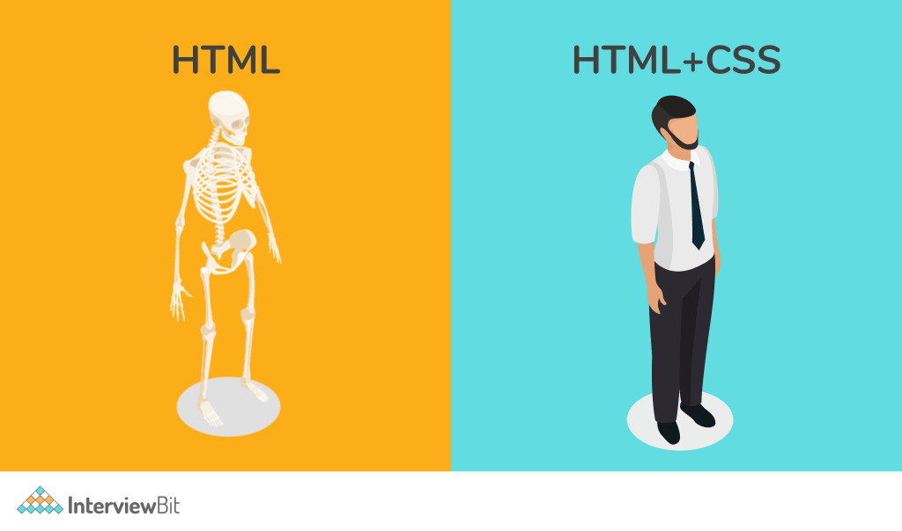
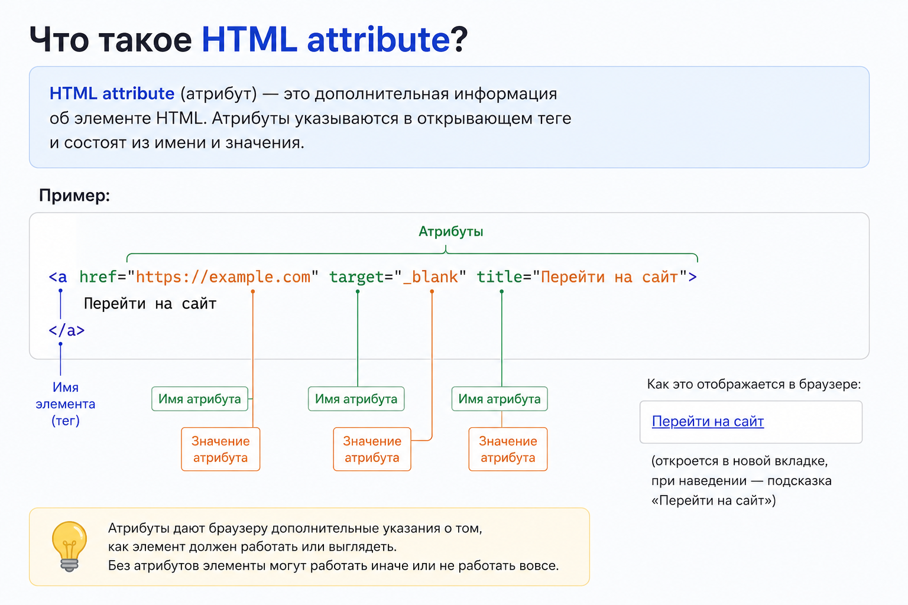
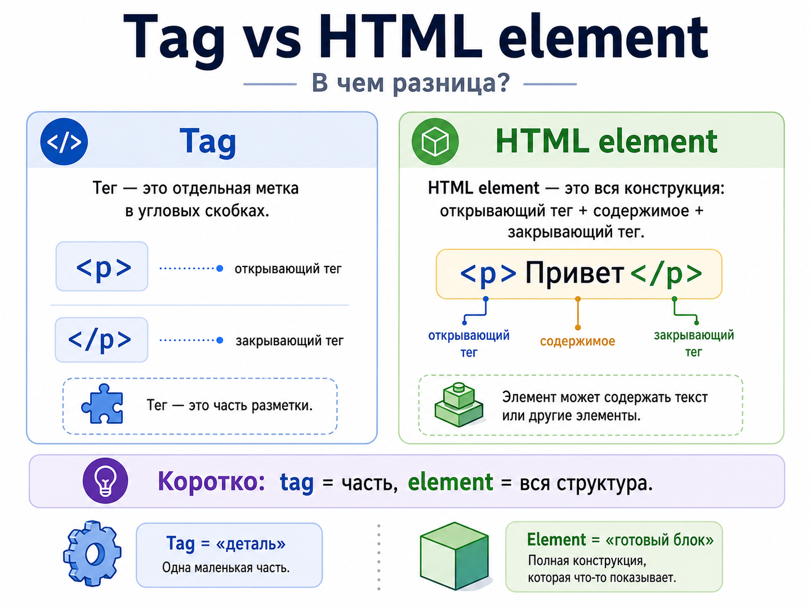

## HTML

### HTML

#### Junior

<details>
<summary>Что такое HTML и какую задачу он решает?</summary><br>
<table><tr><td>

HTML описывает структуру и смысл документа: заголовки, текст, навигацию, формы, ссылки и изображения. Браузер разбирает
разметку и строит DOM, который используют CSS, JavaScript, поисковые роботы и ассистивные технологии (assistive
technologies).

```html
<button>Buy</button>
```



</td></tr></table>

</details>

<details>
<summary>Что такое HTML attribute?</summary><br>
<table><tr><td>



Attribute задает дополнительную информацию или поведение element: `href`, `type`, `disabled`, `lang`. Global attributes
вроде `id`, `class`, `hidden` и `data-*` доступны большинству элементов, а часть attributes имеет смысл только для
определенных tags.

</td></tr></table>

</details>

<details>
<summary>Что такое semantic HTML?</summary><br>
<table><tr><td>

Semantic HTML использует элементы по их назначению: `nav` для навигации, `main` для основного контента, `button` для
действия. Это делает структуру понятнее браузеру, разработчикам, поисковым системам и assistive technologies.

В командных guidelines semantic HTML должен быть отдельным правилом, потому что в Angular templates легко заменить
структуру набором компонентов и директив. Хороший кандидат объяснит, что компоненты не отменяют базовые HTML semantics:
landmarks, headings, form controls и интерактивные элементы все равно должны оставаться корректными.

</td></tr></table>

</details>

<details>
<summary>Что такое document outline?</summary><br>
<table><tr><td>

Это логическая структура документа, прежде всего иерархия заголовков и landmarks. На практике нужно последовательно
использовать `h1`–`h6`, не полагаясь на давно предложенный, но не реализованный браузерами outline algorithm для
sectioning elements.

</td></tr></table>

</details>

<details>
<summary>Что такое <code>doctype</code> и зачем он нужен?</summary><br>
<table><tr><td>

`<!doctype html>` сообщает браузеру, что документ следует обрабатывать в standards mode. Без корректного doctype браузер
может включить quirks mode с устаревшими правилами layout и совместимости.

</td></tr></table>

</details>

<details>
<summary>Что такое custom elements?</summary><br>
<table><tr><td>

Custom Elements API позволяет регистрировать собственные HTML-элементы с именем через дефис и lifecycle callbacks. Это
часть Web Components; Shadow DOM и templates являются отдельными API и не включаются автоматически.

</td></tr></table>

</details>

#### Middle

<details>
<summary>Чем tag отличается от HTML element?</summary><br>
<table><tr><td>



Tag — синтаксическая часть разметки, например `<p>` или `</p>`. Element — целый узел: открывающий tag, attributes,
content и закрывающий tag. Void elements вроде `` не имеют closing tag и содержимого.

</td></tr></table>

</details>

<details>
<summary>Чем block element отличается от inline element?</summary><br>
<table><tr><td>

Исторически block elements начинали новую строку, а inline elements участвовали в строке текста. В современном CSS
реальное поведение задает `display`, поэтому семантическую категорию HTML-элемента нельзя использовать как замену знанию
layout.

</td></tr></table>

</details>

<details>
<summary>Зачем команде договариваться об HTML principles?</summary><br>
<table><tr><td>

HTML principles фиксируют, как команда пишет разметку: использует семантические элементы, поддерживает accessibility, не
заменяет `button` и `a` на кликабельные `div`, сохраняет правильную структуру headings и forms. Это снижает споры в
review и помогает screen readers, SEO, автотестам и долгой поддержке интерфейса.

</td></tr></table>

</details>

<details>
<summary>Чем <code>section</code>, <code>article</code>, <code>main</code>, <code>aside</code> и <code>nav</code> отличаются друг от друга?</summary><br>
<table><tr><td>

`main` содержит основное уникальное содержимое страницы, `nav` — крупный блок навигации, `article` — самостоятельный
материал, пригодный для отдельного распространения, `section` — тематический раздел обычно с заголовком, `aside` —
связанный, но второстепенный контент.

</td></tr></table>

</details>

<details>
<summary>Когда использовать <code>button</code>, а когда <code>a</code>?</summary><br>
<table><tr><td>

`button` выполняет действие: отправляет форму, открывает dialog, меняет состояние. `a` с `href` выполняет навигацию к
URL. Правильный элемент сразу дает ожидаемые keyboard behavior, semantics и browser features вроде открытия ссылки в
новой вкладке.

</td></tr></table>

</details>

<details>
<summary>Когда команда может использовать HTML preprocessor или template engine?</summary><br>
<table><tr><td>

HTML preprocessor или template engine полезны, когда разметка генерируется сервером, CMS, static site generator или
design system tooling. В Angular основным слоем обычно остаются Angular templates, но frontend-разработчик должен
понимать, откуда приходит HTML, какие fragments может вставлять backend и какие ограничения это создает для структуры,
styles и hydration.

</td></tr></table>

</details>

<details>
<summary>Как backend или CMS может влиять на frontend markup?</summary><br>
<table><tr><td>

Backend или CMS могут добавлять wrappers, ids, classes, служебные attributes и готовые HTML-фрагменты. Эти соглашения
нужно учитывать, чтобы не сломать CSS, accessibility, analytics и автотесты. Хороший ответ включает мысль, что такие
контракты лучше документировать, а не выяснять по случайным DOM-структурам в production.

</td></tr></table>

</details>

<details>
<summary>Как договориться о комментариях в HTML?</summary><br>
<table><tr><td>

HTML-комментарии стоит оставлять только для неочевидной структуры, интеграционного ограничения или временного
workaround. Они не должны пересказывать obvious markup. В Angular чаще лучше помогают понятные имена компонентов, inputs
и template blocks, а большой комментарий в template может быть сигналом, что код стоит упростить.

</td></tr></table>

</details>

<details>
<summary>Что делает атрибут <code>lang</code>?</summary><br>
<table><tr><td>

`lang` задает язык документа или фрагмента. Он помогает screen reader выбрать произношение, браузеру — проверку
орфографии и переносы, а поисковым системам — интерпретировать содержимое.

</td></tr></table>

</details>

<details>
<summary>Для чего нужны <code>data-*</code> attributes?</summary><br>
<table><tr><td>

Они хранят небольшие пользовательские данные прямо на element и доступны через `dataset`. Их используют для связи
разметки с поведением или тестами, но не как замену application state и не для секретных данных.

</td></tr></table>

</details>

<details>
<summary>Из каких частей состоит HTML5 как open web platform?</summary><br>
<table><tr><td>

HTML5 в широком смысле часто называют набором Web Platform API: semantic HTML, forms, media, canvas, SVG, storage,
offline capabilities, history, drag and drop и messaging. На интервью важно не смешивать сам язык разметки с браузерными
API вокруг него. Для Angular-разработчика это база, на которую опираются компоненты, forms, routing и интеграции с
browser APIs.

</td></tr></table>

</details>

<details>
<summary>Чем cookie отличается от <code>sessionStorage</code> и <code>localStorage</code>?</summary><br>
<table><tr><td>

Cookie может автоматически отправляться с HTTP-запросами и иметь флаги `HttpOnly`, `Secure`, `SameSite`. `localStorage`
и `sessionStorage` доступны JavaScript, привязаны к origin и не отправляются автоматически; `sessionStorage` живет в
рамках вкладки, `localStorage` сохраняется дольше. Секретные tokens опасно хранить в Web Storage из-за XSS.

</td></tr></table>

</details>

<details>
<summary>Чем <code>script</code>, <code>script async</code> и <code>script defer</code> отличаются?</summary><br>
<table><tr><td>

Обычный `script` блокирует HTML parsing до загрузки и выполнения. `async` загружается параллельно и выполняется сразу
после загрузки, поэтому порядок между async scripts не гарантирован. `defer` загружается параллельно, выполняется после
parsing в порядке объявления и обычно лучше подходит для application bundle.

</td></tr></table>

</details>

#### Middle+ or Senior

<details>
<summary>Почему clickable <code>div</code> — плохая практика?</summary><br>
<table><tr><td>

`div` не получает focus, keyboard activation, role и accessible name интерактивного элемента автоматически. Их ручная
имитация сложна и хрупка. Для действий следует использовать `button`, для переходов — `a`.

</td></tr></table>

</details>

### HTML parsing, compatibility и resources

#### Middle+ or Senior

<details>
<summary>Что происходит после получения HTML-документа?</summary><br>
<table><tr><td>

Браузер начинает streaming parse HTML еще до полной загрузки документа. Он строит DOM, заранее обнаруживает ресурсы
через preload scanner, загружает CSS, JavaScript, изображения, fonts и другие зависимости.

Для первого render нужны DOM, CSSOM и render tree. Затем browser выполняет layout, paint и compositing. JavaScript,
stylesheets, fonts и большие изображения могут задержать отдельные этапы, поэтому производительность оценивают по
реальному Critical Rendering Path.

</td></tr></table>

</details>

<details>
<summary>Что такое progressive enhancement?</summary><br>
<table><tr><td>

Progressive enhancement начинает с базового доступного HTML и постепенно добавляет CSS, JavaScript и продвинутые browser
features. Если часть улучшений недоступна, основной content и ключевые действия остаются рабочими. Для Angular это
особенно заметно в SSR/prerender сценариях: пользователь не должен видеть пустую страницу до загрузки bundle.

</td></tr></table>

</details>

<details>
<summary>Чем progressive enhancement отличается от graceful degradation?</summary><br>
<table><tr><td>

Progressive enhancement проектирует опыт от базового слоя к улучшениям. Graceful degradation обычно начинается с
полнофункционального варианта и пытается сохранить приемлемую работу при отсутствии части возможностей. Первый подход
лучше помогает accessibility, слабым устройствам и нестабильной сети, второй часто встречается при поддержке старых
браузеров.

</td></tr></table>

</details>

<details>
<summary>Чем browser support отличается от browser optimization?</summary><br>
<table><tr><td>

Browser support означает, что пользователь может выполнить основной сценарий в браузере или на устройстве. Browser
optimization означает, что под важные браузеры, устройства и сети интерфейс дополнительно улучшается. Не всегда нужно
давать всем одинаковый experience, но базовый сценарий не должен ломаться без явной продуктовой причины.

</td></tr></table>

</details>

<details>
<summary>Как определить, какие браузеры поддерживать?</summary><br>
<table><tr><td>

Browser support должен опираться на аналитику пользователей, требования бизнеса, корпоративную среду, законодательные
ограничения и стоимость поддержки. Решение нельзя принимать только по личным предпочтениям разработчиков. Его стоит
записать в guidelines и регулярно пересматривать.

</td></tr></table>

</details>

<details>
<summary>Что такое graded browser support?</summary><br>
<table><tr><td>

Graded browser support делит браузеры или устройства на уровни. Например, в одних браузерах гарантируется полный
experience, в других — базовая функциональность, а для устаревших окружений — readable content или explicit fallback.
Это помогает управлять стоимостью поддержки и ожиданиями бизнеса.

</td></tr></table>

</details>

<details>
<summary>Когда компоненту нужна отдельная browser support policy?</summary><br>
<table><tr><td>

Отдельная policy нужна, если компонент использует API с разной поддержкой: camera, clipboard, drag and drop, сложную
графику, heavy animations, WebGL или нестандартные browser features. Продукт может поддерживать базовый сценарий шире, а
конкретный advanced component — уже, если fallback честно описан.

</td></tr></table>

</details>

<details>
<summary>Почему HTML-парсер не падает на невалидной разметке?</summary><br>
<table><tr><td>

HTML parsing designed to be forgiving: браузеры десятилетиями должны были показывать страницы с ошибками разметки.
Спецификация описывает tokenization, tree construction и error recovery, поэтому parser исправляет многие случаи сам.

Например, браузер может автоматически закрыть тег, вставить пропущенный `<tbody>` или перестроить некорректную
вложенность. Поэтому DOM может отличаться от исходного HTML source.

</td></tr></table>

</details>

<details>
<summary>Чем DOM отличается от HTML source?</summary><br>
<table><tr><td>

HTML source — это текст, который пришел от сервера или был записан в документ. DOM — live object model, которую браузер
построил после parsing и error recovery, а затем может изменять JavaScript.

DOM может содержать автоматически добавленные узлы, нормализованную структуру, элементы из templates после runtime
rendering и изменения, которых не было в исходном HTML. На интервью важно не смешивать view-source и Elements panel.

</td></tr></table>

</details>

<details>
<summary>Что такое preload, prefetch и preconnect?</summary><br>
<table><tr><td>

`preload` приоритетно загружает ресурс текущей страницы, `prefetch` с низким приоритетом готовит вероятный следующий
переход, `preconnect` заранее устанавливает соединение с origin. Ошибочное применение расходует bandwidth и конкурирует
с критическими ресурсами.

</td></tr></table>

</details>

### Forms

#### Middle+ or Senior

<details>
<summary>Как работает HTML form?</summary><br>
<table><tr><td>

`form` объединяет controls и при submit формирует набор успешных пар `name=value`. Браузер валидирует controls, кодирует
данные и отправляет их на `action` выбранным `method`, если JavaScript не перехватил событие.

</td></tr></table>

</details>

<details>
<summary>Что делают <code>action</code> и <code>method</code> у формы?</summary><br>
<table><tr><td>

`action` задает URL отправки, `method` — HTTP-метод `get` или `post`. При `GET` данные попадают в query string, при
`POST` — в request body. Для других HTTP-методов обычно используют JavaScript или backend method override.

</td></tr></table>

</details>

<details>
<summary>Чем GET form отличается от POST form?</summary><br>
<table><tr><td>

GET подходит для безопасного поиска и фильтров: URL можно сохранить и повторить. POST используют для операций с побочным
эффектом и больших или чувствительных данных, но HTTPS все равно обязателен. Выбор метода не является
authorization-механизмом.

</td></tr></table>

</details>

<details>
<summary>Почему специализированные типы <code>input</code> полезнее <code>text</code>?</summary><br>
<table><tr><td>

Типы `email`, `number`, `date`, `url`, `search`, `tel`, `checkbox` и другие дают подходящую семантику, native
validation, мобильную клавиатуру и browser UI. Поддержка и локализация отдельных типов различаются, поэтому server
validation все равно нужна.

</td></tr></table>

</details>

<details>
<summary>Что такое <code>label</code> и как связать его с control?</summary><br>
<table><tr><td>

`label` дает полю доступное имя и увеличивает clickable area. Его связывают атрибутом `for`, равным `id` control, или
вкладывают control внутрь label.

```html
<label for="email">Email</label>
<input
  id="email"
  name="email"
  type="email"
/>
```

</td></tr></table>

</details>

<details>
<summary>Почему <code>placeholder</code> не должен заменять <code>label</code>?</summary><br>
<table><tr><td>

Placeholder исчезает при вводе, часто имеет низкий contrast и не является надежной подписью для assistive technologies.
Он может показывать пример формата, но постоянное понятное имя поля должен задавать label.

</td></tr></table>

</details>

<details>
<summary>Для чего нужен <code>name</code> у form control?</summary><br>
<table><tr><td>

`name` определяет ключ при native form submission и объединяет radio buttons в одну группу. Control без `name` обычно не
входит в отправляемый набор данных.

</td></tr></table>

</details>

<details>
<summary>Что такое native validation?</summary><br>
<table><tr><td>

Браузер проверяет constraints вроде `required`, `min`, `max`, `minlength`, `maxlength`, `pattern` и соответствие типу
перед submit. Это улучшает UX, но не заменяет backend validation, потому что клиентскую проверку можно обойти.

</td></tr></table>

</details>

<details>
<summary>Для чего нужен <code>autocomplete</code>?</summary><br>
<table><tr><td>

`autocomplete` подсказывает браузеру назначение поля, например `name`, `email`, `current-password` или `one-time-code`.
Корректные tokens ускоряют заполнение и помогают пользователям с когнитивными и моторными ограничениями.

</td></tr></table>

</details>

<details>
<summary>Как сделать accessible error message для поля?</summary><br>
<table><tr><td>

Сообщение должно быть конкретным, видимым и связанным с полем через `aria-describedby`; невалидность можно обозначить
`aria-invalid="true"`. После submit focus переводят осмысленно, а динамическую сводку ошибок при необходимости объявляют
live region.

</td></tr></table>

</details>

<details>
<summary>Почему disabled field не отправляется вместе с формой?</summary><br>
<table><tr><td>

Disabled control исключается из focus order, validation и набора успешных controls при submit. Если значение должно
отправляться, используют другой способ моделирования; скрытое поле нельзя считать защитой от подмены данных.

</td></tr></table>

</details>

<details>
<summary>Чем <code>disabled</code> отличается от <code>readonly</code>?</summary><br>
<table><tr><td>

`disabled` control не фокусируется и не отправляется. `readonly` поддерживается только частью controls, остается
focusable и отправляет значение, но пользователь не может его изменить обычным вводом.

</td></tr></table>

</details>

<details>
<summary>Для чего нужны <code>fieldset</code> и <code>legend</code>?</summary><br>
<table><tr><td>

`fieldset` семантически группирует связанные controls, а `legend` дает группе доступное название. Это особенно важно для
radio buttons и checkbox groups, где отдельные labels не объясняют общий вопрос.

</td></tr></table>

</details>

<details>
<summary>Как группировать radio buttons?</summary><br>
<table><tr><td>

Radio buttons одной группы получают одинаковый `name`, уникальные `id` и собственные labels. Группу помещают в
`fieldset` с `legend`, чтобы ее назначение было понятно визуально и screen reader.

</td></tr></table>

</details>

### Accessibility

#### Middle+ or Senior

<details>
<summary>Что такое accessibility и WCAG?</summary><br>
<table><tr><td>

Accessibility, или a11y, — проектирование интерфейса так, чтобы им могли пользоваться люди с разными возможностями и
устройствами. WCAG — рекомендации W3C, сгруппированные по принципам perceivable, operable, understandable и robust, с
проверяемыми критериями уровней A, AA и AAA.

</td></tr></table>

</details>

<details>
<summary>Что такое keyboard navigation и visible focus?</summary><br>
<table><tr><td>

Все действия должны быть доступны с клавиатуры в логичном порядке. Текущий focus обязан быть заметен; нельзя убирать
outline без равноценной замены. Native controls уже поддерживают Tab, Enter, Space и ожидаемые паттерны.

</td></tr></table>

</details>

<details>
<summary>Что такое focus management и focus trap?</summary><br>
<table><tr><td>

Focus management переводит focus после значимого UI-события и возвращает его в понятное место. Modal dialog ограничивает
Tab внутри себя, устанавливает начальный focus и после закрытия возвращает его trigger. Focus trap не применяют к
немодальным областям без необходимости.

</td></tr></table>

</details>

<details>
<summary>Что такое screen reader?</summary><br>
<table><tr><td>

Screen reader озвучивает accessibility tree и позволяет перемещаться по headings, landmarks, controls и другим
семантическим узлам. Проверка только DOM или визуального вида не гарантирует корректный опыт screen reader.

</td></tr></table>

</details>

<details>
<summary>Что такое ARIA и когда ее использовать?</summary><br>
<table><tr><td>

ARIA добавляет roles, states и relationships в accessibility tree, но не создает keyboard behavior и не меняет семантику
для обычного UI автоматически. Сначала выбирают native HTML; ARIA используют, когда нужную семантику нельзя выразить
подходящим элементом.

</td></tr></table>

</details>

<details>
<summary>Как ARIA и screen reader связаны с accessibility?</summary><br>
<table><tr><td>

Screen reader читает accessibility tree, который строится из HTML-семантики, текста, attributes и ARIA. ARIA может
добавить role, state или связь между элементами, но не добавляет поведение клавиатуры и не исправляет неверный элемент.
Поэтому сначала выбирают native HTML, а ARIA используют для сложных widgets и динамических состояний.

</td></tr></table>

</details>

<details>
<summary>Как сделать страницу доступнее без JavaScript?</summary><br>
<table><tr><td>

Использовать semantic landmarks, правильную иерархию заголовков, `label`, `fieldset`, `legend`, понятные ссылки,
доступные изображения и native form validation. Контент и основные действия должны быть доступны как HTML, а JavaScript
добавляет улучшения. Такой подход помогает progressive enhancement и снижает риск пустого интерфейса при ошибке bundle.

</td></tr></table>

</details>

<details>
<summary>Зачем команде accessibility checklist?</summary><br>
<table><tr><td>

Accessibility checklist помогает не забывать базовые требования: semantic HTML, keyboard navigation, focus states,
labels, contrast, alt text и корректные ARIA attributes. В большой команде это превращает accessibility из личной памяти
отдельного разработчика в повторяемую часть review и testing workflow.

</td></tr></table>

</details>

<details>
<summary>Какие accessibility tools стоит использовать во frontend workflow?</summary><br>
<table><tr><td>

Полезны axe, Lighthouse, browser DevTools, Angular ESLint template rules и component tests для важных состояний. Но
инструменты находят только часть проблем, поэтому их дополняют ручной проверкой keyboard flow, focus order и screen
reader поведения в ключевых сценариях.

</td></tr></table>

</details>

<details>
<summary>Почему accessibility нельзя полностью проверить автоматическими тестами?</summary><br>
<table><tr><td>

Автотесты могут найти отсутствие label, часть ошибок ARIA, слабый contrast и очевидные нарушения semantics. Но они не
понимают смысл текста, удобство сценария, ожидаемый порядок focus и реальное восприятие screen reader. Поэтому хороший
workflow сочетает automated checks, ручную проверку и ревью компонентов design system.

</td></tr></table>

</details>

<details>
<summary>Что такое accessible name и как кнопка его получает?</summary><br>
<table><tr><td>

Accessible name — имя элемента в accessibility tree. Кнопка обычно получает его из видимого текста, затем могут
учитываться `aria-labelledby` или `aria-label`. Видимая подпись предпочтительнее скрытого имени, когда она уместна.

</td></tr></table>

</details>

<details>
<summary>Чем <code>aria-label</code>, <code>aria-labelledby</code> и <code>aria-describedby</code> отличаются?</summary><br>
<table><tr><td>

`aria-label` задает строку имени напрямую, `aria-labelledby` берет имя из текста других элементов, а `aria-describedby`
добавляет описание после имени. Они не взаимозаменяемы: label отвечает «что это», description — за дополнительную
инструкцию или ошибку.

</td></tr></table>

</details>

<details>
<summary>Для чего нужен <code>aria-hidden</code>?</summary><br>
<table><tr><td>

`aria-hidden="true"` скрывает element и его descendants от accessibility tree, не меняя визуальное отображение. Его
нельзя ставить на focusable element или его ancestor: keyboard focus окажется на узле, который screen reader не видит.

</td></tr></table>

</details>

<details>
<summary>Что такое live region и <code>role="alert"</code>?</summary><br>
<table><tr><td>

Live region сообщает assistive technologies о динамических изменениях без перемещения focus. `role="alert"` подходит для
срочных ошибок и обычно объявляется assertive; обычные статусы лучше сообщать через менее навязчивый `role="status"`.

</td></tr></table>

</details>

<details>
<summary>Как сделать доступное modal dialog?</summary><br>
<table><tr><td>

Нужны понятное имя, modal semantics, начальный focus, ограничение Tab внутри окна, закрытие Escape и возврат focus на
trigger. Native `<dialog>` решает часть поведения, но название, содержимое, trigger и тестирование остаются задачей
приложения.

</td></tr></table>

</details>

<details>
<summary>Как сделать доступные dropdown и tabs?</summary><br>
<table><tr><td>

Сначала выбирают правильный паттерн: disclosure, menu, listbox и combobox имеют разное поведение. Tabs используют
`tablist`, `tab`, `tabpanel`, arrow-key navigation и связи через `aria-controls`/`aria-labelledby`. Для сложных widgets
следуют WAI-ARIA Authoring Practices и тестируют клавиатурой и screen reader.

</td></tr></table>

</details>

<details>
<summary>Как сделать доступную icon button?</summary><br>
<table><tr><td>

Используют настоящий `button` с accessible name, например `aria-label="Закрыть"`; декоративную SVG внутри скрывают через
`aria-hidden="true"`. Нужны достаточный target size, visible focus и понятные hover/disabled states.

</td></tr></table>

</details>

<details>
<summary>Почему цвет не должен быть единственным способом передачи информации?</summary><br>
<table><tr><td>

Различие может быть незаметно пользователям с нарушением цветовосприятия или на плохом дисплее. Ошибку, статус или
выбранное состояние дублируют текстом, иконкой, формой или другим независимым признаком и обеспечивают достаточный
contrast.

</td></tr></table>

</details>

<details>
<summary>Для чего нужен атрибут lang?</summary><br>
<table><tr><td>

Атрибут `lang` задает язык документа или отдельного фрагмента текста.

```html
<html lang="ru"></html>
```

Он помогает:

- скринридерам выбрать правильное произношение;
- браузеру проверять орфографию и предлагать перевод;
- поисковым системам определить язык страницы;
- применять языковые правила переноса и типографики.

```html
<p>
  Я изучаю
  <span lang="en">frontend development</span>
  .
</p>
```

`lang` не меняет внешний вид напрямую, но помогает браузеру и assistive technologies правильно интерпретировать контент.

</td></tr></table>

</details>

<details>
<summary>Для чего нужны семантические HTML-теги?</summary><br>
<table><tr><td>

Семантические теги описывают назначение контента: `header`, `nav`, `main`, `article`, `button`.

Они улучшают accessibility, навигацию скринридеров, SEO и читаемость разметки. Семантика не заменяет корректную
структуру заголовков, подписи элементов форм и поддержку клавиатуры.

</td></tr></table>

</details>

### SEO и metadata

#### Junior

<details>
<summary>Зачем нужен <code>meta name="viewport"</code>?</summary><br>
<table><tr><td>

`<meta name="viewport" content="width=device-width, initial-scale=1">` сопоставляет layout viewport ширине устройства.
Без него мобильный браузер может отрендерить страницу в широком виртуальном viewport и уменьшить ее целиком.

</td></tr></table>

</details>

<details>
<summary>Что такое favicon?</summary><br>
<table><tr><td>

Favicon — набор иконок сайта для вкладок, bookmarks, history и устройств. Его подключают через `<link rel="icon">`, а
форматы и размеры выбирают с учетом целевых браузеров и manifest приложения.

</td></tr></table>

</details>

<details>
<summary>Что такое canonical URL?</summary><br>
<table><tr><td>

`<link rel="canonical" href="…">` указывает предпочтительный URL для страниц с одинаковым или очень похожим content. Это
сигнал поисковой системе против дублирования, а не redirect и не механизм безопасности.

</td></tr></table>

</details>

#### Middle

<details>
<summary>Для чего нужны <code>title</code> и meta description?</summary><br>
<table><tr><td>

`title` задает название документа во вкладке и часто заголовок поискового результата. Meta description кратко описывает
страницу и может использоваться как snippet. Они должны быть уникальными и соответствовать реальному содержимому.

</td></tr></table>

</details>

<details>
<summary>Какие HTML-теги важны для поисковых систем?</summary><br>
<table><tr><td>

Важны содержательные `title`, headings, links с понятным текстом, semantic landmarks, `img alt`, canonical и metadata.
Семантика помогает понять структуру, но не компенсирует слабый content, закрытую индексацию или плохую доступность.

</td></tr></table>

</details>

<details>
<summary>Какие SEO-практики важны для frontend-разработчика?</summary><br>
<table><tr><td>

Frontend-разработчик отвечает за содержательный HTML, корректные `title` и metadata, canonical URL, semantic headings,
понятные links, `alt` у значимых изображений, robots rules и скорость first render. Для SPA важно, чтобы crawler получил
контент через SSR, prerender или другой поддерживаемый rendering strategy. SEO не заменяет качество контента и не должно
ломать accessibility.

</td></tr></table>

</details>

<details>
<summary>Как правильно использовать заголовки <code>h1</code>–<code>h6</code>?</summary><br>
<table><tr><td>

Заголовки создают иерархию, а не выбираются ради размера шрифта. Обычно у страницы один основной `h1`, затем уровни идут
последовательно по структуре. Несколько `h1` технически допустимы, но один главный заголовок обычно понятнее
пользователям и инструментам.

</td></tr></table>

</details>

#### Middle+ or Senior

<details>
<summary>Что такое Open Graph?</summary><br>
<table><tr><td>

Open Graph metadata задает title, description, image и URL для preview при публикации ссылки в социальных сетях и
мессенджерах. Это не замена обычным HTML metadata; изображения должны иметь доступный URL и подходящие размеры.

</td></tr></table>

</details>

<details>
<summary>Как SSR влияет на SEO?</summary><br>
<table><tr><td>

SSR или prerender отдает содержательный HTML раньше JavaScript, упрощая индексацию и previews. Современные crawlers
могут выполнять JavaScript, но это требует времени и ресурсов; SPA без server-rendered content также хуже работает у
ботов без полного rendering support.

</td></tr></table>

</details>

### SVG и media

#### Middle+ or Senior

<details>
<summary>Чем JPEG, PNG, WebP, AVIF и SVG отличаются друг от друга?</summary><br>
<table><tr><td>

JPEG подходит для фотографий без прозрачности, PNG — для lossless-графики и прозрачности, WebP и AVIF дают более
современное сжатие, SVG — векторную графику. Формат выбирают по типу изображения, качеству, размеру, transparency,
animation и browser support.

</td></tr></table>

</details>

<details>
<summary>Когда использовать SVG, а когда raster image?</summary><br>
<table><tr><td>

SVG подходит для иконок, схем и простой графики, которая должна масштабироваться и стилизоваться. Для фотографий и
сложных текстур raster format обычно компактнее и быстрее. Очень сложный SVG тоже может быть тяжелым для rendering.

</td></tr></table>

</details>

<details>
<summary>Что такое responsive images и как работают <code>srcset</code>/<code>sizes</code>?</summary><br>
<table><tr><td>

`srcset` перечисляет image candidates по ширине или density, а `sizes` сообщает ожидаемый layout size. Браузер выбирает
ресурс с учетом viewport, DPR, доступной ширины и других факторов, не загружая все варианты.

На уровне командных guidelines стоит договориться, когда использовать `srcset`, `sizes`, `picture`, lazy loading и
отдельные форматы. Responsive images нужны не ради синтаксиса, а чтобы мобильный пользователь не скачивал тяжелую
desktop-картинку и не платил за это LCP, трафиком и battery usage.

</td></tr></table>

</details>

<details>
<summary>Что делает <code>loading="lazy"</code>?</summary><br>
<table><tr><td>

Атрибут откладывает загрузку изображения или iframe, пока ресурс не приблизится к viewport. Это экономит сеть, но его не
ставят на вероятный LCP image. `width` и `height` задают заранее, чтобы сохранить место и избежать CLS.

</td></tr></table>

</details>

<details>
<summary>Что такое <code>alt</code> и когда он должен быть пустым?</summary><br>
<table><tr><td>

`alt` передает текстовую альтернативу смыслового изображения. У декоративного изображения используют `alt=""`, чтобы
screen reader его пропустил. Alt описывает назначение изображения в контексте, а не обязательно все визуальные детали.

</td></tr></table>

</details>

<details>
<summary>Для чего нужен элемент <code>picture</code>?</summary><br>
<table><tr><td>

`picture` позволяет задавать `source` для разных media conditions, crops и formats, сохраняя fallback `img`. Его
используют для art direction или выбора формата; обычное изменение resolution часто достаточно решить через `srcset`.

</td></tr></table>

</details>

<details>
<summary>Что такое SVG?</summary><br>
<table><tr><td>

SVG — векторный формат изображения, который описывает картинку через XML-разметку: линии, пути, фигуры, градиенты и
текст. В отличие от PNG и JPEG, SVG масштабируется без потери качества: браузер пересчитывает геометрию, а не
растягивает пиксели.

</td></tr></table>

</details>

<details>
<summary>Почему SVG подходит для scalable icons?</summary><br>
<table><tr><td>

SVG-иконка остается четкой при разных размерах и плотностях экрана. Один файл можно использовать в размерах `16px`,
`24px`, `48px` и на Retina-дисплеях без отдельного набора изображений.

</td></tr></table>

</details>

<details>
<summary>Как сделать SVG-иконку масштабируемой?</summary><br>
<table><tr><td>

Нужно задать `viewBox` и управлять внешними `width` и `height` атрибутами или через CSS:

```html
<svg
  viewBox="0 0 24 24"
  width="24"
  height="24"
  aria-hidden="true"
>
  <path d="M12 2L2 22h20L12 2z" />
</svg>
```

```css
.icon {
  width: 32px;
  height: 32px;
}
```

`viewBox` сохраняет внутреннюю систему координат, поэтому браузер корректно пересчитывает геометрию под новый размер.

</td></tr></table>

</details>

<details>
<summary>Что такое <code>viewBox</code> в SVG?</summary><br>
<table><tr><td>

`viewBox` задает координатную область SVG. Например, `viewBox="0 0 24 24"` означает виртуальную область шириной и
высотой 24 единицы. По ней браузер масштабирует содержимое SVG под внешний размер.

</td></tr></table>

</details>

<details>
<summary>Чем <code>width</code>/<code>height</code> отличаются от <code>viewBox</code>?</summary><br>
<table><tr><td>

`width` и `height` задают внешний размер SVG на странице, а `viewBox` — внутреннюю координатную систему. При наличии
`viewBox` внешний размер можно менять через CSS, сохраняя пропорции изображения.

</td></tr></table>

</details>

<details>
<summary>Как менять цвет SVG-иконки через CSS?</summary><br>
<table><tr><td>

Значение `currentColor` позволяет иконке наследовать CSS-свойство `color` родителя:

```html
<button class="button">
  <svg
    viewBox="0 0 24 24"
    class="icon"
    aria-hidden="true"
  >
    <path
      fill="currentColor"
      d="M12 2L2 22h20L12 2z"
    />
  </svg>
  Отправить
</button>
```

```css
.button {
  color: #4f46e5;
}

.icon {
  width: 24px;
  height: 24px;
}
```

</td></tr></table>

</details>

<details>
<summary>Что лучше для иконок: inline SVG, SVG sprite или <code>img</code>?</summary><br>
<table><tr><td>

Inline SVG удобен для управления цветом, состояниями и доступностью через CSS. SVG sprite подходит для переиспользования
большого набора символов. `` проще и хорошо кешируется, но не позволяет странице напрямую менять
стили внутренних элементов SVG.

Команда должна заранее договориться, где живут иконки, кто отвечает за оптимизацию, как задаются имена и как
обрабатываются декоративные и смысловые icons. SVG обычно предпочтительнее icon font, потому что лучше контролирует
accessibility, цвет, размер и не зависит от font loading.

</td></tr></table>

</details>

<details>
<summary>Какие проблемы появляются при локализации frontend-приложения?</summary><br>
<table><tr><td>

Локализация влияет не только на перевод строк. Нужно учитывать длину текста, pluralization, даты, числа, валюты,
сортировку, переносы, шрифты, SEO, accessibility и направление LTR/RTL. Если компоненты не проверять на разных locale,
интерфейс может сломаться из-за длинных labels или другого порядка слов.

</td></tr></table>

</details>

<details>
<summary>Как сделать SVG-иконку доступной?</summary><br>
<table><tr><td>

Декоративную иконку нужно скрыть от accessibility tree:

```html
<svg
  aria-hidden="true"
  focusable="false"
></svg>
```

Если иконка передает смысл, ей нужен доступный текст, например видимая подпись рядом или имя изображения:

```html
<svg
  role="img"
  aria-label="Поиск"
></svg>
```

Для кнопки только с иконкой доступное имя обычно задают самой кнопке.

</td></tr></table>

</details>

<details>
<summary>Какие ошибки часто делают при работе с SVG-иконками?</summary><br>
<table><tr><td>

- Забывают `viewBox`.
- Жестко задают размеры и затрудняют масштабирование.
- Не используют `currentColor`, когда цвет должен наследоваться.
- Подключают тяжелые SVG без оптимизации.
- Не учитывают accessibility.
- Оставляют лишние metadata из Figma и других редакторов.

</td></tr></table>

</details>

### Accessibility и SEO

#### Middle

<details>
<summary>Как рассчитывается accessible name?</summary><br>
<table><tr><td>

Accessible name - имя элемента в accessibility tree. Его могут задавать видимый текст, `aria-labelledby`, `aria-label`,
`alt`, label элемента формы и другие источники по алгоритму браузера.

```html
<button aria-label="Закрыть">
  <svg aria-hidden="true"></svg>
</button>
```

Лучше предпочитать видимый текст или `aria-labelledby`, потому что они синхронизированы с интерфейсом. `aria-label`
полезен для icon-only controls, но его легко забыть обновить при переводе.

</td></tr></table>

</details>

<details>
<summary>Когда использовать <code>aria-live</code>?</summary><br>
<table><tr><td>

`aria-live` сообщает screen reader об изменениях, которые происходят без перемещения focus: ошибка сохранения, результат
поиска, завершение загрузки. Для обычного контента, который появляется после действия и получает focus, live region
часто не нужна.

```html
<p
  role="status"
  aria-live="polite"
>
  Данные сохранены
</p>
```

`polite` не перебивает текущую речь, `assertive` используют редко и только для срочных сообщений. Частая ошибка -
объявлять слишком много изменений и создавать шум.

</td></tr></table>

</details>

<details>
<summary>Что такое structured data и зачем нужен JSON-LD?</summary><br>
<table><tr><td>

Structured data описывает смысл страницы машинно-читаемым способом: article, product, breadcrumbs, FAQ, organization.
JSON-LD удобно добавлять отдельным script block, не смешивая schema-разметку с HTML-структурой.

```html
<script type="application/ld+json">
  {
    "@context": "https://schema.org",
    "@type": "Article",
    "headline": "Frontend interview questions"
  }
</script>
```

JSON-LD не гарантирует rich results. Данные должны соответствовать видимому контенту страницы, иначе поисковая система
может их игнорировать.

</td></tr></table>

</details>
