## TypeScript

### Frontend fundamentals

#### Middle

<details>
<summary>В чем отличие фреймворка от библиотеки (приведите примеры и отличия)?</summary><br>
<table><tr><td>

**Библиотека** решает отдельную задачу, а приложение само определяет архитектуру и момент вызова библиотеки. Примеры:
RxJS, Lodash, date-fns.

**Фреймворк** задает каркас приложения, жизненный цикл, правила организации кода и сам вызывает пользовательский код в
нужный момент. Это называют inversion of control. Примеры: Angular, NestJS.

Angular предоставляет не только рендеринг, но и DI, Router, формы, HTTP-клиент, компиляцию шаблонов, CLI и инструменты
тестирования. Поэтому Angular является платформой и фреймворком, а не просто UI-библиотекой.

</td></tr></table>

</details>

<details>
<summary>Какие популярные CSS, JS библиотеки вы знаете?</summary><br>
<table><tr><td>

Примеры, которые уместно назвать вместе с их назначением:

- UI и CSS: Angular Material, Taiga UI, Bootstrap, Tailwind CSS.
- Реактивность: RxJS.
- Работа с датами: date-fns, Luxon.
- Утилиты: Lodash.
- Графики: D3.js, Chart.js, ECharts.
- Тестирование: Vitest, Jest, Jasmine, Cypress, Playwright.
- Управление состоянием Angular: NgRx, NGXS.

На собеседовании важнее объяснить, какую проблему решает библиотека и почему она была выбрана, чем перечислить много
названий.

</td></tr></table>

</details>

### Принципы проектирования

#### Junior

<details>
<summary>Что такое SOLID?</summary><br>
<table><tr><td>

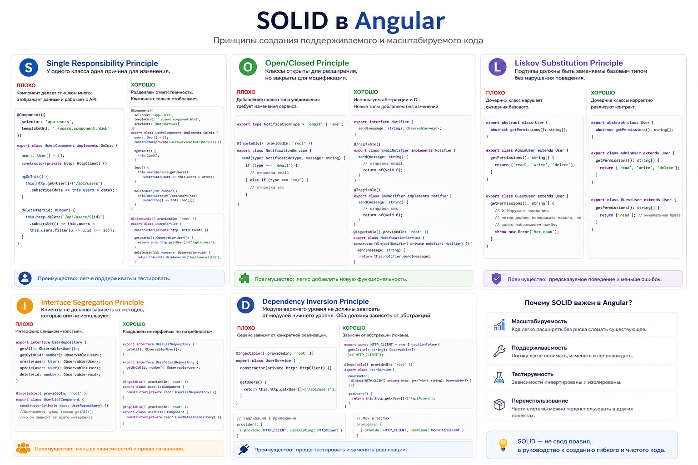

SOLID - пять принципов проектирования:

- **SRP**: у модуля должна быть одна основная причина для изменения.
- **OCP**: поведение лучше расширять через новые реализации, а не растущий `if`.
- **LSP**: реализация должна соблюдать контракт базового типа.
- **ISP**: лучше несколько узких интерфейсов, чем один универсальный.
- **DIP**: бизнес-логика должна зависеть от абстракций, а не от HTTP, storage или других деталей.

На практике SOLID помогает уменьшить связанность и упростить тестирование. Это ориентиры, а не требование создавать
отдельный класс для каждой функции.

</td></tr></table>

</details>

<details>
<summary>Что такое DRY?</summary><br>
<table><tr><td>


DRY означает, что одно бизнес-правило должно иметь один источник истины. Если порог бесплатной доставки используется в
нескольких местах, его лучше вынести в общую функцию или доменный сервис.

Одинаковые строки кода не всегда являются дублированием: два похожих сценария можно оставить раздельными, если они
меняются по разным причинам.

</td></tr></table>

</details>

<details>
<summary>Что такое KISS?</summary><br>
<table><tr><td>

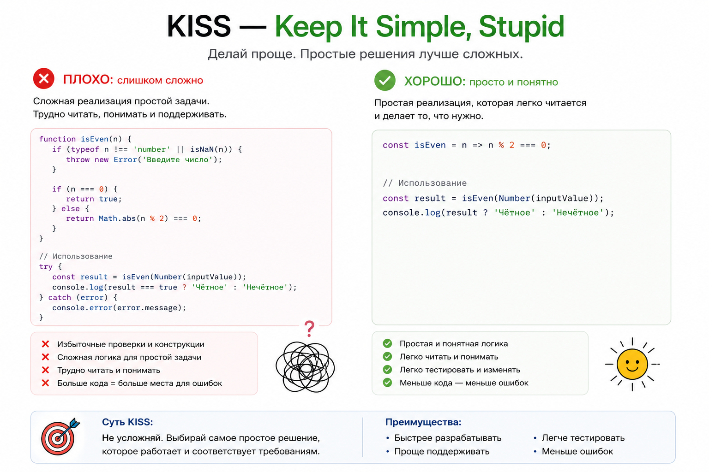

KISS предлагает выбирать самое простое решение, которое корректно выполняет текущие требования.

Если обычной функции или небольшого компонента достаточно, не нужны фабрики, глубокое наследование и универсальная
конфигурация. Простота не отменяет типизацию, обработку ошибок и тесты.

</td></tr></table>

</details>

<details>
<summary>Что такое YAGNI?</summary><br>
<table><tr><td>

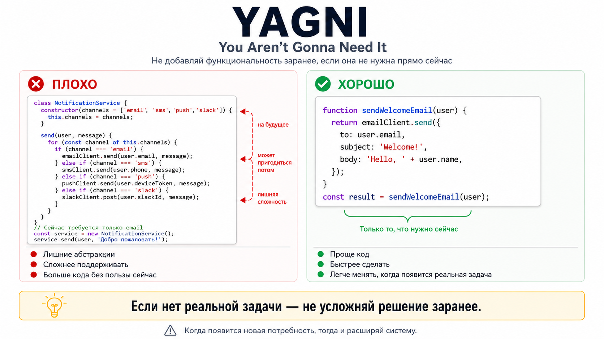

YAGNI означает: не реализовывать функциональность, пока для нее нет подтвержденной потребности.

Код «на будущее» увеличивает объем поддержки и часто основан на неверном прогнозе. При этом текущее решение должно
оставаться понятным и допускать безопасные изменения.

</td></tr></table>

</details>

<details>
<summary>Что такое cohesion и coupling?</summary><br>
<table><tr><td>

**Cohesion** показывает, насколько логика внутри модуля относится к одной задаче. **Coupling** показывает, насколько
сильно модуль зависит от деталей других модулей.

Обычно стремятся к высокой cohesion и низкому явному coupling: например, состояние корзины и расчет суммы можно хранить
вместе, а аналитику и HTTP вынести за ее границы.

</td></tr></table>

</details>

<details>
<summary>Что такое code smell и technical debt?</summary><br>
<table><tr><td>

Code smell - признак возможной проблемы дизайна: большой компонент, длинный список зависимостей, boolean-флаги с
противоречивыми состояниями или повторение бизнес-правил.

Technical debt - будущая стоимость сделанного упрощения. Он допустим как осознанный компромисс с ограниченным риском,
тестовой страховкой и планом пересмотра.

</td></tr></table>

</details>

<details>
<summary>Что такое рефакторинг?</summary><br>
<table><tr><td>

Рефакторинг улучшает внутреннюю структуру кода без изменения наблюдаемого поведения. Его выполняют небольшими шагами под
тестами.

Если небольшое бизнес-правило нельзя проверить без большого `TestBed`, его стоит отделить от I/O и Angular APIs,
например вынести в чистую функцию или узкий сервис.

</td></tr></table>

</details>

#### Middle

<details>
<summary>Как могут конфликтовать SOLID, DRY, KISS и YAGNI?</summary><br>
<table><tr><td>

Принципы могут подталкивать к разным решениям:

- DRY предлагает вынести повторение, а KISS может оставить два простых независимых фрагмента.
- OCP предлагает точку расширения, а YAGNI не позволяет проектировать ее без реального сценария.
- SRP помогает разделить обязанности, но чрезмерное дробление ухудшает навигацию.

Приоритет отдают текущим требованиям и стоимости изменений. Сначала пишут ясное рабочее решение, а абстракцию добавляют
после появления устойчивого повторения или вариативности.

</td></tr></table>

</details>

<details>
<summary>Как применять инженерные принципы в Angular?</summary><br>
<table><tr><td>

- Компонент отвечает за UI и события пользователя.
- Сервис или facade координирует сценарий.
- Чистая функция содержит вычисления и преобразования.
- DI и `InjectionToken` позволяют заменить инфраструктурную реализацию.
- Signals подходят для локального синхронного состояния, RxJS - для сложных асинхронных потоков.

```ts
export interface UserRepository {
  findById(id: string): Observable<User>;
}

export const USER_REPOSITORY = new InjectionToken<UserRepository>('USER_REPOSITORY');

@Injectable({providedIn: 'root'})
export class UserFacade {
  private readonly repository = inject(USER_REPOSITORY);

  load(id: string): Observable<User> {
    return this.repository.findById(id);
  }
}
```

`UserFacade` зависит от узкого контракта, а HTTP-реализацию можно заменить provider-ом или тестовым fake.

</td></tr></table>

</details>

<details>
<summary>Что лучше: композиция или наследование?</summary><br>
<table><tr><td>

Во frontend чаще выбирают композицию: компоненты, сервисы, директивы, content projection, host directives и DI можно
сочетать без глубокой иерархии классов.

Наследование уместно, когда существует устойчивое отношение «является» и подкласс полностью соблюдает контракт базового
типа.

</td></tr></table>

</details>

### Парадигмы и базовые CS-темы

#### Junior

<details>
<summary>Что такое функциональное программирование?</summary><br>
<table><tr><td>

Функциональное программирование строит вычисления вокруг функций и преобразований данных. Практические идеи:

- pure functions без скрытых side effects;
- immutable data;
- композиция небольших функций;
- декларативные операции `map`, `filter`, `reduce`;
- явное отделение вычислений от I/O.

Во frontend это упрощает тестирование и предсказуемость состояния. Полностью избегать мутаций не обязательно: важно
локализовать их на понятных границах.

</td></tr></table>

</details>

#### Middle

<details>
<summary>Назовите основные принципы ООП?</summary><br>
<table><tr><td>

- **Инкапсуляция** — объект скрывает внутреннее состояние и предоставляет контролируемый API.
- **Абстракция** — наружу выносится существенное поведение, детали реализации скрываются.
- **Наследование** — новый тип переиспользует и расширяет поведение базового типа.
- **Полиморфизм** — разные реализации используются через общий контракт.

ООП не требует применять наследование везде. В Angular чаще полезны композиция компонентов и сервисов, DI и небольшие
интерфейсы.

Пример сочетает четыре принципа:

```ts
interface NotificationChannel {
  send(message: string): void;
}

abstract class BaseNotificationChannel implements NotificationChannel {
  constructor(private readonly prefix: string) {}

  protected format(message: string): string {
    return `${this.prefix}: ${message}`;
  }

  abstract send(message: string): void;
}

class EmailChannel extends BaseNotificationChannel {
  send(message: string): void {
    sendEmail(this.format(message));
  }
}

class PushChannel extends BaseNotificationChannel {
  send(message: string): void {
    sendPush(this.format(message));
  }
}

function notify(channel: NotificationChannel, message: string): void {
  channel.send(message);
}
```

- `private prefix` демонстрирует инкапсуляцию.
- `NotificationChannel` и `BaseNotificationChannel` задают абстракцию.
- `EmailChannel` и `PushChannel` используют наследование.
- `notify()` работает полиморфно с любой реализацией контракта.

Отдельно часто спрашивают SOLID: пять принципов проектирования, которые помогают уменьшать связанность и делать код
расширяемым и тестируемым.

</td></tr></table>

</details>

### Диаграммы и моделирование

**Sequence diagram / диаграмма последовательности**

#### Junior

<details>
<summary>Что такое participant, lifeline, message и response?</summary><br>
<table><tr><td>

Participant - участник сценария, например Component, Service, Interceptor или Backend. Lifeline - вертикальная линия
жизни участника во времени. Message - вызов или событие между участниками. Response - ответ на вызов или результат
обработки.

</td></tr></table>

</details>

#### Middle

<details>
<summary>Как показать retry, timeout или fallback?</summary><br>
<table><tr><td>

Retry удобно показывать через `loop`, timeout - через отдельный error/timeout branch, fallback - как альтернативный путь
после неуспешного вызова. На диаграмме должно быть видно условие перехода и кто принимает решение о повторе или
fallback.

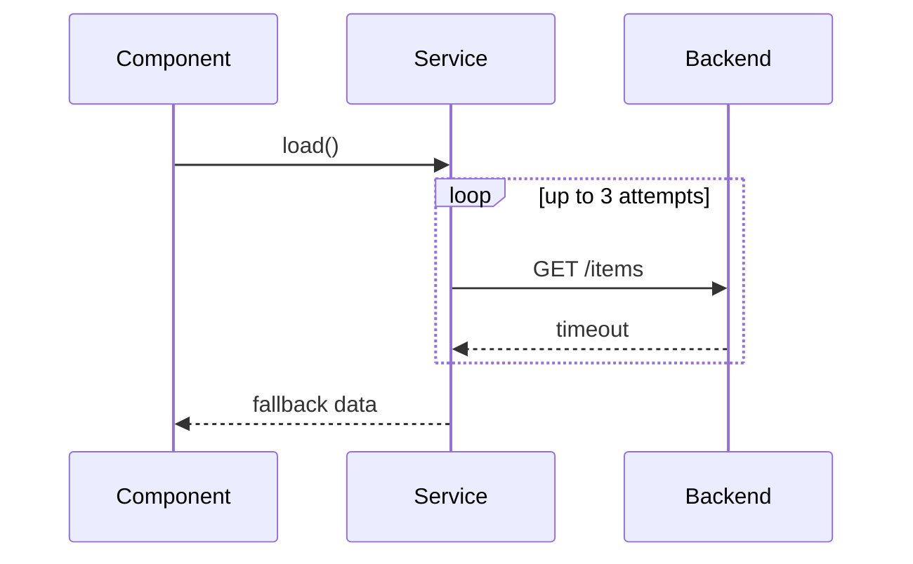

</td></tr></table>

</details>

#### Middle+ or Senior

<details>
<summary>Что такое sequence diagram и для чего она нужна?</summary><br>
<table><tr><td>

Sequence diagram показывает, как участники системы обмениваются сообщениями во времени. Она помогает разобрать порядок
вызовов, границы ответственности, async flows, ошибки и интеграции между frontend, backend и внешними сервисами.

</td></tr></table>

</details>

<details>
<summary>Чем sequence diagram отличается от flowchart?</summary><br>
<table><tr><td>

Sequence diagram фокусируется на взаимодействии участников и порядке сообщений между ними. Flowchart фокусируется на
ветвлениях, шагах алгоритма и принятии решений внутри процесса.

</td></tr></table>

</details>

<details>
<summary>Почему sequence diagram читается сверху вниз?</summary><br>
<table><tr><td>

Вертикальная ось показывает ход времени: верхние сообщения происходят раньше нижних. Поэтому порядок строк важен и
позволяет увидеть, что произошло до запроса, после ответа, при ошибке или повторной попытке.

</td></tr></table>

</details>

<details>
<summary>Как на sequence diagram показать синхронный вызов, асинхронное сообщение и ответ?</summary><br>
<table><tr><td>

Обычно синхронный вызов показывают сплошной стрелкой, асинхронное сообщение - отдельной нотацией инструмента, а ответ -
обратной пунктирной стрелкой. Важно не столько оформление стрелки, сколько явный порядок: кто вызывает, кого вызывает и
когда получает результат.

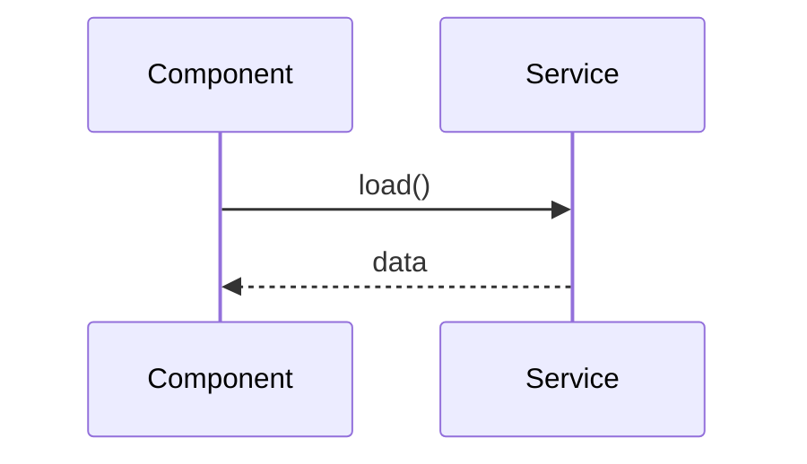

</td></tr></table>

</details>

<details>
<summary>Как показать альтернативные сценарии: success / error, cache hit / cache miss?</summary><br>
<table><tr><td>

Альтернативы показывают через блоки `alt` / `else`. В каждом блоке оставляют только сообщения, которые относятся к этому
варианту, чтобы success, error, cache hit и cache miss не смешивались в одну линию.

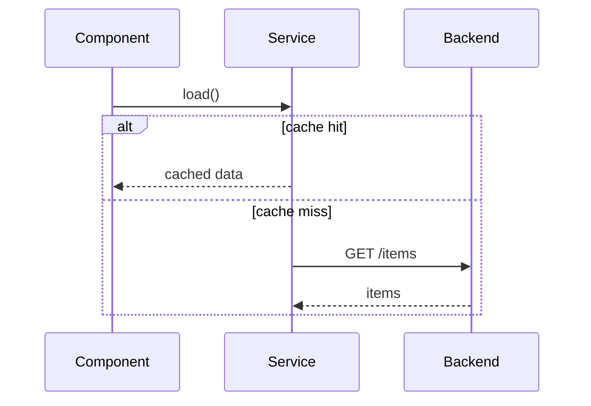

</td></tr></table>

</details>

<details>
<summary>Когда sequence diagram полезна frontend-разработчику?</summary><br>
<table><tr><td>

Она полезна при разборе авторизации, refresh token flow, загрузки данных, race conditions, optimistic updates,
interceptors, guards, WebSocket-сценариев и взаимодействия нескольких сервисов. Диаграмма быстро показывает, где живет
логика и какие ошибки нужно обработать.

</td></tr></table>

</details>

<details>
<summary>Какие признаки плохой или перегруженной sequence diagram?</summary><br>
<table><tr><td>

Слишком много участников, смешение нескольких независимых сценариев, отсутствие условий, неясные названия сообщений,
детали реализации вместо бизнес-событий и попытка показать всю систему на одной диаграмме. Хорошая диаграмма отвечает на
один конкретный вопрос.

</td></tr></table>

</details>

<details>
<summary>Нарисуйте sequence diagram для сценария refresh token в Angular.</summary><br>
<table><tr><td>

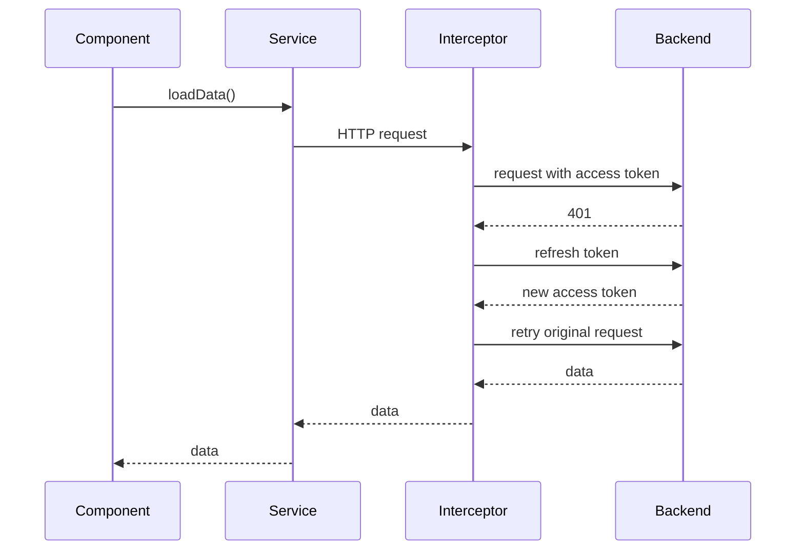

В ответе важно показать, что refresh выполняет interceptor, исходный запрос повторяется после получения нового access
token, а component получает результат как обычный ответ сервиса.

</td></tr></table>

</details>

**Flowchart / блок-схема**

#### Junior

<details>
<summary>Что такое flowchart и для чего она нужна?</summary><br>
<table><tr><td>

Flowchart, или блок-схема, показывает шаги процесса, условия и переходы между ними. Она помогает обсудить алгоритм,
валидацию, бизнес-правила или decision tree без привязки к конкретному коду.

</td></tr></table>

</details>

#### Middle

<details>
<summary>Какие базовые элементы flowchart вы знаете: start/end, process, decision, input/output?</summary><br>
<table><tr><td>

Start/end обозначает начало и завершение процесса. Process - действие или вычисление. Decision - условие с несколькими
ветками. Input/output - получение входных данных или вывод результата.

</td></tr></table>

</details>

<details>
<summary>Как на flowchart показать условие if/else?</summary><br>
<table><tr><td>

Условие показывают decision-блоком с двумя или несколькими исходящими ветками. Ветки подписывают значениями условия,
например `yes` / `no`, `valid` / `invalid`, `success` / `error`.

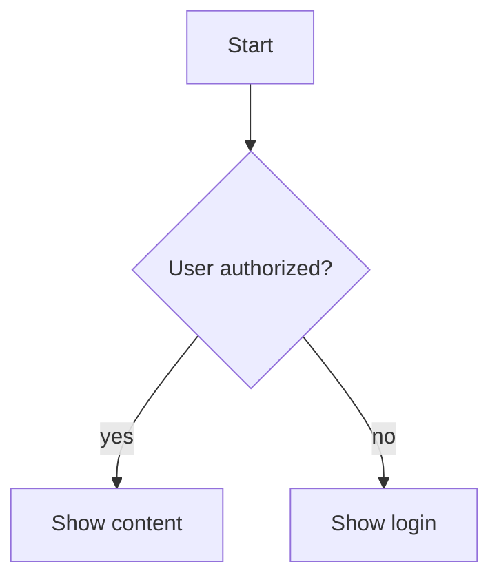

</td></tr></table>

</details>

<details>
<summary>Как на flowchart показать цикл?</summary><br>
<table><tr><td>

Цикл показывают обратной связью к предыдущему шагу или условию. Важно подписать условие продолжения и условие выхода,
иначе схема превращается в неясное повторение.

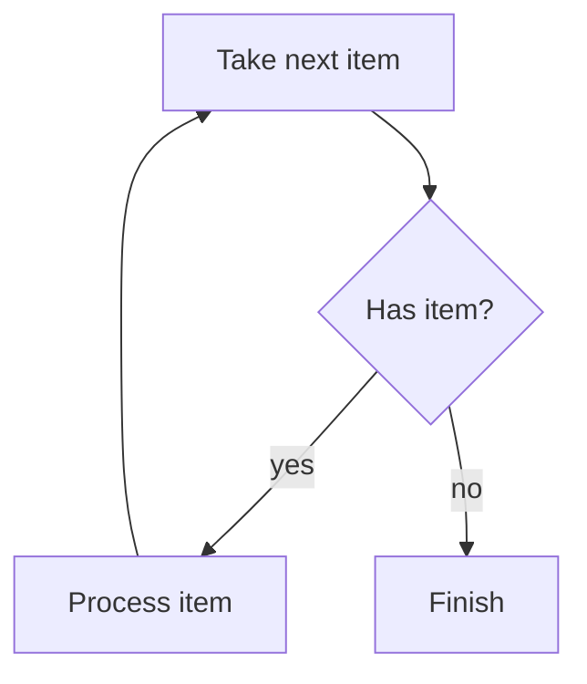

</td></tr></table>

</details>

<details>
<summary>Как flowchart помогает разобрать сложную бизнес-логику?</summary><br>
<table><tr><td>

Она делает явными входные данные, порядок проверок, причины отказа, крайние случаи и дублирующиеся условия. По такой
схеме проще договориться с аналитиком, backend и QA до написания кода.

</td></tr></table>

</details>

<details>
<summary>Какие проблемы появляются, если пытаться описать слишком большую систему одной flowchart?</summary><br>
<table><tr><td>

Схема становится нечитаемой: слишком много веток, пересечений, уровней детализации и скрытых правил. Лучше разделять ее
на несколько схем: общий happy path, ошибки, отдельные доменные процессы и редкие edge cases.

</td></tr></table>

</details>

<details>
<summary>Нарисуйте flowchart для логики показа кнопки "Купить".</summary><br>
<table><tr><td>

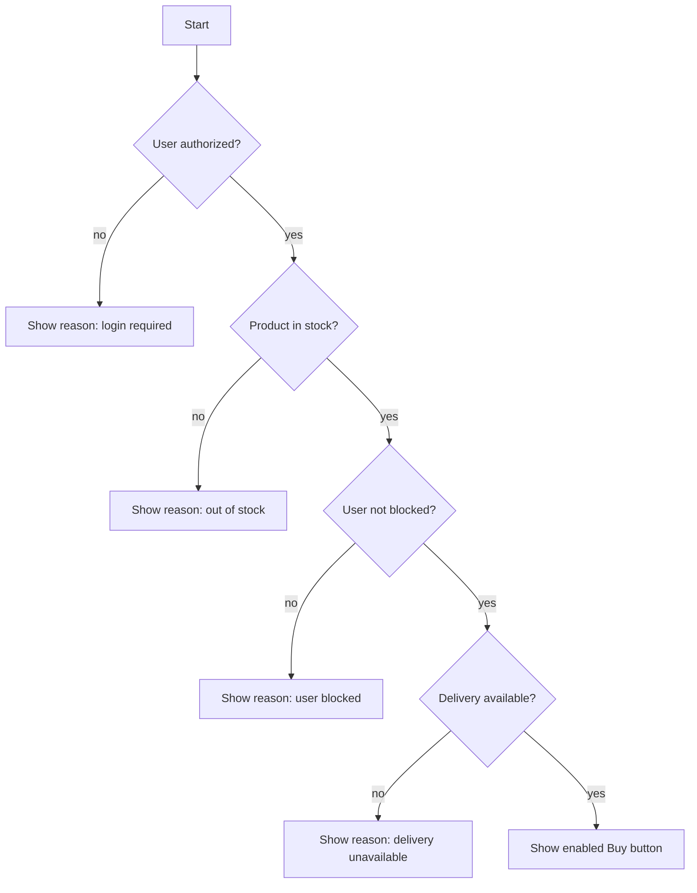

Хороший ответ показывает не только итог `enabled`, но и причину, которую нужно отобразить пользователю при каждом
неуспешном условии.

</td></tr></table>

</details>

#### Middle+ or Senior

<details>
<summary>Чем flowchart отличается от sequence diagram?</summary><br>
<table><tr><td>

Flowchart отвечает на вопрос "какие шаги и условия есть в процессе". Sequence diagram отвечает на вопрос "какие
участники обмениваются сообщениями и в каком порядке".

</td></tr></table>

</details>

<details>
<summary>Когда flowchart лучше подходит, чем sequence diagram?</summary><br>
<table><tr><td>

Flowchart лучше подходит для условий, алгоритмов, валидации формы, расчета статуса, показа UI-состояний и бизнес-правил,
где важнее decision logic, чем обмен сообщениями между несколькими участниками.

</td></tr></table>

</details>

**ER diagram / Entity Relationship Diagram**

#### Junior

<details>
<summary>Что такое attribute / field?</summary><br>
<table><tr><td>

Attribute или field - свойство сущности: `id`, `email`, `status`, `createdAt`, `price`. В ER diagram поля помогают
увидеть, какие данные обязательны, какие являются идентификаторами и какие участвуют в связях.

</td></tr></table>

</details>

<details>
<summary>Что такое primary key?</summary><br>
<table><tr><td>

Primary key - поле или набор полей, которые уникально идентифицируют запись. Для frontend это часто стабильный `id`,
который используют в URL, normalized state, списках, track expressions и API-запросах.

</td></tr></table>

</details>

<details>
<summary>Что такое foreign key?</summary><br>
<table><tr><td>

Foreign key - поле, которое ссылается на primary key другой сущности. Например, `booking.userId` связывает бронирование
с пользователем, а `session.movieId` связывает сеанс с фильмом.

</td></tr></table>

</details>

<details>
<summary>Что такое junction table / linking table?</summary><br>
<table><tr><td>

Junction table, или linking table, - таблица-связка для many-to-many. Например, `BookingSeat` может связывать Booking и
Seat, если в одном бронировании может быть несколько мест, а место участвует в разных бронированиях для разных сеансов.

</td></tr></table>

</details>

#### Middle

<details>
<summary>Чем entity отличается от table?</summary><br>
<table><tr><td>

Entity - сущность предметной области, например User или Booking. Table - конкретное хранение этой сущности в базе
данных. В простой системе они могут почти совпадать, но entity описывает смысл, а table - техническую реализацию.

</td></tr></table>

</details>

#### Middle+ or Senior

<details>
<summary>Что такое ER diagram и для чего она нужна?</summary><br>
<table><tr><td>

ER diagram показывает сущности предметной области, их поля и связи. Она помогает понять структуру данных, ограничения,
отношения между объектами и то, как эти данные могут приходить во frontend через API.

</td></tr></table>

</details>

<details>
<summary>Какие бывают связи между сущностями: one-to-one, one-to-many, many-to-many?</summary><br>
<table><tr><td>

One-to-one: одной записи соответствует одна другая запись. One-to-many: одна запись связана со многими, например Movie и
Sessions. Many-to-many: многие записи связаны со многими, например Users и Roles или Students и Courses.

</td></tr></table>

</details>

<details>
<summary>Как смоделировать many-to-many связь?</summary><br>
<table><tr><td>

Many-to-many обычно моделируют через отдельную связующую сущность. Она хранит ссылки на обе стороны связи и может иметь
собственные поля: дату создания, статус, порядок, роль или цену.

</td></tr></table>

</details>

<details>
<summary>Почему frontend-разработчику полезно понимать ER diagrams?</summary><br>
<table><tr><td>

Так проще понимать API, нормализовать данные, проектировать state, ловить неоднозначности в DTO и задавать backend
правильные вопросы. ER diagram помогает увидеть, какие данные являются справочниками, какие зависят от пользователя, а
какие являются результатом операции.

</td></tr></table>

</details>

<details>
<summary>Как ER diagram помогает понять API и структуру данных на frontend?</summary><br>
<table><tr><td>

Она показывает, какие объекты могут приходить вложенными, где нужны ids, какие связи надо дозагружать и какие поля
нельзя редактировать напрямую. Это влияет на типы DTO, формы, кеширование, optimistic updates и normalized stores.

</td></tr></table>

</details>

<details>
<summary>Чем ER diagram отличается от class diagram?</summary><br>
<table><tr><td>

ER diagram описывает данные и связи предметной области. Class diagram описывает классы, методы, наследование, интерфейсы
и объектную модель кода. Они могут пересекаться по названиям сущностей, но отвечают на разные вопросы.

</td></tr></table>

</details>

<details>
<summary>Нарисуйте ER diagram для простой системы бронирования билетов в кино.</summary><br>
<table><tr><td>

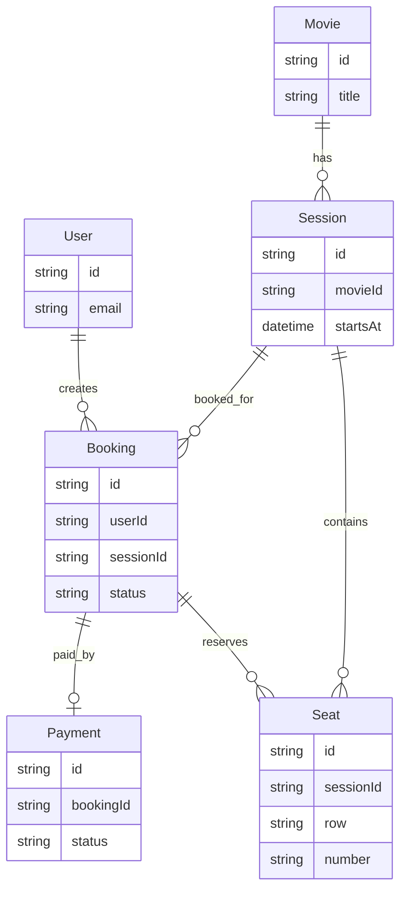

На собеседовании можно обсудить, нужна ли отдельная сущность `BookingSeat`, если одно бронирование содержит несколько
мест или если у места есть цена на момент покупки.

</td></tr></table>

</details>

**Инструменты**

#### Middle

<details>
<summary>Почему Mermaid удобно использовать в GitHub README?</summary><br>
<table><tr><td>

GitHub умеет рендерить Mermaid прямо в Markdown. Диаграмма хранится как текст рядом с документацией, ее легко читать в
diff, ревьюить, менять вместе с кодом и поддерживать без отдельных бинарных файлов.

</td></tr></table>

</details>

#### Middle+ or Senior

<details>
<summary>Какие инструменты можно использовать для описания диаграмм в документации: Mermaid, PlantUML, draw.io / diagrams.net?</summary><br>
<table><tr><td>

Mermaid и PlantUML описывают диаграммы текстом, поэтому хорошо подходят для version control и code review. draw.io /
diagrams.net удобен для визуального редактирования, особенно когда нужна свободная компоновка или схема для презентации.

</td></tr></table>

</details>

### Алгоритмы и структуры данных

#### Junior

<details>
<summary>Что такое структура данных и какие виды вы знаете (Стек, etc)?</summary><br>
<table><tr><td>

Структура данных — способ организовать данные и операции над ними.

- Массив: быстрый доступ по индексу, последовательное хранение.
- Связный список: удобные вставки и удаления при наличии ссылки на узел.
- Стек: LIFO, пример — call stack.
- Очередь: FIFO, пример — очередь задач.
- `Map`: пары ключ-значение с ключами любого типа.
- `Set`: множество уникальных значений.
- Дерево: иерархия, пример — DOM и дерево компонентов.
- Граф: вершины и связи, пример — зависимости модулей.
- Heap: структура для быстрого получения минимального или максимального элемента.

На собеседовании полезно сравнить сложность основных операций по времени и памяти, а не только дать определения.

</td></tr></table>

</details>

#### Middle

<details>
<summary>Чем Θ-нотация отличается от O-нотации?</summary><br>
<table><tr><td>

`O(f(n))` задает верхнюю границу роста, а `Θ(f(n))` - точную асимптотическую оценку сверху и снизу.

Например, полный проход по массиву всегда выполняет пропорциональное `n` число шагов: это `Θ(n)` и одновременно `O(n)`.
На frontend-собеседованиях чаще используют Big O, но важно понимать, что это оценка роста, а не точное время в
миллисекундах.

</td></tr></table>

</details>

<details>
<summary>Как оптимизировать перебор двумя циклами?</summary><br>
<table><tr><td>

Часто один набор заранее индексируют через `Map` или `Set`, заменяя повторный линейный поиск на lookup:

```ts
const usersById = new Map(users.map((user) => [user.id, user]));

const ordersWithUsers = orders.map((order) => ({
  ...order,
  user: usersById.get(order.userId),
}));
```

Вместо примерно `O(n * m)` получается `O(n + m)` по времени ценой дополнительной памяти.

</td></tr></table>

</details>

<details>
<summary>Чем линейный поиск отличается от бинарного?</summary><br>
<table><tr><td>

Линейный поиск проверяет элементы последовательно и работает за `O(n)`. Он подходит для небольшого или
неотсортированного списка.

Бинарный поиск делит область поиска пополам и работает за `O(log n)`, но требует отсортированных данных и доступа по
индексу. Предварительная сортировка стоит `O(n log n)`, поэтому она не всегда окупается для одного поиска.

</td></tr></table>

</details>

<details>
<summary>Какой алгоритм сортировки полезно знать?</summary><br>
<table><tr><td>

Merge sort делит массив пополам, сортирует части и сливает их. Временная сложность - `O(n log n)`, дополнительная
память - `O(n)`.

В прикладном frontend-коде обычно используют встроенный `toSorted(comparator)`. Важно уметь написать comparator и
понимать, что сортировка больших таблиц может потребовать memoization, worker или переноса на сервер.

</td></tr></table>

</details>

<details>
<summary>Как следить за чистотой кода?</summary><br>
<table><tr><td>

Помогают небольшие функции, точные имена, строгие типы, явные состояния, отсутствие скрытых side effects и регулярное
удаление мертвого кода.

ESLint, Prettier и тесты автоматизируют проверки, но не заменяют ясные границы модулей и ответственность разработчика.

</td></tr></table>

</details>

#### Middle+ or Senior

<details>
<summary>Что такое сложность алгоритмов?</summary><br>
<table><tr><td>

Big O показывает верхнюю асимптотическую границу роста времени или памяти при увеличении входных данных. Константы и
небольшие слагаемые обычно отбрасывают.

- `O(1)` - доступ к элементу `Map` в среднем;
- `O(log n)` - бинарный поиск в отсортированном массиве;
- `O(n)` - один проход по массиву;
- `O(n log n)` - типичная сортировка;
- `O(n²)` - вложенное сравнение всех элементов.

Один цикл по `n` элементам обычно имеет `O(n)`, два независимых последовательных цикла тоже `O(n)`, а два вложенных
цикла часто дают `O(n²)`.

</td></tr></table>

</details>

<details>
<summary>Как измерять сложность алгоритма?</summary><br>
<table><tr><td>

Определяют размер входа `n`, считают наиболее часто выполняемые операции и оставляют доминирующий член.

Помимо времени учитывают память, реальные размеры данных и стоимость операций. Профилирование дополняет асимптотическую
оценку: алгоритм с лучшим Big O не всегда быстрее на маленьком входе.

</td></tr></table>

</details>

<details>
<summary>Какова сложность доступа в основных структурах данных?</summary><br>
<table><tr><td>

- Массив: доступ по индексу `O(1)`, поиск по значению `O(n)`, вставка в середину `O(n)`.
- Связный список: доступ по позиции `O(n)`, вставка по известной ссылке `O(1)`.
- `Map` и `Set`: lookup, добавление и удаление в среднем `O(1)`.
- Стек и очередь: добавление и удаление с рабочего конца обычно `O(1)`.

В JavaScript для очереди частый `shift()` массива имеет `O(n)`. Для большой очереди лучше использовать индекс начала или
специализированную структуру.

</td></tr></table>

</details>

### Алгоритмы и структуры данных для frontend

#### Junior

<details>
<summary>Что такое дерево и где деревья встречаются в Angular-приложении?</summary><br>
<table><tr><td>

Дерево — иерархическая структура из узлов, где у узла может быть родитель и дочерние узлы. Во frontend деревья
встречаются постоянно: DOM tree, accessibility tree, component tree, Angular Router tree, DI tree, Reactive Forms tree,
AST в TypeScript/ESLint/Babel.

Обход дерева нужен для поиска узла, валидации вложенной формы, построения меню, анализа AST или сериализации состояния.
DFS удобно идет вглубь ветки, BFS обходит уровень за уровнем.

```ts
function collectInvalidControls(control: AbstractControl): AbstractControl[] {
  const invalidControls: AbstractControl[] = [];
  const stack: AbstractControl[] = [control];

  while (stack.length > 0) {
    const current = stack.pop();

    if (current === undefined) {
      continue;
    }

    if (current.invalid) {
      invalidControls.push(current);
    }

    if ('controls' in current) {
      stack.push(...Object.values(current.controls));
    }
  }

  return invalidControls;
}
```

</td></tr></table>

</details>

<details>
<summary>Что такое граф и где графы встречаются во frontend-разработке?</summary><br>
<table><tr><td>

Граф состоит из вершин и связей между ними. Directed graph имеет направленные ребра, undirected graph — связи без
направления. Граф может храниться как adjacency list или adjacency matrix.

Во frontend графы встречаются в routing flows, state machines, dependency graph bundler-а, Nx affected graph, module
federation dependencies, диаграммах, permission models и формах с зависимыми полями.

Cycle в dependency graph часто означает архитектурную проблему: модули начинают зависеть друг от друга, сборка и тесты
становятся хрупкими. DFS помогает находить cycle, BFS — искать кратчайший путь по числу переходов в простом графе.

</td></tr></table>

</details>

<details>
<summary>Что такое NP-complete и нужно ли это frontend-разработчику?</summary><br>
<table><tr><td>

NP-complete — класс задач, для которых неизвестен быстрый алгоритм общего вида, а перебор вариантов быстро становится
непрактичным. Для frontend это редко повседневная тема, но идея полезна при обсуждении scheduling, layout, оптимизации
маршрутов, упаковки элементов и сложных combinatorial constraints.

На интервью достаточно объяснить практический вывод: если точное решение слишком дорогое, выбирают ограничения,
эвристики, приближенный алгоритм, предварительный расчет на сервере или упрощение продукта.

</td></tr></table>

</details>

<details>
<summary>Почему <code>Array.includes</code> внутри <code>filter</code> может случайно дать <code>O(n²)</code>?</summary><br>
<table><tr><td>

`includes()` ищет элемент линейно. Если вызвать его для каждого элемента другого массива, получится вложенный перебор.
На маленьком списке это нормально, но на тысячах строк таблицы может стать bottleneck.

```ts
const selectedUsers = users.filter((user) => selectedIds.includes(user.id));
```

Если `selectedIds` большой и используется многократно, лучше построить `Set` один раз:

```ts
const selectedIdSet = new Set(selectedIds);
const selectedUsers = users.filter((user) => selectedIdSet.has(user.id));
```

Так поиск по выбранным id становится в среднем `O(1)`, а общий проход — `O(n + m)` по времени ценой дополнительной
памяти.

</td></tr></table>

</details>

<details>
<summary>Как выбрать между <code>Array</code>, <code>Object</code>, <code>Map</code> и <code>Set</code>?</summary><br>
<table><tr><td>

| Структура | Когда использовать                                                      | Важный компромисс                   |
| --------- | ----------------------------------------------------------------------- | ----------------------------------- |
| `Array`   | Упорядоченный список, rendering через `@for`, последовательный обход    | Поиск по значению обычно `O(n)`     |
| `Object`  | Простая JSON-like запись со строковыми ключами                          | Не подходит для произвольных ключей |
| `Map`     | Индекс по id, кеш по объекту или составному ключу, частые lookup/delete | Больше overhead, чем у plain object |
| `Set`     | Уникальные значения, проверка принадлежности, дедупликация              | Хранит только значения, без payload |

Для UI-состояния структура должна выражать сценарий. Если список нужен для отображения, часто оставляют `Array`. Если
нужны частые проверки выбранности, рядом хранят `Set` id. Если нужно быстро получить сущность по id, добавляют `Map`.

</td></tr></table>

</details>

<details>
<summary>Что значит stable sort и почему это важно для UI?</summary><br>
<table><tr><td>

Stable sort сохраняет относительный порядок элементов, которые считаются равными comparator-ом. Это важно для таблиц:
если пользователь сначала отсортировал список по имени, а потом по роли, элементы с одинаковой ролью могут сохранить
предыдущий порядок по имени.

Современный JavaScript требует стабильную сортировку `Array.prototype.sort`. Но comparator все равно должен быть
корректным: возвращать отрицательное число, ноль или положительное число согласованно и не зависеть от случайного
состояния.

```ts
const sorted = users.toSorted((first, second) => {
  const byRole = first.role.localeCompare(second.role);

  return byRole === 0 ? first.name.localeCompare(second.name) : byRole;
});
```

</td></tr></table>

</details>

<details>
<summary>Чем отличаются preorder, inorder, postorder, DFS и BFS?</summary><br>
<table><tr><td>

DFS идет в глубину. Preorder обрабатывает узел до детей, postorder — после детей, inorder применим прежде всего к
бинарным деревьям и обходит левую ветку, узел, правую ветку.

BFS идет по уровням и обычно использует очередь. Он удобен, когда нужно найти ближайший подходящий узел или обработать
иерархию слоями.

В Angular-практике preorder похож на обработку route/config tree сверху вниз, postorder удобен для агрегации валидности
детей формы, а BFS может пригодиться для поиска ближайшего видимого пункта в древовидном UI.

</td></tr></table>

</details>

<details>
<summary>Что такое BST и почему он не всегда дает <code>O(log n)</code>?</summary><br>
<table><tr><td>

Binary Search Tree хранит меньшие значения в левом поддереве, большие — в правом. Если дерево сбалансировано, поиск,
вставка и удаление работают за `O(log n)`.

Если добавлять уже отсортированные значения в обычный BST без балансировки, дерево может выродиться в цепочку, и поиск
станет `O(n)`. Поэтому на практике используют самобалансирующиеся деревья или другие структуры.

Frontend-разработчику редко нужно писать BST руками. Важнее понимать идею упорядоченной структуры и почему обычный
массив с бинарным поиском, `Map` или серверный индекс часто практичнее.

</td></tr></table>

</details>

<details>
<summary>Чем adjacency list отличается от adjacency matrix?</summary><br>
<table><tr><td>

Adjacency list хранит для каждой вершины список соседей. Он обычно экономнее для sparse graph, где связей мало
относительно числа возможных связей.

Adjacency matrix хранит таблицу `n * n`, где быстро проверять наличие ребра между двумя вершинами, но память стоит
`O(n²)`. Для больших dependency graph это часто слишком дорого.

```ts
const dependencies = new Map<string, readonly string[]>([
  ['checkout', ['shared-ui', 'payments']],
  ['payments', ['shared-ui']],
]);
```

Для большинства frontend-задач adjacency list через `Map<string, string[]>` читаемее и дешевле.

</td></tr></table>

</details>

<details>
<summary>Когда рекурсию лучше заменить итерацией во frontend-коде?</summary><br>
<table><tr><td>

Рекурсия хорошо выражает дерево или вложенную структуру, но глубина call stack ограничена. Если данные могут прийти от
API и быть очень глубокими, рекурсивный обход рискует упасть с `RangeError`.

Итерация с явным stack или queue безопаснее для больших структур и позволяет проще разбивать работу на chunks, чтобы не
блокировать main thread.

```ts
const stack: TreeNode[] = [root];

while (stack.length > 0) {
  const node = stack.pop();

  if (node === undefined) {
    continue;
  }

  processNode(node);
  stack.push(...node.children);
}
```

</td></tr></table>

</details>

<details>
<summary>Что такое bitwise operations и почему в JavaScript с ними нужно быть осторожным?</summary><br>
<table><tr><td>

Bitwise operations работают с битовым представлением числа: `&`, `|`, `^`, `~`, `<<`, `>>`, `>>>`. В JavaScript такие
операции приводят `number` к 32-bit integer, поэтому большие значения, дроби и `NaN` ведут себя не как обычная
арифметика `number`.

Битовые маски могут пригодиться для компактного набора flags, permissions или низкоуровневой работы с binary data. Но в
обычном frontend-бизнес-коде читаемый объект, `Set` или enum-like union чаще безопаснее и понятнее.

```ts
const enum Permission {
  Read = 1 << 0,
  Write = 1 << 1,
}

const canWrite = (permissions: number): boolean => (permissions & Permission.Write) !== 0;
```

</td></tr></table>

</details>

<details>
<summary>Зачем frontend-разработчику понимать Big O?</summary><br>
<table><tr><td>

Big O помогает оценить, как растет стоимость операции при увеличении входных данных. Для frontend это не абстрактная
математика: фильтрация таблицы, группировка списка, сортировка на клиенте, поиск выбранных элементов и построение дерева
меню могут выполняться на main thread и напрямую влиять на отзывчивость UI.

Важно помнить, что Big O не заменяет профилирование. `O(n)` на маленьком массиве может быть незаметен, а `O(n log n)` с
дорогим comparator, большим DOM update или лишними allocation может давать long task. На практике сначала оценивают
порядок роста, затем подтверждают проблему Performance panel, профилировщиком Angular или пользовательскими метриками.

</td></tr></table>

</details>

<details>
<summary>Как оценить сложность фильтрации, сортировки и группировки списка на клиенте?</summary><br>
<table><tr><td>

Фильтрация одним проходом обычно стоит `O(n)`. Группировка через `Map` тоже обычно `O(n)`, если lookup по ключу
амортизированно константный. Сортировка чаще стоит `O(n log n)`, но реальная стоимость зависит от comparator и размера
элементов.

```ts
const usersByRole = users.reduce((groups, user) => {
  const roleUsers = groups.get(user.role) ?? [];

  roleUsers.push(user);
  groups.set(user.role, roleUsers);

  return groups;
}, new Map<string, User[]>());
```

Для Angular важно не только вычисление, но и rendering. Даже быстрый алгоритм может привести к лагам, если после него
отрисовать тысячи DOM-узлов без virtual scroll, pagination или server-side filtering.

</td></tr></table>

</details>

<details>
<summary>Где во frontend встречаются stack, queue и priority queue?</summary><br>
<table><tr><td>

Stack работает по LIFO. Во frontend он встречается как call stack, undo/redo history, breadcrumbs навигации назад, обход
дерева DFS без рекурсии.

Queue работает по FIFO. Примеры: очередь toast-уведомлений, upload tasks, последовательные save operations через
`concatMap`, message queue между main thread и Web Worker.

Priority queue отдает элемент с наибольшим или наименьшим приоритетом. В UI она нужна редко, но может пригодиться для
планирования фоновых задач, обработки событий по важности или алгоритмов графов. В обычном бизнес-коде часто лучше
начать с читаемого массива и сортировки, если объем маленький и профиль не показывает проблему.

</td></tr></table>

</details>

<details>
<summary>Что такое binary search и где он может пригодиться во frontend?</summary><br>
<table><tr><td>

Binary search ищет значение в отсортированном массиве, каждый шаг отбрасывая половину диапазона. Сложность поиска —
`O(log n)`, но данные должны быть отсортированы и доступны по индексу.

Во frontend бинарный поиск редко нужен для обычных UI-списков. Он полезнее в больших данных: поиск позиции в timeline,
виртуальный скролл с переменной высотой строк, графики, диапазоны дат, nearest point на canvas.

```ts
function findFirstGreaterOrEqual(values: readonly number[], target: number): number {
  let left = 0;
  let right = values.length;

  while (left < right) {
    const middle = Math.floor((left + right) / 2);

    if (values[middle] < target) {
      left = middle + 1;
    } else {
      right = middle;
    }
  }

  return left;
}
```

</td></tr></table>

</details>

<details>
<summary>Чем quicksort, mergesort и heapsort отличаются на уровне идеи?</summary><br>
<table><tr><td>

Quicksort выбирает pivot и делит данные на элементы меньше и больше pivot. В среднем он быстрый, но плохой выбор pivot
может привести к `O(n²)`.

Mergesort делит массив пополам, сортирует части и сливает их. Он стабильно дает `O(n log n)`, но обычно требует
дополнительную память `O(n)`.

Heapsort строит heap и последовательно извлекает минимум или максимум. Он работает за `O(n log n)` и может обходиться
малой дополнительной памятью, но часто менее дружелюбен к cache locality и стабильности порядка.

В прикладном JS/TS-коде обычно используют встроенный `toSorted()` или `sort()`, а на собеседовании важно понимать
trade-offs и уметь написать корректный comparator.

</td></tr></table>

</details>

<details>
<summary>Что такое heap и как он связан с priority queue?</summary><br>
<table><tr><td>

Heap — деревообразная структура, где родитель имеет приоритет не ниже или не выше детей. Binary heap обычно хранится в
массиве: для индекса `i` дети находятся около `2 * i + 1` и `2 * i + 2`.

Priority queue часто реализуют через heap: вставка и извлечение приоритетного элемента стоят `O(log n)`, чтение верхнего
элемента — `O(1)`.

Во frontend это может пригодиться для планировщика фоновых задач, графовых алгоритмов или обработки большого потока
событий по приоритетам. Для обычного UI-состояния heap обычно избыточен.

</td></tr></table>

</details>

<details>
<summary>Что такое memoization и чем она отличается от caching?</summary><br>
<table><tr><td>

Memoization — частный случай кеширования результата чистой функции по ее аргументам. Если вход тот же, можно вернуть
сохраненный результат без повторного вычисления.

Caching шире: можно кешировать HTTP-ответы, изображения, compiled templates, computed state или expensive selectors. У
кеша появляются вопросы invalidation, TTL, размера и прав доступа.

Во frontend memoization встречается в Angular `computed()`, selector-ах state management, pure pipes и ручных индексах
через `Map`. Она полезна только если вычисление дорогое или часто повторяется на тех же входах.

</td></tr></table>

</details>

<details>
<summary>Что такое dynamic programming на базовом уровне?</summary><br>
<table><tr><td>

Dynamic programming разбивает задачу на пересекающиеся подзадачи и переиспользует их результаты. Обычно это memoization
сверху вниз или табличное вычисление снизу вверх.

Для Angular-разработчика важнее не заучивать академические задачи, а узнавать паттерн: если одно и то же производное
значение пересчитывается много раз, можно сохранить результат по ключу.

```ts
const priceBySku = new Map<string, number>();

function getPrice(sku: string): number {
  const cachedPrice = priceBySku.get(sku);

  if (cachedPrice !== undefined) {
    return cachedPrice;
  }

  const price = calculatePrice(sku);
  priceBySku.set(sku, price);

  return price;
}
```

</td></tr></table>

</details>

<details>
<summary>Что такое CPU cache и locality of reference?</summary><br>
<table><tr><td>

CPU cache — быстрая память рядом с процессором. Она отличается от browser cache и HTTP cache: CPU cache ускоряет доступ
к данным в памяти во время вычислений, а browser/HTTP cache уменьшает сетевые загрузки и чтение ресурсов.

Locality of reference означает, что программа часто обращается к близким участкам памяти или повторно использует недавно
прочитанные данные. Последовательный обход массива обычно дружелюбнее к CPU cache, чем хаотичные переходы по ссылкам.

Во frontend это редко оптимизируют руками. Но понимание помогает объяснить, почему большие CPU-bound вычисления лучше
измерять, упрощать алгоритмически, переносить в Web Worker или выполнять на сервере.

</td></tr></table>

</details>

### Практические задачи по алгоритмам и design primitives

#### Middle

<details>
<summary>Как спроектировать debounce и throttle как reusable utility?</summary><br>
<table><tr><td>

Debounce откладывает вызов до паузы в событиях, throttle ограничивает частоту вызовов. Для reusable utility важно
заранее определить API: leading/trailing вызовы, `cancel`, `flush`, сохранение `this`, аргументы последнего вызова и тип
возвращаемого значения.

На frontend-интервью полезно привести примеры:

- debounce - search input, autosave, resize после остановки;
- throttle - scroll/drag metrics, pointer move, progress updates.

Частая ошибка - использовать одну технику для всех сценариев. Для network search debounce обычно лучше, а для scroll
position чаще нужен throttle или `requestAnimationFrame`.

</td></tr></table>

</details>

#### Middle+ or Senior

<details>
<summary>Реализуйте LRU cache.</summary><br>
<table><tr><td>

**Что проверяет:** `Map`, порядок доступа, сложность `O(1)`.

В JavaScript `Map` хранит порядок вставки, поэтому простую LRU cache можно реализовать через удаление и повторную
вставку ключа при чтении.

```ts
class LruCache<TKey, TValue> {
  private readonly values = new Map<TKey, TValue>();

  constructor(private readonly capacity: number) {}

  get(key: TKey): TValue | undefined {
    if (!this.values.has(key)) {
      return undefined;
    }

    const value = this.values.get(key);

    if (value === undefined) {
      return undefined;
    }

    this.values.delete(key);
    this.values.set(key, value);

    return value;
  }

  set(key: TKey, value: TValue): void {
    if (this.values.has(key)) {
      this.values.delete(key);
    }

    this.values.set(key, value);

    if (this.values.size > this.capacity) {
      const oldestKey = this.values.keys().next().value;

      if (oldestKey !== undefined) {
        this.values.delete(oldestKey);
      }
    }
  }
}
```

На интервью стоит обсудить, почему `undefined` как значение усложняет `get`, как обработать `capacity <= 0`, и когда
нужен doubly linked list вместо reliance on `Map` order.

</td></tr></table>

</details>

#### Junior

<details>
<summary>Что такое пользовательский тип данных</summary><br>
<table><tr><td>

Пользовательский тип описывает доменную модель приложения с помощью `type`, `interface`, класса, enum или их комбинации.

```ts
type UserId = string;

interface User {
  readonly id: UserId;
  readonly name: string;
  readonly role: 'admin' | 'user';
}
```

Хороший тип выражает ограничения предметной области и делает недопустимые состояния трудными для представления. Для
вариантов состояния удобно использовать discriminated union, а для runtime-поведения и DI — классы.

</td></tr></table>

</details>

<details>
<summary>Что такое Union Type (тип объединения) и для чего используется?</summary><br>
<table><tr><td>

Union type означает, что значение может принадлежать одному из нескольких типов:

```ts
type RequestState<T> =
  | {status: 'idle'}
  | {status: 'loading'}
  | {status: 'success'; data: T}
  | {status: 'error'; error: string};
```

Перед использованием специфичных свойств union нужно сузить тип через `typeof`, `instanceof`, оператор `in`, проверку
discriminant-поля или type guard.

Discriminated union часто лучше набора независимых boolean-флагов: он не позволяет одновременно представить
несовместимые состояния, например `loading` и `success`.

</td></tr></table>

</details>

<details>
<summary>Что такое декоратор и какие виды декораторов вы знаете?</summary><br>
<table><tr><td>

Декоратор — способ добавления метаданных к объявлению класса. Это специальный вид объявления, который может быть
присоединен к объявлению класса, методу, методу доступа, свойству или параметру.

Декораторы используют форму @expression, где expression - функция, которая будет вызываться во время выполнения с
информацией о декорированном объявлении.

И, чтобы написать собственный декоратор, нам нужно сделать его factory и определить тип:

- ClassDecorator
- PropertyDecorator
- MethodDecorator
- ParameterDecorator

**Декоратор класса**

Вызывается перед объявлением класса, применяется к конструктору класса и может использоваться для наблюдения, изменения
или замены определения класса. Expression декоратора класса будет вызываться как функция во время выполнения, при этом
конструктор декорированного класса является единственным аргументом. Если класс декоратора возвращает значение, он
заменит объявление класса вернувшимся значением.

```ts
export function logClass(target: Function) {
  // Сохранение ссылки на оригинальный конструктор
  const original = target;

  // Функция генерирует экземпляры класса
  function construct(constructor, args) {
    const c: any = function () {
      return constructor.apply(this, args);
    };
    c.prototype = constructor.prototype;
    return new c();
  }

  // Определение поведения нового конструктора
  const f: any = function (...args) {
    console.log(`New: ${original['name']} is created`);
    //New: Employee создан
    return construct(original, args);
  };

  // Копирование прототипа, чтобы оператор intanceof работал
  f.prototype = original.prototype;

  // Возвращает новый конструктор, переписывающий оригинальный
  return f;
}

@logClass
class Employee {}

let emp = new Employee();
console.log('emp instanceof Employee');
//emp instanceof Employee
console.log(emp instanceof Employee);
//true
```

**Декоратор свойства**

Объявляется непосредственно перед объявлением метода. Будет вызываться как функция во время выполнения со следующими
двумя аргументами:

- target - прототип текущего объекта, т.е. если Employee является объектом, Employee.prototype
- propertyKey - название свойства

```ts
function logParameter(target: Object, propertyName: string) {
  // Значение свойства
  let _val = this[propertyName];

  // Геттер свойства
  const getter = () => {
    console.log(`Get: ${propertyName} => ${_val}`);
    return _val;
  };

  // Сеттер свойства
  const setter = (newVal) => {
    console.log(`Set: ${propertyName} => ${newVal}`);
    _val = newVal;
  };

  // Удаление свойства
  if (delete this[propertyName]) {
    // Создает новое свойство с геттером и сеттером
    Object.defineProperty(target, propertyName, {
      get: getter,
      set: setter,
      enumerable: true,
      configurable: true,
    });
  }
}

class Employee {
  @logParameter
  name: string;
}

const emp = new Employee();
emp.name = 'Mohan Ram';
console.log(emp.name);

// Set: name => Mohan Ram
// Get: name => Mohan Ram
// Mohan Ram
```

**Декоратор метода**

Объявляется непосредственно перед объявлением метода. Будет вызываться как функция во время выполнения со следующими
двумя аргументами:

- target - прототип текущего объекта, т.е. если Employee является объектом, Employee.prototype
- propertyName - название свойства
- descriptor - дескриптор свойства метода т.е. - Object.getOwnPropertyDescriptor (Employee.prototype, propertyName)

  ```ts
  export function logMethod(
    target: Object,
    propertyName: string,
    propertyDescriptor: PropertyDescriptor,
  ): PropertyDescriptor {
    const method = propertyDescriptor.value;

    propertyDescriptor.value = function (...args: any[]) {
      // Конвертация списка аргументов greet в строку
      const params = args.map((a) => JSON.stringify(a)).join();

      // Вызов greet() и получение вернувшегося значения
      const result = method.apply(this, args);

      // Конвертация результата в строку
      const r = JSON.stringify(result);

      // Отображение в консоли деталей вызова
      console.log(`Call: ${propertyName}(${params}) => ${r}`);

      // Возвращение результата вызова
      return result;
    };
    return propertyDescriptor;
  }

  class Employee {
    constructor(
      private firstName: string,
      private lastName: string,
    ) {}

    @logMethod
    greet(message: string): string {
      return `${this.firstName} ${this.lastName} says: ${message}`;
    }
  }

  const emp = new Employee('Mohan Ram', 'Ratnakumar');
  emp.greet('hello');
  //Call: greet("hello") => "Mohan Ram Ratnakumar says: hello"
  ```

**Декоратор параметра**

Объявляется непосредственно перед объявлением метода. Будет вызываться как функция во время выполнения со следующими
двумя аргументами:

- target - прототип текущего объекта, т.е. если Employee является объектом, Employee.prototype
- propertyKey - название свойства
- index - индекс параметра в массиве аргументов

```ts
function logParameter(target: Object, propertyName: string, index: number) {
  // Генерация метаданных для соответствующего метода
  // для сохранения позиции декорированных параметров
  const metadataKey = `log_${propertyName}_parameters`;

  if (Array.isArray(target[metadataKey])) {
    target[metadataKey].push(index);
  } else {
    target[metadataKey] = [index];
  }
}

class Employee {
  greet(@logParameter message: string): void {
    console.log(`hello ${message}`);
  }
}
const emp = new Employee();
emp.greet('world');
```

</td></tr></table>

</details>

#### Middle

<details>
<summary>Зачем нам нужны определения типов, где есть JavaScript c динамической типизацией?</summary><br>
<table><tr><td>

Динамическая типизация удобна во время выполнения, но многие ошибки можно обнаружить раньше:

- неправильное имя свойства;
- передача аргумента неверного типа;
- забытая обработка `null`;
- несовместимое изменение публичного API.

TypeScript добавляет статический анализ, автодополнение, безопасный рефакторинг и явные контракты между частями
приложения. Типы не заменяют runtime-валидацию: данные от API, пользователя и внешних систем все равно считаются
недоверенными и должны проверяться.

После компиляции большинство типов удаляется, а браузер выполняет обычный JavaScript.

</td></tr></table>

</details>

<details>
<summary>Поддерживает ли TypeScript перегрузку методов?</summary><br>
<table><tr><td>

Да. TypeScript поддерживает несколько сигнатур перегрузки и одну общую реализацию.

```ts
function format(value: number): string;
function format(value: Date): string;
function format(value: number | Date): string {
  return value instanceof Date ? value.toISOString() : value.toFixed(2);
}
```

Сигнатура реализации не видна вызывающему коду и должна быть совместима со всеми перегрузками. В runtime существует
только одна JavaScript-функция, поэтому различение вариантов выполняет сама реализация.

Если union-параметр дает такой же понятный API, обычно он проще перегрузок.

</td></tr></table>

</details>

<details>
<summary>Возможна ли перегрузка конструктора в TypeScript?</summary><br>
<table><tr><td>

Да, с тем же ограничением: можно описать несколько сигнатур, но реализация конструктора остается одна.

```ts
class Point {
  readonly x: number;
  readonly y: number;

  constructor();
  constructor(x: number, y: number);
  constructor(x = 0, y = 0) {
    this.x = x;
    this.y = y;
  }
}
```

Нельзя написать несколько тел `constructor`, как в некоторых языках. При большом числе вариантов часто понятнее
использовать именованные фабричные методы.

</td></tr></table>

</details>

<details>
<summary>Поддерживает ли TypeScript перегрузку методов (конструкторов)?</summary><br>
<table><tr><td>

TypeScript поддерживает перегрузку функций, методов и конструкторов на уровне типов. Сначала объявляются доступные
вызывающему коду сигнатуры, затем одна совместимая реализация.

В скомпилированном JavaScript остается одна функция или один конструктор. Поэтому перегрузка не выбирает разные
реализации автоматически: код должен сам сузить аргументы.

Перегрузки нужны, когда разные наборы аргументов дают разные, точно связанные возвращаемые типы. Для простых случаев
предпочтительнее union types, optional-параметры или объект параметров.

</td></tr></table>

</details>

### Продвинутый TypeScript

#### Middle

<details>
<summary>Чем type отличается от interface и что такое intersection type?</summary><br>
<table><tr><td>

`interface` описывает форму объекта, поддерживает declaration merging и удобно расширяется через `extends`. `type` может
описывать не только объект, но и union, tuple, primitive alias, mapped или conditional type.

```ts
interface Identifiable {
  readonly id: string;
}

type Timestamped = {
  readonly createdAt: Date;
};

type Entity = Identifiable & Timestamped;
```

Intersection `A & B` требует одновременно выполнить оба контракта. Для публичных объектных контрактов часто выбирают
`interface`, для композиции и type-level вычислений — `type`.

</td></tr></table>

</details>

<details>
<summary>Как типизировать состояние, API response и конфигурацию Angular-компонента?</summary><br>
<table><tr><td>

Для состояний удобен discriminated union:

```ts
type LoadState<T> =
  | {status: 'idle'}
  | {status: 'loading'}
  | {status: 'success'; data: T}
  | {status: 'error'; error: string};
```

API DTO отделяют от доменной модели и преобразуют на data-access границе. Inputs типизируют максимально узко:

```ts
readonly user = input.required<Pick<User, "id" | "name">>();
```

Конфигурации проверяют через `satisfies`, readonly properties и explicit defaults. Generic-компонент оправдан, когда тип
элемента должен проходить через inputs, templates и outputs без потери связи.

</td></tr></table>

</details>

<details>
<summary>Как типами описать дерево в TypeScript?</summary><br>
<table><tr><td>

Для дерева обычно описывают узел с payload и дочерними узлами. Если структура readonly для потребителей, это стоит
отразить в типе:

```ts
interface TreeNode<T> {
  readonly value: T;
  readonly children: ReadonlyArray<TreeNode<T>>;
}
```

Такой тип подходит для меню, router-like конфигурации, дерева категорий или результата парсинга. Если у узлов бывают
разные виды, лучше использовать discriminated union.

```ts
type FormNode =
  | {readonly kind: 'group'; readonly controls: ReadonlyArray<FormNode>}
  | {readonly kind: 'field'; readonly name: string; readonly value: string};
```

Discriminant `kind` делает обход безопаснее: TypeScript сузит тип в `switch` и подскажет доступные поля.

</td></tr></table>

</details>

<details>
<summary>Зачем использовать readonly-типы для структур данных?</summary><br>
<table><tr><td>

`readonly` и `ReadonlyArray<T>` показывают, что вызывающий код не должен менять структуру напрямую. Это особенно полезно
для Angular inputs, signals, store state и derived data.

```ts
interface TableState {
  readonly rows: ReadonlyArray<Row>;
  readonly selectedIds: ReadonlySet<string>;
}
```

Readonly-тип не делает данные глубоко immutable в runtime, но улучшает контракт и снижает риск случайной мутации.
Обновление состояния лучше выражать созданием новой структуры:

```ts
const nextRows = state.rows.toSorted((first, second) => first.name.localeCompare(second.name));
```

</td></tr></table>

</details>

#### Middle+ or Senior

<details>
<summary>Что такое generics, generic constraints и keyof?</summary><br>
<table><tr><td>

Generic позволяет сохранить связь между входными и выходными типами:

```ts
function getProperty<T extends object, K extends keyof T>(value: T, key: K): T[K] {
  return value[key];
}
```

`T extends object` — constraint, ограничивающий допустимые типы. `keyof T` создает union ключей объекта, а `T[K]`
получает тип конкретного свойства.

Generics нужны для reusable API, но не должны превращать простой код в сложную type-level программу.

</td></tr></table>

</details>

<details>
<summary>Что такое mapped, conditional types и infer?</summary><br>
<table><tr><td>

Mapped type преобразует свойства существующего типа:

```ts
type ReadonlyState<T> = {
  readonly [K in keyof T]: T[K];
};
```

Conditional type выбирает тип по условию:

```ts
type ApiResult<T> = T extends Error ? {error: T} : {data: T};
```

`infer` извлекает часть типа внутри conditional type:

```ts
type AwaitedValue<T> = T extends Promise<infer Value> ? Value : T;
```

В прикладном коде сначала используют стандартные utility types: `Pick`, `Omit`, `Partial`, `Required`, `Record`,
`Parameters`, `ReturnType`, `Awaited`.

</td></tr></table>

</details>

<details>
<summary>Чем satisfies отличается от as?</summary><br>
<table><tr><td>

`satisfies` проверяет совместимость значения с типом, сохраняя максимально точный выведенный тип:

```ts
const routes = {
  home: '/',
  profile: '/profile',
} satisfies Record<string, `/${string}`>;
```

`as` утверждает тип и может скрыть ошибку:

```ts
const config = value as AppConfig;
```

Для конфигураций, route maps и provider options предпочтителен `satisfies`. Type assertion используют только после
реального runtime narrowing или на узкой границе interop.

</td></tr></table>

</details>

<details>
<summary>Почему unknown безопаснее any и как писать type guards?</summary><br>
<table><tr><td>

`any` отключает проверку типов и распространяет небезопасность по коду. `unknown` требует сначала доказать форму
значения.

```ts
function isUser(value: unknown): value is User {
  if (typeof value !== 'object' || value === null) {
    return false;
  }

  return 'id' in value && 'name' in value;
}
```

Type guard с предикатом `value is User` сужает тип. Данные API нужно валидировать в runtime: TypeScript не проверяет
JSON после загрузки.

</td></tr></table>

</details>

<details>
<summary>Как типизировать граф или dependency graph?</summary><br>
<table><tr><td>

Для adjacency list удобно использовать `ReadonlyMap` или `Record`, если ключи строковые и данные приходят из JSON.

```ts
type ProjectName = string;

type DependencyGraph = ReadonlyMap<ProjectName, ReadonlyArray<ProjectName>>;
```

Если нужно хранить дополнительные данные о ребре, вводят отдельный тип:

```ts
interface DependencyEdge {
  readonly from: ProjectName;
  readonly to: ProjectName;
  readonly type: 'static' | 'dynamic';
}
```

В frontend такие типы встречаются в визуализации зависимостей, build tooling, state machines и flows навигации. Типы
фиксируют форму данных, но cycle detection и валидация внешнего JSON все равно остаются runtime-логикой.

</td></tr></table>

</details>

<details>
<summary>Когда generic data structure оправдана?</summary><br>
<table><tr><td>

Generic-структура оправдана, когда один алгоритм действительно работает с разными типами значений и сохраняет связь
между входом и выходом.

```ts
interface Queue<T> {
  enqueue(value: T): void;
  dequeue(): T | undefined;
  readonly size: number;
}
```

Если структура нужна только для одного доменного типа, отдельный generic может быть лишним. Например,
`NotificationQueue` с явными полями и правилами приоритета часто понятнее универсальной `Queue<T>` плюс набор внешних
условий.

</td></tr></table>

</details>

### TypeScript и runtime-контракты

#### Middle

<details>
<summary>Чем generic constraints отличаются от intersection types?</summary><br>
<table><tr><td>

`T extends Constraint` ограничивает допустимые типы для generic и разрешает обращаться к полям constraint внутри
функции. `T & Constraint` создает новый intersection type, который требует свойства обеих частей у итогового значения.

```ts
function byId<T extends {readonly id: string}>(items: ReadonlyArray<T>): ReadonlyMap<string, T> {
  return new Map(items.map((item) => [item.id, item]));
}
```

Constraint говорит: "принимаю любой тип, но у него должен быть `id`". Intersection чаще используют, когда нужно описать
комбинированную форму данных. На интервью важно не заменять constraint на широкое assertion.

</td></tr></table>

</details>

<details>
<summary>Как типизировать тестовые double без <code>any</code>?</summary><br>
<table><tr><td>

Для stub обычно достаточно `Pick` или `satisfies`, чтобы описать только используемую часть зависимости.

```ts
interface UserApi {
  loadUser(id: string): Promise<User>;
  saveUser(user: User): Promise<void>;
}

const userApiStub = {
  loadUser: async () => ({id: '1', name: 'Ada'}),
} satisfies Pick<UserApi, 'loadUser'>;
```

Так тест не зависит от лишних методов и не теряет типовую проверку. Если mock framework возвращает широкие типы, лучше
изолировать unsafe interop в маленьком helper и не распространять `any` по тестам.

</td></tr></table>

</details>

<details>
<summary>Когда нужны declaration files <code>.d.ts</code>?</summary><br>
<table><tr><td>

`.d.ts` описывает типы для JavaScript-кода, внешнего global API, CSS modules, assets или пакета без собственных типов.
Файл не содержит runtime-кода и не должен обещать то, чего нет в реализации.

```ts
declare module '*.module.css' {
  const classes: Readonly<Record<string, string>>;
  export default classes;
}
```

В библиотеке declaration files являются частью публичного API. Их нужно проверять вместе с build и не использовать для
скрытия реальных несовпадений между TypeScript и runtime.

</td></tr></table>

</details>

#### Middle+ or Senior

<details>
<summary>Почему generic type parameter не дает runtime safety?</summary><br>
<table><tr><td>

Generic существует только на этапе компиляции и стирается в JavaScript. Если данные приходят из API, `T` не проверяет
форму ответа в runtime.

```ts
async function loadJson<T>(url: string): Promise<T> {
  const response = await fetch(url);

  return response.json() as Promise<T>;
}
```

Такой helper удобен, но он доверяет внешним данным. Для важных контрактов нужна runtime validation: schema, hand-written
guard или adapter на границе API. Хороший ответ разделяет compile-time типы и проверку данных, которые пришли извне.

**Follow-up вопросы:**

- Что происходит с generic после компиляции?
- Когда достаточно generic, а когда нужна schema validation?
- Почему `as T` может создать ложное чувство безопасности?

</td></tr></table>

</details>
